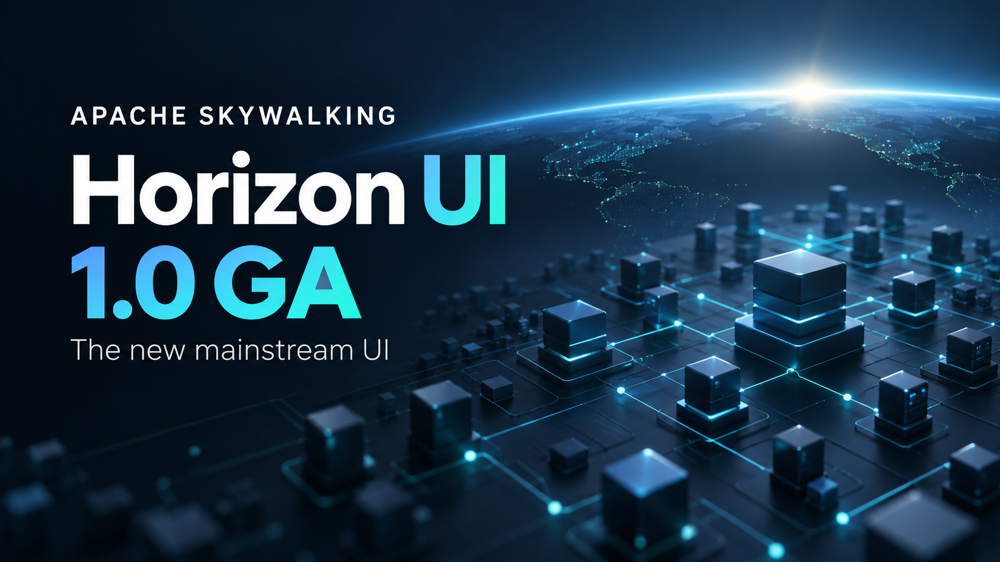

**Apache SkyWalking Horizon UI 1.0 is generally available, and Horizon is now SkyWalking's official primary UI.** Following the [1.0.0 release on August 28](/events/release-apache-skywalking-horizon-ui-1-0-0/), the community voted to adopt Horizon, focus future UI development and maintenance on it, and retire Booster UI.

The [community vote](https://lists.apache.org/thread/phjx33xfcb0mygcw5jlrmfd73tt8pkpr) concluded with **three binding +1 votes and no -1 votes**, with the result reported on September 3. This announcement marks the transition from the UI that has served SkyWalking users for years to the console that will carry the project forward.

## What this means for Booster users

**Booster UI has reached maintenance end of life.** It will receive no further feature development, bug fixes, or security updates, including CVE-related fixes. Its repository and existing releases will remain available, and users are encouraged to migrate to Horizon for future SkyWalking releases. These are the terms approved in the [vote](https://lists.apache.org/thread/phjx33xfcb0mygcw5jlrmfd73tt8pkpr).

Thank you to everyone who built, maintained, translated, tested, and used Booster. It helped generations of SkyWalking users understand their systems. Horizon carries that work forward through the same SkyWalking observability concepts, with a new console and room to expand how people investigate and operate their deployments.

## A complete observability console

Over the past few months, the [Meet Horizon UI series](/blog/2026-06-21-skywalking-horizon-ui-introduction/) has walked through the new experience. The screenshots below revisit that series and the later AI assistant tour.

Horizon starts with your services and the layers they belong to. Its sidebar follows the estate reported by OAP, and its dashboards connect metrics, topology, traces, logs, and alarms in one place. The 1.0 release ships **46 bundled dashboards**, with templates that let operators adjust widgets, thresholds, labels, and layouts from the console.

*The Services overview brings service health, call relationships, and active alarms together. From the [Horizon introduction](/blog/2026-06-21-skywalking-horizon-ui-introduction/).*

An investigation can begin with a latency point on a chart, continue into the matching traces, and drill down into a span waterfall. Native SkyWalking and Zipkin traces share the explorer experience. Logs, browser errors with source-map resolution, and five kinds of profiling provide the next steps when metrics alone cannot explain a problem.

For a broader view, the **3D Infrastructure Map** lays out services across layers and shows their relationships. It gives operators another way to orient themselves before opening an individual service, with alarm beacons that draw attention to the parts of the deployment that need investigation.

*Explore the deployment across layers, then follow a service into its details. From the [3D Infrastructure Map tour](/blog/2026-06-22-horizon-ui-3d-infrastructure-map/).*

Horizon also brings operations into the console. With the required OAP 11 modules enabled, operators can manage runtime rules, debug their execution against live samples, inspect incoming data, and check the OAP cluster's configuration and health. Server-enforced permissions govern access to those capabilities. Local and LDAP authentication, single sign-on, configurable dashboards, and eight languages help teams make Horizon part of their daily workflow.

## Investigate with the UI and your AI assistant

Version 1.0 brings AI into everyday observability investigations with an embedded **AI assistant** and access for external agents through the **Model Context Protocol (MCP)**.

The embedded assistant reads live observability data and answers with Horizon's own charts, tables, topology, traces, and other interactive views. Captured results retain their timestamps, so reopening a conversation preserves the evidence from the investigation. The assistant is optional, disabled by default, and uses a model configured by an administrator.

*The assistant can present the same interactive topology used elsewhere in Horizon. From the [AI assistant tour](/blog/2026-07-06-horizon-ui-ai-assistant/).*

MCP lets an external agent use the same investigation capabilities while keeping the model on the client's side. Access follows the authenticated user's permissions, and MCP tools are read-only. In the embedded assistant, profiling can be proposed when more evidence is needed, but starting a task requires the user's explicit approval and the appropriate permission.

These capabilities build on the console's existing views: people and agents can work with the same service context and observability evidence. See the [1.0.0 release notes](/docs/skywalking-horizon-ui/v1.0.0/changelog/1.0.0/) for the full set of changes.

## Meet the future of observability for AI

Horizon 1.0 is a starting point for a broader direction: using AI to investigate systems, and making AI agents themselves observable.

Since our [first look at Apache SkyWalking AI Sessionizer](/blog/2026-09-03-ai-sessionizer-first-look/), that direction has moved into working code. Sessionizer can export assembled conversation evidence to OAP, and work toward **Horizon 1.1 and OAP 11.1** adds an **AI Agents** layer for reading it. These are capabilities on the development branches, extending the 1.0 GA foundation.

Conversation replay is built on a shared renderer used by both Horizon and Sessionizer's local viewer. Open a conversation to read its transcript, expand a turn to see the model calls and tools behind the response, and follow the execution timeline into a child agent. Selecting a step connects the conversation to its details and source evidence. A shareable link preserves the selected conversation position, so another reader can open the same turn and step. See the [Horizon conversation replay documentation](https://github.com/apache/skywalking-horizon-ui/blob/22e2f8692de57b12529fad4b6c819d8943b7e565/docs/operate/ai-agent-conversations.md).

**Claude Code file-change tracking is already part of this work.** The development version of **AI Sessionizer 0.3.0** records workspace changes alongside the relevant tool calls, while keeping unattributed changes separate. The conversation-wide **Changes** view groups records by workspace and file. Select a record to jump to its tool step, inspect additions and deletions in an expandable diff, and open the source evidence behind the observation. This connects what the agent said, which tool it called, and the file changes recorded during its work in one investigation.

Sessionizer reads Claude Code's own recorded edits on the main stream without a plugin. The optional [asz Claude Code plugin](https://github.com/apache/skywalking-ai-sessionizer/blob/b66b0578c0e523bb6c442c4b8201776333a40872/docs/en/setup/claude-code-plugin.md) extends capture to **shell-command changes and edits inside subagents**. It preserves observation limits: overlapping tool windows are marked as shared, and a command whose scan was skipped is not presented as proof that no files changed.

The new [AI agent dashboards](https://github.com/apache/skywalking-horizon-ui/blob/22e2f8692de57b12529fad4b6c819d8943b7e565/docs/dashboards/ai_agent.md) also bring token usage by type, model, and main agent or subagent into Horizon, alongside cache read share. Additional metrics such as cost and active time appear when Claude Code's own telemetry exporter supplies them. Together, conversation replay, file changes, and usage metrics give us a concrete foundation for agent observability, with broader runtime support and richer analysis still to come.

## Moving to Horizon

Start with the [Horizon 1.0 documentation](/docs/skywalking-horizon-ui/v1.0.0/readme/) and [downloads](/downloads/). Horizon is released independently from OAP; choose the configuration that matches your backend before switching your UI endpoint.

Container images continue to use the existing [apache/skywalking-ui repository on Docker Hub](https://hub.docker.com/r/apache/skywalking-ui). Horizon releases use `horizon-*` tags: pin **`apache/skywalking-ui:horizon-1.0.0`** for this release. **`apache/skywalking-ui:latest` now points to Horizon**, so deployments following `latest` should account for the UI transition when pulling a new image.

- **OAP 11.x is Horizon's native target.** Configure the query and admin connections and enable the modules needed for your workflow. Dashboard publishing uses OAP 11's template management REST API.
- **OAP 10.x support is partial and requires `templates.mode: readonly`**, or the environment variable `HORIZON_TEMPLATES_MODE=readonly`. Horizon then uses its bundled templates. For the supported investigation workflow including native trace detail, use OAP 10.3 or later; earlier 10.x versions have additional trace and endpoint-selector limitations. Horizon's template editing and OAP 11 admin features remain unavailable on OAP 10.
- **Review your console configuration during migration.** Set up users or your identity provider, map roles, and check the dashboards your team relies on. Recreate custom Booster dashboards using Horizon's templates where needed, and validate your usual investigations before directing users to Horizon.

The [OAP compatibility guide](/docs/skywalking-horizon-ui/v1.0.0/compatibility/oap-version/) explains the version requirements, and the [container deployment guide](/docs/skywalking-horizon-ui/v1.0.0/setup/container-image/) covers configuration through environment variables or a mounted file.

Thank you to the early Horizon users who shared feedback and helped shape the path to 1.0. Try it with your deployment, revisit the [Horizon series](/blog/2026-06-21-skywalking-horizon-ui-introduction/), and join us in [building SkyWalking's next UI chapter](https://github.com/apache/skywalking-horizon-ui).
