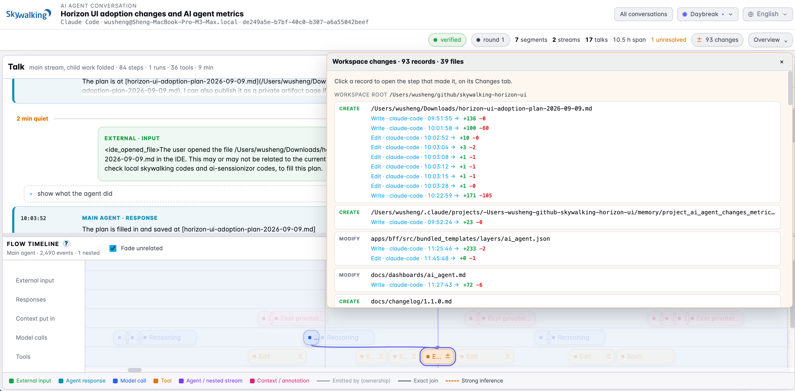
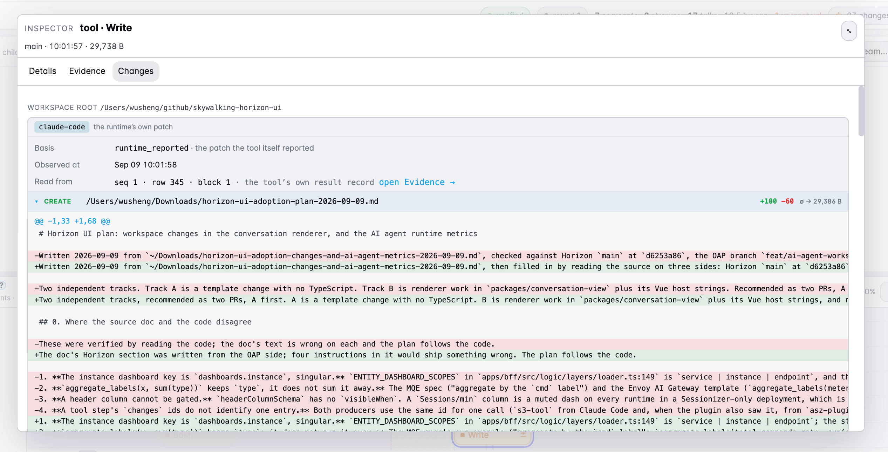
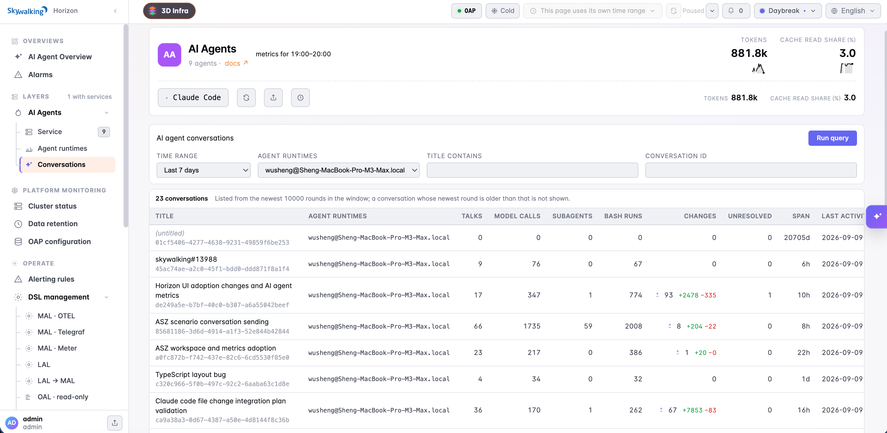
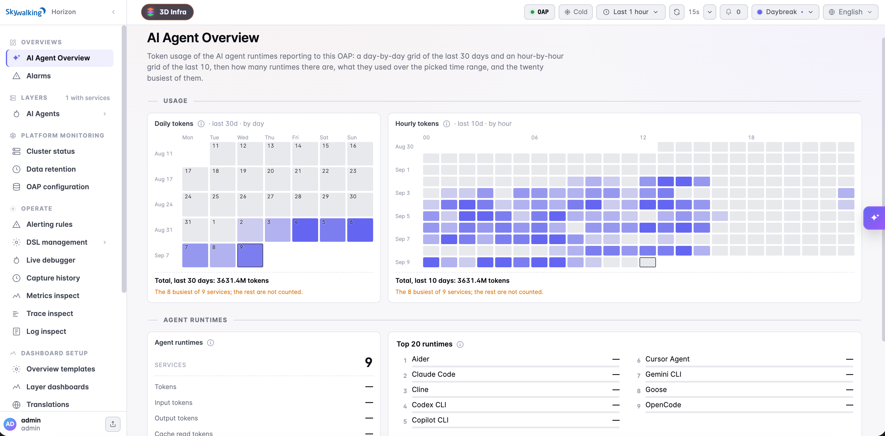

In our [first look at Apache SkyWalking AI Sessionizer](/blog/2026-09-03-ai-sessionizer-first-look/), we started with replay: reconstructing a Claude Code conversation from the records already on your machine, then exploring its messages, tools, and child agents. Since then, the work has advanced across Sessionizer, OAP, and Horizon UI. Remote conversation export and agent dashboards have moved from the agenda into working code.

The most useful new connection is between **what the agent discussed, which tools it called, and what changed in the files it worked on**. A conversation can now carry recorded workspace changes, with diffs attached to the relevant tool steps and a conversation-wide view of the affected files.

This post follows that experience using screenshots from our own development work. It covers development toward **AI Sessionizer 0.3.0, OAP 11.1, and Horizon UI 1.1**.

## Start with the files a conversation changed

An agent may work through dozens of edits, run shell commands, and delegate parts of a task before producing its final response. Reviewing the resulting files tells you where the work ended. The conversation adds the path it took: the request, the successive edits, and the operations recorded along the way.

The conversation header now includes a **Changes** count. Open it to see files grouped by workspace root, with each recorded observation listed under its file. Select an observation to jump to the associated tool step and open its **Changes** inspector.


*Figure 1: This development conversation contains 93 change records across 39 files. Repeated writes and edits remain visible under each path, and each linked record opens its associated tool step.*

The example is itself a conversation about adding AI agent metrics and change inspection to Horizon. Its file list includes the planning document, dashboard templates, documentation, and changelog. You can follow how one file evolved across several calls without searching the transcript for every occurrence of its name.

**The count describes observations, not unique files or a final Git diff.** One call can produce records for several workspace roots, and separate producers can record the same call. Added and removed line totals sum those records; they can include repeated edits to the same lines. These numbers help navigate the work, while the individual records explain what was observed.

## Open a change, then follow its evidence

Tool cards and timeline steps carry change indicators. Expanding a card shows the affected paths, operations, and line counts; expanding a file shows a unified diff with additions and deletions. The inspector can also open in a larger panel, giving a long diff room to read.


*Figure 2: A recorded Write operation on the planning document. The inspector identifies Claude Code as the source, shows the observation time and landed record location, and links to the Evidence tab.*

Here the diff shows a revision to the plan after checking the repositories. Beside it, the transcript retains the user's request and the agent's response; the timeline retains the model and tool activity. That makes it possible to inspect a concrete change in the context of the discussion that led to it.

The connection uses the **tool-use ID**, rather than matching an edit to whichever message happened nearby in time. Each change retains who captured it and the basis of that observation. A patch reported by Claude Code and a workspace scan performed by the plugin remain separate records when both are present. The [conversation replay documentation](https://skywalking.apache.org/docs/skywalking-horizon-ui/next/operate/ai-agent-conversations/#changes) explains the card indicators, inspector, and conversation-wide panel.

## Native patches first, broader capture with an optional plugin

The first post's starting point still holds: **replay reads existing Claude Code history without installing a plugin or changing Claude Code's configuration**. Change inspection builds on that path. Sessionizer now extracts the patches Claude Code records for successful main-stream editing calls, including `Edit` and `Write`.

For activity the transcript does not describe fully, the optional **asz-changes** Claude Code plugin adds observations:

| Source | What it contributes |
| --- | --- |
| Claude Code's own records | Native editing patches on the main stream, collected alongside the tool result. |
| Optional asz-changes plugin | Before-and-after workspace scans around shell tools such as `Bash`, `PowerShell`, and `Monitor`, plus reported editing patches inside subagents. |

This extends inspection to files changed by a script or command, as well as edits made during delegated work. The plugin writes its own records; Sessionizer collects them and connects them to the appropriate execution stream and tool call. It can only observe activity while installed. Older shell commands cannot acquire before-and-after snapshots retroactively.

Native patches are extracted when Sessionizer collects a transcript. A storage root collected by an earlier version does not gain those change records simply by reopening it in the new viewer.

The observation boundaries remain visible. When tool windows overlap, affected files can be marked **shared**, with the other windows named. Changes detected between observed calls appear separately as **Changes outside observed tool windows**. A shell command classified as read-only may skip scanning; that means the workspace was not scanned, whereas a completed scan can report that it found no changes. Partial scans disclose gaps, and binary or oversized files can carry paths and hashes without a text diff.

These distinctions matter when reviewing concurrent agent work. A before-and-after scan establishes a change within an observation window; it does not prove that one tool alone authored every byte. See the [plugin guide](https://skywalking.apache.org/docs/skywalking-ai-sessionizer/next/en/setup/claude-code-plugin/) for capture rules and configuration.

## Carry the same conversation into OAP and Horizon

The first article described centralized observation as a next step. That path is now implemented: **Sessionizer → OAP → Horizon**.

Sessionizer exports collected evidence files and conversation rounds through OpenTelemetry logs. OAP verifies file digests and line counts, stores the files under the **AI_AGENT** layer, and assembles the conversation document that Horizon reads. Workspace change records travel with that evidence, preserving their connection to the tools and streams. The [OAP conversation guide](https://skywalking.apache.org/docs/main/next/en/setup/backend/ai-agent-conversation/) describes ingestion, storage, and queries.

Horizon and Sessionizer's local viewer use the same conversation renderer and document format. The transcript, execution timeline, child-agent navigation, and change inspector therefore follow the same model in both places.


*Figure 3: The centralized conversation list brings talks, model calls, subagents, Bash runs, change records, and unresolved references into one view.*

In Horizon, choose an agent and query conversations by time range, agent runtime, title text, or conversation ID. Open a row to investigate it in a dedicated tab. The address preserves the selected talk, step, and stream, so a colleague with Horizon access and conversation-read permission can open the same position.

That gives change inspection an entry point beyond a single machine. A reviewer can find a conversation, identify the files it touched, and follow a record into the operation and discussion behind it.

## Usage dashboards provide the wider context

Alongside individual conversations, Horizon now has agent and runtime dashboards for token usage by type, model, and main agent or subagent, together with cache read share. An **AI Agent Overview** adds daily and hourly token heatmaps and a ranking of reporting agents.


*Figure 4: Usage over time provides context for individual investigations. The heatmap footer states its coverage: this example includes the eight busiest of nine reporting services.*

Sessionizer can reconstruct the subset of token metrics available in collected transcripts. Additional measures, including cost and active time, come from Claude Code's own telemetry exporter when configured. They are not estimated from conversation text. The [AI Agents dashboard guide](https://skywalking.apache.org/docs/skywalking-horizon-ui/next/dashboards/ai_agent/) explains the sources and how to choose one token-reporting path without counting the same activity twice.

The service names shown in an overview are the services reporting to OAP. They do not establish Sessionizer adapter support: **Claude Code remains the implemented adapter**, with Codex and LangChain/LangGraph still planned.

## Try the current development version

With Go 1.27 or later, build Sessionizer from source and start the collection pipeline and local viewer:

```sh
git clone https://github.com/apache/skywalking-ai-sessionizer.git
cd skywalking-ai-sessionizer
make build
./bin/asz server
```

Open [http://127.0.0.1:8787](http://127.0.0.1:8787). **The command has changed since the first post:** `asz server` collects, assembles, and serves; `asz view` now reads an existing storage root. Export runs as part of the pipeline when an OAP endpoint is configured.

To add shell and subagent change capture to a new Claude Code session, the same build includes the optional plugin:

```sh
claude --plugin-dir plugins/claude-code
```

Run these commands from the Sessionizer checkout. For centralized inspection, set `export.otlp.endpoint` in `asz.yaml` to your OAP receiver, choose the sessions to collect through the adapter filters, and use compatible OAP 11.1 and Horizon 1.1 development builds. The [export guide](https://skywalking.apache.org/docs/skywalking-ai-sessionizer/next/en/setup/export-otlp/) covers the transport and configuration; the [quick start](https://skywalking.apache.org/docs/skywalking-ai-sessionizer/next/en/setup/quick-start/) covers local collection.

We now have a concrete path from a recorded conversation to its workspace changes, with centralized inspection and usage metrics around it. Broader runtime adapters and whole-conversation evaluation remain work ahead. Try a conversation whose files you know well, inspect how its changes connect to the recorded tools, and share cases we should improve in [Apache SkyWalking Discussions](https://github.com/apache/skywalking/discussions).
