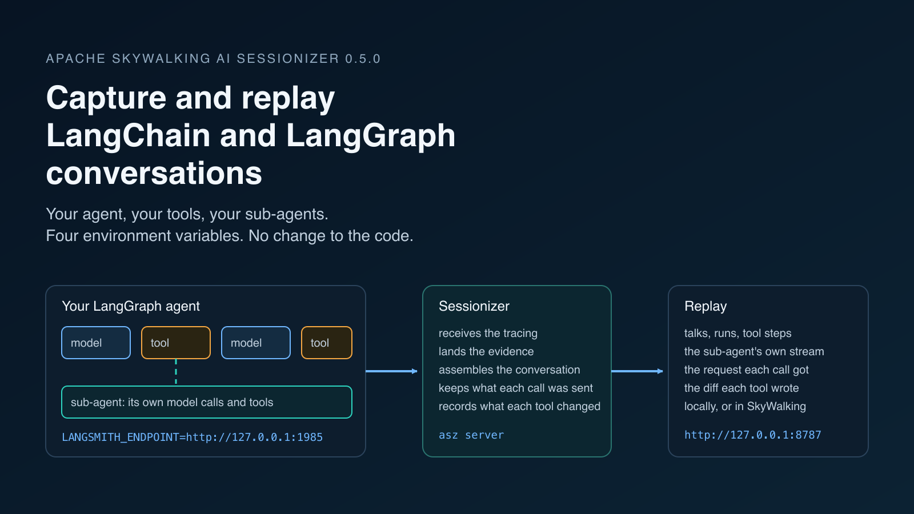
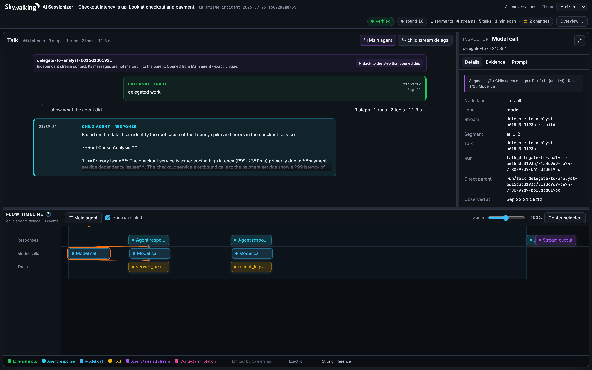
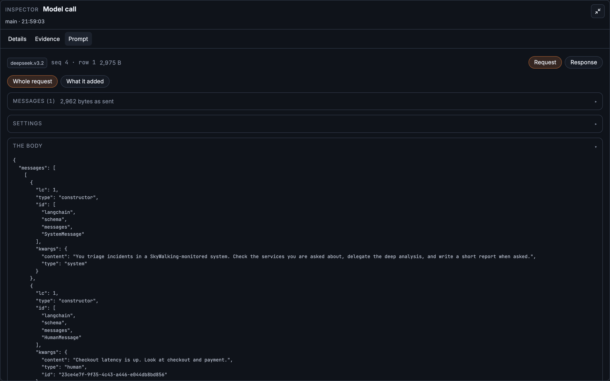
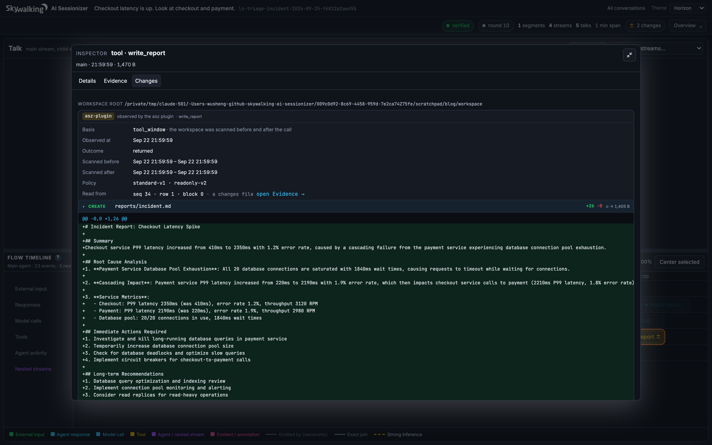
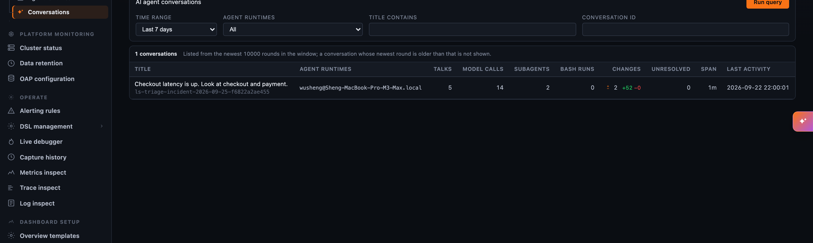

Our [first two posts](/blog/2026-09-03-ai-sessionizer-first-look/) on [Apache SkyWalking AI Sessionizer](https://github.com/apache/skywalking-ai-sessionizer) replayed Claude Code sessions. Claude Code is a product. It writes its transcripts to known files on your machine, and Sessionizer reads them. Nothing had to change in Claude Code.

An agent you build with [LangChain](https://github.com/langchain-ai/langchain) or [LangGraph](https://github.com/langchain-ai/langgraph) is different. It is your code. You choose the model, the tools, when to delegate to a sub-agent, and what a conversation even is. It writes no transcript anywhere. Yet a long run of such an agent raises the same questions: what was the model told on the call that went wrong, which tool result led it there, what did the sub-agent do, and what did it change on disk?

**Sessionizer 0.5.0 answers those questions for LangChain and LangGraph agents, and the application still does not change.** This post builds a small but real agent on Amazon Bedrock, installs Sessionizer, connects the two with four environment variables, and replays what happened. Along the way it shows what is different when the agent is yours, and what the recorded evidence can and cannot say.

## What is different when the agent is your code

Claude Code decides for you what a session is, which tools exist, and when a child agent runs. It records all of that itself. With a LangChain agent, those decisions are in your source file, and there is no record of them unless something writes one.

Something does. The LangChain tracing client, `langsmith`, is a dependency of `langchain-core`, so every LangChain application already carries it. It reports every run of the graph, every model call with its inputs and outputs, and every tool call with its arguments and result. It reports each run when it starts and again when it ends. Normally it sends all of this to the LangSmith service. Sessionizer includes a receiver that speaks the same protocol, so the client can send it to your own machine instead.

Two things still have to come from you, because the wire cannot supply them:

- **What a conversation is.** A Claude Code session has a boundary by construction. Your agent has one only if you give it a thread. In LangGraph that is the checkpointer's `thread_id`; in plain LangChain it is a metadata key. Without it, Sessionizer lands what arrived under a session that says so, and does not invent a conversation.
- **Which tools write.** Claude Code's tools have fixed names, so Sessionizer knows `Bash` may change files and `Read` does not. Your agent names its own tools, and nothing about `write_report` or `lookup_status` says which of them touches the disk. The change recorder records nothing until you name the tools it should watch.

Everything else, from the model calls to the sub-agent's own stream, is read from what the client already sends.


Figure 1: The path from your agent to a replayable conversation. The application does not change; the tracing client it already carries is pointed at Sessionizer.</br>

## Build a real agent

The agent below triages an incident in a monitored system. A supervisor checks the health of the services it is asked about, hands one of them to an analyst sub-agent for a deeper look, and writes a report. The model is Amazon Bedrock; any chat model LangChain supports works the same way, because the tracing client sits below the model integration.

```python
import json, os
from langchain_aws import ChatBedrockConverse
from langchain_core.tools import tool
from langgraph.checkpoint.memory import InMemorySaver
from langgraph.prebuilt import create_react_agent

model = ChatBedrockConverse(model="deepseek.v3.2", region_name="us-west-2", temperature=0)


def load(name):
    with open(os.path.join("data", name)) as f:
        return json.load(f)


@tool
def service_health(service: str) -> str:
    """Return the last hour of latency, error rate and throughput for a service."""
    return json.dumps(load("metrics.json").get(service, "unknown service"))


@tool
def recent_logs(service: str, level: str = "ERROR") -> str:
    """Return the most recent log lines of a service at a level."""
    lines = load("logs.json")
    return "\n".join(l["line"] for l in lines if l["service"] == service and l["level"] == level)


analyst = create_react_agent(
    model, [service_health, recent_logs], name="analyst",
    prompt="You find the root cause of one service's trouble. Use the tools. Never guess.")


@tool
def delegate_to_analyst(service: str, question: str) -> str:
    """Hand one service to the analyst sub-agent and return its finding."""
    out = analyst.invoke({"messages": [{"role": "user", "content": f"{question} Service: {service}"}]})
    return out["messages"][-1].content


@tool
def summarise(text: str) -> str:
    """Shorten a finding to three sentences with one model call."""
    return model.invoke([{"role": "user", "content": "In three sentences: " + text}]).content


@tool
def write_report(path: str, text: str) -> str:
    """Write the incident report to a file."""
    with open(path, "w") as f:
        f.write(text)
    return f"wrote {path}"


triage = create_react_agent(
    model, [service_health, delegate_to_analyst, summarise, write_report],
    checkpointer=InMemorySaver(),
    prompt="You triage incidents in a SkyWalking-monitored system. Check the services you are "
           "asked about, delegate the deep analysis, and write a short report when asked.")

if __name__ == "__main__":
    config = {"configurable": {"thread_id": "incident-2026-09-25"}}
    for turn in ["Checkout latency is up. Look at checkout and payment.",
                 "Write the report to reports/incident.md."]:
        result = triage.invoke({"messages": [{"role": "user", "content": turn}]}, config=config)
        print(result["messages"][-1].content)
```

Three shapes in this one file matter for what comes later. `delegate_to_analyst` runs a second agent inside a tool: that is a sub-agent, with a model context of its own. `summarise` makes one plain model call inside a tool: that is not a sub-agent, and Sessionizer keeps the two apart. `write_report` changes the disk, and nothing on the wire says so.

The `thread_id` is the conversation. Both turns share it, so they land in one conversation, as two talks in its main stream. The two data files under `data/`, `metrics.json` and `logs.json`, are a small export of service metrics and logs; any JSON of that shape works.

To run it against Bedrock you need an API key for the model, which the AWS SDK reads from one variable:

```sh
pip install langgraph langchain-aws
export AWS_BEARER_TOKEN_BEDROCK=...      # a Bedrock API key
export AWS_REGION=us-west-2
python agent.py
```

## Install Sessionizer 0.5.0

Sessionizer is a single program, `asz`, plus `asz-changes`, the recorder that says what a tool call changed on disk. On macOS or Linux with Homebrew:

```sh
brew trust https://github.com/apache/skywalking-ai-sessionizer
brew tap apache/skywalking-ai-sessionizer https://github.com/apache/skywalking-ai-sessionizer
brew install apache/skywalking-ai-sessionizer/asz
```

On Debian and Ubuntu, `sudo apt install asz asz-changes` from the Apache SkyWalking apt repository. There is also an install script and a binary package for every platform; the [install guide](https://skywalking.apache.org/docs/skywalking-ai-sessionizer/next/en/setup/install/) lists them all.

Then turn the receiver on. Sessionizer reads `asz.yaml` from the directory it runs in, and the only setting a LangChain application needs is the receiver:

```yaml
adapters:
  - name: langsmith-ingest
    enabled: true
    listen: 127.0.0.1:1985
```

```sh
asz server
```

`asz server` runs everything in one process: it receives what the agent sends, assembles it into conversations, and serves the replay page at [http://127.0.0.1:8787](http://127.0.0.1:8787). The startup lines say where the receiver listens and that any API key is accepted.

## Connect the agent

Four environment variables point the tracing client at Sessionizer instead of LangSmith. The address is the receiver that `asz server` opened, the `listen` line above; nothing else has to run. The application does not change.

```sh
export LANGSMITH_TRACING=true
export LANGSMITH_ENDPOINT=http://127.0.0.1:1985
export LANGSMITH_API_KEY=asz
export LANGSMITH_PROJECT=triage
python agent.py
```

The key has to be set because the client insists on sending one; its value only matters if you configure the receiver with a token, which you would do when the agent runs in another container and the receiver listens on a reachable address.

The client sends in the background, in batches. Within one collector period the conversation is on the page, and on the command line:

```sh
asz conversation ls-triage-incident-2026-09-25-f6822a2ae455
```

The name is the project, the thread, and a digest of both. Two applications can both use the project `production` and the thread `123`, and the digest keeps their conversations apart.

## Replay the conversation


Figure 2: One conversation, three streams. The supervisor's two talks and their tool steps sit in the main stream; the analyst's work has a child stream of its own, and the summarise call sits in a stream marked auxiliary. The lines show how the streams connect: a tool step `starts` a stream, a child stream `ends_with` its output, and a stream's final step is the `result_of` the tool step that started it, which is the way back.</br>


Figure 3: A real run of the agent on Amazon Bedrock, with one analyst's child stream open: an independent context linked back to the step that opened it, the analyst's finding, and its own model and tool calls in the flow timeline. In this run the supervisor handed both services over at once, so there are two analyst streams. Each child stream and the auxiliary stream open a talk of their own, so the page counts four streams and five talks.</br>

The page shows what the first post described for Claude Code, from the same conversation model. A **talk** opens with the prompt from outside the agent. A **run** is the agent loop inside it: model call, tool call, model call again. A tool request and its result are joined into one tool step, with the arguments and the result whole, as they were sent.

Two things are particular to an agent you wrote.

**The analyst is a child stream.** Its model calls do not continue the supervisor's context; they start from the question the supervisor handed over. When the supervisor delegates twice in one step, as it did in the run in Figure 3, each analyst gets a stream of its own, and neither sees the other's work. Sessionizer keeps them in an execution stream of their own, related to the tool step that started them, rather than copying the analyst's messages into the supervisor's conversation. A tool that only makes a plain model call, like `summarise`, also gets a stream, but it is marked **auxiliary**: it is a tool step, not an agent, and it stays out of the continuity check between the supervisor's calls.

**Work is visible while it runs.** The client reports a run when it starts and again when it ends. A slow tool therefore appears on the page before it returns, and an agent process that dies in the middle of a turn still leaves what it had reported. The conversation then says the work was unfinished, rather than pretending it never happened.

## See what each model call was sent

A model call's record keeps what the model said. What it was told is a different thing, and on this wire it is large: LangChain sends the whole message list again on every call. Measured on a twenty-turn conversation, the first call's inputs were 210 bytes and the twenty-first's were 18,918, a factor of ninety.

Sessionizer 0.5.0 lands what each call was sent, and what came back, beside the conversation as a **provider body**, the same mechanism the Claude Code path uses for its raw API bodies. Each request is cut against what the session already holds, so a request shares its front with the one before. Measured with every call's inputs and outputs, the twenty-turn conversation landed at 13% of what crossed the wire, bodies included; a conversation of a few short calls lands at about a third, because the note that says how to rebuild a body costs more than a small body saves.


Figure 4: The Prompt tab of the supervisor's second model call. The request is rebuilt from the landed records, byte for byte, and shown whole: the system prompt, the question, and everything that followed, in LangChain's serialized message form. Response shows what came back.</br>

This is the evidence for three questions that a transcript alone cannot answer: whether each call in a stream really continued the one before it, what the analyst's own first prompt was, and whether a summarising tool worked from the history or from a summary. On this wire the body is LangChain's view of what it sent, in its serialized message form, and not the bytes the provider received; the record says so. To land the conversation alone, set `provider_bodies: false` on the adapter.

## See what the tools changed

`write_report` wrote a file. The wire says the tool ran and what it returned, `wrote reports/incident.md`, and nothing more. The recorder from the [previous post](/blog/2026-09-12-ai-sessionizer-workspace-changes/), `asz-changes`, brings the change itself in, and in 0.5.0 it is no longer Claude Code's alone.

For LangChain the recorder needs a small shim, because LangChain has no way to tell a program outside the process that a tool started. The shim is a Python package that imports nothing into your application: it installs a loader that attaches a callback handler at interpreter start, and only when the environment says to.

```sh
pip install apache-skywalking-asz-langchain
asz-langchain enable

export ASZ_CHANGES=true
export ASZ_WATCH=$PWD
export ASZ_CHANGES_DATA=/var/lib/asz/changes
python agent.py
```

Then say which tools may write. Nothing is watched until you do, because Sessionizer cannot know which of your tools change files. In `/var/lib/asz/changes/settings.yaml`:

```yaml
tools:
  scope: [write_report]
```

or take everything and exclude what only reads, `scope: ["*"]` with `exclude: ["re:^(service_health|recent_logs)$"]`. Add the `changes` adapter to `asz.yaml`, pointed at the same directory, and the tool step shows the diff of `reports/incident.md` beside the call that wrote it.


Figure 5: The second turn's `write_report` step. The asz plugin scanned the workspace before and after the call, and the change it found is the file the tool created, `reports/incident.md`, with the diff of the report the agent wrote.</br>

Measured against a real wheel installed into a fresh environment, the loader costs 0.01 s of interpreter start when the plugin is off and 0.21 s when it is on, which is the cost of importing `langchain_core` itself.

## Share it with the team

Everything above ran on one machine. To make the conversations available to a team, name a SkyWalking OAP in `asz.yaml`:

```yaml
export:
  otlp:
    protocol: grpc
    endpoint: 127.0.0.1:11800
```

`asz server` then sends every landed file and every conversation round after each collection, and the OAP stores them. In Horizon's **AI Agents** views the conversations appear beside the Claude Code ones, under the runtime **LangChain**, and the conversation page is drawn by the same renderer the local page uses, so a conversation looks the same wherever you open it. The [export guide](https://skywalking.apache.org/docs/skywalking-ai-sessionizer/next/en/setup/export-otlp/) and the [backend guide](https://skywalking.apache.org/docs/main/next/en/setup/backend/ai-agent-conversation/) cover the setup.


Figure 6: The same conversation in SkyWalking, exported from the local root. Horizon lists it under the runtime LangChain, with its five talks, fourteen model calls, two sub-agents and two file changes.</br>

## What the wire cannot say

Sessionizer records what the evidence supports and marks the rest. On this wire, four limits are worth knowing, and each is documented with the measurement behind it on the [adapter page](https://skywalking.apache.org/docs/skywalking-ai-sessionizer/next/en/adapters/langsmith/):

- **A sub-agent cannot have its own conversation.** An agent invoked with its own `thread_id` still reports the parent's on every run, because the surrounding run context wins. Its work is part of the conversation that delegated to it, in a stream of its own.
- **A failed tool does not always say which call it answered.** When a tool raises, its output is empty and the call id is nowhere in its run. Sessionizer reads it from the model call that asked for the tool, and when that arrived in a different batch, the result lands joined to nothing rather than to a guess.
- **There is no context reset.** LangChain has no compaction, so a conversation is one epoch however long it runs.
- **A graph's own runs are trimmed.** LangGraph reports every node, and each repeats the whole message list its model call already carries; in one capture they were 30 of 39 runs and 74% of the bytes. The envelope and the graph's metadata land, the repeated content does not, and the record says how many bytes went with it.

## Try it with your agent

These capabilities ship in **AI Sessionizer 0.5.0**, with the team views in OAP 11.1 and Horizon UI 1.1. The [LangChain and LangGraph guide](https://skywalking.apache.org/docs/skywalking-ai-sessionizer/next/en/setup/langchain/) has the setup in full, and the [plugin guide](https://skywalking.apache.org/docs/skywalking-ai-sessionizer/next/en/setup/langchain-plugin/) the change recording.

Start with an agent you already run. Install `asz`, turn the receiver on, set the four variables, and give the agent a thread. Then open a conversation you know well and read what its model was sent on the turn that surprised you.

If you build agents and something in your conversations does not come out the way the evidence says it should, we would like to see it. Join the conversation in [Apache SkyWalking Discussions](https://github.com/apache/skywalking/discussions), and explore the source in the [Apache SkyWalking AI Sessionizer repository](https://github.com/apache/skywalking-ai-sessionizer).
