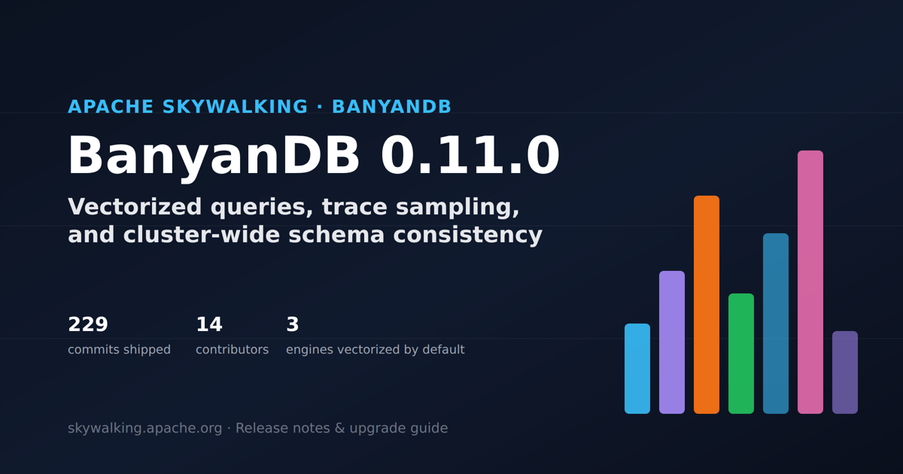

[BanyanDB](https://github.com/apache/skywalking-banyandb) 0.11.0 is out, and it's the release where the columnar query engine stops being an opt-in experiment and becomes how the database answers queries by default. It ships alongside a pluggable trace-retention sampling pipeline, cluster-wide schema-consistency barriers, a full admin UI, and the end of etcd as a supported schema-registry backend. We went through the 229 commits behind the release — not just the changelog — to pull out what actually matters if you operate a cluster.

> **Key Takeaways**
>
> - Vectorized query paths for measure, stream, and trace are now **on by default**. Rolling upgrades must go **liaison nodes first, then data nodes** — the opposite of the normal order — or queries fail mid-rollout.
> - A new in-merge and finalize-time trace-sampling pipeline lets you drop unwanted spans with pluggable `.so` sampler plugins, with bounded memory even under multi-million-trace merges.
> - Schema changes are now cluster-consistent: `SchemaBarrierService` lets a client confirm a Create/Update/Delete has actually propagated to every liaison and data node before it proceeds.
> - etcd support is fully removed — the property-based schema registry is now the only mode — and BanyanDB fixed a backup-restore path-traversal vulnerability that CHANGES.md doesn't mention by name.

## What Shipped, at a Glance

We classified all 229 non-merge commits between v0.10.3 and v0.11.0 by subject line. Bug fixes are the largest single bucket — this is a maturity release as much as a features release — but nearly a quarter of the work is new capability.

<figure>

<svg viewBox="0 0 560 380" width="100%" role="img" aria-label="Donut chart showing BanyanDB 0.11.0's 229 commits grouped by category: 86 bug fixes, 56 features, 46 tooling/tests/CI/docs, 19 other, 15 Canopy UI, and 7 performance commits">
  <title>What 229 commits in BanyanDB 0.11.0 were about</title>
  <desc>Bug fixes 86 (37.6%), Features 56 (24.5%), Tooling/tests/CI/docs 46 (20.1%), Other/mixed 19 (8.3%), Canopy UI 15 (6.6%), Performance 7 (3.1%). Source: git log v0.10.3..v0.11.0, non-merge commits, classified by commit-subject prefix.</desc>
  <text x="170" y="30" text-anchor="middle" font-size="15" fill="currentColor">229 commits, classified</text>
  <text x="170" y="48" text-anchor="middle" font-size="11" fill="#898781">v0.10.3 &#8594; v0.11.0</text>
  <path d="M 170.00 72.00 A 98 98 0 0 1 239.06 239.53 L 215.10 215.41 A 64 64 0 0 0 170.00 106.00 Z" fill="#f97316"><title>Bug fixes: 86 commits (37.6%)</title></path>
  <path d="M 239.06 239.53 A 98 98 0 0 1 102.88 241.40 L 126.16 216.63 A 64 64 0 0 0 215.10 215.41 Z" fill="#38bdf8"><title>Features: 56 commits (24.5%)</title></path>
  <path d="M 102.88 241.40 A 98 98 0 0 1 81.58 127.74 L 112.26 142.40 A 64 64 0 0 0 126.16 216.63 Z" fill="#a78bfa"><title>Tooling, tests, CI &amp; docs: 46 commits (20.1%)</title></path>
  <path d="M 81.58 127.74 A 98 98 0 0 1 114.37 89.32 L 133.67 117.31 A 64 64 0 0 0 112.26 142.40 Z" fill="#94a3b8"><title>Other / mixed: 19 commits (8.3%)</title></path>
  <path d="M 114.37 89.32 A 98 98 0 0 1 151.29 73.80 L 157.78 107.18 A 64 64 0 0 0 133.67 117.31 Z" fill="#22c55e"><title>Canopy UI: 15 commits (6.6%)</title></path>
  <path d="M 151.29 73.80 A 98 98 0 0 1 170.00 72.00 L 170.00 106.00 A 64 64 0 0 0 157.78 107.18 Z" fill="#f472b6"><title>Performance: 7 commits (3.1%)</title></path>
  <text x="170" y="164" text-anchor="middle" font-size="26" fill="currentColor">229</text>
  <text x="170" y="184" text-anchor="middle" font-size="11" fill="#898781">commits</text>
  <rect x="320" y="68" width="12" height="12" fill="#f97316"></rect>
  <text x="340" y="78" font-size="12" fill="currentColor">Bug fixes &#8212; 86 (37.6%)</text>
  <rect x="320" y="94" width="12" height="12" fill="#38bdf8"></rect>
  <text x="340" y="104" font-size="12" fill="currentColor">Features &#8212; 56 (24.5%)</text>
  <rect x="320" y="120" width="12" height="12" fill="#a78bfa"></rect>
  <text x="340" y="130" font-size="12" fill="currentColor">Tooling, tests, CI &amp; docs &#8212; 46 (20.1%)</text>
  <rect x="320" y="146" width="12" height="12" fill="#94a3b8"></rect>
  <text x="340" y="156" font-size="12" fill="currentColor">Other / mixed &#8212; 19 (8.3%)</text>
  <rect x="320" y="172" width="12" height="12" fill="#22c55e"></rect>
  <text x="340" y="182" font-size="12" fill="currentColor">Canopy UI &#8212; 15 (6.6%)</text>
  <rect x="320" y="198" width="12" height="12" fill="#f472b6"></rect>
  <text x="340" y="208" font-size="12" fill="currentColor">Performance &#8212; 7 (3.1%)</text>
  <text x="280" y="372" text-anchor="middle" font-size="10" fill="#898781">Source: BanyanDB git history, v0.10.3&#8230;v0.11.0 (229 non-merge commits)</text>
</svg>

<figcaption>Source: BanyanDB git history, v0.10.3&#8230;v0.11.0 (229 non-merge commits), classified by commit-subject prefix. Original analysis.</figcaption>
</figure>

Three storylines account for most of the engineering weight in that "features" slice: the vectorized query engine going default-on, a new trace-retention sampling pipeline, and cluster-wide schema consistency. We'll take each in turn, then round up everything else — including two fixes CHANGES.md itself doesn't call out.

## Vectorized Queries Are Now the Default

The columnar (vectorized) query path — which replaces per-row protobuf serialization with a batch, columnar pipeline — was already on by default for measure queries since 0.10. In 0.11, **stream and trace queries join it**: `--stream-vectorized-enabled`, `--trace-vectorized-enabled`, and `--measure-vectorized-enabled` all default to `true`.

For measure queries specifically, coverage is now complete on a single node: scan, `GroupBy`+`Agg` via `BatchAggregation`, scalar reduce, raw `GroupBy`, `TopN`/`BottomN`, `order_by`, and boundary-error parity all resolve through the vectorized dispatch with row-path-equivalent semantics. The gRPC wire format is byte-identical to the row path's output, and the team validated it with a 6-hour production soak showing zero divergences. Distributed Map-mode partial aggregation and multi-group requests still flow through the row path pending follow-up work.

This is also the release's headline **breaking change for rolling upgrades**, so it's worth stating precisely: a distributed data node with a vectorized path enabled emits a native columnar frame instead of protobuf on the liaison&#8230;data wire. A 0.11 liaison decodes both formats — it dispatches per message on the frame's leading magic byte — but an older liaison has no frame decoder at all and fails to deserialize the response. That flips the normal rolling-upgrade order:

| Upgrade order | Result |
| --- | --- |
| Liaison first, then data | **Safe.** New liaisons decode both frames and protobuf; old data nodes keep sending protobuf until upgraded. |
| Data first, then liaison | **Queries fail** for the duration of the rollout. |

Standalone deployments are unaffected — the frame is only emitted on a distributed data node. If you can't control node ordering, start new data nodes with `--stream-vectorized-enabled=false --trace-vectorized-enabled=false --measure-vectorized-enabled=false` and flip them on only after every liaison is upgraded. Rollback is the same three flags; no data migration is involved, since the flags affect only the query and wire paths, never the on-disk format.

See the [full rolling-upgrade procedure](https://github.com/apache/skywalking-banyandb/blob/master/docs/operation/upgrade.md#upgrading-to-011) for the "Upgrading to 0.11" section in detail.

## A Pluggable Pipeline for Trace Retention Sampling

Trace volume is the classic observability-backend problem: keep everything and pay for it, or drop data and hope you kept the traces that mattered. 0.11 gives BanyanDB an answer: a storage-node **in-merge trace-retention filter** that evaluates per-group sampler chains and safely drops non-retained traces from both core and secondary-index parts, configured dynamically per group with runtime register/update/remove support.

Two pieces make this production-shaped rather than a one-off filter:

- **Finalization sampling** is a best-effort backstop. A single node-wide, concurrency-1 scanner periodically sweeps cooled segments and force-merges each shard's un-finalized parts through the group's sampler chain, reusing the existing hot-merge path so it never contends with the hot-merge semaphore. A per-part `finalizeGen` stamp — written to disk before the part metadata — means a crash can't double-sample on replay.
- **The drop-set is bounded.** The team found that a shard's first finalize round could select every cooled part into one merge, and an 18-million-entry drop set reaches roughly 1.3 GiB live and 2.6 GiB reserved heap in a process also serving queries. The fix bounds the sampling *decision*, not the pruning predicate: once a merge's drop set is full, every further proposed drop is retained instead of recorded, so the set stays complete with respect to drops actually performed — no orphaned entries, none missing. The ceiling is resolved from the memory protector as `limit/(16&#215;CPUs)`, so the aggregate across concurrent merges stays near `limit/16`.

See the [trace drop-set bounding design doc](https://github.com/apache/skywalking-banyandb/blob/master/docs/design/trace-drop-set-bounding.md) for the full derivation.

First-party sampler plugins ship for SkyWalking's own trace schema and for Zipkin (`sw-trace-sampler.so`, `zipkin-trace-sampler.so`), plus a bounded telemetry SDK so a sampler plugin can emit its own metered metrics and logs without the host process's cardinality or log budget going unbounded. One plugin was also **removed**: `latencystatussampler` projected `duration` and `status` — `status` exists in neither shipped trace schema, and `duration` exists only in Zipkin's, in microseconds rather than the plugin's millisecond threshold (a 1000x unit mismatch) — so it could never match live data and, failing open, silently kept every trace it was given.

See the [trace-pipeline plugin SDK and sampler config reference](https://github.com/apache/skywalking-banyandb/blob/master/plugins/README.md) for the full config schema.

## Cluster-Wide Schema Consistency

Before 0.11, a schema change (create a stream, add an index rule, delete a group) could return success from the metadata service before every node in the cluster had actually applied it — a query against a node that hadn't caught up could see stale or missing schema. 0.11 introduces client-observable revision tracking and a barrier RPC to close that gap:

- `mod_revision` on Group/IndexRule/IndexRuleBinding/TopNAggregation responses, and `delete_time` on delete responses, so clients can observe exactly which version they're looking at, including tombstones.
- A three-way `ModRevision` gate on write RPCs and a per-group query-path gate, so a write or query whose revision is ahead of a node's cache gets a distinct `STATUS_SCHEMA_NOT_APPLIED` instead of silently running against stale schema.
- `SchemaBarrierService`, with `AwaitRevisionApplied`, `AwaitSchemaApplied`, and `AwaitSchemaDeleted` — a client (or an internal caller like the standalone preload path) can block until a change has actually propagated, cluster-wide, before proceeding.

Phase 2 extends the barrier cluster-wide: it fans the same three calls out across every liaison and data node through a new `NodeSchemaStatusService`, handling mixed-version and membership-change cases safely. All of it is opt-in and zero-valued requests preserve prior behavior, so existing clients that don't pass a revision see no change.

See the [schema-consistency client surface and SchemaBarrierService reference](https://github.com/apache/skywalking-banyandb/blob/master/docs/interacting/schema-consistency/barriers.md) for the full RPC contract.

## Also Shipped: Canopy, Migration Tooling, and the End of etcd

Three more efforts are worth knowing about even if they're not this release's headline:

- **Canopy** is a brand-new admin UI — a standalone React SPA with a Fastify BFF, not embedded in the existing `ui/` — covering metadata CRUD for Group/Stream/Measure/Trace/IndexRule, a query console with WHERE-clause coverage across distributed clusters, Property collection CRUD, and TopN aggregation management. It shipped with its own Docker image, CI, and E2E suite. (These specifics come from the `canopy/` commits themselves, not from CHANGES.md, which covers Canopy in less detail.)
- **A migration tool** with `copy`, `verify`, and `analyze` subcommands now covers measure and stream data (index-mode measures included per the underlying commits), building on the trace/lifecycle migration work from earlier releases.
- **etcd support is fully removed** — the property-based schema registry is the only supported mode now. Every `--etcd-*` flag is gone, `--namespace` is gone, and `--node-discovery-mode` no longer accepts `etcd` (use `dns`, `file`, or `none`). If you're still running etcd-backed clusters, this is a hard blocker on upgrading to 0.11 until you migrate.

See the [Canopy setup and architecture guide](https://github.com/apache/skywalking-banyandb/blob/master/canopy/README.md) for how to run it.

There's also a new `bydbctl agent` — a two-pane terminal UI that drives Codex or Claude Code for natural-language BanyanDB querying: it discovers your schema, proposes typed query plans, and runs read-only queries. It owns none of your AI provider's credentials — you authenticate the CLI it wraps, separately.

See the [bydbctl agent setup and usage doc](https://github.com/apache/skywalking-banyandb/blob/master/docs/interacting/bydbctl/agent.md) to get started.

## Correctness and Security Hardening

This is the section we'd read most closely before upgrading a production cluster. A few of these are quietly severe:

- **A merge write-path durability gap** ([apache/skywalking#13862](https://github.com/apache/skywalking/issues/13862)): `seqWriter.Close` was discarding `fdatasync` errors, so a disk error (ENOSPC, EIO, EBADF) during a merge — a path shared by trace, measure, stream, and sidx — could silently lose data and leave a torn part on crash. Metadata now goes through an atomic write-tmp + fsync + rename + fsync-dir sequence.
- **A backup-restore path-traversal fix.** Landed with new sanitization logic in `pkg/path` and `pkg/fs/remote/local`, plus tests. This one doesn't appear anywhere in CHANGES.md's Bug Fixes section — worth flagging if you maintain your own release notes off of it.
- **A stream migration data-corruption bug**: an arena-owned tag value was being pooled and reused after a migration copy, corrupting tag data. Also absent from CHANGES.md.
- **The trace merge loop could wedge an entire node.** In production, a few unreadable parts made every merge selection fail. Each failed attempt leaked its output directory, which exhausted volume inodes at just 8% byte usage. The resulting disk-full panic killed the merge lane workers, which are recovered but never respawned — so the dispatcher blocked forever and every part stayed pinned in flight. Four layered changes fix it:
  - Clean up the output directory on any merge failure.
  - Quarantine a part after three consecutive attributable failures.
  - Back off merge dispatch exponentially (1s&#8594;60s cap) after consecutive failures.
  - Convert merge-execution panics into ordinary errors so the semaphore release and failure accounting always run.
- **Queries could return TTL-expired data.** Retention only removes a segment on its next scheduled run, so a fully expired segment could linger on disk and keep serving stale results; queries now skip segments whose entire time range is past the retention deadline.
- **Two CVE-tagged dependency bumps**: `golang.org/x/net` v0.52.0&#8594;v0.56.0 ([CVE-2026-25680](https://nvd.nist.gov/vuln/detail/CVE-2026-25680)) and `opencontainers/runc` v1.3.3&#8594;v1.3.6 ([CVE-2026-41579](https://nvd.nist.gov/vuln/detail/CVE-2026-41579)), alongside a new `govulncheck` CI job to catch the next one earlier.

And one fix with numbers clean enough to chart on their own:

<figure>

<svg viewBox="0 0 560 380" width="100%" role="img" aria-label="Grouped bar chart comparing peak heap memory during lifecycle row-replay before and after the 0.11.0 fix: about 1500 megabytes before, about 296 megabytes after, an 80 percent reduction">
  <title>Lifecycle row-replay peak heap: before vs. after the 0.11.0 fix</title>
  <desc>Peak heap during large-measure-part row replay dropped from approximately 1.5 GB to approximately 296 MB, roughly an 80% reduction, via a streaming dump reader, pooled size-classed marshal buffers, and a bounded in-flight batch (default 32 MiB). Source: BanyanDB CHANGES.md, 0.11.0 Bug Fixes.</desc>
  <text x="20" y="30" font-size="15" fill="currentColor">Lifecycle migration: peak heap, before &#8594; after</text>
  <text x="20" y="48" font-size="11" fill="#898781">Row-replay of large measure parts, same workload</text>
  <rect x="190" y="80.0" width="100" height="220.0" rx="4" fill="#38bdf8"></rect>
  <text x="240.0" y="68.0" text-anchor="middle" font-size="15" fill="currentColor">~1.5 GB</text>
  <text x="240.0" y="322" text-anchor="middle" font-size="12" fill="#898781">Before</text>
  <rect x="350" y="256.6" width="100" height="43.4" rx="4" fill="#22c55e"></rect>
  <text x="400.0" y="244.6" text-anchor="middle" font-size="15" fill="currentColor">~296 MB</text>
  <text x="400.0" y="322" text-anchor="middle" font-size="12" fill="#898781">After</text>
  <line x1="150" y1="300" x2="410" y2="300" stroke="#898781" stroke-width="1"></line>
  <text x="410" y="226.6" text-anchor="end" font-size="12" fill="#22c55e">&#8595; ~80% less peak heap</text>
  <text x="280" y="372" text-anchor="middle" font-size="10" fill="#898781">Source: BanyanDB CHANGES.md, 0.11.0 Bug Fixes (streaming dump reader + pooled buffers + 32 MiB bounded batch)</text>
</svg>

<figcaption>Source: BanyanDB CHANGES.md, 0.11.0 Bug Fixes — streaming dump reader, pooled size-classed marshal buffers, and a 32 MiB default bound on in-flight batch bytes.</figcaption>
</figure>

Lifecycle migration's row-replay path was reading large measure parts entirely into memory before this fix; on large parts that meant real OOM risk on the receiving node. Streaming the dump reader and pooling size-classed marshal buffers cut peak heap by roughly 80% for the same workload.

## Breaking Changes and How to Upgrade Safely

Straight from the project's own upgrade guide, in order:

**1. API version 0.11.** A cluster containing both 0.10 and 0.11 nodes is not supported. This one needs a maintenance window: stop writes and all API clients, stop all 0.10 nodes, upgrade and start all nodes at 0.11, upgrade API clients to require version 0.11, then verify schema initialization and ingestion before restoring traffic. Rollback means stopping all clients and nodes first — never run a mixed 0.10/0.11 cluster, in either direction.

**2. Vectorized query paths, liaison before data.** Covered above — this is the one most likely to bite an automated rolling-upgrade pipeline that assumes "data nodes first" from every previous release.

**3. etcd is gone.** If `--schema-registry-mode` or `--node-discovery-mode` still reference etcd, you need to migrate to the property-based registry and `dns`/`file`/`none` discovery before you can run 0.11 at all.

**4. Queue and lifecycle metrics were redesigned.** `queue_pub`/`queue_sub` metrics moved to a uniform `operation`/`group`-labeled model (the old `topic` label and chunk-ordering metric families are gone), and lifecycle health metrics gained `remote_node`/`remote_role`/`remote_tier`/`group` labels while `banyandb_lifecycle_self_identity_resolution_total` was removed outright. Update dashboards and alerts before you upgrade, not after.

See the [complete "Upgrading to 0.11" walkthrough](https://github.com/apache/skywalking-banyandb/blob/master/docs/operation/upgrade.md#upgrading-to-011) for the full maintenance-window checklist.

## Behind the Release

14 people contributed non-merge commits between v0.10.3 and v0.11.0 — a reminder that a release this dense is a team effort, not a single push.

<figure>

<svg viewBox="0 0 560 380" width="100%" role="img" aria-label="Lollipop chart of top contributors to BanyanDB 0.11.0 by commit count: Gao Hongtao 131, mrproliu 48, eight other contributors combined 18, Owen Willison 11, Huang Youliang 10, OmCheeLin 6, Tanay Paul 5">
  <title>Top contributors to BanyanDB 0.11.0</title>
  <desc>Commit counts, v0.10.3 to v0.11.0, non-merge commits, 14 total contributors. Gao Hongtao 131, mrproliu 48, eight other contributors combined 18, Owen Willison 11, Huang Youliang 10, OmCheeLin 6, Tanay Paul 5.</desc>
  <text x="20" y="30" font-size="15" fill="currentColor">Top contributors to 0.11.0</text>
  <text x="20" y="48" font-size="11" fill="#898781">Commits per author, v0.10.3&#8594;v0.11.0 (14 contributors total)</text>
  <text x="176" y="64" text-anchor="end" font-size="12" fill="currentColor">Gao Hongtao</text>
  <line x1="190" y1="60" x2="498.8" y2="60" stroke="#898781" stroke-width="2"></line>
  <circle cx="498.8" cy="60" r="7" fill="#38bdf8"><title>Gao Hongtao: 131 commits</title></circle>
  <text x="512.8" y="64" font-size="12" fill="currentColor">131</text>
  <text x="176" y="104" text-anchor="end" font-size="12" fill="currentColor">mrproliu</text>
  <line x1="190" y1="100" x2="303.1" y2="100" stroke="#898781" stroke-width="2"></line>
  <circle cx="303.1" cy="100" r="7" fill="#38bdf8"><title>mrproliu: 48 commits</title></circle>
  <text x="317.1" y="104" font-size="12" fill="currentColor">48</text>
  <text x="176" y="144" text-anchor="end" font-size="12" fill="currentColor">8 other contributors</text>
  <line x1="190" y1="140" x2="232.4" y2="140" stroke="#898781" stroke-width="2"></line>
  <circle cx="232.4" cy="140" r="7" fill="#38bdf8"><title>8 other contributors: 18 commits</title></circle>
  <text x="246.4" y="144" font-size="12" fill="currentColor">18</text>
  <text x="176" y="184" text-anchor="end" font-size="12" fill="currentColor">Owen Willison</text>
  <line x1="190" y1="180" x2="215.9" y2="180" stroke="#898781" stroke-width="2"></line>
  <circle cx="215.9" cy="180" r="7" fill="#38bdf8"><title>Owen Willison: 11 commits</title></circle>
  <text x="229.9" y="184" font-size="12" fill="currentColor">11</text>
  <text x="176" y="224" text-anchor="end" font-size="12" fill="currentColor">Huang Youliang</text>
  <line x1="190" y1="220" x2="213.6" y2="220" stroke="#898781" stroke-width="2"></line>
  <circle cx="213.6" cy="220" r="7" fill="#38bdf8"><title>Huang Youliang: 10 commits</title></circle>
  <text x="227.6" y="224" font-size="12" fill="currentColor">10</text>
  <text x="176" y="264" text-anchor="end" font-size="12" fill="currentColor">OmCheeLin</text>
  <line x1="190" y1="260" x2="204.1" y2="260" stroke="#898781" stroke-width="2"></line>
  <circle cx="204.1" cy="260" r="7" fill="#38bdf8"><title>OmCheeLin: 6 commits</title></circle>
  <text x="218.1" y="264" font-size="12" fill="currentColor">6</text>
  <text x="176" y="304" text-anchor="end" font-size="12" fill="currentColor">Tanay Paul</text>
  <line x1="190" y1="300" x2="201.8" y2="300" stroke="#898781" stroke-width="2"></line>
  <circle cx="201.8" cy="300" r="7" fill="#38bdf8"><title>Tanay Paul: 5 commits</title></circle>
  <text x="215.8" y="304" font-size="12" fill="currentColor">5</text>
  <line x1="190" y1="46" x2="190" y2="314" stroke="#898781" stroke-width="1"></line>
  <text x="280" y="372" text-anchor="middle" font-size="10" fill="#898781">Source: BanyanDB git history, v0.10.3&#8230;v0.11.0 (229 non-merge commits, 14 authors)</text>
</svg>

<figcaption>Source: BanyanDB git history, v0.10.3&#8230;v0.11.0 (229 non-merge commits, 14 authors). Original analysis.</figcaption>
</figure>

## What's Next

The vectorized engine's own release notes flag what's still pending: distributed Map-mode partial aggregation and multi-group (multi-measure) requests still run through the row path. Expect that gap to close in a follow-up release rather than this one — and expect the trace-sampling pipeline's plugin ecosystem to grow past the two first-party samplers now that the SDK and dev toolkit are stable.

## Frequently Asked Questions

### Do I have to reorder my upgrade automation for 0.11?

Yes, if you run a distributed cluster with any of the vectorized flags enabled (the default). Upgrade liaison nodes before data nodes — the reverse of every prior release's guidance — or disable the vectorized flags on new data nodes until every liaison is upgraded.

### Can I keep running etcd for schema discovery?

No. `--schema-registry-mode` only accepts `property` in 0.11, and every `--etcd-*` flag has been removed. Migrate to the property-based registry before upgrading.

### Is the vectorized query path safe to trust for correctness, not just speed?

The measure path was validated by a 6-hour production soak with byte-identical parity and zero divergences against the row path, plus per-workload bench gates. All three engines (measure, stream, trace) keep a rollback flag (`--{measure,stream,trace}-vectorized-enabled=false`) that reverts to the row path immediately with no data migration required, if you do hit a discrepancy.

### What happened to the `latencystatussampler` plugin?

It was removed. `status` exists in neither shipped trace schema, and `duration` exists only in Zipkin's — in microseconds, not the plugin's millisecond threshold — so the plugin could never match live data and, failing open, silently kept every trace it was given rather than actually filtering anything. If you had it configured, switch to `sw-trace-sampler` or `zipkin-trace-sampler`.

## Conclusion

0.11.0 is the release where BanyanDB's columnar query engine graduates from opt-in to default, and where trace retention gets a real, pluggable answer instead of a blunt TTL. The correctness and security fixes buried in the bug-fix list — the merge durability gap, the path-traversal fix, the migration double-free — are the ones worth reading even if you skim everything else. Read the [full 0.11.0 release notes](https://github.com/apache/skywalking-banyandb/tree/master/CHANGES.md) for the complete list, and work through the ["Upgrading to 0.11" checklist](https://github.com/apache/skywalking-banyandb/blob/master/docs/operation/upgrade.md#upgrading-to-011) before you touch a production cluster.