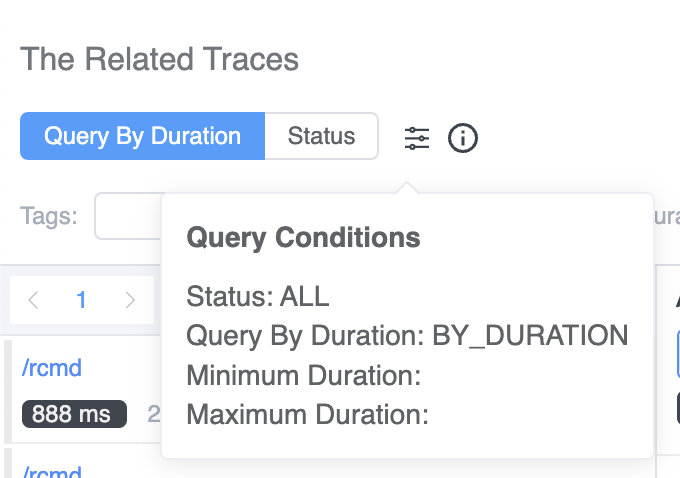
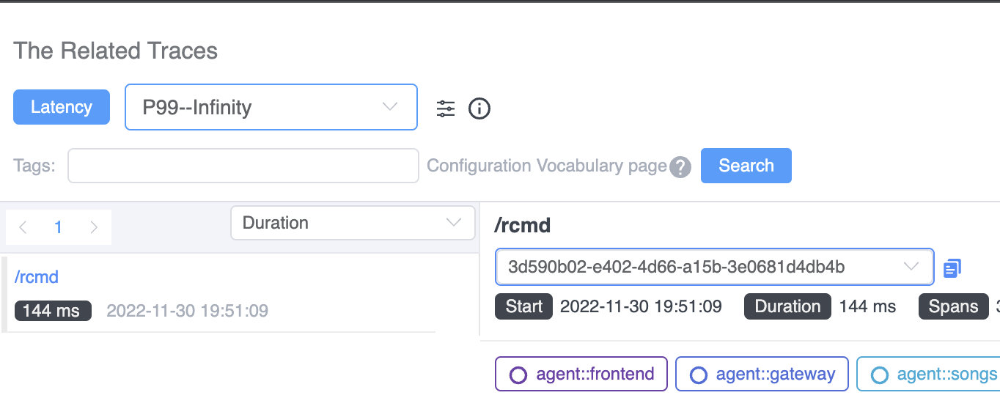

Observability for modern distributed applications work is critical for understanding how they behave under a variety of conditions and for troubleshooting and resolving issues when they arise. Traces, metrics, and logs are regarded as fundamental parts of the observability stack. Traces are the footprints of distributed system executions, meanwhile, metrics measure system performance with numbers in the timeline. Essentially, they measure the performance from two dimensions. Being able to quickly visualize the connection between traces and corresponding metrics makes it possible to quickly diagnose which process flows are correlated to potentially pathological behavior. This powerful new capability is now [available in SkyWalking 9.3.0](https://skywalking.apache.org/events/release-apache-skywalking-apm-9.3.0/).

The SkyWalking project started only with tracing, with a focus on 100% sampling-based metrics and topology analysis since 2018. When users face anomaly trends of time-series metrics, like a peak on the line chart, or histogram shows a larger gap between p95 and p95, the immediate question is, why is this happening? One of SkyWalking's latest features, the **trace-metric association**, makes it much easier to answer that question and to address the root cause.

## How Are Metrics Generated? 

SkyWalking provides three ways to calculate metrics:

1. Metrics built from trace spans, depending on the span’s layer, kind, and tags.
2. Metrics extracted from logs—a kind of keyword and tags-based metrics extraction.
3. Metrics reported from mature and mainstream metrics/meter systems, such as OpenTelemetry, Prometheus, and Zabbix.

Tracing tracks the processes of requests between an application's services. Most systems that generate traffic and performance-related metrics also generate tracing data, either from server-side trace-based aggregations or through client SDKs.

## Use SkyWalking to Reduce the Traditional Cost of Trace Indexing

Tracing data and visualization are critical troubleshooting tools for both developers and operators alike because of how helpful they are in locating issue boundaries. But, because it has traditionally been difficult to find associations between metrics and traces, teams have added increasingly more tags into the spans, and search through various combinations. This trend of increased instrumentation and searching has required increased infrastructure investment to support this kind of search. SkyWalking's metrics and tracing association capabilities can help reduce the cost of indexing and searching that data.

## Find the Associated Trace

When looking for association between metrics and traces, the kind of metrics we're dealing with determines their relationships to traces. Let’s review the standard request *rate, error, and duration (RED)* metrics to see how it works.

### Success Rate Metrics

The success rate is determined by the return code, RPC response code, or exceptions of the process. When the success rate decreases, looking for errors in the traces of this service or pod are the first place to look to find clues.

*Figure 1: The success rate graph from SkyWalking's 9.3.0 dashboard with the option to view related traces at a particular time.*

Drilling down from the peak of the success rate, SkyWalking lists all traces and their error status that were collected in this particular minute (Figure 2):

*Figure 2: SkyWalking shows related traces with an error status.*

Requests to */test* can be located from the trace, and the span’s tag indicates a 404 response code of the HTTP request.

*Figure 3: A detail view of a request to http://frontend/test showing that the URI doesn't exist.*

By looking at the trace data, it becomes immediately clear that the drop in success rate is caused by requests to a nonexistent URI.

### Average Response Time

The average response time metric provides a general overview of service performance. When average response time is unstable, this usually means that the system is facing serious performance impacts. 

*Figure 4: SkyWalking's query UI for searching for related traces showing traces for requests that exceed a particular duration threshold.*

When you drill down from this metric, this query condition (Figure 4) will reveal the slowest traces of the service in this specific minute. Notice, at least 168ms is added as a condition automatically, to avoid scanning a large number of rows in the Database.

### Apdex

Apdex—the Application Performance Index—is a measure of response time based against a set threshold. It measures the ratio of satisfactory response times to unsatisfactory response times (Figure 5). The response time is measured from an asset request to completed delivery back to the requestor.

*Figure 5: The Apdex formula*

A user defines a response time tolerating threshold *T*. All responses handled in *T* or less time satisfy the user.

For example, if *T* is 1.2 seconds and a response completes in 0.5 seconds, then the user is satisfied. All responses greater than 1.2 seconds dissatisfy the user. Responses greater than 4.8 seconds frustrate the user.

When the Apdex score decreases, we need to find related traces from two perspectives: slow traces and error status traces. SkyWalking's new related tracing features offers a quick way to view both (Figure 6) directly from the Apdex graph.

*Figure 6: Show slow trace and error status traces from the Apdex graph*

### Service Response Time

Percentile MetricThe percentile graph (Figure 7) provides p50, p75, p90, p95, and p99 latency ranks to measure the long-tail issues of service performance. 

*Figure 7: The service response time percentile graph helps to highlight long-tail issues of service performance.*

This percentile graph shows a typical long-tail issue. P99 latency is four times slower than the P95. When we use the association, we see the traces with latency between P95 - P99 and P99 - Infinity.

The traces of requests causing this kind of long-tail phenomena are automatically listing from there.

*Figure 8: Query parameters to search for traces based on latency.*

## Are More Associations Available?

SkyWalking provides more than just associations between between traces and metrics to help you find possible causal relationships and to avoid looking for the proverbial needle in a haystack.

Currently, SkyWalking 9.3.0 offers two more associations: **metric-to-metric** associations and **event-to-metric** associations.

### Metric-to-metric Associations

There are dozens of metrics on the dashboard—which is great for getting a complete picture of application behavior. During a typical performance issue, the peaks of multiple metrics are affected simultaneously. But, trying to correlate peaks across all of these graphs can be difficult...

Now in SkyWalking 9.3.0, when you click the peak of one graph, the pop-out box lets you see associated metrics.

*Figure 9: SkyWalking's option to view associated metrics.*

When you choose that option, all associated metrics graphs will show axis pointers (the dotted vertical lines) in all associated graphs like in Figure 10. This makes it easier to correlate the peaks in different graphs with each other. Often, these correlated peaks with have the same root cause.

*Figure 10: Axis pointers (vertical dotted lines) show associations between peaks across multiple metrics graphs.*

### Event-to-Metric Associations

SkyWalking provides the event concept to associate possible service performance impacted by the infrastructure, such as new deployment even from k8s. Or, the anomaly had been detected by alerting or integrated AIOps engine.

The event to metrics association is also automatically, it could cover the time range of the event on the metric graphs(blue areas). If the area of event and peaks are matched, most likely this event covered this anomaly. 

*Figure 11: SkyWalking's event to metric association view.*

## SkyWalking Makes it Easier and Faster to Find Root Causes

SkyWalking now makes it easy to find associations between metrics, events, and traces, ultimately making it possible to identify root causes and fix problems fast. The associations we've discussed in this article are available out-of-box in the SkyWalking 9.3.0 release. 

*Figure 12: Just click on the dots to see related traces and metrics associations.*

Click the dots on any metric graph, and you will see a *View Related Traces* item pop-out if this metric has logical mapping traces.

## Conclusion

In this blog, we took a look at the newly-added association feature between metrics and traces. With this new visualization, it's now much easier to find key traces to identify root cause of issues.Associations in SkyWalking can go even deeper. Associations from metrics to traces is not the end of diagnosing system bottleneck. In the next post, we will introduce an eBPF powered trace enhancement where you’ll be able to see HTTP request and response details associated with tracing spans from network profiling. Stay tuned.
