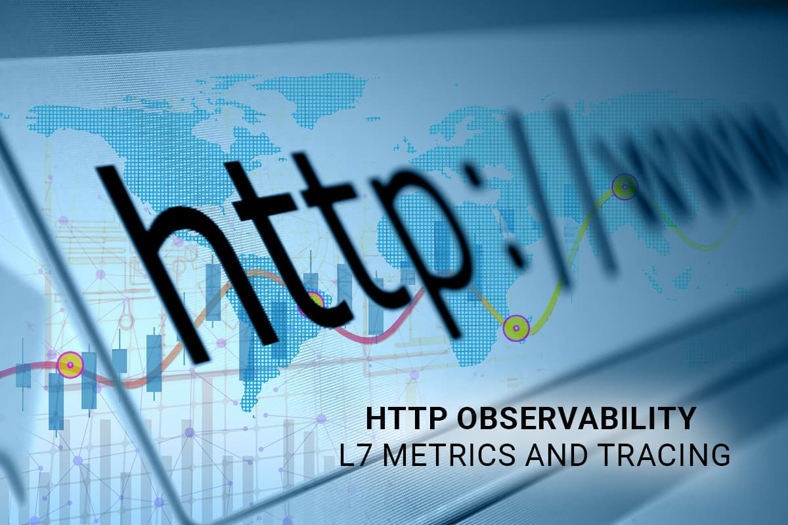

## Background

Apache SkyWalking is an open-source Application Performance Management system that helps users collect and aggregate logs, traces, metrics, and events for display on a UI. In the [previous article](/blog/diagnose-service-mesh-network-performance-with-ebpf/), we introduced how to use Apache SkyWalking Rover to analyze the network performance issue in the service mesh environment. However, in business scenarios, users often rely on mature layer 7 protocols, such as HTTP, for interactions between systems. In this article, we will discuss how to use eBPF techniques to analyze performance bottlenecks of layer 7 protocols and how to enhance the tracing system using network sampling.

This article will show how to use [Apache SkyWalking](https://github.com/apache/skywalking) with [eBPF](https://ebpf.io/what-is-ebpf/) to enhance metrics and traces in HTTP observability.

## HTTP Protocol Analysis

HTTP is one of the most common Layer 7 protocols and is usually used to provide services to external parties and for inter-system communication. In the following sections, we will show how to identify and analyze HTTP/1.x protocols.

### Protocol Identification

In HTTP/1.x, the client and server communicate through a single file descriptor (FD) on each side. Figure 1 shows the process of communication involving the following steps:

1. Connect/accept: The client establishes a connection with the HTTP server, or the server accepts a connection from the client.
2. Read/write (multiple times): The client or server reads and writes HTTPS requests and responses. A single request-response pair occurs within the same connection on each side.
3. Close: The client and server close the connection.

To obtain HTTP content, it’s necessary to read it from the second step of this process. As defined in the [RFC](http://rfc-editor.org/rfc/rfc2068.html), the content is contained within the data of the Layer 4 protocol and can be obtained by parsing the data. The request and response pair can be correlated because they both occur within the same connection on each side.


_Figure 1: HTTP communication timeline._

### HTTP Pipeline

[HTTP pipelining](https://en.wikipedia.org/wiki/HTTP_pipelining) is a feature of HTTP/1.1 that enables multiple HTTP requests to be sent over a single TCP connection without waiting for the corresponding responses. This feature is important because it ensures that the order of the responses on the server side matches the order of the requests.

Figure 2 illustrates how this works. Consider the following scenario: an HTTP client sends multiple requests to a server, and the server responds by sending the HTTP responses in the same order as the requests. This means that the first request sent by the client will receive the first response from the server, the second request will receive the second response, and so on.

When designing HTTP parsing, we should follow this principle by adding request data to a list and removing the first item when parsing a response. This ensures that the responses are processed in the correct order.

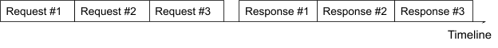

_Figure 2: HTTP/1.1 pipeline._

### Metrics

Based on the identification of the HTTP content and process topology diagram mentioned in the previous article, we can combine these two to generate process-to-process metrics data.

Figure 3 shows the metrics that currently support the analysis between the two processes. Based on the HTTP request and response data, we can analyze the following data:

| **Metrics Name**                     | **Type**          | **Unit**    | **Description**                                         |
| ------------------------------------ | ----------------- | ----------- | ------------------------------------------------------- |
| Request CPM(Call Per Minute)         | Counter           | count       | The HTTP request count                                  |
| Response Status CPM(Call Per Minute) | Counter           | count       | The count of per HTTP response status code              |
| Request Package Size                 | Counter/Histogram | Byte        | The request package size                                |
| Response Package Size                | Counter/Histogram | Byte        | The response package size                               |
| Client Duration                      | Counter/Histogram | Millisecond | The duration of single HTTP response on the client side |
| Server Duration                      | Counter/Histogram | Millisecond | The duration of single HTTP response on the server side |

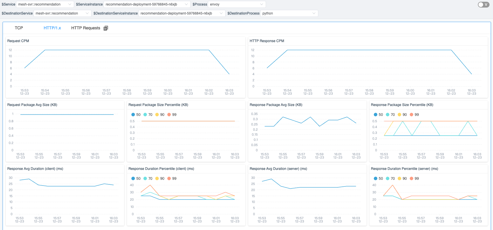

_Figure 3: Process-to-process metrics._

## HTTP and Trace

During the HTTP process, if we unpack the HTTP requests and responses from raw data, we can use this data to correlate with the existing tracing system.

### Trace Context Identification

In order to track the flow of requests between multiple services, the trace system usually creates a trace context when a request enters a service and passes it along to other services during the request-response process. For example, when an HTTP request is sent to another server, the trace context is included in the request header.

Figure 4 displays the raw content of an HTTP request intercepted by Wireshark. The trace context information generated by the Zipkin Tracing system can be identified by the “X-B3” prefix in the header. By using eBPF to intercept the trace context in the HTTP header, we can connect the current request with the trace system.

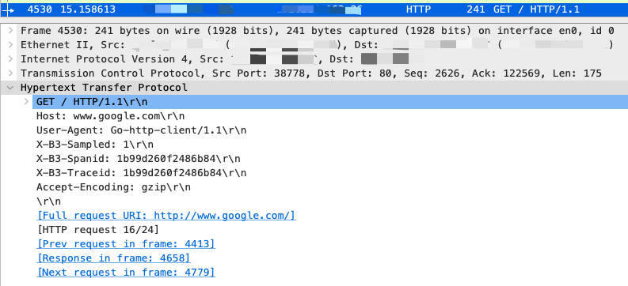

_Figure 4: View of HTTP headers in Wireshark._

### Trace Event

We have added the concept of an _event_ to traces. An event can be attached to a span and consists of start and end times, tags, and summaries, allowing us to attach any desired information to the Trace.

When performing eBPF network profiling, two events can be generated based on the request-response data. Figure 5 illustrates what happens when a service performs an HTTP request with profiling. The trace system generates _trace context_ information and sends it in the request. When the service executes in the kernel, we can generate an event for the corresponding trace span by interacting with the request-response data and execution time in the kernel space.

Previously, we could only observe the execution status in the user space. However, by combining traces and eBPF technologies, we can now also get more information about the current trace in the kernel space, which would impact less performance for the target service if we do similar things in the tracing SDK and agent.


_Figure 5: Logical view of profiling an HTTP request and response._

### Sampling

To ensure efficient data storage and minimize unnecessary data sampling, we use a sampling mechanism for traces in our system. This mechanism triggers sampling only when certain conditions are met. We also provide a list of the top _N_ traces, which allows users to quickly access the relevant request information for a specific trace.

To help users easily identify and analyze relevant events, we offer three different sampling rules:

1. **Slow Traces**: Sampling is triggered when the response time for a request exceeds a specified threshold.
2. **Response Status [400, 500)**: Sampling is triggered when the response status code is greater than or equal to 400 and less than 500.
3. **Response Status [500, 600)**: Sampling is triggered when the response status code is greater than or equal to 500 and less than 600.

In addition, we recognize that not all request or response raw data may be necessary for analysis. For example, users may be more interested in requesting data when trying to identify performance issues, while they may be more interested in response data when troubleshooting errors. As such, we also provide configuration options for request or response events to allow users to specify which type of data they would like to sample.

## Profiling in a Service Mesh

The SkyWalking and SkyWalking Rover projects have already implemented the HTTP protocol _analyze_ and _trace_ associations. How do they perform when running in a service mesh environment?

### Deployment

Figure 6 demonstrates the deployment of SkyWalking and SkyWalking Rover in a service mesh environment. SkyWalking Rover is deployed as a DaemonSet on each machine where a service is located and communicates with the SkyWalking backend cluster. It automatically recognizes the services on the machine and reports metadata information to the SkyWalking backend cluster. When a new network profiling task arises, SkyWalking Rover senses the task and analyzes the designated processes, collecting and aggregating network data before ultimately reporting it back to the SkyWalking backend service.


_Figure 6: SkyWalking rover deployment topology in a service mesh._

### Tracing Systems

Starting from version 9.3.0, the SkyWalking backend fully supports all functions in the Zipkin server. Therefore, the SkyWalking backend can collect traces from both the SkyWalking and Zipkin protocols. Similarly, SkyWalking Rover can identify and analyze trace context in both the SkyWalking and Zipkin trace systems. In the following two sections, network analysis results will be displayed in the SkyWalking and Zipkin UI respectively.

#### SkyWalking

When SkyWalking performs network profiling, similar to the TCP metrics in the [previous article](/blog/diagnose-service-mesh-network-performance-with-ebpf/), the SkyWalking UI will first display the topology between processes. When you open the dashboard of the line representing the traffic metrics between processes, you can see the metrics of HTTP traffic from the “HTTP/1.x” tab and the sampled HTTP requests with tracing in the “HTTP Requests” tab.

As shown in Figure 7, there are three lists in the tab, each corresponding to a condition in the event sampling rules. Each list displays the traces that meet the pre-specified conditions. When you click on an item in the trace list, you can view the complete trace.


_Figure 7: Sampled HTTP requests within tracing context._

When you click on an item in the trace list, you can quickly view the specified trace. In Figure 8, we can see that in the current service-related span, there is a tag with a number indicating how many HTTP events are related to that trace span.

Since we are in a service mesh environment, each service involves interacting with Envoy. Therefore, the current span includes Envoy’s request and response information. Additionally, since the current service has both incoming and outgoing requests, there are events in the corresponding span.

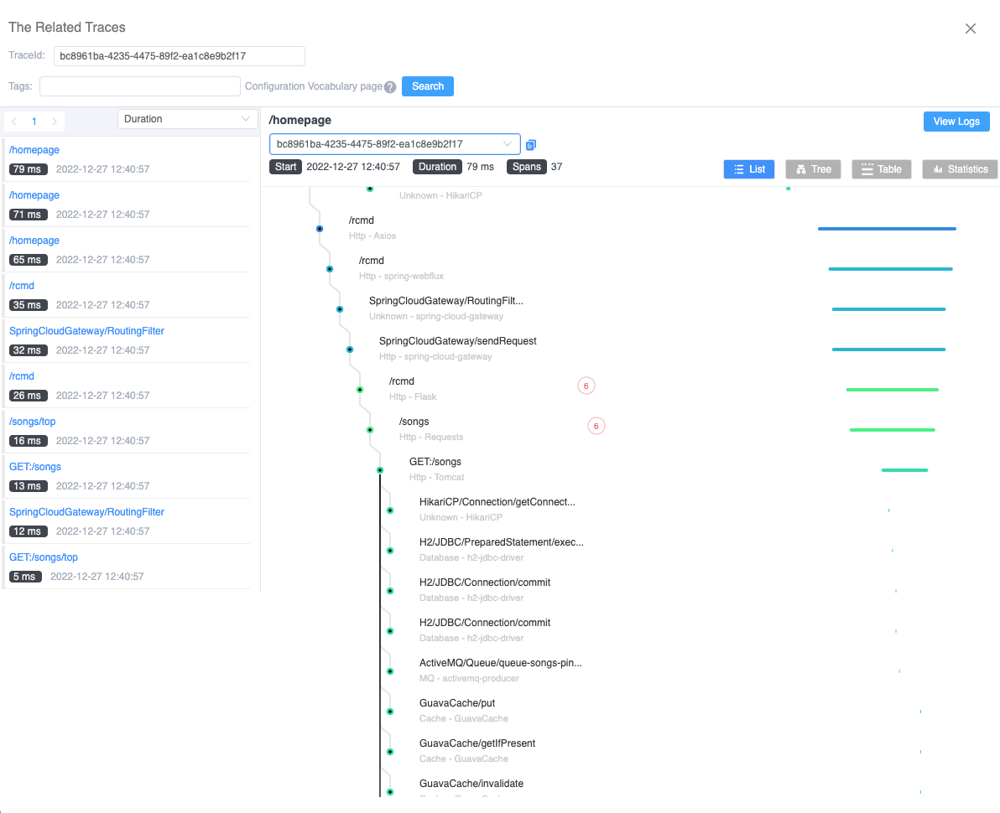

_Figure 8: Events in the trace detail._

When the span is clicked, the details of the span will be displayed. If there are events in the current span, the relevant event information will be displayed on a time axis. As shown in Figure 9, there are a total of 6 related events in the current Span. Each event represents a data sample of an HTTP request/response. One of the events spans multiple time ranges, indicating a longer system call time. It may be due to a blocked system call, depending on the implementation details of the HTTP request in different languages. This can also help us query the possible causes of errors.

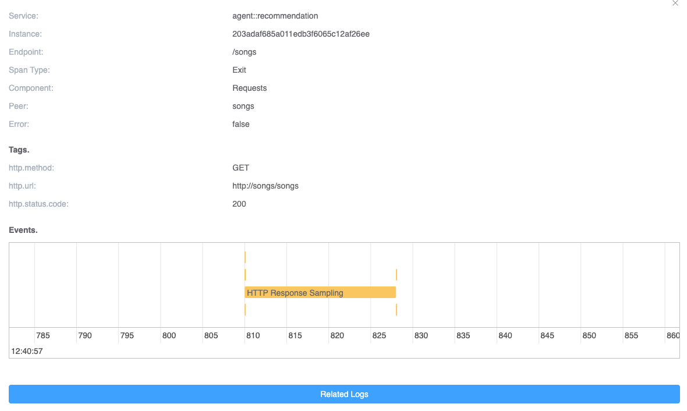

_Figure 9: Events in one trace span._

Finally, we can click on a specific event to see its complete information. As shown in Figure 10, it displays the sampling information of a request, including the SkyWalking trace context protocol contained in the request header from the HTTP raw data. The raw request data allows you to quickly re-request the request to solve any issues.

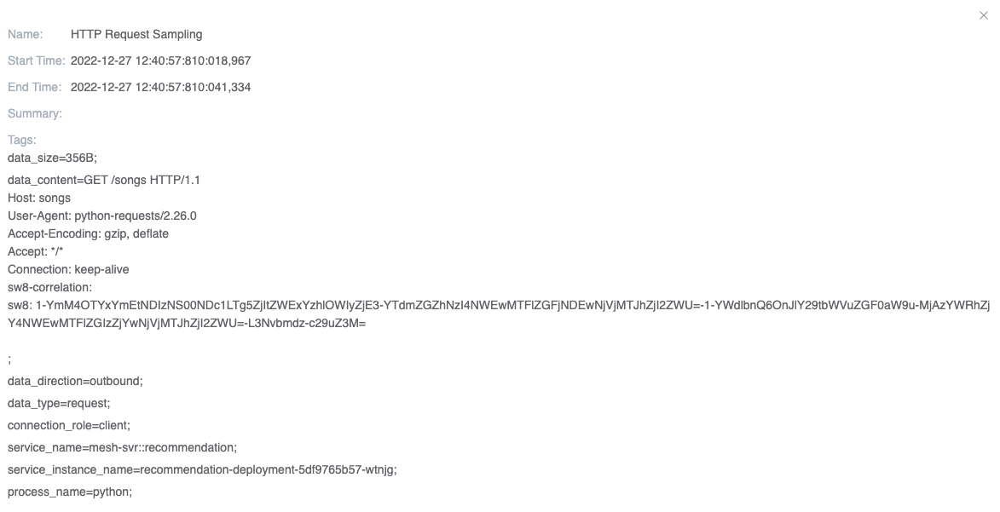

_Figure 10: The detail of the event._

#### Zipkin

Zipkin is one of the most widely used distributed tracing systems in the world. SkyWalking can function as an [alternative server](https://zipkin.io/pages/extensions_choices.html) to provide advanced features for Zipkin users. Here, we use this way to bring the feature into the Zipkin ecosystem out-of-box. The new events would also be treated as a kind of Zipkin’s tags and annotations.

To add events to a Zipkin span, we need to do the following:

1. Split the start and end times of each event into two annotations with a canonical name.
2. Add the sampled HTTP raw data from the event to the Zipkin span tags, using the same event name for corresponding purposes.

Figures 11 and 12 show annotations and tags in the same span. In these figures, we can see that the span includes at least two events with the same event name and sequence suffix (e.g., “Start/Finished HTTP Request/Response Sampling-x” in the figure). Both events have separate timestamps to represent their relative times within the span. In the tags, the data content of the corresponding event is represented by the event name and sequence number, respectively.

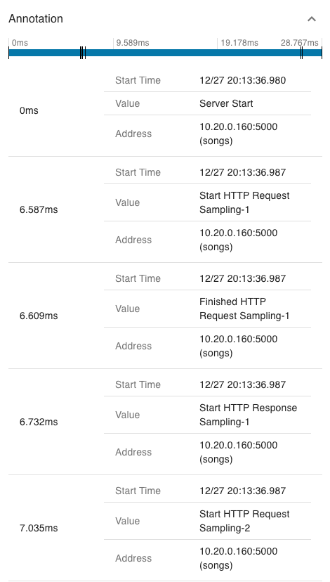

_Figure 11: Event timestamp in the Zipkin span annotation._

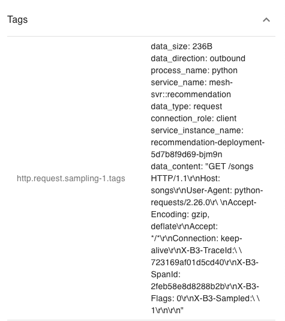

_Figure 12: Event raw data in the Zipkin span tag._

## Demo

In this section, we demonstrate how to perform network profiling in a service mesh and complete metrics collection and HTTP raw data sampling. To follow along, you will need a running Kubernetes environment.

### Deploy SkyWalking Showcase

SkyWalking Showcase contains a complete set of example services and can be monitored using SkyWalking. For more information, please check the [official documentation](https://skywalking.apache.org/docs/skywalking-showcase/next/readme/).

In this demo, we only deploy service, the latest released SkyWalking OAP, and UI.

```bash
export SW_OAP_IMAGE=apache/skywalking-oap-server:9.3.0
export SW_UI_IMAGE=apache/skywalking-ui:9.3.0
export SW_ROVER_IMAGE=apache/skywalking-rover:0.4.0

export FEATURE_FLAGS=mesh-with-agent,single-node,elasticsearch,rover
make deploy.kubernetes
```

After deployment is complete, please run the following script to open SkyWalking UI: http://localhost:8080/.

```bash
kubectl port-forward svc/ui 8080:8080 --namespace default
```

### Start Network Profiling Task

Currently, we can select the specific instances that we wish to monitor by clicking the **Data Plane** item in the **Service Mesh** panel and the **Service** item in the **Kubernetes** panel.

In figure 13, we have selected an instance with a list of tasks in the network profiling tab.

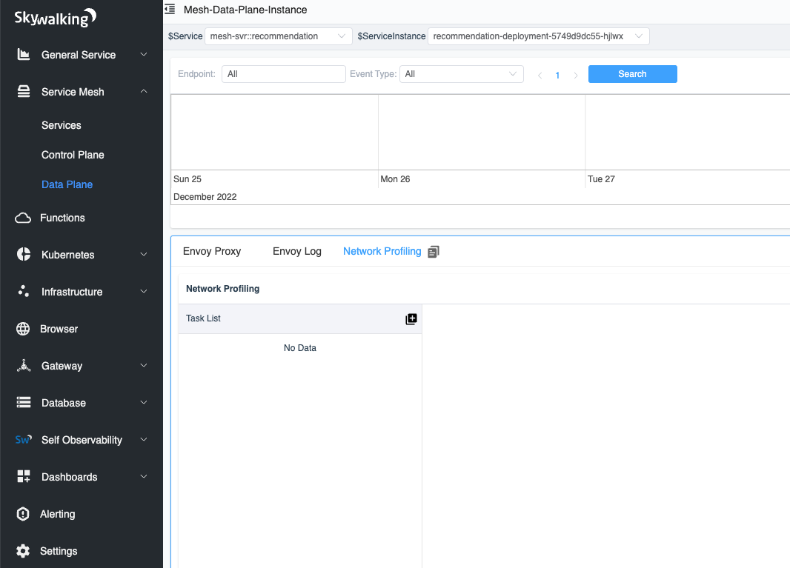

_Figure 13: Network Profiling tab in the Data Plane._

When we click the Start button, as shown in Figure 14, we need to specify the sampling rules for the profiling task. The sampling rules consist of one or more rules, each of which is distinguished by a different URI regular expression. When the HTTP request URI matches the regular expression, the rule is used. If the URI regular expression is empty, the default rule is used. Using multiple rules can help us make different sampling configurations for different requests.

Each rule has three parameters to determine if sampling is needed:

1. **Minimal Request Duration (ms)**: requests with a response time exceeding the specified time will be sampled.
2. **Sampling response status code between 400 and 499**: all status codes in the range [400-499) will be sampled.
3. **Sampling response status code between 500 and 599**: all status codes in the range [500-599) will be sampled.

Once the sampling configuration is complete, we can create the task.

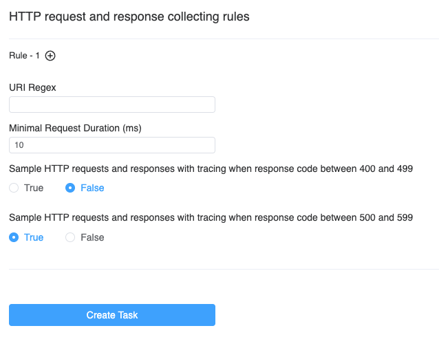

_Figure 14: Create network profiling task page._

### Done!

After a few seconds, you will see the process topology appear on the right side of the page.

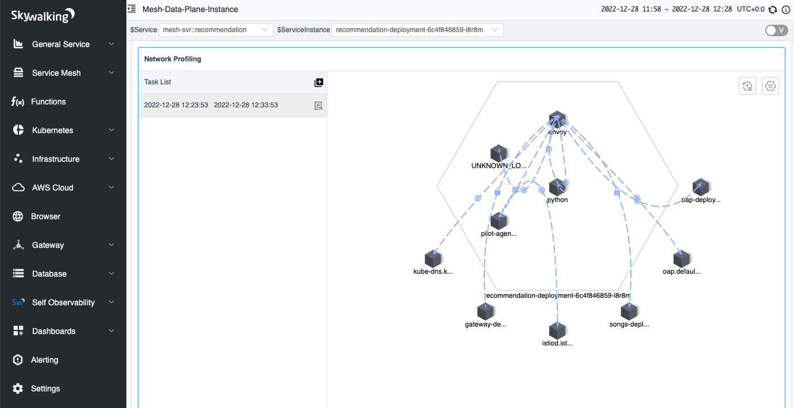

When you click on the line between processes, you can view the data between the two processes, which is divided into three tabs:

1. **TCP**: displays TCP-related metrics.
2. **HTTP/1.x**: displays metrics in the HTTP 1 protocol.
3. **HTTP Requests**: displays the analyzed request and saves it to a list according to the sampling rule.

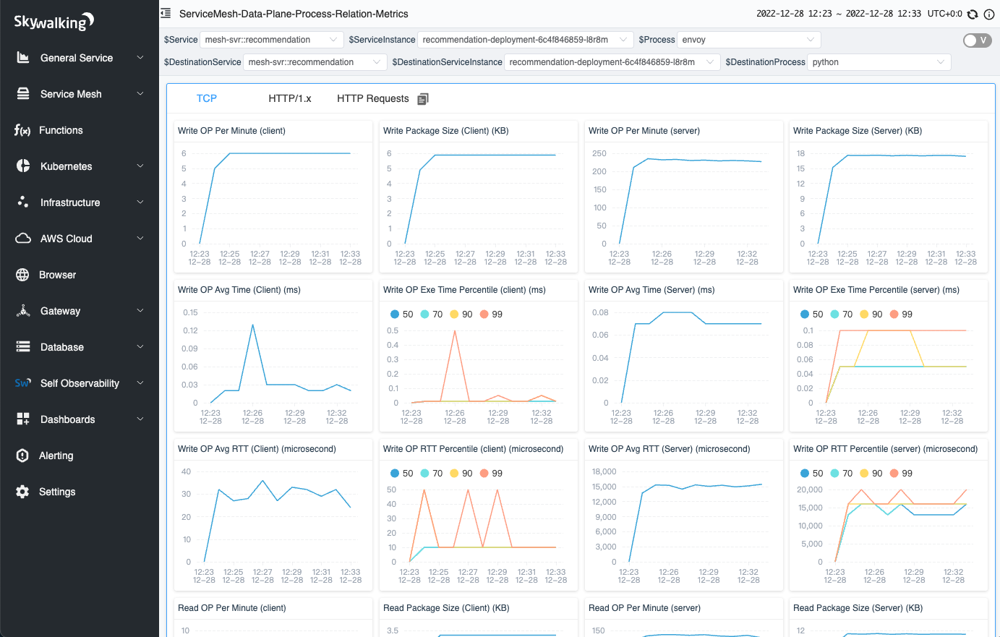

_Figure 16: TCP metrics in a network profiling task._

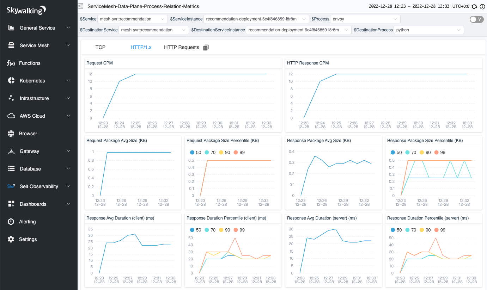

_Figure 17: HTTP/1.x metrics in a network profiling task._

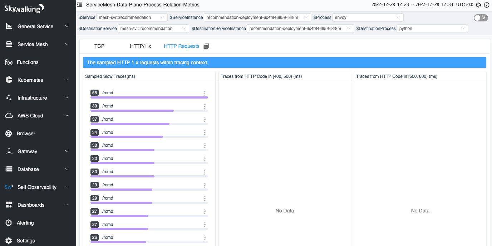

_Figure 18: HTTP sampled requests in a network profiling task._

## Conclusion

In this article, we detailed the overview of how to analyze the Layer 7 HTTP/1.x protocol in network analysis, and how to associate it with existing trace systems. This allows us to extend the scope of data we can observe from just user space to also include kernel-space data.

In the future, we will delve further into the analysis of kernel data, such as collecting information on TCP packet size, transmission frequency, network card, and help on enhancing distributed tracing from another perspective.

## Additional Resources

1. [SkyWalking Github Repo ›](https://github.com/apache/skywalking)
2. [SkyWalking Rover Github Repo ›](https://github.com/apache/skywalking-rover)
3. [SkyWalking Rover Documentation ›](https://skywalking.apache.org/docs/skywalking-rover/next/readme/)
4. [Diagnose Service Mesh Network Performance with eBPF blog post >](https://skywalking.apache.org/blog/diagnose-service-mesh-network-performance-with-ebpf/)
5. [SkyWalking Profiling Documentation >](https://skywalking.apache.org/docs/main/next/en/concepts-and-designs/profiling/)
6. [SkyWalking Trace Context Propagation >](https://skywalking.apache.org/docs/main/next/en/api/x-process-propagation-headers-v3/)
7. [Zipkin Trace Context Propagation >](https://github.com/openzipkin/b3-propagation)
8. [RFC - Hypertext Transfer Protocol – HTTP/1.1 >](https://www.rfc-editor.org/rfc/rfc2068.html)
