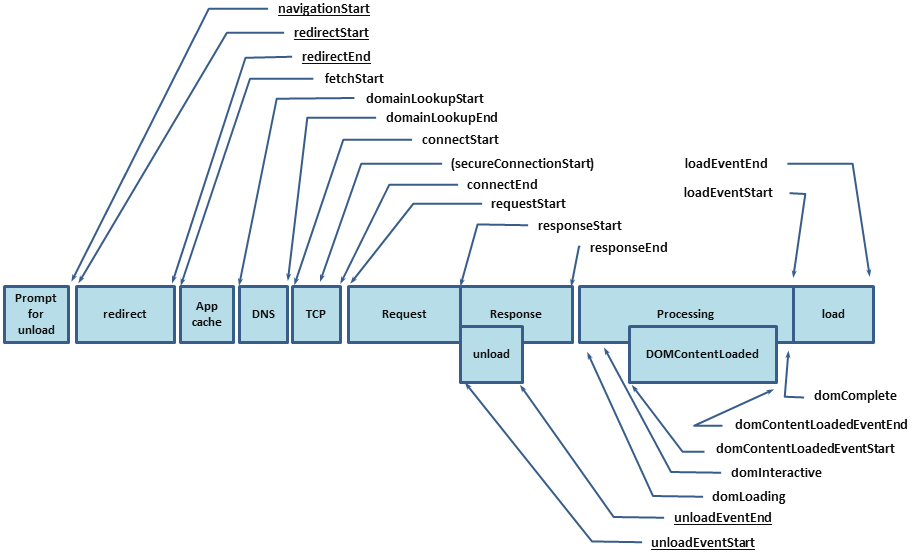

> Origin: [End-User Tracing in a SkyWalking-Observed Browser - The New Stack](https://thenewstack.io/end-user-tracing-in-a-skywalking-observed-browser)

[Apache SkyWalking](https://github.com/apache/skywalking): an APM (application performance monitor) system, especially
designed for microservices, cloud native, and container-based (Docker, Kubernetes, Mesos) architectures.

[skywalking-client-js](https://github.com/apache/skywalking-client-js): a lightweight client-side JavaScript exception, performance, and tracing library. It provides metrics and error collection to the SkyWalking backend. It also makes the browser the starting point for distributed tracing.


## Background

Web application performance affects the retention rate of users. If a page load time is too long, the user will give up. So we need to monitor the web application to understand performance and ensure that servers are stable, available and healthy. SkyWalking is an APM tool and the skywalking-client-js extends its monitoring to include the browser, providing performance metrics and error collection to the SkyWalking backend.


## Performance Metrics

The skywalking-client-js uses [window.performance] (https://developer.mozilla.org/en-US/docs/Web/API/Window/performance) for performance data collection. From the MDN doc, the performance interface provides access to performance-related information for the current page. It's part of the High Resolution Time API, but is enhanced by the [Performance Timeline API](https://developer.mozilla.org/en-US/docs/Web/API/Performance_Timeline),  the [Navigation Timing API](https://developer.mozilla.org/en-US/docs/Web/API/Navigation_timing_API), the [User Timing API](https://developer.mozilla.org/en-US/docs/Web/API/User_Timing_API), and the [Resource Timing API](https://developer.mozilla.org/en-US/docs/Web/API/Resource_Timing_API). In skywalking-client-js, all performance metrics  are calculated according to the [Navigation Timing API](https://www.w3.org/TR/navigation-timing/?spm=a2c4g.11186623.2.12.2f495c7cmRef8Q#sec-navigation-timing-interface) defined in the W3C specification. We can get a PerformanceTiming object describing our page using the window.performance.timing property. The PerformanceTiming interface contains properties that offer performance timing information for various events that occur during the loading and use of the current page.


We can better understand these attributes when we see them together in the figure below from [W3C](https://www.w3.org/TR/navigation-timing/?spm=a2c4g.11186623.2.14.2f495c7cmRef8Q#processing-model):



The following table contains performance metrics in skywalking-client-js.

|Metrics Name|Describe|Calculating Formulae|Note|
|----|----|----|----|
|redirectTime|Page redirection time|redirectEnd - redirectStart|If the current document and the document that is redirected to are not from the same [origin](http://tools.ietf.org/html/rfc6454), set redirectStart, redirectEnd to 0|
|ttfbTime|Time to First Byte|responseStart - requestStart|According to [Google Development](https://developers.google.com/web/tools/chrome-devtools/network/reference?spm=a2c4g.11186623.2.16.2f495c7cmRef8Q#timing)|
|dnsTime|Time to DNS query|domainLookupEnd - domainLookupStart|
|tcpTime|Time to TCP link|connectEnd - connectStart|
|transTime|Time to content transfer|responseEnd - responseStart|
|sslTime|Time to SSL secure connection|connectEnd - secureConnectionStart|Only supports HTTPS|
|resTime|Time to resource loading|loadEventStart - domContentLoadedEventEnd|Represents a synchronized load resource in pages|
|fmpTime|Time to First Meaningful Paint|-|Listen for changes in page elements. Traverse each new element, and calculate the total score of these elements. If the element is visible, the score is 1 * weight; if the element is not visible, the score is 0
|domAnalysisTime|Time to DOM analysis|domInteractive - responseEnd|
|fptTime|First Paint Time|responseEnd - fetchStart|
|domReadyTime|Time to DOM ready|domContentLoadedEventEnd - fetchStart|
|loadPageTime|Page full load time|loadEventStart - fetchStart|
|ttlTime|Time to interact|domInteractive - fetchStart|
|firstPackTime|Time to first package|responseStart - domainLookupStart|

Skywalking-client-js collects those performance metrics and sends them to the [OAP (Observability Analysis Platform) server](https://skywalking.apache.org/docs/main/latest/en/concepts-and-designs/backend-overview/) , which aggregates data on the back-end side that is then shown in visualizations on the UI side. Users can optimize the page according to these data.


## Exception Metrics
There are five kinds of errors that can be caught in skywalking-client-js:

- The resource loading error  is captured  by `window.addeventlistener ('error ', callback, true)`
- `window.onerror` catches JS execution errors 
- `window.addEventListener('unhandledrejection', callback)` is used to catch the promise errors
- the  Vue errors are captured by `Vue.config.errorHandler`
- the Ajax errors are captured by `addEventListener('error', callback); addEventListener('abort', callback); addEventListener('timeout', callback); ` in send callback.

The Skywalking-client-js traces error data to the OAP server, finally visualizing data on the UI side.  For an error overview of the App, there are several metrics for basic statistics and trends of errors, including the following metrics.

- App  Error Count, the total number of errors in the selected time period.
- App JS Error Rate, the proportion of PV with JS errors in a selected time period to total PV.
- All of  Apps Error Count, Top N Apps error count  ranking.
- All of Apps JS Error Rate, Top N Apps JS error rate ranking.
- Error Count of  Versions in the Selected App,  Top N Error Count of  Versions in the Selected App ranking.
- Error Rate  of  Versions in the Selected App, Top N JS Error Rate of Versions in the Selected App ranking.
- Error Count of the Selected App, Top N Error Count of the Selected App ranking.
- Error Rate  of the Selected App, Top N JS Error Rate of the Selected App ranking.


For pages, we use several metrics for basic statistics and trends of errors, including the following metrics:

- Top Unstable Pages / Error Rate, Top N Error Count pages of the Selected version ranking.
- Top Unstable Pages / Error Count, Top N Error Count pages of the Selected version ranking.
- Page Error Count Layout, data display of different errors in a period of time.


## User Metrics

SkyWalking browser monitoring also provides metrics about how the visitors use the monitored websites, such as PV(page views), UV(unique visitors), top N PV(page views), etc. 

In SPAs (single page applications), the page will be refreshed only once. The traditional method only reports PV once after the page loading, but cannot count the PV of each sub-page, and can't make other types of logs aggregate by sub-page.

SkyWalking browser monitoring provides two processing methods for SPA pages:

1. Enable SPA automatic parsing. This method is suitable for most single page application scenarios with URL hash as the route. In the initialized configuration item, set enableSPA to true, which will turn on the page's hashchange event listener (trigger re reporting PV), and use URL hash as the page field in other data reporting.

2. Manual reporting. This method can be used in all single page application scenarios. This method can be used if the first method is not usable. The following example provides a set page method to manually update the page name when data is reported. When this method is called, the page PV will be re reported by default: 

```js
app.on('routeChange', function (to) {
    ClientMonitor.setPerformance({
    collector: 'http://127.0.0.1:8080',
    service: 'browser-app',
    serviceVersion: '1.0.0',
    pagePath: to.path,
    autoTracePerf: true,
    enableSPA: true,
  });
});
```

Let's take a look at the result found in the following image. It shows the most popular applications and versions, and the changes of PV over a period of time.


 
## Make the browser the starting point for distributed tracing

SkyWalking browser monitoring intercepts HTTP requests to trace segments and spans. It supports tracking these following modes of HTTP requests: XMLHttpRequest and fetch. It also supports tracking libraries and tools based on XMLHttpRequest and fetch - such as Axios, SuperAgent, OpenApi, and so on.

Let’s see how the SkyWalking browser monitoring intercepts HTTP requests:


After this, use `window.addEventListener('xhrReadyStateChange', callback)` and set the readyState value to`sw8 = xxxx` in the request header. At the same time, reporting requests information to the back-end side. Finally, we can view trace data on the trace page. The following graphic is from the trace page:


To see how we listen for fetch requests, let’s see the source code of [fetch](https://github.com/github/fetch/blob/90fb680c1f50181782f276122c1b1115535b1603/fetch.js#L506)


As you can see, it creates a promise and a new XMLHttpRequest object. Because the code of the fetch is built into the browser, it must monitor the code execution first. Therefore, when we add listening events, we can't monitor the code in the fetch. Just after monitoring the code execution, let's rewrite the fetch:

```js
import { fetch } from 'whatwg-fetch'; window.fetch = fetch;
```

In this way, we can intercept the fetch request through the above method.


## Additional Resources

- [End-User Tracing in a SkyWalking-Observed Browser](/blog/end-user-tracing-in-a-skywalking-observed-browser).
