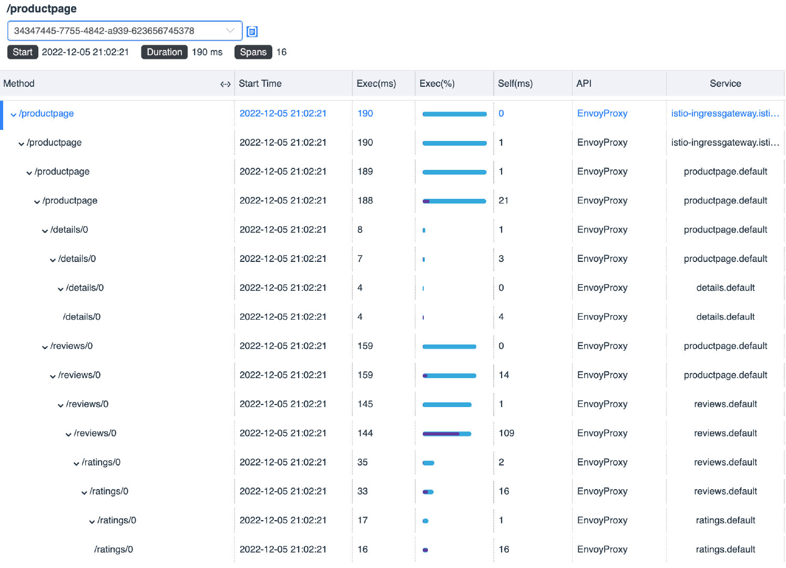
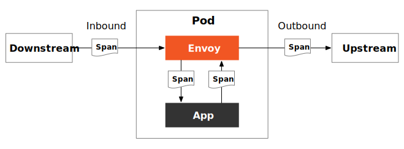
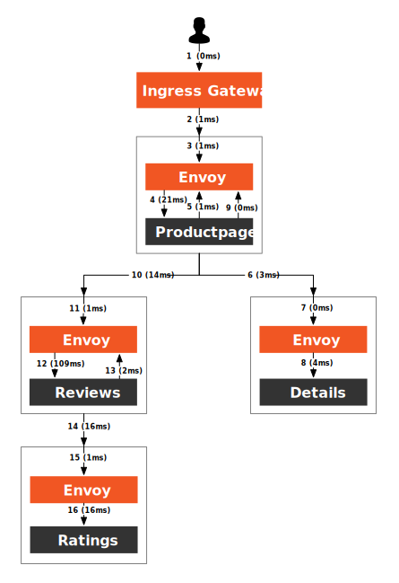

In cloud native applications, a request often needs to be processed through a series of APIs or backend services, some of which are parallel and some serial and located on different platforms or nodes. How do we determine the service paths and nodes a call goes through to help us troubleshoot the problem? This is where distributed tracing comes into play.

This article covers:

- How distributed tracing works
- How to choose distributed tracing software
- How to use distributed tracing in Istio
- How to view distributed tracing data using Bookinfo and SkyWalking as examples

## Distributed Tracing Basics

Distributed tracing is a method for tracing requests in a distributed system to help users better understand, control, and optimize distributed systems. There are two concepts used in distributed tracing: TraceID and SpanID. You can see them in Figure 1 below.

- **TraceID** is a globally unique ID that identifies the trace information of a request. All traces of a request belong to the same TraceID, and the TraceID remains constant throughout the trace of the request.
- **SpanID** is a locally unique ID that identifies a request’s trace information at a certain time. A request generates different SpanIDs at different periods, and SpanIDs are used to distinguish trace information for a request at different periods.

TraceID and SpanID are the basis of distributed tracing. They provide a uniform identifier for request tracing in distributed systems and facilitate users’ ability to query, manage, and analyze the trace information of requests.


*Figure 1: Trace and span*

The following is the process of distributed tracing:

- When a system receives a request, the distributed tracing system assigns a TraceID to the request, which is used to chain together the entire chain of invocations.
- The distributed trace system generates a SpanID and ParentID for each service call within the system for the request, which is used to record the parent-child relationship of the call; a Span without a ParentID is used as the entry point of the call chain.
- TraceID and SpanID are to be passed during each service call.
- When viewing a distributed trace, query the full process of a particular request by TraceID.

## How Istio Implements Distributed Tracing

Istio’s distributed tracing is based on information collected by the Envoy proxy in the data plane. After a service request is intercepted by Envoy, Envoy adds tracing information as headers to the request forwarded to the destination workload. The following headers are relevant for distributed tracing:

- As TraceID: x-request-id
- Used to establish parent-child relationships for Span in the LightStep trace: x-ot-span-context</li
- Used for Zipkin, also for Jaeger, SkyWalking, see [b3-propagation](https://github.com/openzipkin/b3-propagation):
  - *x-b3-traceid*
  - *x-b3-traceid*
  - *x-b3-spanid*
  - *x-b3-parentspanid*
  - *x-b3-sampled*
  - *x-b3-flags*
  - *b3*
- For Datadog:
  - *x-datadog-trace-id*
  - *x-datadog-parent-id*
  - *x-datadog-sampling-priority*
- For SkyWalking: *sw8*
- For AWS X-Ray: *x-amzn-trace-id*

For more information on how to use these headers, please see the [Envoy documentation](https://www.envoyproxy.io/docs/envoy/latest/configuration/http/http_conn_man/headers).

Regardless of the language of your application, Envoy will generate the appropriate tracing headers for you at the Ingress Gateway and forward these headers to the upstream cluster. However, in order to utilize the distributed tracing feature, you must modify your application code to attach the tracing headers to upstream requests. Since neither the service mesh nor the application can automatically propagate these headers, you can integrate the agent for distributed tracing into the application or manually propagate these headers in the application code itself. Once the tracing headers are propagated to all upstream requests, Envoy will send the tracing data to the tracer’s back-end processing, and then you can view the tracing data in the UI.

For example, look at the code of the Productpage service in the [Bookinfo application](https://istio.io/latest/docs/examples/bookinfo/). You can see that it integrates the Jaeger client library and synchronizes the header generated by Envoy with the HTTP requests to the Details and Reviews services in the *getForwardHeaders (request)* function.

```python
def getForwardHeaders(request):
    headers = {}

    # Using Jaeger agent to get the x-b3-* headers
    span = get_current_span()
    carrier = {}
    tracer.inject(
        span_context=span.context,
        format=Format.HTTP_HEADERS,
        carrier=carrier)

    headers.update(carrier)

    # Dealing with the non x-b3-* header manually
    if 'user' in session:
        headers['end-user'] = session['user']
    incoming_headers = [
        'x-request-id',
        'x-ot-span-context',
        'x-datadog-trace-id',
        'x-datadog-parent-id',
        'x-datadog-sampling-priority',
        'traceparent',
        'tracestate',
        'x-cloud-trace-context',
        'grpc-trace-bin',
        'sw8',
        'user-agent',
        'cookie',
        'authorization',
        'jwt',
    ]

    for ihdr in incoming_headers:
        val = request.headers.get(ihdr)
        if val is not None:
            headers[ihdr] = val

    return headers
```

For more information, the [Istio documentation](https://istio.io/latest/about/faq/#distributed-tracing) provides answers to frequently asked questions about distributed tracing in Istio.

## How to Choose A Distributed Tracing System

Distributed tracing systems are similar in principle. There are many such systems on the market, such as [Apache SkyWalking](https://github.com/apache/skywalking), [Jaeger](https://github.com/jaegertracing/jaeger), [Zipkin](https://github.com/openzipkin/zipkin/), [Lightstep](https://lightstep.com/), [Pinpoint](https://github.com/pinpoint-apm/pinpoint), and so on. For our purposes here, we will choose three of them and compare them in several dimensions. Here are our inclusion criteria:

- They are currently the most popular open-source distributed tracing systems.
- All are based on the OpenTracing specification.
- They support integration with Istio and Envoy.

| Items               | Apache SkyWalking                                            | Jaeger                                       | Zipkin                                       |
| ------------------- | ------------------------------------------------------------ | -------------------------------------------- | -------------------------------------------- |
| Implementations     | Language-based probes, service mesh probes, eBPF agent, third-party instrumental libraries (Zipkin currently supported) | Language-based probes                        | Language-based probes                        |
| Database            | ES, H2, MySQL, TiDB, Sharding-sphere, BanyanDB               | ES, MySQL, Cassandra, Memory                 | ES, MySQL, Cassandra, Memory                 |
| Supported Languages | Java, Rust, PHP, NodeJS, Go, Python, C++, .Net, Lua          | Java, Go, Python, NodeJS, C#, PHP, Ruby, C++ | Java, Go, Python, NodeJS, C#, PHP, Ruby, C++ |
| Initiator           | Personal                                                     | Uber                                         | Twitter                                      |
| Governance          | Apache Foundation                                            | CNCF                                         | CNCF                                         |
| Version             | 9.3.0                                                        | 1.39.0                                       | 2.23.19                                      |
| Stars               | 20.9k                                                        | 16.8k                                        | 15.8k                                        |

Although Apache SkyWalking’s agent does not support as many languages as Jaeger and Zipkin, SkyWalking’s implementation is richer and compatible with Jaeger and Zipkin trace data, and development is more active, so it is one of the best choices for building a telemetry platform.

## Demo

Refer to the [Istio documentation](https://istio.io/latest/docs/tasks/observability/distributed-tracing/skywalking/) to install and configure Apache SkyWalking.

### Environment Description

The following is the environment for our demo:

- Kubernetes 1.24.5
- Istio 1.16
- SkyWalking 9.1.0

### Install Istio

Before installing Istio, you can check the environment for any problems:

```bash
$ istioctl experimental precheck
✔ No issues found when checking the cluster. Istio is safe to install or upgrade!
  To get started, check out https://istio.io/latest/docs/setup/getting-started/
```

Then install Istio and configure the destination for sending tracing messages as SkyWalking:

```bash
# Initial Istio Operator
istioctl operator init
# Configure tracing destination
kubectl apply -f - <<EOF
apiVersion: install.istio.io/v1alpha1
kind: IstioOperator
metadata:
  namespace: istio-system
  name: istio-with-skywalking
spec:
  meshConfig:
    defaultProviders:
      tracing:
      - "skywalking"
    enableTracing: true
    extensionProviders:
    - name: "skywalking"
      skywalking:
        service: tracing.istio-system.svc.cluster.local
        port: 11800
EOF
```

## Deploy Apache SkyWalking

Istio 1.16 supports distributed tracing using Apache SkyWalking. Install SkyWalking by executing the following code:

```bash
kubectl apply -f 
https://raw.githubusercontent.com/istio/istio/release-1.16/samples/addons/extras/skywalking.yaml
```

It will install the following components under the *istio-system* namespace:

- [SkyWalking Observability Analysis Platform (OAP)](https://skywalking.apache.org/docs/main/v9.3.0/en/concepts-and-designs/backend-overview/): Used to receive trace data, supports SkyWalking native data formats, Zipkin v1 and v2 and Jaeger format.
- [UI](https://skywalking.apache.org/docs/main/v9.3.0/en/ui/readme/): Used to query distributed trace data.

For more information about SkyWalking, please refer to the [SkyWalking documentation](https://skywalking.apache.org/docs/main/v9.3.0/readme/).

## Deploy the Bookinfo Application

Execute the following command to install the bookinfo application:

```bash
kubectl label namespace default istio-injection=enabled
kubectl apply -f samples/bookinfo/platform/kube/bookinfo.yaml
kubectl apply -f samples/bookinfo/networking/bookinfo-gateway.yaml
```

Launch the SkyWalking UI:

```bash
istioctl dashboard skywalking
```

Figure 2 shows all the services available in the bookinfo application:


*Figure 2: SkyWalking General Service page*

You can also see information about instances, endpoints, topology, tracing, etc. For example, Figure 3 shows the service topology of the bookinfo application:


*Figure 3: Topology diagram of the Bookinfo application*

Tracing views in SkyWalking can be displayed in a variety of formats, including list, tree, table, and statistics. See Figure 4:


*Figure 4: SkyWalking General Service trace supports multiple display formats*

To facilitate our examination, set the sampling rate of the trace to 100%:

```bash
kubectl apply -f - <<EOF
apiVersion: telemetry.istio.io/v1alpha1
kind: Telemetry
metadata:
  name: mesh-default
  namespace: istio-system
spec:
  tracing:
  - randomSamplingPercentage: 100.00
EOF
```

> **Important:** *It’s generally not good practice to set the sampling rate to 100% in a production environment. To avoid the overhead of generating too many trace logs in production, please adjust the sampling strategy (sampling percentage).*

## Uninstall

After experimenting, uninstall Istio and SkyWalking by executing the following command.

```bash
samples/bookinfo/platform/kube/cleanup.sh
istioctl unintall --purge
kubectl delete namespace istio-system
```

## Understanding the Bookinfo Tracing Information

Navigate to the General Service tab in the Apache SkyWalking UI, and you can see the trace information for the most recent *istio-ingressgateway* service, as shown in Figure 5. Click on each span to see the details.



*Figure 5: The table view shows the basic information about each span.*

Switching to the list view, you can see the execution order and duration of each span, as shown in Figure 6:


*Figure 6: List display*

You might want to know why such a straightforward application generates so much span data. Because after we inject the Envoy proxy into the pod, every request between services will be intercepted and processed by Envoy, as shown in Figure 7:



*Figure 7: Envoy intercepts requests to generate a span*

The tracing process is shown in Figure 8:



*Figure 8: Trace of the Bookinfo application*

We give each span a label with a serial number, and the time taken is indicated in parentheses. For illustration purposes, we have summarized all spans in the table below.

| No.  | Endpoint     | Total Duration (ms) | Component Duration (ms) | Current Service      | Description                                 |
| ---- | ------------ | ------------------- | ----------------------- | -------------------- | ------------------------------------------- |
| 1    | /productpage | 190                 | 0                       | istio-ingressgateway | Envoy Outbound                              |
| 2    | /productpage | 190                 | 1                       | istio-ingressgateway | Ingress -> Productpage network transmission |
| 3    | /productpage | 189                 | 1                       | productpage          | Envoy Inbound                               |
| 4    | /productpage | 188                 | 21                      | productpage          | Application internal processing             |
| 5    | /details/0   | 8                   | 1                       | productpage          | Envoy Outbound                              |
| 6    | /details/0   | 7                   | 3                       | productpage          | Productpage -> Details network transmission |
| 7    | /details/0   | 4                   | 0                       | details              | Envoy Inbound                               |
| 8    | /details/0   | 4                   | 4                       | details              | Application internal processing             |
| 9    | /reviews/0   | 159                 | 0                       | productpage          | Envoy Outbound                              |
| 10   | /reviews/0   | 159                 | 14                      | productpage          | Productpage -> Reviews network transmission |
| 11   | /reviews/0   | 145                 | 1                       | reviews              | Envoy Inbound                               |
| 12   | /reviews/0   | 144                 | 109                     | reviews              | Application internal processing             |
| 13   | /ratings/0   | 35                  | 2                       | reviews              | Envoy Outbound                              |
| 14   | /ratings/0   | 33                  | 16                      | reviews              | Reviews -> Ratings network transmission     |
| 15   | /ratings/0   | 17                  | 1                       | ratings              | Envoy Inbound                               |
| 16   | /ratings/0   | 16                  | 16                      | ratings              | Application internal processing             |

From the above information, it can be seen that:

- The total time consumed for this request is 190 ms.
- In Istio sidecar mode, each traffic flow in and out of the application container must pass through the Envoy proxy once, each time taking 0 to 2 ms.
- Network requests between Pods take between 1 and 16ms.
- This is because the data itself has errors and the start time of the Span is not necessarily equal to the end time of the parent Span.
- We can see that the most time-consuming part is the Reviews application, which takes 109 ms so that we can optimize it for that application.

## Summary

Distributed tracing is an indispensable tool for analyzing performance and troubleshooting modern distributed applications. In this tutorial, we’ve seen how, with just a few minor changes to your application code to propagate tracing headers, Istio makes distributed tracing simple to use. We’ve also reviewed [Apache SkyWalking](https://skywalking.apache.org/) as one of the best distributed tracing systems that Istio supports. It is a fully functional platform for cloud native application analytics, with features such as metrics and log collection, alerting, Kubernetes monitoring, [service mesh performance diagnosis using eBPF](https://skywalking.apache.org/blog/diagnose-service-mesh-network-performance-with-ebpf/), and more.

---

If you’re new to service mesh and Kubernetes security, we have a bunch of free online courses [available at Tetrate Academy](https://tetr8.io/academy) that will quickly get you up to speed with Istio and Envoy.

If you’re looking for a fast way to get to production with Istio, check out [Tetrate Istio Distribution (TID)](https://tetr8.io/tid). TID is Tetrate’s hardened, fully upstream Istio distribution, with FIPS-verified builds and support available. It’s a great way to get started with Istio knowing you have a trusted distribution to begin with, have an expert team supporting you, and also have the option to get to FIPS compliance quickly if you need to.

Once you have Istio up and running, you will probably need simpler ways to manage and secure your services beyond what’s available in Istio, that’s where Tetrate Service Bridge comes in. You can learn more about how Tetrate Service Bridge makes service mesh more secure, manageable, and resilient [here](https://tetr8.io/tsb), or [contact us for a quick demo](https://tetr8.io/contact).
