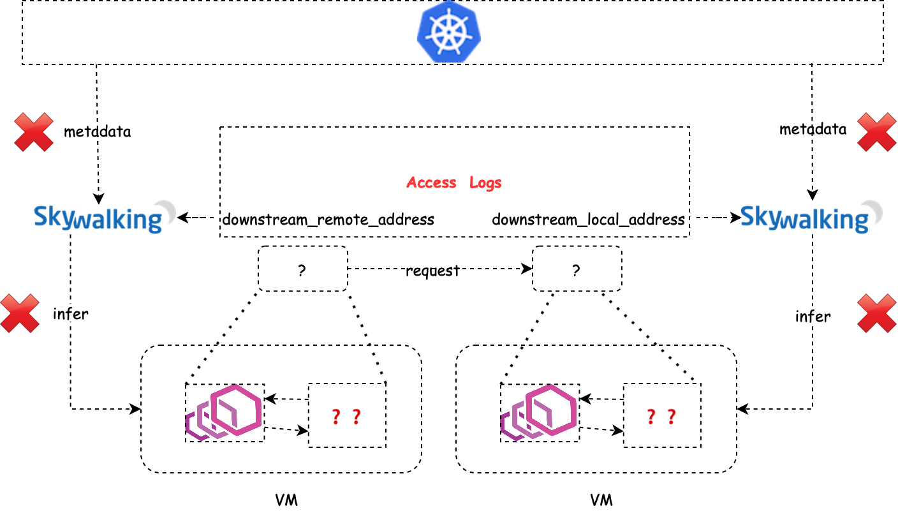
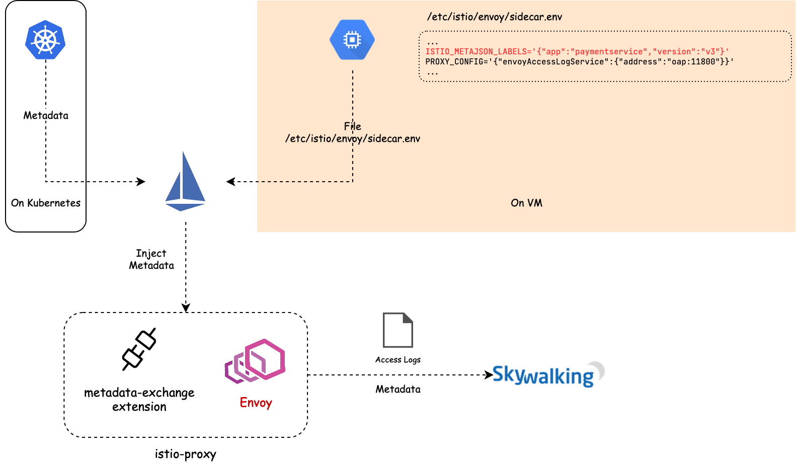
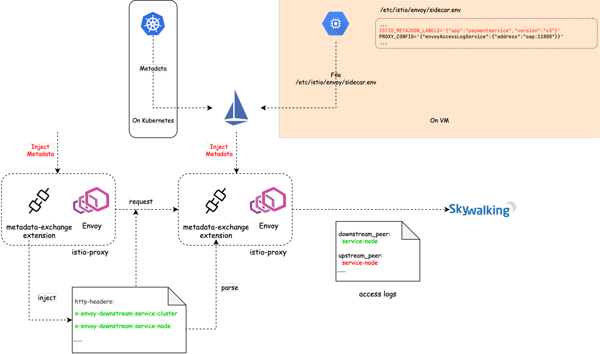
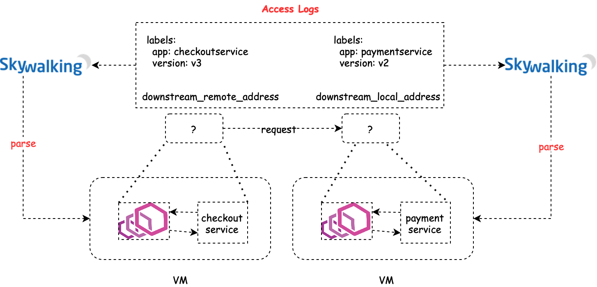
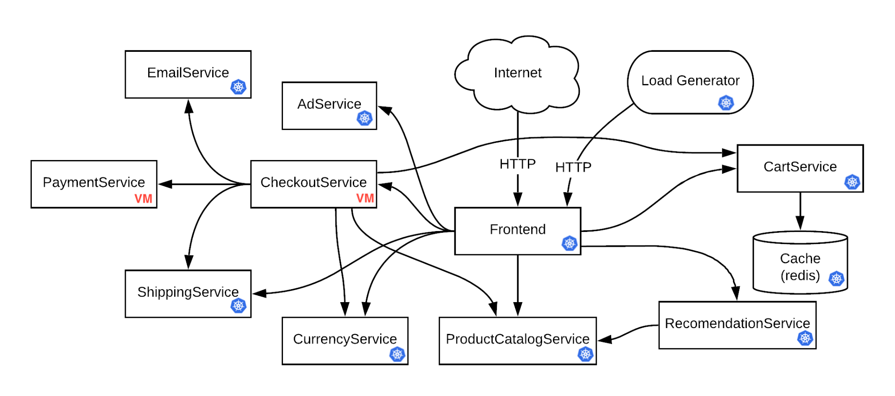
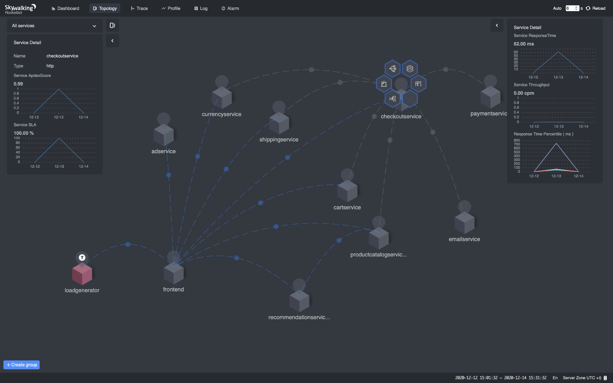
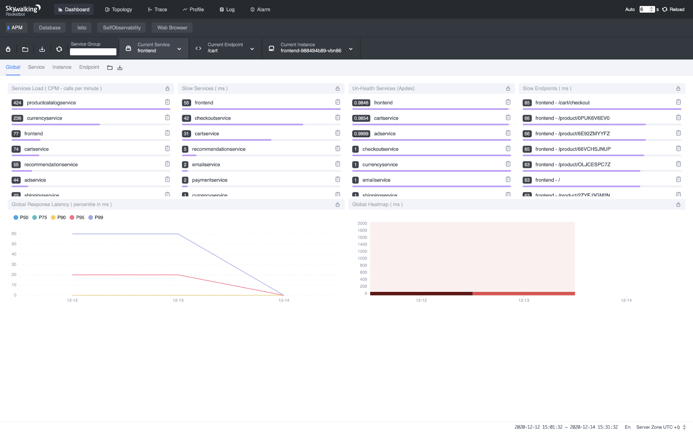
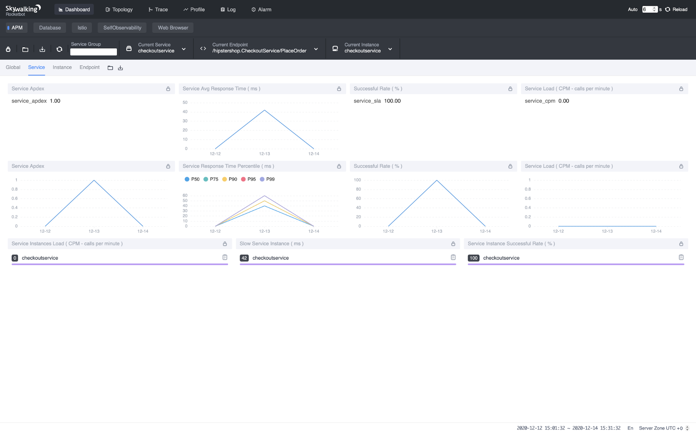
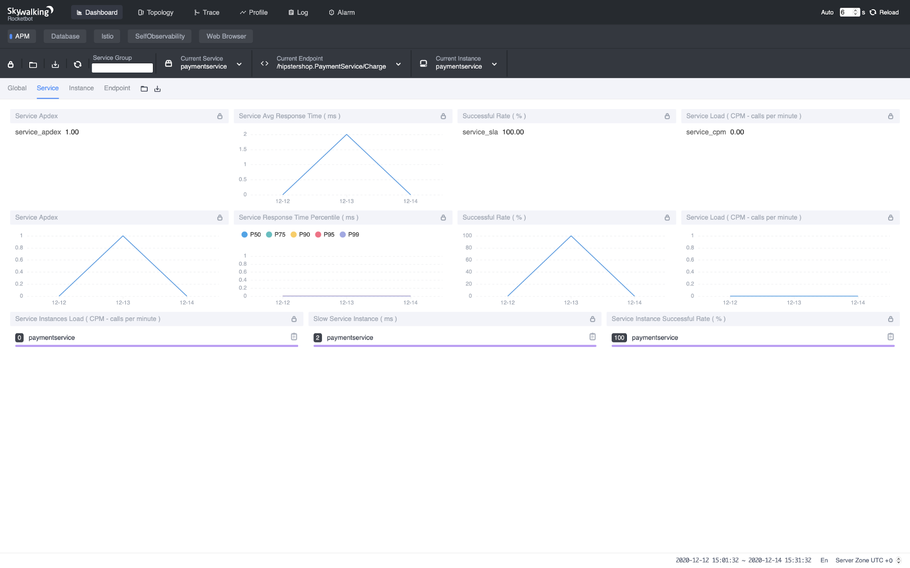

> Origin: [Observe VM Service Meshes with Apache SkyWalking and the Envoy Access Log Service - The New Stack](https://thenewstack.io/observe-virtual-machine-service-meshes-with-apache-skywalking-and-the-envoy-access-log-service)

[Apache SkyWalking](https://github.com/apache/skywalking): an APM (application performance monitor) system, especially
designed for microservices, cloud native, and container-based (Docker, Kubernetes, Mesos) architectures.

[Envoy Access Log Service](https://www.envoyproxy.io/docs/envoy/latest/api-v2/service/accesslog/v2/als.proto): Access
Log Service (ALS) is an Envoy extension that emits detailed access logs of all requests going through Envoy.

## Background

In the [previous post](/blog/obs-service-mesh-with-sw-and-als), we talked about the observability of service mesh under
Kubernetes environment, and applied it to the bookinfo application in practice. We also mentioned that, in order to map
the IP addresses into services, SkyWalking needs access to the service metadata from a Kubernetes cluster, which is not
available for services deployed in virtual machines (VMs). In this post, we will introduce a new analyzer in SkyWalking
that leverages Envoy’s metadata exchange mechanism to decouple with Kubernetes. The analyzer is designed to work in
Kubernetes environments, VM environments, and hybrid environments. If there are virtual machines in your service mesh,
you might want to try out this new analyzer for better observability, which we will demonstrate in this tutorial.

## How it works

The mechanism of how the analyzer works is the same as what we discussed in
the [previous post](/blog/obs-service-mesh-with-sw-and-als). What makes VMs different from Kubernetes is that, for VM
services, there are no places where we can fetch the metadata to map the IP addresses into services.



The basic idea we present in this article is to carry the metadata along with Envoy’s access logs, which is called
metadata-exchange mechanism in Envoy. When Istio pilot-agent starts an Envoy proxy as a sidecar of a service, it
collects the metadata of that service from the Kubernetes platform, or a file on the VM where that service is deployed,
and injects the metadata into the bootstrap configuration of Envoy. Envoy will carry the metadata transparently when
emitting access logs to the SkyWalking receiver.



But how does Envoy compose a piece of a complete access log that involves the client side and server side? When a
request goes out from Envoy, a plugin of istio-proxy named "metadata-exchange" injects the metadata into the http
headers (with a prefix like `x-envoy-downstream-`), and the metadata is propagated to the server side. The Envoy sidecar
of the server side receives the request and parses the headers into metadata, and puts the metadata into the access log,
keyed by `wasm.downstream_peer`. The server side Envoy also puts its own metadata into the access log keyed
by `wasm.upstream_peer.` Hence the two sides of a single request are completed.



With the metadata-exchange mechanism, we can use the metadata directly without any extra query.



## Example

In this tutorial, we will use another demo
application [Online Boutique](http://github.com/GoogleCloudPlatform/microservices-demo) that consists of 10+ services so
that we can deploy some of them in VMs and make them communicate with other services deployed in Kubernetes.



Topology of Online Boutique In order to cover as many cases as possible, we will deploy `CheckoutService`
and `PaymentService` on VM and all the other services on Kubernetes, so that we can cover the cases like Kubernetes →
VM (e.g. `Frontend` → `CheckoutService`), VM → Kubernetes (e.g. `CheckoutService` → `ShippingService`), and VM → VM (
e.g. `CheckoutService` → `PaymentService`).

**NOTE**: All the commands used in this tutorial are accessible
on [GitHub](https://github.com/SkyAPMTest/sw-als-vm-demo-scripts).

```shell
git clone https://github.com/SkyAPMTest/sw-als-vm-demo-scripts
cd sw-als-vm-demo-scripts
```

Make sure to init the `gcloud` SDK properly before moving on. Modify the `GCP_PROJECT` in file `env.sh` to your own
project name. Most of the other variables should be OK to work if you keep them intact. If you would like to
use `ISTIO_VERSION` >/= 1.8.0, please make sure [this patch](https://github.com/istio/istio/pull/28956) is included.

* Prepare Kubernetes cluster and VM instances
  [`00-create-cluster-and-vms.sh`](https://github.com/SkyAPMTest/sw-als-vm-demo-scripts/blob/2179d04270c98b9f87cf3998f5af775870ed53a7/00-create-cluster-and-vms.sh)
  creates a new GKE cluster and 2 VM instances that will be used through the entire tutorial, and sets up some necessary
  firewall rules for them to communicate with each other.
* Install Istio and SkyWalking
  [`01a-install-istio.sh`](https://github.com/SkyAPMTest/sw-als-vm-demo-scripts/blob/2179d04270c98b9f87cf3998f5af775870ed53a7/01a-install-istio.sh)
  installs Istio Operator with spec `resources/vmintegration.yaml`. In the YAML file, we enable the `meshExpansion` that
  supports VM in mesh. We also enable the Envoy access log service and specify the
  address `skywalking-oap.istio-system.svc.cluster.local:11800` to which Envoy emits the access logs.
  [`01b-install-skywalking.sh`](https://github.com/SkyAPMTest/sw-als-vm-demo-scripts/blob/2179d04270c98b9f87cf3998f5af775870ed53a7/01b-install-skywalking.sh)
  installs Apache SkyWalking and sets the analyzer to `mx-mesh`.
* Create files to initialize the VM
  [`02-create-files-to-transfer-to-vm.sh`](https://github.com/SkyAPMTest/sw-als-vm-demo-scripts/blob/2179d04270c98b9f87cf3998f5af775870ed53a7/02-create-files-to-transfer-to-vm.sh)
  creates necessary files that will be used to initialize the VMs.
  [`03-copy-work-files-to-vm.sh`](https://github.com/SkyAPMTest/sw-als-vm-demo-scripts/blob/2179d04270c98b9f87cf3998f5af775870ed53a7/03-copy-work-files-to-vm.sh)
  securely transfers the generated files to the VMs with `gcloud scp` command. Now use `./ssh.sh checkoutservice`
  and `./ssh.sh paymentservice` to log into the two VMs respectively, and `cd` to the `~/work` directory,
  execute `./prep-checkoutservice.sh` on `checkoutservice` VM instance and `./prep-paymentservice.sh`
  on `paymentservice` VM instance. The Istio sidecar should be installed and started properly. To verify that,
  use `tail -f /var/logs/istio/istio.log` to check the Istio logs. The output should be something like:

  ```
  2020-12-12T08:07:07.348329Z	info	sds	resource:default new connection
  2020-12-12T08:07:07.348401Z	info	sds	Skipping waiting for gateway secret
  2020-12-12T08:07:07.348401Z	info	sds	Skipping waiting for gateway secret
  2020-12-12T08:07:07.568676Z	info	cache	Root cert has changed, start rotating root cert for SDS clients
  2020-12-12T08:07:07.568718Z	info	cache	GenerateSecret default
  2020-12-12T08:07:07.569398Z	info	sds	resource:default pushed key/cert pair to proxy
  2020-12-12T08:07:07.949156Z	info	cache	Loaded root cert from certificate ROOTCA
  2020-12-12T08:07:07.949348Z	info	sds	resource:ROOTCA pushed root cert to proxy
  2020-12-12T20:12:07.384782Z	info	sds	resource:default pushed key/cert pair to proxy
  2020-12-12T20:12:07.384832Z	info	sds	Dynamic push for secret default
  ```

  The dnsmasq configuration `address=/.svc.cluster.local/{ISTIO_SERVICE_IP_STUB}` also resolves the domain names ended
  with `.svc.cluster.local` to Istio service IP, so that you are able to access the Kubernetes services in the VM by
  fully qualified domain name (FQDN) such as `httpbin.default.svc.cluster.local`.

* Deploy demo application Because we want to deploy `CheckoutService` and `PaymentService` manually on
  VM, `resources/google-demo.yaml` removes the two services
  from [the original YAML](https://github.com/GoogleCloudPlatform/microservices-demo/blob/master/release/kubernetes-manifests.yaml)
  .
  [`04a-deploy-demo-app.sh`](https://github.com/SkyAPMTest/sw-als-vm-demo-scripts/blob/2179d04270c98b9f87cf3998f5af775870ed53a7/04a-deploy-demo-app.sh)
  deploys the other services on Kubernetes. Then log into the 2 VMs, run `~/work/deploy-checkoutservice.sh`
  and `~/work/deploy-paymentservice.sh` respectively to deploy `CheckoutService` and `PaymentService`.

* Register VMs to Istio Services on VMs can access the services on Kubernetes by FQDN, but that’s not the case when the
  Kubernetes services want to talk to the VM services. The mesh has no idea where to forward the requests such
  as `checkoutservice.default.svc.cluster.local` because `checkoutservice` is isolated in the VM. Therefore, we need to
  register the services to the
  mesh. [`04b-register-vm-with-istio.sh`](https://github.com/SkyAPMTest/sw-als-vm-demo-scripts/blob/2179d04270c98b9f87cf3998f5af775870ed53a7/04b-register-vm-with-istio.sh)
  registers the VM services to the mesh by creating a "dummy" service without running Pods, and a `WorkloadEntry` to
  bridge the "dummy" service with the VM service.

## Done!

The demo application contains a `load generator` service that performs requests repeatedly. We only need to wait a few
seconds, and then open the SkyWalking web UI to check the results.

```
export POD_NAME=$(kubectl get pods --namespace istio-system -l "app=skywalking,release=skywalking,component=ui" -o jsonpath="{.items[0].metadata.name}")
echo "Visit http://127.0.0.1:8080 to use your application"
kubectl port-forward $POD_NAME 8080:8080 --namespace istio-system
```

Navigate the browser to http://localhost:8080 . The metrics, topology should be there.









## Troubleshooting

If you face any trouble when walking through the steps, here are some common problems and possible solutions:

* VM service cannot access Kubernetes services? It’s likely the DNS on the VM doesn’t correctly resolve the fully
  qualified domain names. Try to verify that with `nslookup istiod.istio-system.svc.cluster.local`. If it doesn’t
  resolve to the Kubernetes CIDR address, recheck the step in `prep-checkoutservice.sh` and `prep-paymentservice.sh`. If
  the DNS works correctly, try to verify that Envoy has fetched the upstream clusters from the control plane
  with `curl http://localhost:15000/clusters`. If it doesn’t contain the target service,
  recheck `prep-checkoutservice.sh`.

* Services are normal but nothing on SkyWalking WebUI? Check the SkyWalking OAP logs
  via `kubectl -n istio-system logs -f $(kubectl get pod -A -l "app=skywalking,release=skywalking,component=oap" -o name)`
  and WebUI logs
  via `kubectl -n istio-system logs -f $(kubectl get pod -A -l "app=skywalking,release=skywalking,component=ui" -o name)`
  to see whether there are any error logs . Also, make sure the time zone at the bottom-right of the browser is set
  to `UTC +0`.

## Additional Resources

- [Observe a Service Mesh with Envoy ALS](/blog/obs-service-mesh-with-sw-and-als).
