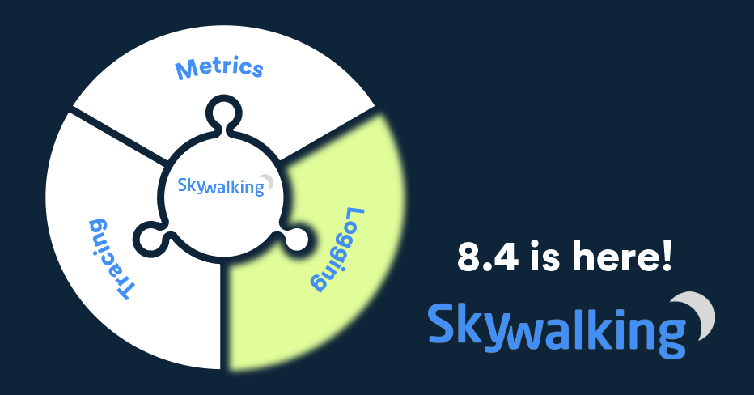
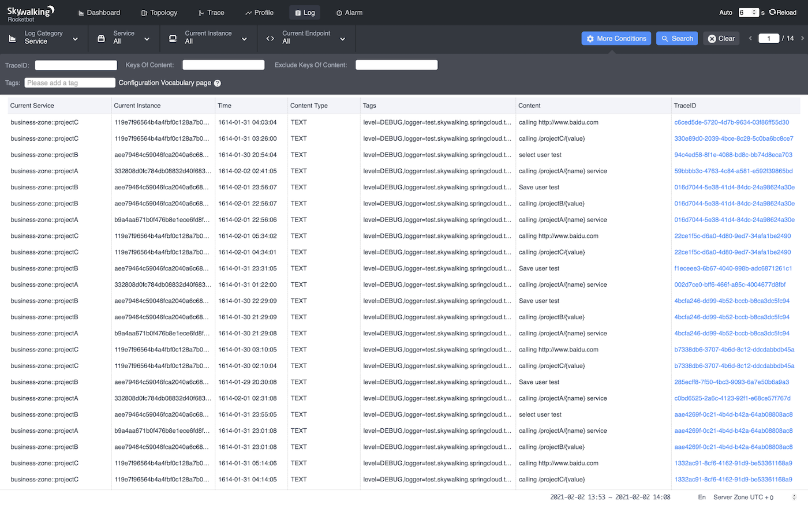
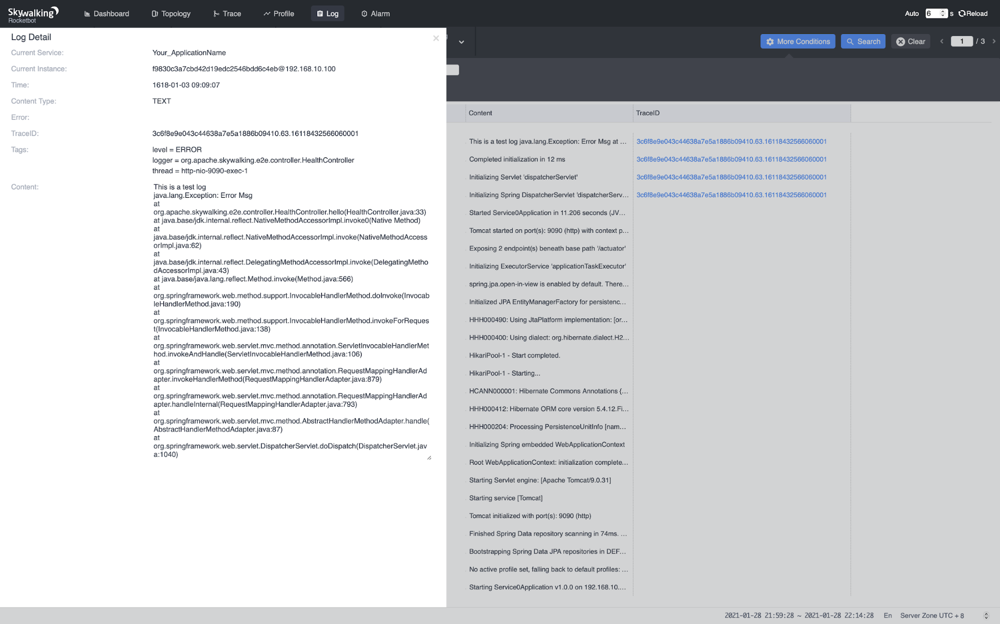
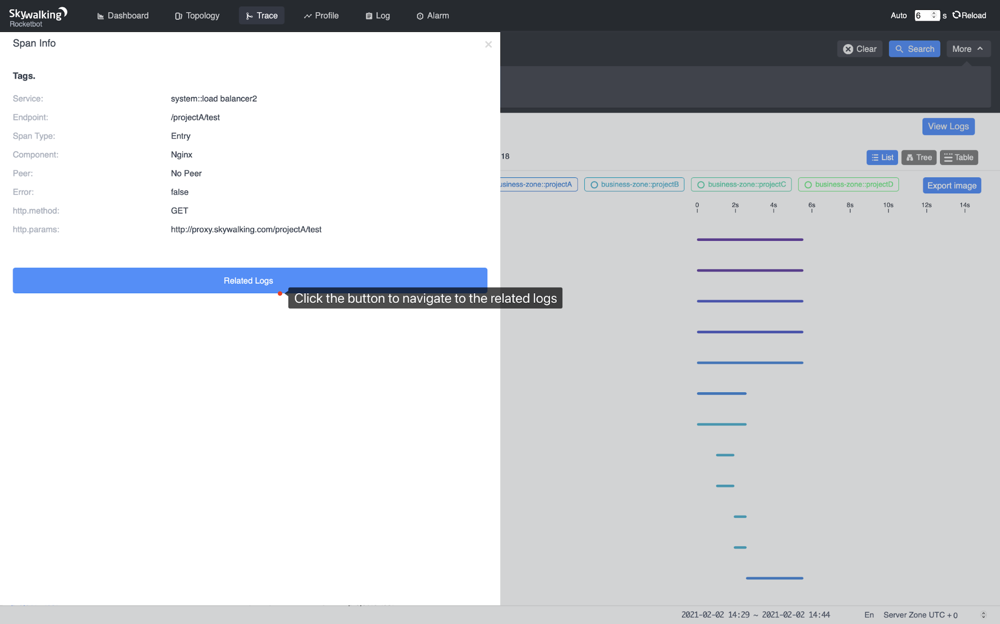
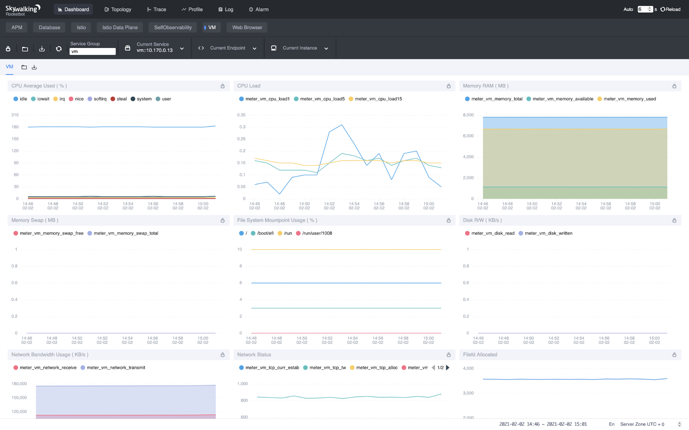
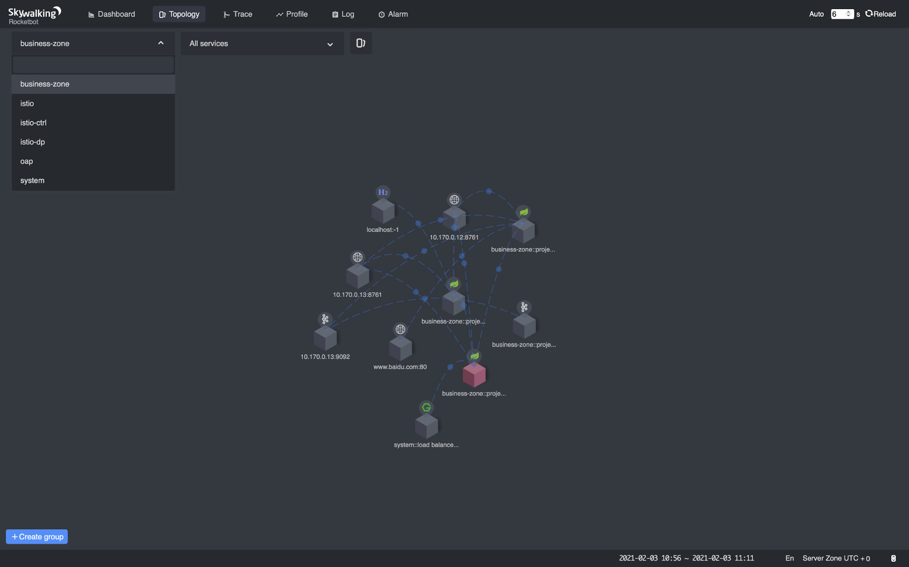

> Origin: [Tetrate.io blog](https://www.tetrate.io/blog/skywalking-8-4/)

The Apache SkyWalking team today announced the 8.4 release is generally available. This release fills the gap between all previous versions of SkyWalking and the logging domain area.
The release also advances SkyWalking’s capabilities  for infrastructure observability, starting with virtual machine monitoring.

## Background

SkyWalking has historically focused on the tracing and metrics fields of observability.
As its features for tracing, metrics and service level monitoring have become more and more powerful and stable, the SkyWalking team has started to explore new scenarios covered by observability.
Because service performance is reflected in the logs, and is highly impacted by the infrastructure on which it runs, SkyWalking brings these two fields into the 8.4 release.
This release blog briefly introduces the two new features as well as some other notable changes.

## Logs

Metrics, tracing, and logging are considered the three pillars of observability [1]. SkyWalking had the full features of metrics and tracing prior to 8.4; today, as 8.4 is released, the last piece of the jigsaw is now in place.

Figure 1: Logs Collected By SkyWalking

Figure 2: Logs Collected By SkyWalking

The Java agent firstly provides SDKs to enhance the widely-used logging frameworks, log4j (1.x and 2.x) [2] and logback [3], and send the logs to the SkyWalking backend (OAP).
The latter is able to collect logs from wherever the protocol is  implemented.
This is not a big deal, but when it comes to the correlation between logs and traces, the traditional solution is to print the trace IDs in the logs, and pick the IDs in the error logs to query the related traces.
SkyWalking just simplifies the workflow by correlating the logs and traces natively. Navigating between traces and their related logs is as simple as clicking a button.

Figure 3: Correlation Between Logs and Traces

## Infrastructure Monitoring

SkyWalking is known as an application performance monitoring tool. One of the most important factors that impacts the application’s performance is the infrastructure on which the application runs. 
In the 8.4 release, we added the monitoring metrics of virtual machines into the dashboard.

Figure 4: VM Metrics

Fundamental metrics such as `CPU Used`, `Memory Used`,  `Disk Read / Write` and `Network Usage` are available on the dashboard.
And as usual, those metrics are also available to be configured as alarm triggers when needed.

## Dynamic Configurations at Agent Side

Dynamic configuration at the backend side has long existed in SkyWalking for several versions. Now, it finally comes to the agent side!
Prior to 8.4, you’d have to restart the target services when you modify some configuration items of the agent -- for instance, sampling rate (agent side), ignorable endpoint paths, etc. Now, say goodbye to rebooting.
Modifying configurations is not the only usage of the dynamic configuration mechanism. The latter gives countless possibilities to the agent side in terms of dynamic behaviours, e.g. enabling / disabling plugins, enabling / disabling the whole agent, etc. Just imagine!

## Grouped Service Topology

This enhancement is from the UI. SkyWalking backend supports grouping the services by user-defined dimensions. In a real world use case, the services are usually grouped by business group or department. When a developer opens the topology map, out of hundreds of services, he or she may just want to focus on the services in charge. The grouped service topology comes to the rescue: one can now choose to display only services belonging to a specified group.

Figure 5: Grouped Service Topology

## Other Notable Enhancements
- Agent: resolves domain names to look up backend service IP addresses.
- Backend: meter receiver supports meter analysis language (MAL).
- Backend: several CVE fixes.
- Backend: supports Envoy `{AccessLog,Metrics}Service` API V3 and adopts MAL.

## Links
- [1] https://peter.bourgon.org/blog/2017/02/21/metrics-tracing-and-logging.html
- [2] https://logging.apache.org/log4j/2.x/
- [3] http://logback.qos.ch

## Additional Resources
- Read more about the [SkyWalking 8.4 release highlights](https://github.com/apache/skywalking/blob/v8.4.0/changes/changes-8.4.0.md).
- Get more SkyWalking updates on [Twitter](https://twitter.com/ASFSkyWalking).
