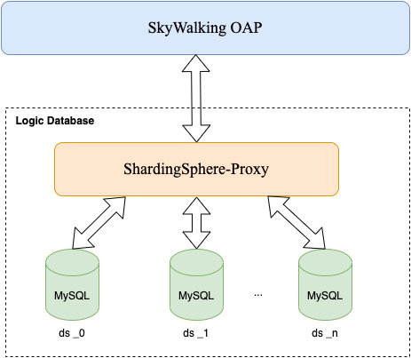
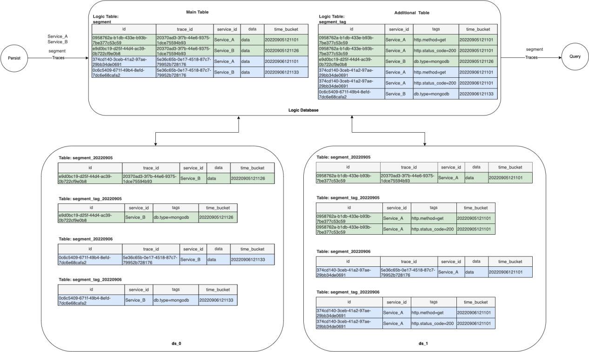
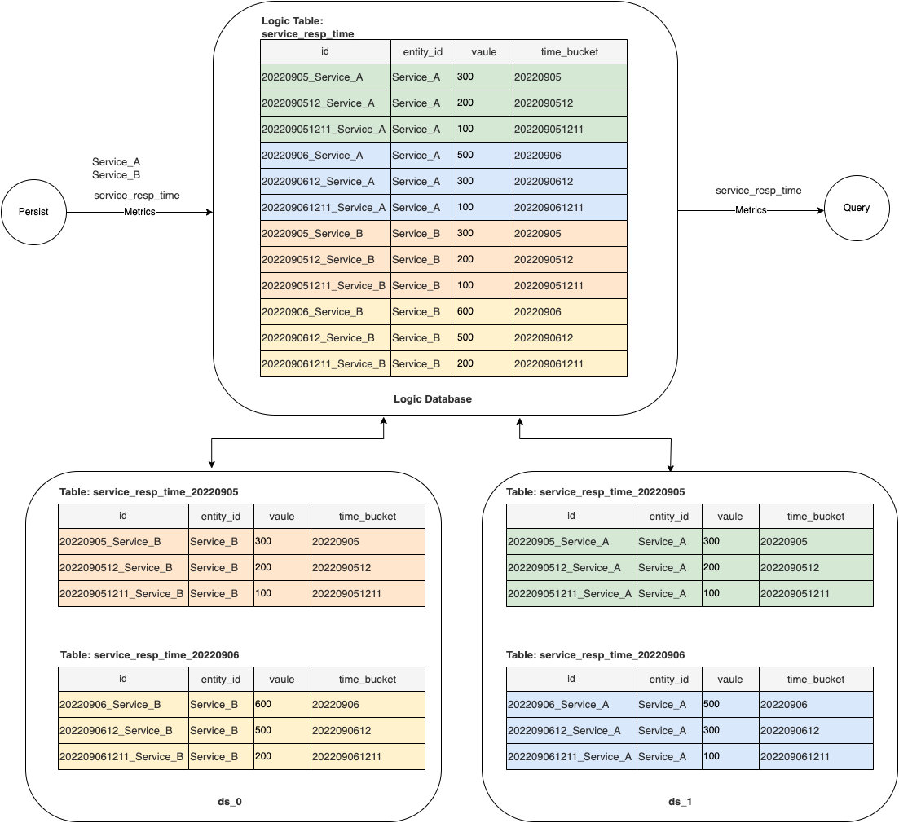

As an application performance monitoring tool for distributed systems, Apache SkyWalking observes metrics, logs, traces, and events in the service mesh.

SkyWalking OAP’s dataflow processing architecture boasts high performance and is capable of dealing with massive data traffic in real-time. However, storing, updating, and querying massive amounts of data poses a great challenge to its backend storage system.

By default, SkyWalking provides storage methods including H2, OpenSearch, ElasticSearch, MySQL, TiDB, PostgreSQL, and BanyanDB. Among them, MySQL storage is suited to a single machine and table (MySQL cluster capability depends on your technology selection). Nevertheless, in the context of high-traffic business systems, the storage of monitoring data is put under great pressure and query performance is lowered.

Based on MySQL storage, SkyWalking v9.3.0 provides a new storage method: MySQL-Sharding. It supports database and table sharding features thanks to [ShardingSphere-Proxy](https://shardingsphere.apache.org/document/5.1.2/en/quick-start/shardingsphere-proxy-quick-start/), which is a mature solution for dealing with relational databases’ massive amounts of data.

## 1. Architecture Deployment



- SkyWalking will only interact with [ShardingSphere-Proxy](https://shardingsphere.apache.org/document/5.1.2/en/quick-start/shardingsphere-proxy-quick-start/) instead of directly connecting to the database.
- The connection exposed by each MySQL node is a data source managed by [ShardingSphere-Proxy](https://shardingsphere.apache.org/document/5.1.2/en/quick-start/shardingsphere-proxy-quick-start/).
- [ShardingSphere-Proxy](https://shardingsphere.apache.org/document/5.1.2/en/quick-start/shardingsphere-proxy-quick-start/) will establish a virtual logical database based on the configuration and then carry out database and table sharding and routing according to the OAP provided data sharding rules.
- SkyWalking OAP creates data sharding rules and performs DDL and DML on a virtual logical database just like it does with MySQL.

## 2. Application Scenario

Applicable to scenarios where MySQL is used for storage, but the single-table mode cannot meet the performance requirements created by business growth.

## 3. How Does Data Sharding Work with SkyWalking?

Data sharding defines the data Model in SkyWalking with the annotation **@SQLDatabase.Sharding**.

```java
@interface Sharding {
  ShardingAlgorithm shardingAlgorithm();
  String dataSourceShardingColumn() default "";
  String tableShardingColumn() default ""; 
}
```

**Note:**

> shardingAlgorithm: Table sharding algorithm
> dataSourceShardingColumn: Database sharding key
> tableShardingColumn: Table sharding key

SkyWalking selects database sharding key, table sharding key and table sharding algorithm based on **@SQLDatabase.Sharding**, in order to dynamically generate sharding rules for each table. Next, it performs rule definition by operating [ShardingSphere-Proxy](https://shardingsphere.apache.org/document/current/en/overview/) via DistSQL. [ShardingSphere-Proxy](https://shardingsphere.apache.org/document/current/en/overview/) carries out data sharding based on the rule definition.

### 3.1 Database Sharding Method

SkyWalking adopts a unified method to carry out database sharding. The number of databases that need to be sharded requires modulo by the hash value of the database sharding key, which should be the numeric suffix of the routing target database. Therefore, the routing target database is:

```
ds_{dataSourceShardingColumn.hashcode() % dataSourceList.size()}
```

For example, we now have *dataSourceList = ds_0…ds_n*.
If *{dataSourceShardingColumn.hashcode() % dataSourceList.size() = 2}*, all the data will be routed to the data source node ds_2.

### 3.2 Table Sharding Method

The table sharding algorithm mainly shards according to the data owing to the TTL mechanism. According to TTL, there will be one sharding table per day:

```
{tableName = logicTableName_timeSeries (data)}
```

To ensure that data within the TTL can be written and queried, the time series will generate the current date:

```
{timeSeries = currentDate - TTL +1...currentDate + 1}
```

For example, if TTL=3 and currentDate=20220907, sharding tables will be:
logicTableName_20220905
logicTableName_20220906
logicTableName_20220907
logicTableName_20220908

**SkyWalking provides table sharding algorithms for different data models:**

| Algorithm Name                      | Sharding Description                                   | Time Precision Requirements for Sharding Key                 | Typical Application Data Model                               |
| ----------------------------------- | ------------------------------------------------------ | ------------------------------------------------------------ | ------------------------------------------------------------ |
| NO_SHARDING                         | No table sharding and single-table mode is maintained. | N/A                                                          | Data model with a small amount of data and no need for sharding. |
| TIME_RELATIVE_ID_SHARDING_ALGORITHM | Shard by day using time_bucket in the ID column.       | time_bucket can be accurate to seconds, minutes, hours, or days in the same table. | Various metrics.                                             |
| TIME_SEC_RANGE_SHARDING_ALGORITHM   | Shard by day using time_bucket column.                 | time_bucket must be accurate to seconds.                     | SegmentRecordLogRecord, etc.                                 |
| TIME_MIN_RANGE_SHARDING_ALGORITHM   | Shard by day using time_bucket column.                 | time_bucket must be accurate to minutes.                     | EndpointTraffic                                              |
| TIME_BUCKET_SHARDING_ALGORITHM      | Shard by day using time_bucket column.                 | time_bucket can be accurate to seconds, minutes, hours, and days in the same table. | Service, Instance, Endpoint and other call relations such as ServiceRelationServerSideMetrics |

## 4. TTL Mechanism

- For sharding tables, delete the physical table *deadline >= timeSeries* according to TTL.

  ```
  {deadline = new DateTime().plusDays(-ttl)}
  ```

- TTL timer will delete the expired tables according to the current date while updating sharding rules according to the new date and informing ShardingSphere-Proxy to create new sharding tables.

- For a single table, use the previous method and delete the row record of ***deadline >=time_bucket***.

## 5. Examples of Sharding Data Storage

Next, we’ll take **segment** (Record type) and *service_resp_time* (Metrics type) as examples to illustrate the data storage logic and physical distribution. Here, imagine MySQL has two nodes *ds_0* and ds_1.

**Note:**

> The following storage table structure is just a simplified version as an example, and does not represent the real SkyWalking table structure.

### 5.1 segment

The sharding configuration is as follows:

```
@SQLDatabase.Sharding(shardingAlgorithm = ShardingAlgorithm.TIME_SEC_RANGE_SHARDING_ALGORITHM, dataSourceShardingColumn = service_id, tableShardingColumn = time_bucket)
```

The logical database, table structures and actual ones are as follows:



### 5.2 service_resp_time

The sharding configuration is as follows:

```
@SQLDatabase.Sharding(shardingAlgorithm = ShardingAlgorithm.TIME_RELATIVE_ID_SHARDING_ALGORITHM, tableShardingColumn = id, dataSourceShardingColumn = entity_id)
```

The logical database and table structures and actual ones are as follows:



## 6. How to Use ShardingSphere-Proxy?

### 6.1 Manual Deployment

Here we take the deployment of a single-node SkyWalking OAP and [ShardingSphere-Proxy 5.1.2](https://shardingsphere.apache.org/document/current/en/overview/) as an example. Please refer to the relevant documentation for the cluster deployment.

- Prepare the MySQL cluster.
- Deploy, install and configure [ShardingSphere-Proxy](https://shardingsphere.apache.org/document/current/en/overview/):

1) *conf/server.yaml* and *props.proxy-hint-enabled* must be true. Refer to the [link](https://github.com/wankai123/skywalking-mysql-sharding-demo/blob/main/shardingsphere-proxy/conf/server.yaml) for the complete configuration.

2) conf/config-sharding.yaml configures logical database and dataSources list. The dataSource name must be prefixed with ds_ and start with ds_0. For details about the configuration, please refer to [this page](https://github.com/wankai123/skywalking-mysql-sharding-demo/blob/main/shardingsphere-proxy/conf/config-sharding.yaml).

- Deploy, install and configure SkyWalking OAP:

1) Set up OAP environment variables: `${SW_STORAGE:mysql-sharding}`，

2) Configure the connection information based on the actual deployment: `${SW_JDBC_URL} ${SW_DATA_SOURCE_USER} ${SW_DATA_SOURCE_PASSWORD}`

**Note:**

> Connection information must correspond to ShardingSphere-Proxy virtual database.

3) Configure the data source name configured by conf/config-sharding.yaml in ShardingSphere-Proxy to `${SW_JDBC_SHARDING_DATA_SOURCES}` and separate names with commas.

- Start the MySQL cluster.
- Start [ShardingSphere-Proxy](https://shardingsphere.apache.org/document/current/en/overview/).
- Start SkyWalking OAP.

### 6.2 Running Demo with Docker

Our GitHub repository provides a complete and operational [demo](https://github.com/wankai123/skywalking-mysql-sharding-demo) based on Docker, allowing you to quickly grasp the operation’s effectiveness. The deployment includes the following:

- One OAP service. The TTL of Metrics and Record data set to 2 days.
- One sharding-proxy service with version 5.1.2. Its external port is 13307 and the logical database name is swtest.
- Two MySQL services. Their external ports are 3306 and 3307 respectively and they are configured as ds_0 and ds_1 in sharding-proxy’s conf/config-sharding.yaml.
- One provider service (simulated business programs used to verify trace and metrics and other data). Its external port is 9090.
- One consumer service (simulated business programs used to verify trace and metrics and other data). Its external port is 9092.

Download the demo program locally and run it directly in the directory skywalking-mysql-sharding-demo.

```bash
docker-compose up -d
```

**Note:**

> The first startup may take some time to pull images and create all the tables.

Once all the services are started, database tools can be used to check the creation of sharding-proxy logical tables and the actual physical sharding table in the two MySQL databases. Additionally, you can also connect the sharding-proxy logical database to view the data query routing. For example:

```sql
PREVIEW
SELECT * FROM SEGMENT
```

The result is as follows:

The simulated business program provided by the [demo](https://github.com/wankai123/skywalking-mysql-sharding-demo) can simulate business requests by requesting the consumer service to verify various types of data distribution:

```bash
curl http://127.0.0.1:9092/info
```

## 7. Conclusion

In this blog, we introduced SkyWalking’s new storage feature, MySQL sharding, which leverage ShardingSphere-Proxy and covered details of its deployment architecture, application scenarios, sharding logic, and TTL mechanism. We’ve also provided sample data and deployment steps to help get started.

SkyWalking offers a variety of storage options to fit many use cases. If you need a solution to store large volumes of telemetry data in a relational database, the new MySQL sharding feature is worth a look. For more information on the SkyWalking 9.3.0 release and where to get it, [check out the release notes](https://skywalking.apache.org/events/release-apache-skywalking-apm-9.3.0/).
