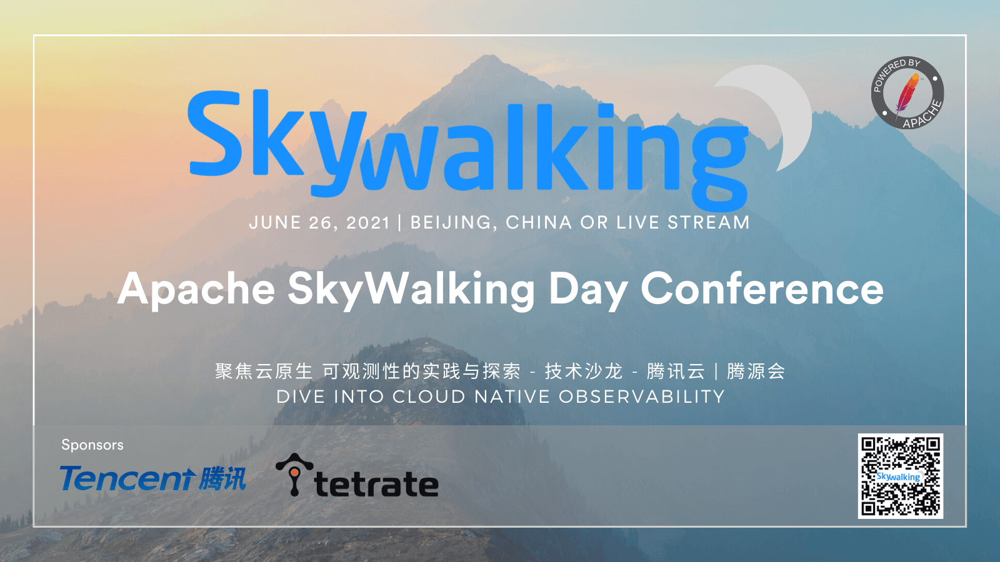

## Abstract
Apache SkyWalking hosts SkyWalkingDay Conference 2021 in June 26th, jointly with Tencent and Tetrate.

We are going to share SkyWalking's roadmap, features, product experiences and open source culture.

Welcome to join us.

## Venue
Addr./地址  北京市海淀区西格玛大厦B1多功能厅

## Date
June 26th.

## Registration For Free
[Register for onsite or online](https://cloud.tencent.com/developer/salon/salon-1447)

## Sessions

#### 10:00 - 10:20 Apache SkyWalking Landscape
- 吴晟 Sheng Wu. Tetrate Founding Engineer, Apache Software Foundation board director. SkyWalking founder.

SkyWalking 2020-2021年发展和后续计划

#### 10:20 - 10:50 微服务可观测性分析平台的探索与实践
- 凌若川 腾讯高级工程师

可观测性分析平台作为云原生时代微服务系统基础组件，开放性与性能是决定平台价值的核心要素。
复杂微服务应用场景与海量多维链路数据，对可观测性分析平台在开放性设计和各环节高性能实现带来诸多挑战。
本次分享中将重点梳理腾讯云微服务团队在构建云原生可观测性分析平台过程中遇到的挑战，介绍我们在架构设计与实现方面的探索与实践。

1. 云原生时代微服务可观测性平台面临的性能与可用性挑战
2. 腾讯云在构建高性能微服务可观测性分析平台的探索与实践
3. 微服务可观测性分析平台架构的下一阶段演进方向展望

#### 10:50 - 11:20 BanyanDB数据模型背后的逻辑
- 高洪涛 Hongtao Gao. Tetrate SRE, SkyWalking PMC, Apache ShardingSphere PMC.

BanyanDB作为为处理Apache SkyWalking产生的trace，log和metric的数据而特别设计的数据库，其背后数据模型的抉择是非常与众不同的。
在本次分享中，我将根据RUM猜想来讨论为什么BanyanDB使用的数据模型对于APM数据而言是更加高效和可靠的。

通过本次分享，观众可以：
1. 理解数据库设计的取舍
2. 了解BanyanDB的数据模型
3. 认识到该模型对于APM类数据有特定的优势

#### 11:20 - 11:50 Apache SkyWalking 如何做前端监控
- 范秋霞 Qiuxia Fan，Tetrate FE SRE，SkyWalking PMC.

Apache SkyWalking对前端进行了监控与跟踪，分别有Metric, Log, Trace三部分。本次分享我会介绍页面性能指标的收集与计算，同时用案列进行分析，也会讲解Log的采集方法以及Source Map错误定位的实施。最后介绍浏览器端Requets的跟踪方法。

通过本次分享，观众可以：
1. 了解页面的性能指标以及收集计算方法
2. 了解前端如何做错误日志收集
3. 如何对页面请求进行跟踪以及跟踪的好处

#### 午休

#### 13:30 - 14:00 一名普通工程师，该如何正确的理解开源精神？
- 王晔倞 Yeliang Wang. API7 Partner / Product VP. 

开源精神，那也许是一种给于和获取的平衡，有给于才能有获取，有获取才会有给于的动力。无需指责别人只会获取，我们应该懂得开源是一种创造方式，一个没有创造欲和创造力的人加入开源也是无用的。

通过本次分享，观众可以：
1. 为什么国内一些程序员会对开源产生误解？
2. 了解 “开源≠自由≠非商业” 的来龙去脉。
3. 一名普通工程师，如何高效地向开源社区做贡献？

#### 14:00 - 14:30 可观测性技术生态和OpenTelemetry原理及实践
- 陈一枭 腾讯. OpenTelemetry docs-cn maintainer、Tencent OpenTelemetry OTeam创始人

综述云原生可观测性技术生态，介绍OpenTracing，OpenMetrics，OpenTelemetry等标准演进。介绍OpenTelemetry存在价值意义，介绍OpenTelemetry原理及其整体生态规划。介绍腾讯在OpenTelemetry方面的实践。

本次分享内容如下：
1. 云原生可观测性技术简介
2. OpenTelemetry及其它规范简介
3. OpenTelemetry原理
4. OpenTelemetry在腾讯的应用及实践

#### 14:30 - 15:10 利用 Apache SkyWalking 事件采集系统更快定位故障
- 柯振旭 Zhenxu Ke，Tetrate SRE, Apache SkyWalking PMC. Apache Incubator PMC. Apache Dubbo committer.

通过本次分享，听众可以：
1. 了解 SkyWalking 的事件采集系统；
2. 了解上报事件至 SkyWalking 的多种方式；
3. 学习如何利用 SkyWalking 采集的事件结合 metrics，分析目标系统的性能问题；

#### 15:10 - 15:30 茶歇

#### 15:30 - 16:00 可观测性自动注入技术原理探索与实践
- 詹启新 Tencnet OpenTelemetry Oteam PMC

在可观测领域中自动注入已经成为重要的组成部分之一，其优异简便的使用方式并且可同时覆盖到链路、指标、日志，大大降低了接入成本及运维成本，属于友好的一种接入方式；
本次分享将介绍Java中的字节码注入技术原理，及在可观测领域的应用实践

1. 常用的自动注入技术原理简介
2. 介绍可观测性在Java落地的要点
3. opentelemetry-java-instrumentation的核心原理及实现
4. opentelemetry自动注入的应用实践

#### 16:00 - 16:30 如何利用 Apache APISIX 提升 Nginx 的可观测性
- 金卫 Wei Jin, API7 Engineer Apache SkyWalking committer. Apache apisix-ingress-controller Founder. Apache APISIX PMC.

在云原生时代，动态和可观测性是 API 网关的标准特性。Apache APISIX 不仅覆盖了 Nginx 的传统功能，在可观测性上也和 SkyWalking 深度合作，大大提升了服务治理能力。本次分享会介绍如何无痛的提升 Nginx 的可观测性和 APISIX 在未来可观测性方面的规划。

通过本次分享，观众可以：
1. 通过 Apache APISIX 实现观测性的几种手段.
2. 了解 Apache APISIX 高效且易用的秘诀.
3. 结合 Apache skywalking 进一步提升可观测性.

#### 16:35 抽奖，结束

## Sponsors
- Tencent
- [Tetrate](https://tetrate.io)
- [SegmentFault 思否](https://segmentfault.com)

## Anti-harassment policy
SkyWalkingDay is dedicated to providing a harassment-free experience for everyone. We do not tolerate harassment of participants in any form. Sexual language and imagery will also not be tolerated in any event venue. Participants violating these rules may be sanctioned or expelled without a refund, at the discretion of the event organizers. Our anti-harassment policy can be found at [Apache website](https://www.apache.org/foundation/policies/anti-harassment.html).

## Contact Us
Send mail to dev@skywalking.apache.org.
