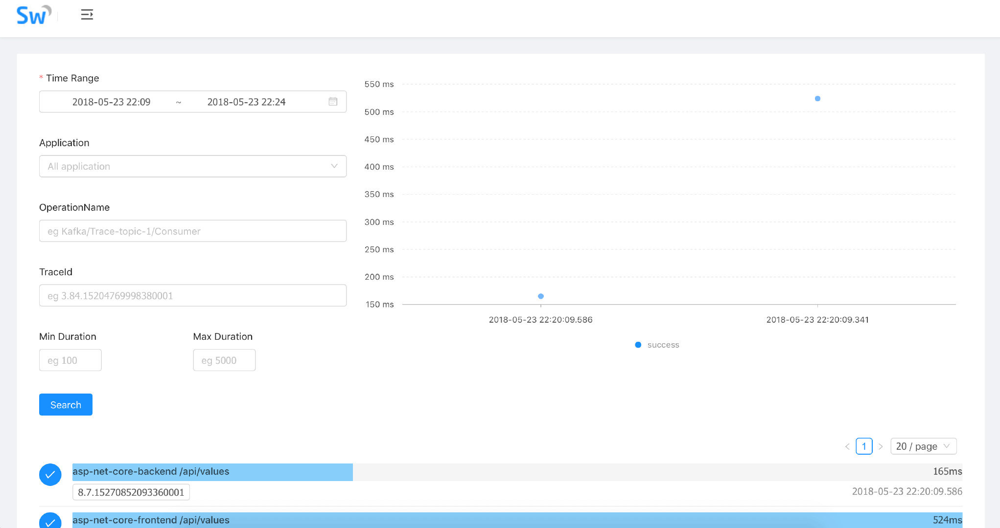
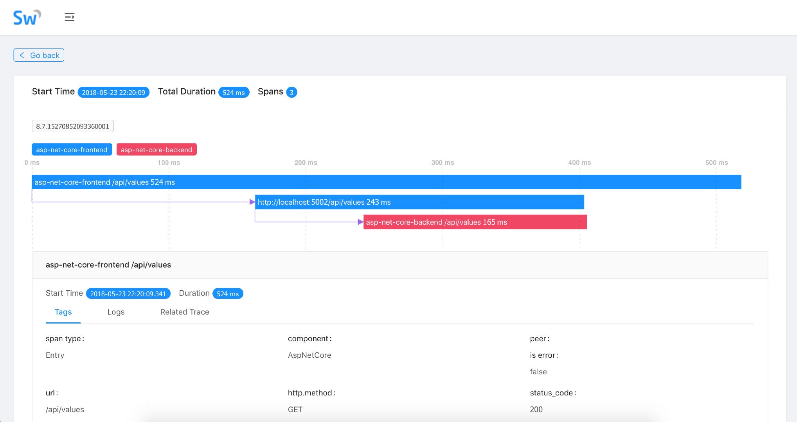

在大型网站系统设计中，随着分布式架构，特别是微服务架构的流行，我们将系统解耦成更小的单元，通过不断的添加新的、小的模块或者重用已经有的模块来构建复杂的系统。随着模块的不断增多，一次请求可能会涉及到十几个甚至几十个服务的协同处理，那么如何准确快速的定位到线上故障和性能瓶颈，便成为我们不得不面对的棘手问题。

为解决分布式架构中复杂的服务定位和性能问题，Google 在论文[《Dapper, a Large-Scale Distributed Systems Tracing Infrastructure》](http://research.google.com/pubs/pub36356.html)中提出了分布式跟踪系统的设计和构建思路。在这样的背景下，[Apache SkyWalking](https://github.com/apache/incubator-skywalking) 创建于 2015 年，参考 Dapper 论文实现分布式追踪功能，并逐渐进化为一个完整功能的 [Application Performance Management](https://en.wikipedia.org/wiki/Application_performance_management) 系统，用于追踪、监控和诊断大型分布式系统，尤其是容器和云原生下的微服务系统。

今年初我在尝试使用.NET Core 构建分布式追踪系统 [Butterfly](https://github.com/liuhaoyang/butterfly) 时接触到 SkyWalking 团队，开始和 SkyWalking 团队合作探索 SkyWalking 对.NET Core 的支持，并于 4 月发布 SkyWalking .NET Core 探针的 [第一个版本](https://www.oschina.net/news/95324/apache-skywalking-apm-support-dot-net-core)，同时我也有幸加入 SkyWalking 团队共同进行 SkyWalking 在多语言生态的推动。在.NET Core 探针 v0.1 版本发布之后，得到了一些同学的[尝鲜使用](https://www.jianshu.com/p/3ddd986c7581)，也得到诸多改进的建议。经过几周的迭代，SkyWalking .NET Core 探针于今天发布 v0.2 release，在 v0.1 的基础上增加了稳定性和 HttpClient 及数据库驱动的追踪支持。

在使用 SkyWalking 对.NET Core 应用追踪之前，我们需要先部署 SkyWalking Collector 收集分析 Trace 和 Elasticsearch 作为 Trace 数据存储。SkyWalking 支持 5.x 的 ES，所以我们需要下载安装对应版本的 ES，并配置 ES 的 `cluster.name` 为 `CollectorDBCluster`。然后部署 SkyWalking 5.0 beta 或更高版本 (下载地址:http://skywalking.apache.org/downloads/)。更详细的 Collector 部署文档，请参考 [Deploy-backend-in-standalone-mode](https://github.com/apache/incubator-skywalking/blob/master/docs/en/Deploy-backend-in-standalone-mode.md) 和 [Deploy-backend-in-cluster-mode](https://github.com/apache/incubator-skywalking/blob/master/docs/en/Deploy-backend-in-cluster-mode.md)。

最后我们使用示例项目来演示在.NET Core 应用中使用 SkyWalking 进行追踪和监控，克隆 SkyWalking-NetCore 项目到本地：

```bash
git clone https://github.com/OpenSkywalking/skywalking-netcore.git
```

进入 skywalking-netcore 目录：

```bash
cd skywalking-netcore
```

还原 nuget package：

```bash
dotnet restore
```

启动示例项目：

```bash
dotnet run -p sample/SkyWalking.Sample.Backend
dotnet run -p sample/SkyWalking.Sample.Frontend
```

访问示例应用：

打开 SkyWalking WebUI 即可看到我们的应用监控面板 [http://localhost:8080](http://localhost:8080/)

Dashboard 视图


TopologyMap 视图


Application 视图


Trace 视图



TraceDetails 视图



## GitHub

- SkyWalking Github Repo：[https://github.com/apache/incubator-skywalking](https://github.com/apache/incubator-skywalking/)
- SkyWalking-NetCore Github Repo：https://github.com/OpenSkywalking/skywalking-netcore
