## 版本选择

我们采用的是 5.0.0-RC2 的版本，SkyWalking 的版本信息可以参考 https://github.com/apache/incubator-skywalking/blob/5.x/CHANGES.md

那么为什么我们没有采用 5.1.0 版本呢，这是因为我们公司内部需要支持 es x-pack，但是在官方发布里面，没有支持 xpack 的版本。

在 Apache SkyWalking 官方文档 https://github.com/CharlesMaster/incubator-skywalking/tree/master/docs/others/cn 中有提到，SkyWalking 5.x 仍受社区支持。

对于用户计划从 5.x 升级到 6.x，您应该知道关于有一些概念的定义的变更。最重要的两个改变了的概念是：

1. Application（在 5.x 中）更改为 **Service**（在 6.x 中），Application Instance 也更改为 **Service Instance**。
2. Service（在 5.x 中）更改为 Endpoint（在 6.x 中）。

## 图文详解

Apache SkyWalking 的监控界面由 Monitor 和 Trace 两者构成，Monitor 菜单又包括 Dashbord、Topology、Application、Service、Alarm 五个子菜单构成。本文就是围绕这些菜单分别逐一进行介绍。

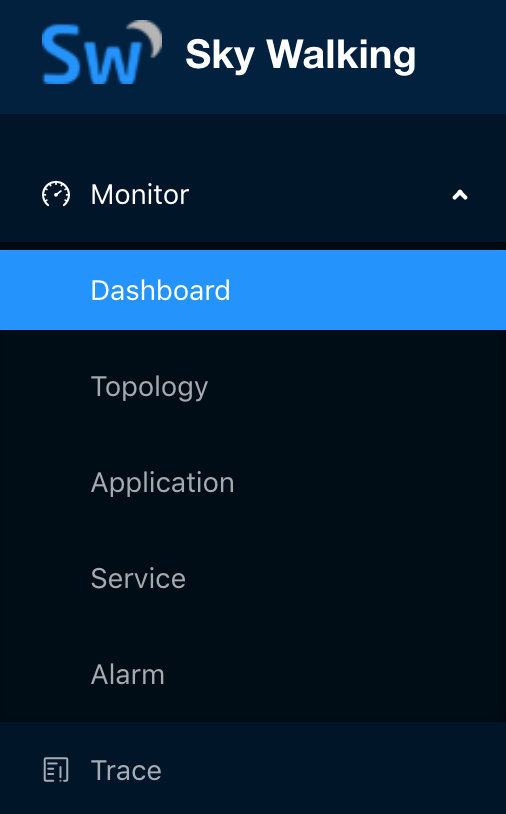

## Monitor

当用户通过 SkyWalking 登陆界面使用用户名、密码登陆以后，就会默认进入到 SkyWalking 的 Monitor 下的 Dashboard 界面

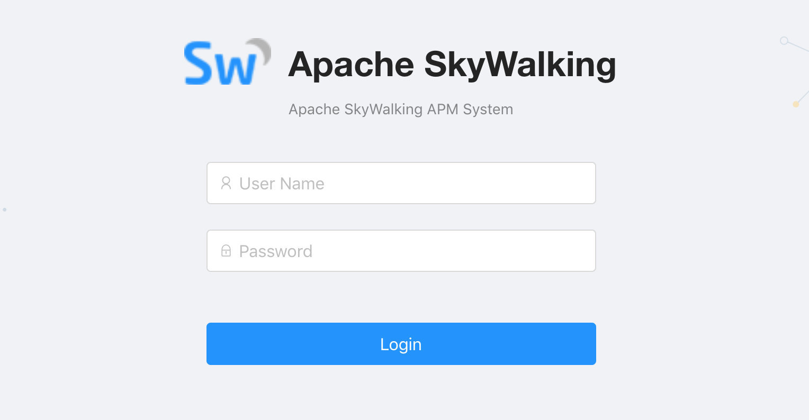

## Dashboard

下图就是用户登陆之后都会看到的关键 Dashboard 页面，在这个页面的下方的关键指标，图中都做了详细的解释。

上图中 app 需要强调的是，52 个 app 并不代表 52 个应用，比如 paycenter 有两台 paycenter1 和 paycenter2 就算了 2 个 app，当然还有一些应用是 3 个以上的。在我们公司，paycenter1、paycenter2 这些运维都和我们跳板机管理平台上的名称设置的一样，约定大于配置，开发人员可以更加便捷的排查问题。

> 再次修正一下，关于 dashboard 页面的 app 数，语言类探针，是探针的 app_code 来决定的。比如我们公司的线上配置就是 agent.application_code=auth-center-1

上图中需要解释两个概念：

- cpm 代表每分钟请求次数
- SLA=(TRANSACTION_CALLS- TRANSACTION_ERROR_CALLS ) * 10000 ) / TRANSACTION_CALLS

该页面主要支持四个跳转：

一、在上图中，App 板块上的帮助选项是可以直接跳转到 Application 监控页面的。 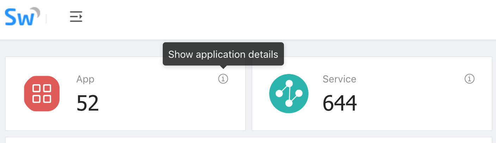

二、 Service 板块上的帮助选项是可以直接跳转到 Service 监控页面的。 

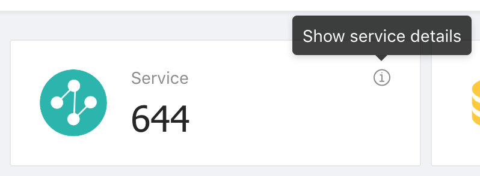

三、 Slow Service 列表中的每一个慢服务点击以后都会进入到其专项的 Service 监控页面。

四、 Application Throughput 列表中的每一个 Application 点击以后也都是可以进入到其专项的 Application 监控页面。

> 关于 Application 和 Service 的详细介绍我们后续会展开

在 Dashboard 的页面上部分，还有一个选择功能模块： 

左侧部分可以定期 refresh Dashboard 的数据，右侧则可以调整整体的查询区间。

## Topology

点击 Monitor 菜单下的 Topology 你会看到下面这张拓扑图

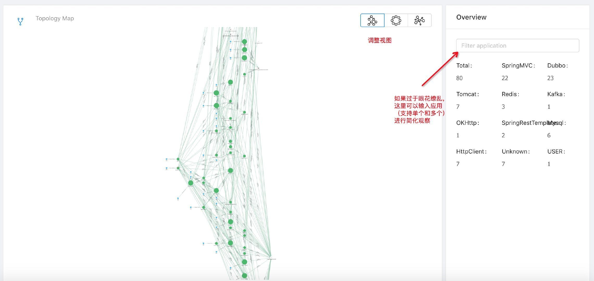

当然这张图太过于夸张了，如果接入 SkyWalking 的应用并不是很多，会如下图所示： 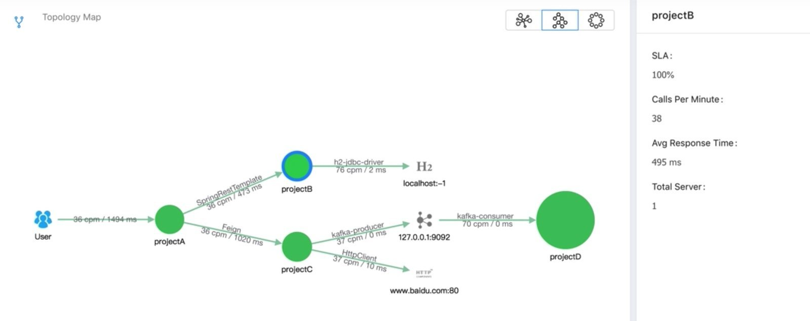

左侧的三个小按钮可以调整你的视图，支持拖拽。右侧可以输入你所关心的应用名。比如我们输入一个支付和订单两个应用，左侧的拓扑图会变得更加清晰：

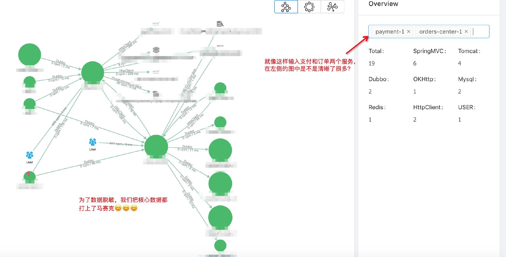

另外，上图中的绿色圆圈都是可以点击的，如果你点击以后，还会出现节点信息： 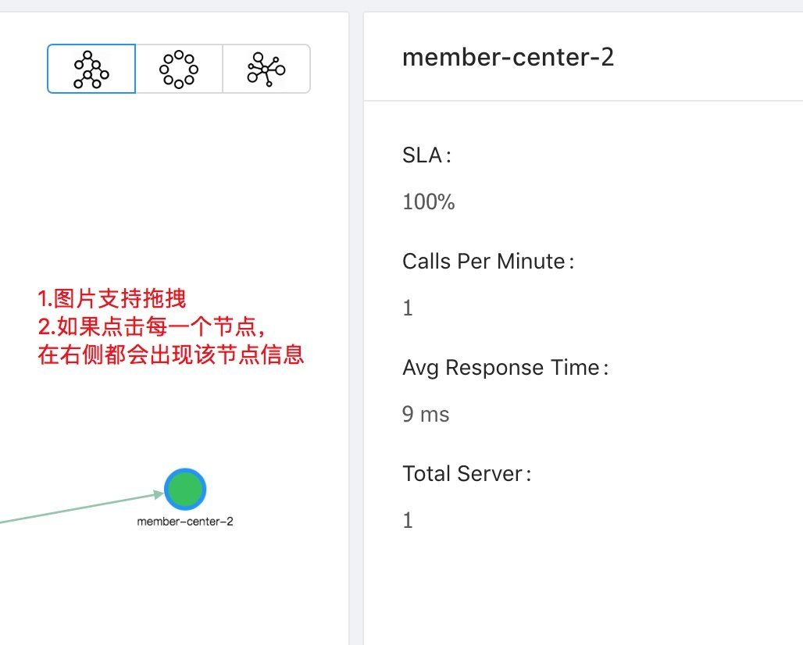

## Application

点击 Monitor 菜单下的 Application 你会看到下面这张图，这张图里你可以看到的东西都做了注解。

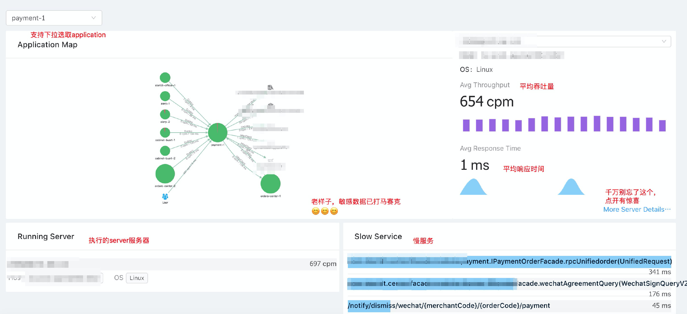

这张图里有一个惊喜，就是如果你点开 More Server Details，你可以看到更多的信息

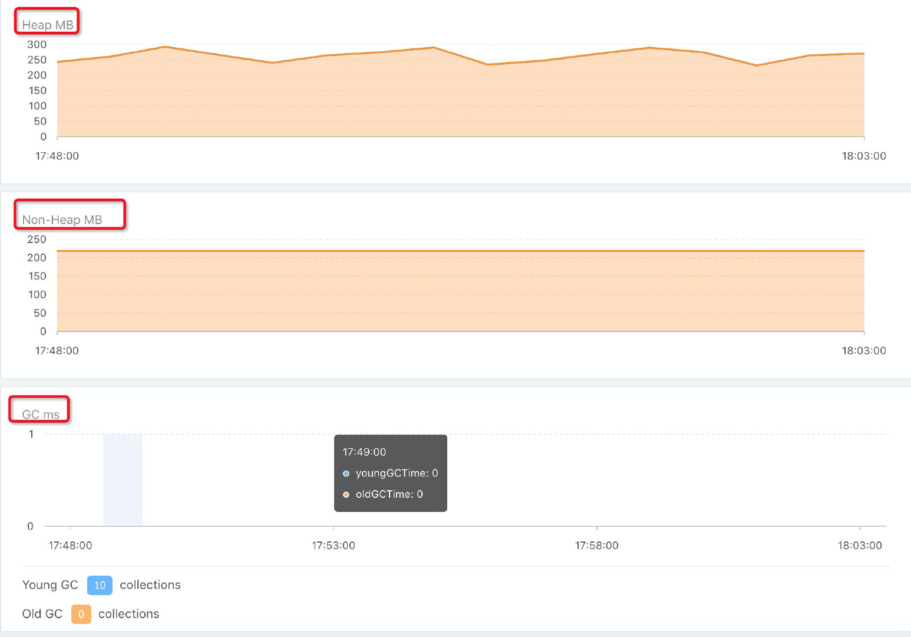

是的，除了 Host、IPv4、Pid、OS 以外，你还可以看到 CPU、Heap、Non-Heap、GC（Young GC、Old GC）等详细监控信息。

## Service

点击 Monitor 菜单下的 Service 你会看到下面这张图，这张图里你可以看到的同样都做了注解。 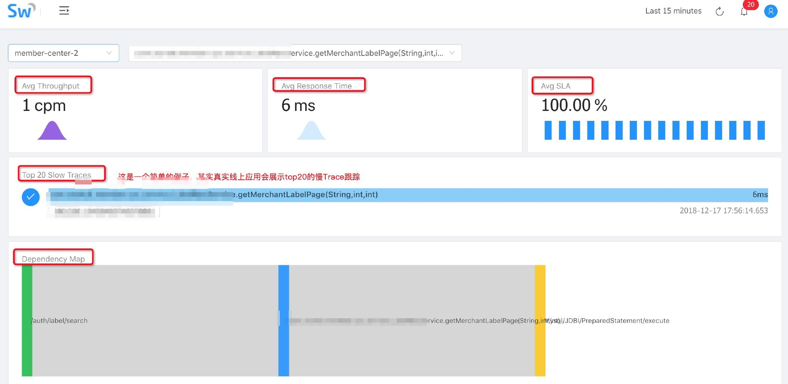

关于 Dependency Map 这张图我们再补充一下，鼠标悬停可以看到每个阶段的执行时间，这是 Service 下的功能 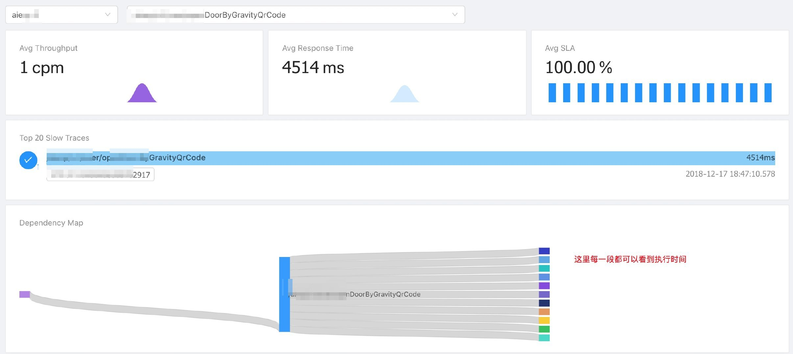

我们点开图中该图中 Top 20 Slow Traces 下面的被我马赛克掉的 trace 的按钮框，可以看到如下更加详细的信息： 

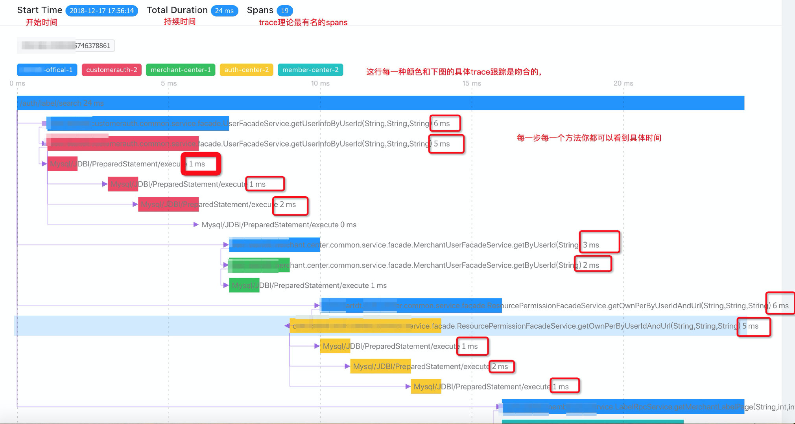

这些信息可以帮助我们知道每一个方法在哪个阶段那个具体实现耗时了多久。 

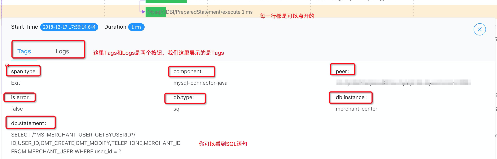

如上图所示，每一行基本都是可以打开的，每一行都包含了 Tags、Logs 等监控内容

## Alarm

点击 Monitor 菜单下的 Alarm 你会看到告警菜单。目前 5.X 版本的还没有接入邮件、短信等告警方式，后续 6 支持 webhook，用户可以自己去接短信和邮件。

告警内容中你可以看到 Applicaion、Server 和 Service 三个层面的告警内容

## Trace

Trace 是一个非常实用的功能，用户可以根据精确的 TraceId 去查找

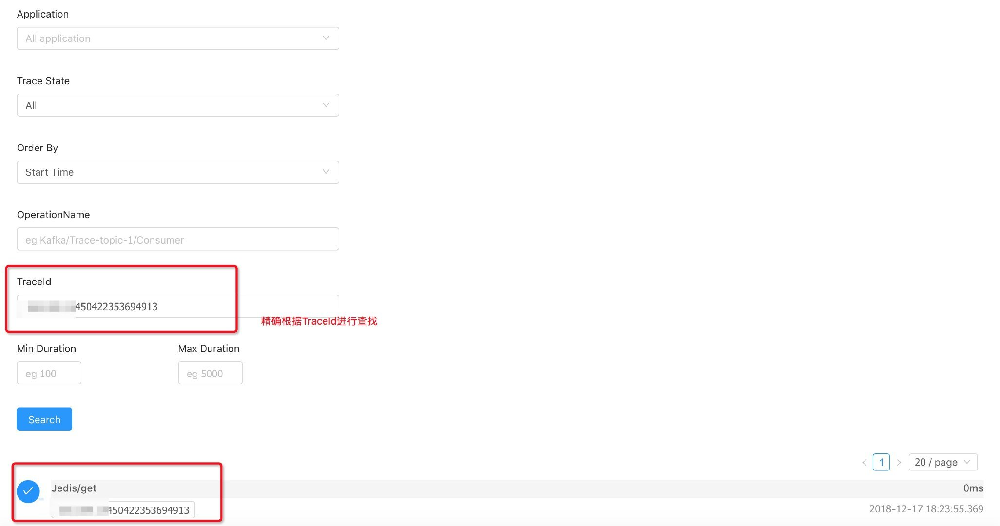

也可以设定时间段去查找

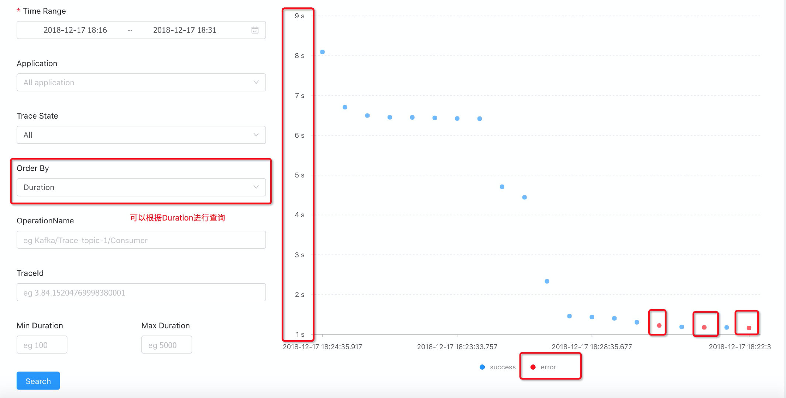

我在写使用手册时候，非常巧的是，看到了上图三起异常，于是我们往下拉列表看到了具体的数据

点击进去，我们可以看到具体的失败原因 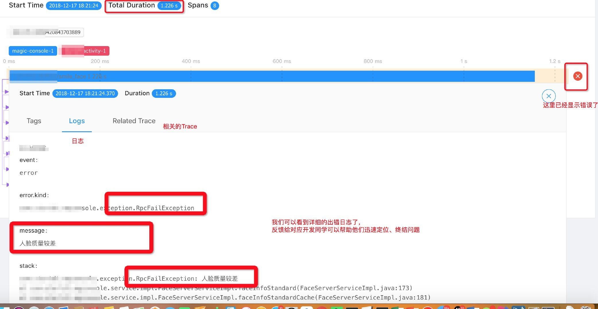

当然用户也可以直接将 Trace State 调整为 Error 级别进行查询

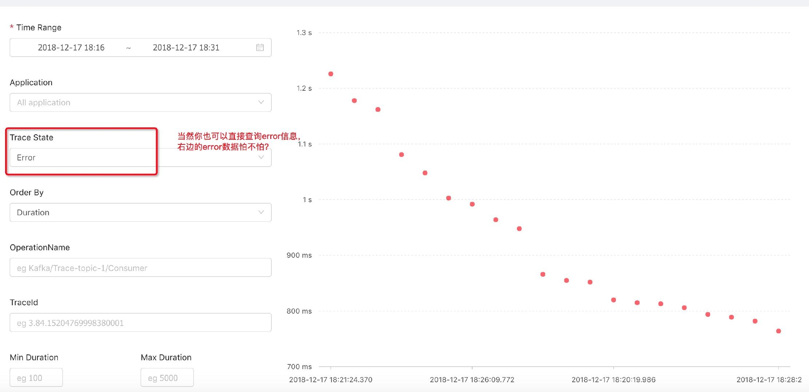

## 再回顾一遍

一、首先我们进入首页： 

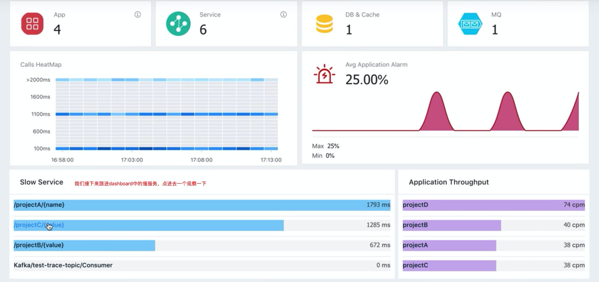

二、点击一下首页的 Slow Service 的 projectC，可以看到如下信息： 

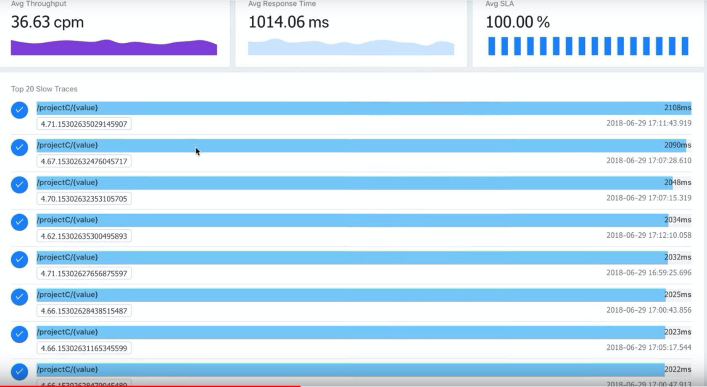

三、如果点击首页的 Appliation Throughput 中的 projectD，可以看到如下信息：

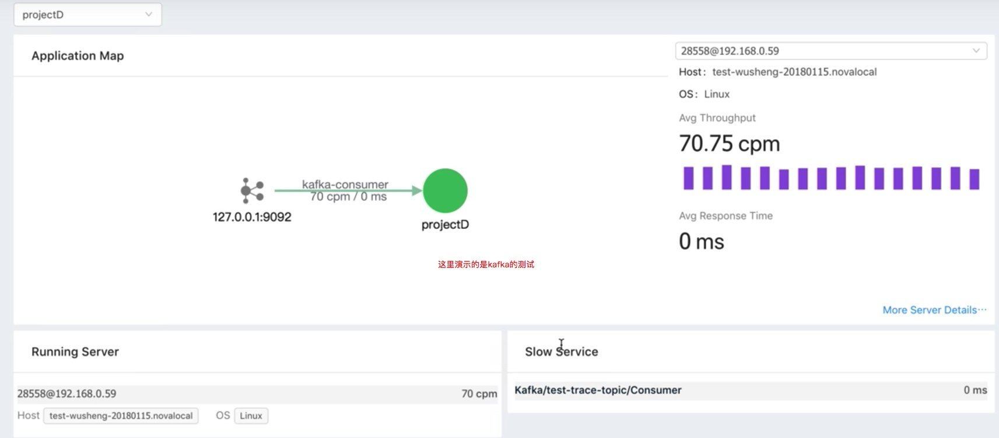

四、继续点进去右下角的这个 slow service 里的 Consumer，我们可以看到下图： 

## 参考资料 

- https://twitter.com/AsfSkyWalking/status/1013616673218179072
- https://twitter.com/AsfSkyWalking/status/1013617100143800320
