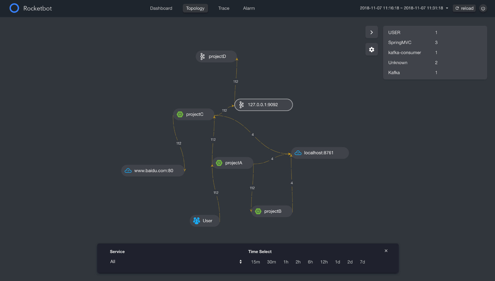
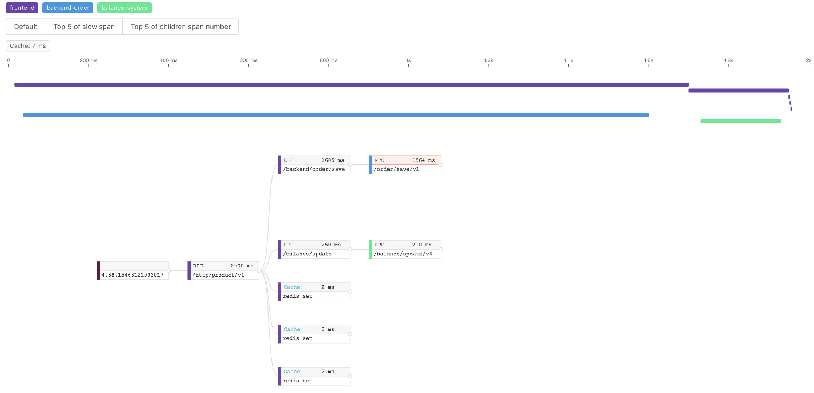
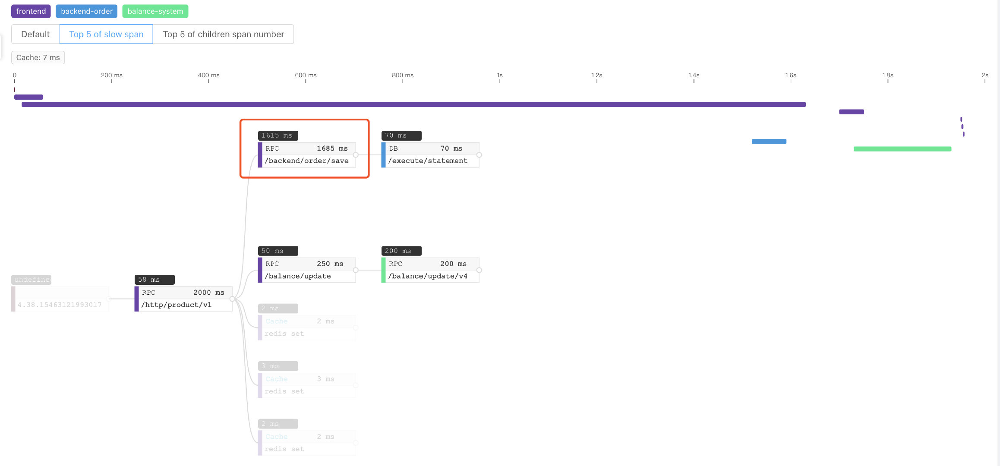
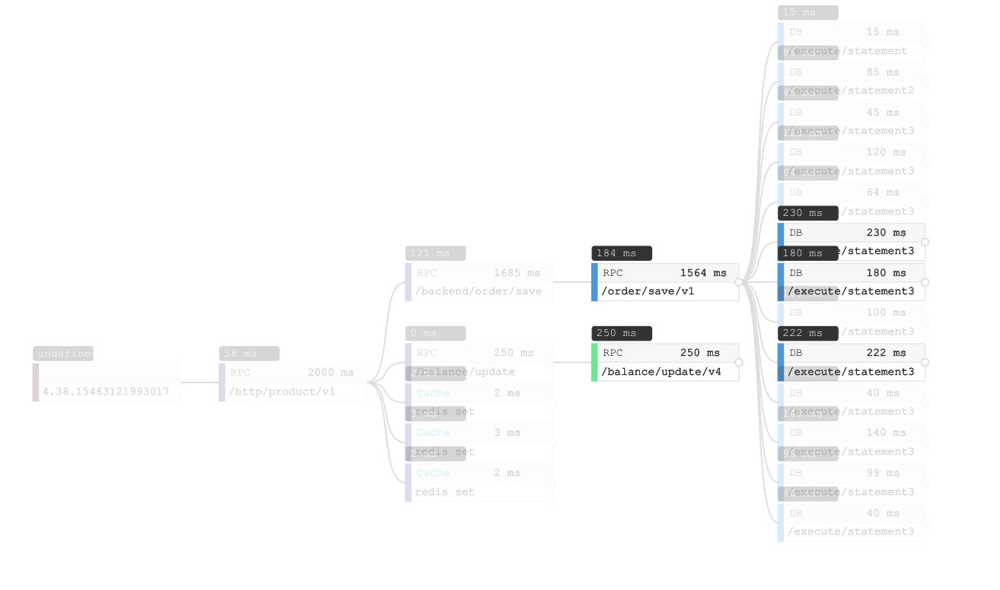
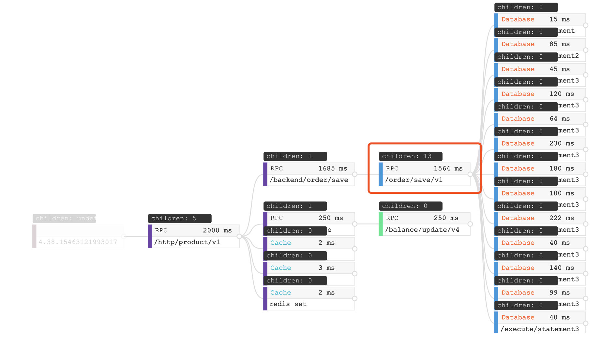
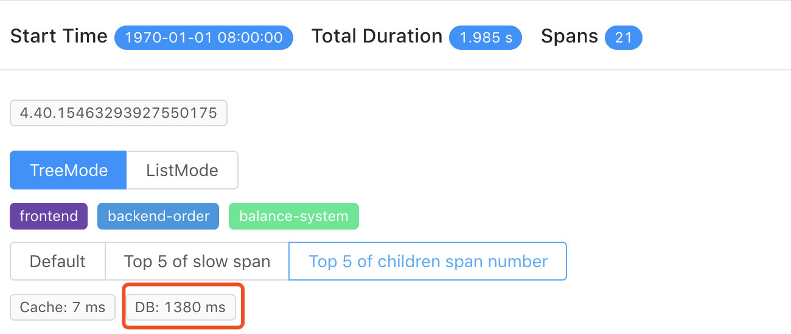
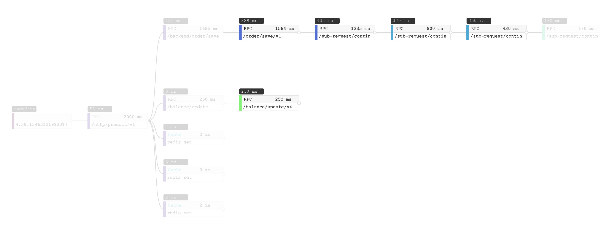

- 作者: Wu Sheng, tetrate, SkyWalking original creator
- [GitHub](https://github.com/wu-sheng), [Twitter](https://twitter.com/wusheng1108), [Linkedin](https://www.linkedin.com/in/wusheng1108)
- 翻译: jjlu521016

# 背景

在当前的微服务架构中分布式链路追踪是很有必要的一部分，但是对于一些用户来说如何去理解和使用分布式链路追踪的相关数据是不清楚的。
这个博客概述了典型的分布式跟踪用例，以及Skywalking的V6版本中新的可视化功能。我们希望新的用户通过这些示例来更好的理解。

## 指标和拓扑图

跟踪数据支持两个众所周知的分析特性：`指标`和`拓扑图`  
`指标`: 每个service, service instance, endpoint的指标都是从跟踪中的入口span派生的。指标代表响应时间的性能。所以可以有一个平均响应时间，99%的响应时间，成功率等。它们按service, service instance, endpoint进行分解。  
`拓扑图`: 拓扑表示服务之间的链接，是分布式跟踪最有吸引力的特性。拓扑结构允许所有用户理解分布式服务关系和依赖关系，即使它们是不同的或复杂的。这一点很重要，因为它为所有相关方提供了一个单一的视图，无论他们是开发人员、设计者还是操作者。

这里有一个拓扑图的例子包含了4个项目，包括kafka和两个外部依赖。

-在skywalking的可选择UI0RocketBot的拓扑图-

# Trace

在分布式链路追踪系统中，我们花费大量资源（CPU、内存、磁盘和网络）来生成、传输和持久跟踪数据。让我们试着回答为什么要这样做？我们可以用跟踪数据回答哪些典型的诊断和系统性能问题？  

Skywalking v6包含两种追踪视图:

+ 1. TreeMode: 第一次提供,帮助您更容易识别问题。
+ 2. ListMode: 常规的时间线视图，通常也出现在其他跟踪系统中，如Zipkin。

# 发生错误

在trace视图，最简单的部分是定位错误，可能是由代码异常或网络故障引起的。通过span详情提供的细节，ListMode和TreeMode都能够找到错误

-ListMode 错误span-

-TreeMode 错误span-

# 慢span

一个高优先级的特性是识别跟踪中最慢的span。这将使用应用程序代理捕获的执行持续时间。在旧的ListMode跟踪视图中，由于嵌套，父span几乎总是包括子span的持续时间。换句话说，一个缓慢的span通常会导致它的父节点也变慢，在Skywalking 6中，我们提供了 `最慢的前5个span` 过滤器来帮助你您直接定位span。

-最慢的前5个span-

# 太多子span

在某些情况下，个别持续时间很快，但跟踪速度仍然很慢，如：

-没有慢span的追踪-

如果要了解根问题是否与太多操作相关，请使用子范围号的`Top 5 of children span number`,筛选器显示每个span的子级数量，突出显示前5个。

-13个数据库访问相关的span-

在这个截图中，有一个包含13个子项的span，这些子项都是数据库访问。另外，当您看到跟踪的概述时，这个2000ms跟踪的数据库花费了1380ms。

-1380ms花费在数据库访问-

在本例中，根本原因是数据库访问太多。这在其他场景中也很常见，比如太多的RPC或缓存访问。

# 链路深度

跟踪深度也与延迟有关。像[太多子span](#太多子span)的场景一样，每个span延迟看起来不错，但整个链路追踪的过程很慢。

-链路深度-

上图所示,最慢的span小鱼500ms,对于2000毫秒的跟踪来说，速度并不太慢。当您看到第一行时，有四种不同的颜色表示这个分布式跟踪中涉及的四个services。每一个都需要100~400ms，这四个都需要近2000ms，从这里我们知道这个缓慢的跟踪是由一个序列中的3个RPC造成的。

## 结束语

分布式链路追踪和APM 工具帮助我们确定造成问题的根源，允许开发和操作团队进行相应的优化。我们希望您喜欢这一点，并且喜欢Apache Skywalking和我们的新链路追踪可视化界面。如果你喜欢的话，在[github上面给我们加start来鼓励我们](https://github.com/apache/incubator-skywalking)

Skywakling 6计划在2019年的1月底完成release。您可以通过以下渠道联系项目团队成员

+ 关注 [skywalking推特](https://twitter.com/ASFSkyWalking)
+ 订阅邮件:dev@skywalking.apache.org。发送邮件到 dev-subscribe@kywalking.apache.org 来订阅.
+ 加入[Gitter](https://gitter.im/OpenSkywalking/Lobby)聊天室
