- 作者：赵瑞栋
- [原文地址](https://mp.weixin.qq.com/s/0XXUpnxR8xiExE4iwu90xg)

## 引言

微服务框架落地后，分布式部署架构带来的问题就会迅速凸显出来。服务之间的相互调用过程中，如果业务出现错误或者异常，如何快速定位问题？如何跟踪业务调用链路？如何分析解决业务瓶颈？...本文我们来看看如何解决以上问题。

## 一、SkyWalking 初探

### Skywalking 简介

Skywalking 是一款国内开源的应用性能监控工具，支持对分布式系统的监控、跟踪和诊断。

它提供了如下的主要功能特性：
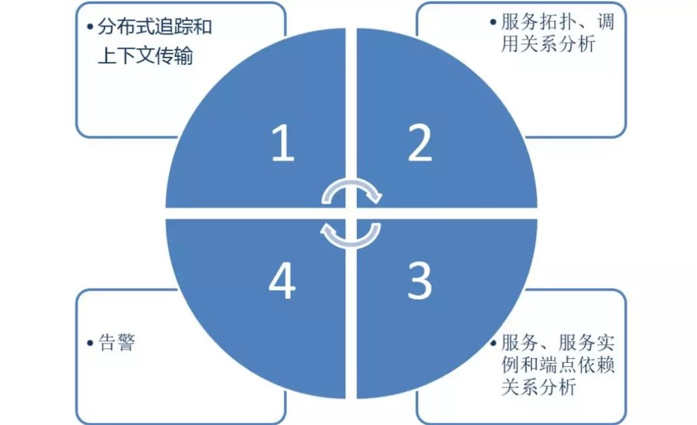

### Skywalking 技术架构

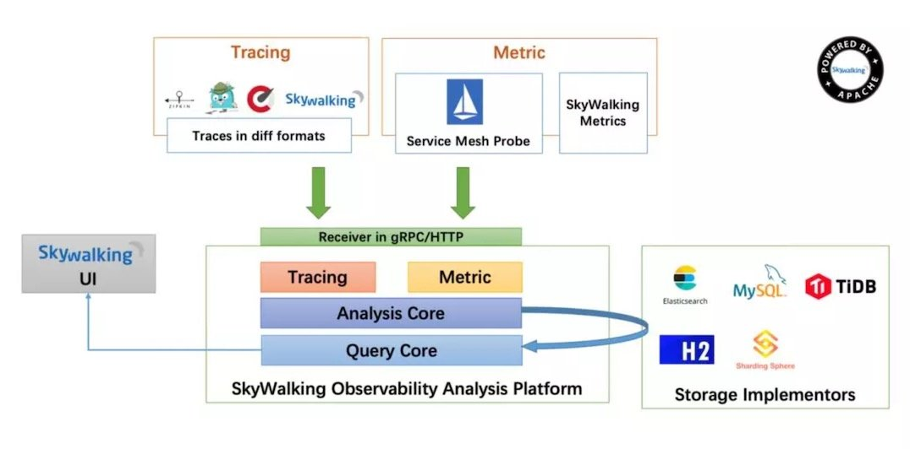

SW 总体可以分为四部分：

1.Skywalking Agent：使用 Javaagent 做字节码植入，无侵入式的收集，并通过 HTTP 或者 gRPC 方式发送数据到 Skywalking Collector。

2. Skywalking Collector ：链路数据收集器，对 agent 传过来的数据进行整合分析处理并落入相关的数据存储中。
3. Storage：Skywalking 的存储，时间更迭，sw 已经开发迭代到了 6.x 版本，在 6.x 版本中支持以 ElasticSearch、Mysql、TiDB、H2、作为存储介质进行数据存储。
4. UI ：Web 可视化平台，用来展示落地的数据。

### Skywalking Agent 配置

通过了解配置，可以对一个组件功能有一个大致的了解。让我们一起看一下 skywalking 的相关配置。

解压开 skywalking 的压缩包，在 agent/config 文件夹中可以看到 agent 的配置文件。

从 skywalking 支持环境变量配置加载，在启动的时候优先读取环境变量中的相关配置。

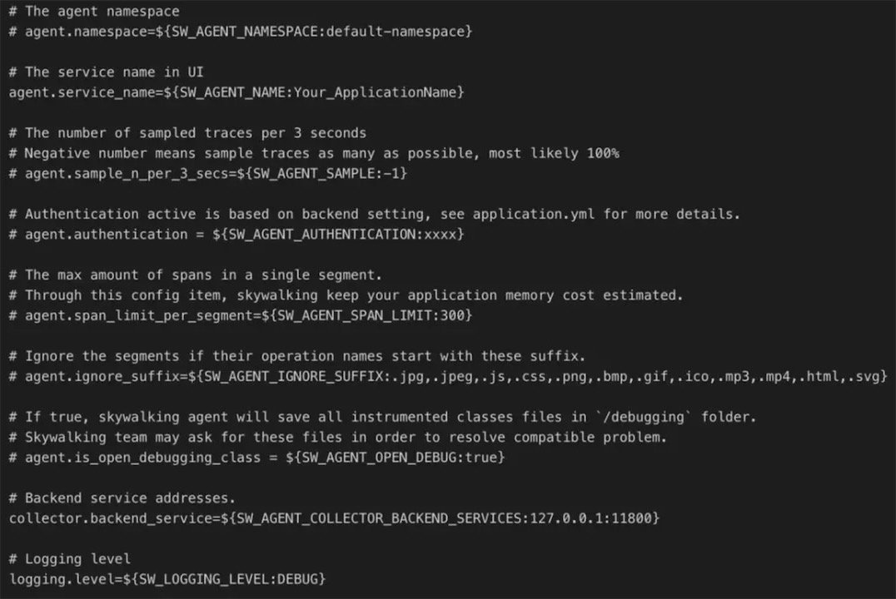

- agent.namespace: 跨进程链路中的 header，不同的 namespace 会导致跨进程的链路中断
- agent.service_name:一个服务（项目）的唯一标识，这个字段决定了在 sw 的 UI 上的关于 service 的展示名称
- agent.sample_n_per_3_secs: 客户端采样率，默认是-1 代表全采样
- agent.authentication: 与 collector 进行通信的安全认证，需要同 collector 中配置相同
- agent.ignore_suffix: 忽略特定请求后缀的 trace
- collecttor.backend_service: agent 需要同 collector 进行数据传输的 IP 和端口
- logging.level: agent 记录日志级别

skywalking agent 使用 javaagent 无侵入式的配合 collector 实现对分布式系统的追踪和相关数据的上下文传递。

### Skywalking Collector 关键配置

Collector 支持集群部署，zookeeper、kubernetes（如果你的应用是部署在容器中的）、consul（GO 语言开发的服务发现工具）是 sw 可选的集群管理工具，结合大家具体的部署方式进行选择。详细配置大家可以去 Skywalking 官网下载介质包进行了解。

**Collector 端口设置**

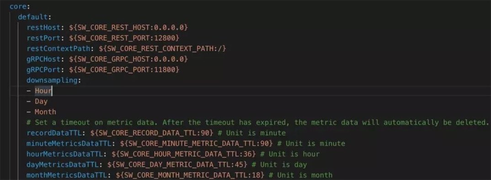

- downsampling: 采样汇总统计维度，会分别按照分钟、【小时、天、月】（可选）来统计各项指标数据。
- 通过设置 TTL 相关配置项可以对数据进行自动清理。

Skywalking 在 6.X 中简化了配置。collector 提供了 gRPC 和 HTTP 两种通信方式。

UI 使用 rest http 通信，agent 在大多数场景下使用 grpc 方式通信，在语言不支持的情况下会使用 http 通信。

关于绑定 IP 和端口需要注意的一点是，通过绑定 IP，agent 和 collector 必须配置对应 ip 才可以正常通信。

**Collector 存储配置**

在 application.yml 中配置的 storage 模块配置中选择要使用的数据库类型，并填写相关的配置信息。

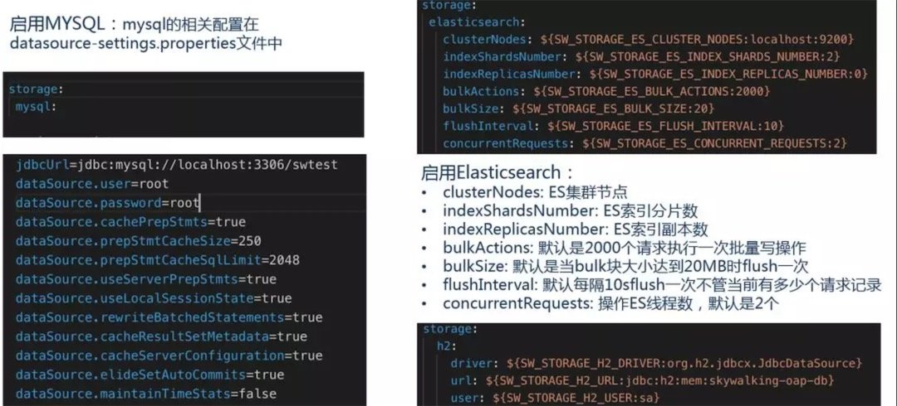

**Collector Receiver**

Receiver 是 Skywalking 在 6.x 提出的新的概念，负责从被监控的系统中接受指标数据。用户完全可以参照 OpenTracing 规范来上传自定义的监控数据。Skywalking 官方提供了 service-mesh、istio、zipkin 的相关能力。

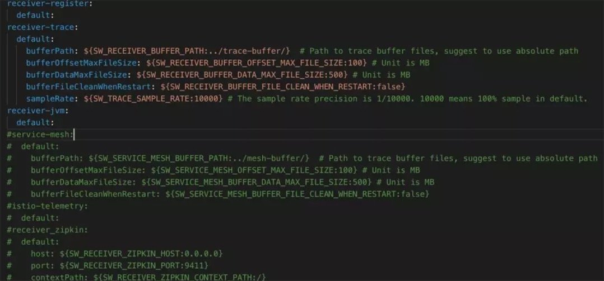

现在 Skywalking 支持服务端采样，配置项为 sampleRate，比例采样，如果配置为 5000 则采样率就是 50%。

**关于采样设置的一点注意事项**

关于服务采样配置的一点建议，如果 Collector 以集群方式部署，比如：Acollector 和 Bcollector，建议 Acollector.sampleRate = Bcollector.sampleRate。如果采样率设置不相同可能会出现数据丢失问题。

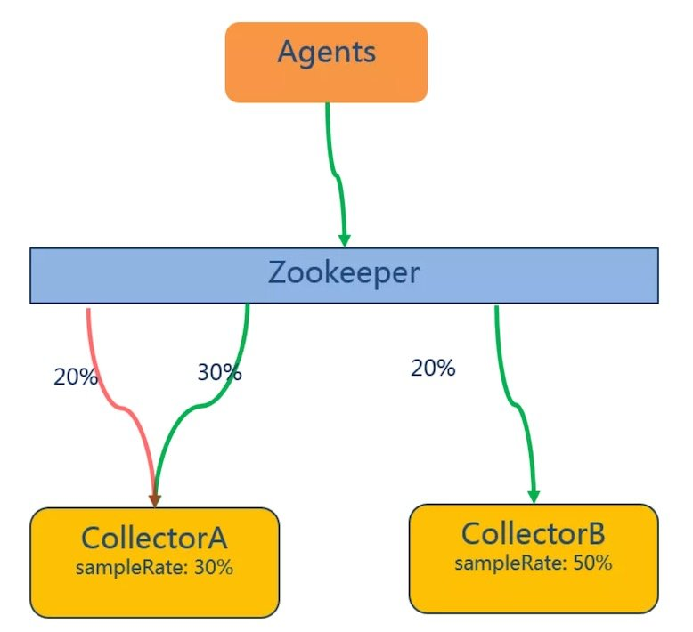

假设 Agent 端将所有数据发送到后端 Collector 处，A 采样率设置为 30%，B 采样率为 50%。

假设有 30%的数据，发送到 A 上，这些数据被全部正确接受并存储，极端情况（与期望的采样数据量相同）下，如果剩下 20%待采样的数据发送到了 B，这个时候一切都是正常的，如果这 20%中有一部分数据被送到了 A 那么，这些数据将是被忽略的，由此就会造成数据丢失。

## 二、业务调用链路监控

### Service Topology 监控

调用链路监控可以从两个角度去看待。我们先从整体上来认识一下我们所监控的系统。

通过给服务添加探针并产生实际的调用之后，我们可以通过 Skywalking 的前端 UI 查看服务之间的调用关系。

我们简单模拟一次服务之间的调用。新建两个服务，service-provider 以及 service-consumer，服务之间简单的通过 Feign Client 来模拟远程调用。

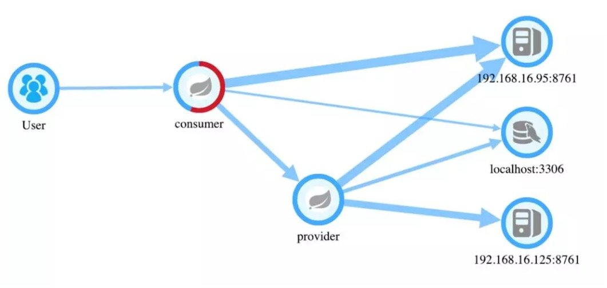

从图中可以看到:

- 有两个服务节点：provider & consumer
- 有一个数据库节点：localhost【mysql】
- 一个注册中心节点

consumer 消费了 provider 提供出来的接口。

一个系统的拓扑图让我们清晰的认识到系统之间的应用的依赖关系以及当前状态下的业务流转流程。细心的可能发现图示节点 consumer 上有一部分是红色的，红色是什么意思呢？

红色代表当前流经 consumer 节点的请求有一断时间内是响应异常的。当节点全部变红的时候证明服务现阶段内就彻底不可用了。运维人员可以通过 Topology 迅速发现某一个服务潜在的问题，并进行下一步的排查并做到预防。

### Skywalking Trace 监控

Skywalking 通过业务调用监控进行依赖分析，提供给我们了服务之间的服务调用拓扑关系、以及针对每个 endpoint 的 trace 记录。

我们在之前看到 consumer 节点服务中发生了错误，让我们一起来定位下错误是发生在了什么地方又是什么原因呢？

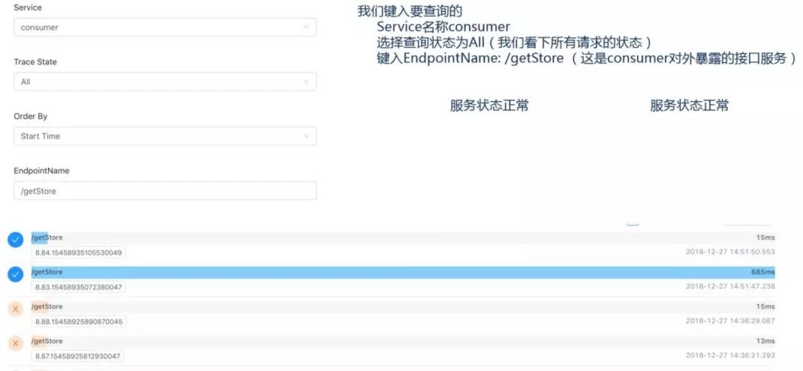

在每一条 trace 的信息中都可以看到当前请求的时间、GloableId、以及请求被调用的时间。我们分别看一看正确的调用和异常的调用。

### Trace 调用链路监控

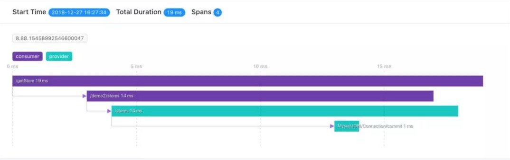

图示展示的是一次正常的响应，这条响应总耗时 19ms，它有 4 个 span：

- span1 /getStore = 19ms 响应的总流转时间
- span2 /demo2/stores = 14ms feign client 开始调用远程服务后的响应的总时间
- span3 /stores = 14ms 接口服务响应总时间
- span4 Mysql = 1ms 服务提供端查询数据库的时间

这里 span2 和 span3 的时间表现相同，其实是不同的，因为这里时间取了整。

在每个 Span 中可以查看当前 Span 的相关属性。

- 组件类型: SpringMVC、Feign
- Span 状态: false
- HttpMethod: GET
- Url: http://192.168.16.125:10002/demo2/stores

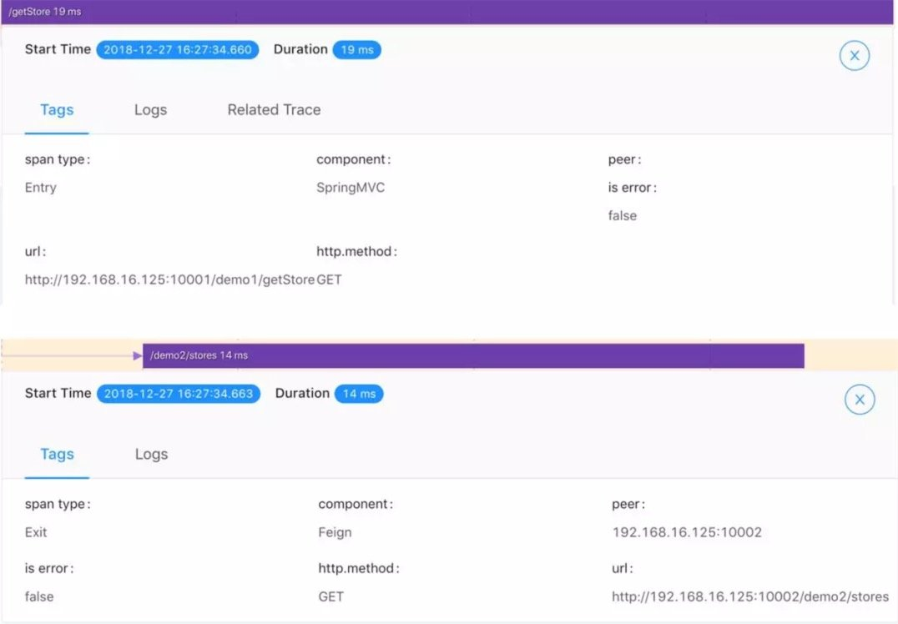

这是一次正常的请求调用 Trace 日志，可能我们并不关心正常的时候，毕竟一切正常不就是我们期待的么！

我们再来看下，异常状态下我们的 Trace 以及 Span 又是什么样的呢。

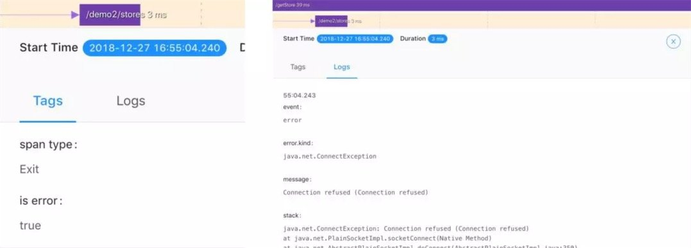

发生错误的调用链中 Span 中的 is error 标识变为 true，并且在名为 Logs 的 TAB 中可以看到错误发生的具体原因。根据异常情况我们就可以轻松定位到影响业务的具体原因，从而快速定位问题，解决问题。

通过 Log 我们看到连接被拒，那么可能是我们的网络出现了问题（可能性小，因为实际情况如果网络出现问题我们连这个 trace 都看不到了），也有可能是服务端配置问题无法正确建立连接。通过异常日志，我们迅速就找到了问题的关键。

实际情况是，我把服务方停掉了，做了一次简单的模拟。可见，通过拓扑图示我们可以清晰的看到众多服务中哪个服务是出现了问题的，通过 trace 日志我们可以很快就定位到问题所在，在最短的时间内解决问题。

## 三、服务性能指标监控

Skywalking 还可以查看具体 Service 的性能指标，根据相关的性能指标可以分析系统的瓶颈所在并提出优化方案。

### Skywalking 性能监控

在服务调用拓扑图上点击相应的节点我们可以看到该服务的

- SLA: 服务可用性（主要是通过请求成功与失败次数来计算）
- CPM: 每分钟调用次数
- Avg Response Time: 平均响应时间

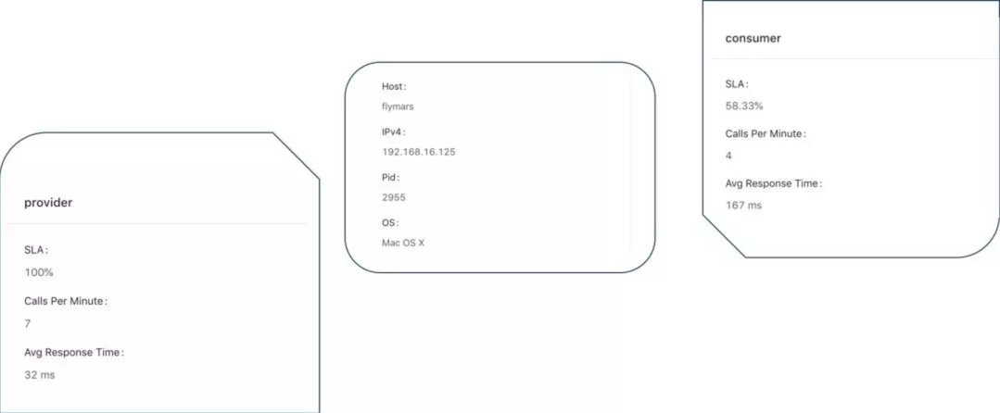

从应用整体外部来看我们可以监测到应用在一定时间段内的

1. 服务可用性指标 SLA
1. 每分钟平均响应数
1. 平均响应时间
1. 服务进程 PID
1. 服务所在物理机的 IP、HostName、Operation System

### Service JVM 信息监控

还可以监控到 Service 运行时的 CPU、堆内存、非堆内存使用率、以及 GC 情况。这些信息来源于 JVM。注意这里的数据可不是机器本身的数据。

# 四、服务告警

前文我们提到了通过查看拓扑图以及调用链路可以定位问题，可是运维人员又不可能一直盯着这些数据，那么我们就需要告警能力，在异常达到一定阈值的时候主动的提示我们去查看系统状态。

在 Sywalking 6.x 版本中新增了对服务状态的告警能力。它通过 webhook 的方式让我们可以自定义我们告警信息的通知方式。诸如:邮件通知、微信通知、短信通知等。

## Skywalking 服务告警

先来看一下告警的规则配置。在 alarm-settings.xml 中可以配置告警规则，告警规则支持自定义。

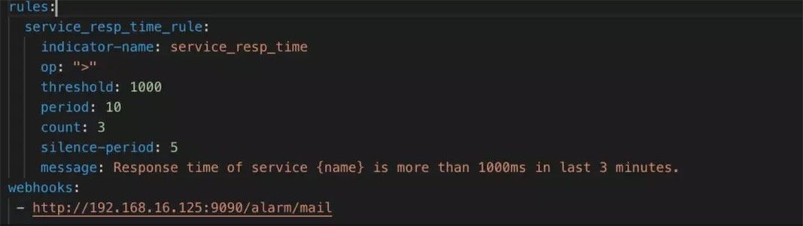

一份告警配置由以下几部分组成：

1. service_resp_time_rule：告警规则名称 \*\*\*\_rule （规则名称可以自定义但是必须以’\_rule’结尾
1. indicator-name：指标数据名称： 定义参见http://t.cn/EGhfbmd
1. op: 操作符： > , < , = 【当然你可以自己扩展开发其他的操作符】
1. threshold：目标值：指标数据的目标数据 如 sample 中的 1000 就是服务响应时间，配合上操作符就是大于 1000ms 的服务响应
1. period: 告警检查周期：多久检查一次当前的指标数据是否符合告警规则
1. counts: 达到告警阈值的次数
1. silence-period：忽略相同告警信息的周期
1. message：告警信息
1. webhooks：服务告警通知服务地址

Skywalking 通过 HttpClient 的方式远程调用在配置项 webhooks 中定义的告警通知服务地址。

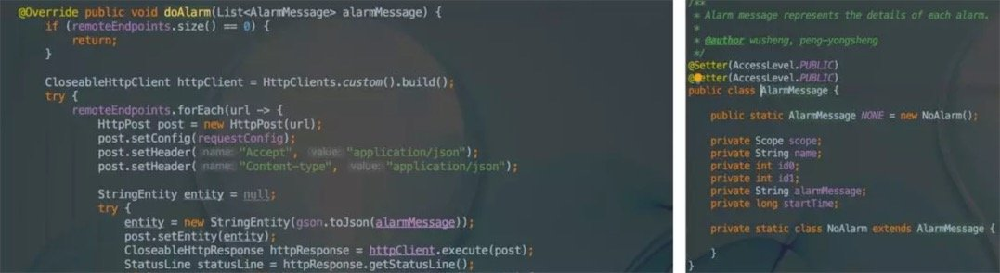

了解了 SW 所传送的数据格式我们就可以对告警信息进行接收处理，实现我们需要的告警通知服务啦！

我们将一个服务停掉，并将另外一个服务的某个对外暴露的接口让他休眠一定的时间。然后调用一定的次数观察服务的状态信息以及告警情况。

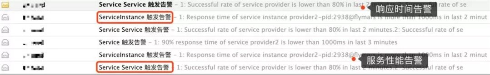

# 总结

本文简单的通过 skwaylking 的配置来对 skywlaking 的功能进行一次初步的了解，对 skwaylking 新提出的概念以及新功能进行简单的诠释，方便大家了解和使用。通过使用 APM 工具，可以让我们方便的查看微服务架构中系统瓶颈以及性能问题等。

### 精选提问

**问 1：想问问选型的时候用 pinpoint 还是 SK 好？**

答：选型问题

1. 要结合具体的业务场景， 比如你的代码运行环境 是 java、php、net 还是什么。
2. pinpoint 在安装部署上要比 skywalking 略微复杂
3. pinpoint 和 sw 支持的组件列表是不同的。
   https://github.com/apache/incubator-skywalking/blob/master/docs/en/setup/service-agent/java-agent/Supported-list.md你可以参照这里的支持列表对比下pinpoint的支持对象做一个简单对比。
4. sw 经过测试在并发量较高的情况下比 pinpoint 的吞吐量更好一些。

**问 2：有没有指标统计，比如某个 url 的 top10 请求、响应最慢的 10 个请求？某个服务在整个链条中的耗时占比？**

答：1.sw 自带有响应最慢的请求 top10 统计针对所有的 endpoint 的统计。 2.针对每个 url 的 top10 统计，sw 本身没有做统计，数据都是现成的通过简单的检索就可以搜到你想要的结果。 3.没有具体的耗时占比，但是有具体总链路时间统计以及某个服务的耗时统计，至于占比自己算吧，可以看 ppt 中的调用链路监控的 span 时间解释。

**问 3：能不能具体说一下在你们系统中的应用？**

答：EOS8LA 版本中，我们整合 sw 对应用提供拓扑、调用链路、性能指标的监控、并在 sw 数据的基础上增加系统的维度。
当服务数很庞大的时候，整体的拓扑其实就是一张密密麻麻的蜘蛛网。我们可以通过系统来选择具体某个系统下的应用。
8LA 中 SW 是 5.0.0alpha 版本，受限于 sw 功能，我们并没有提供告警能力，这在之后会是我们的考虑目标。

**问 4：业务访问日志大概每天 100G，kubernetes 环境中部署，使用稳定吗？**

答：监控数据没有长时间的存储必要，除非你有特定的需求。它有一定的时效性，你可以设置 ttl 自动清除过时信息。100g，es 集群还是能轻松支撑的。

**问 5：和 pinpoint 相比有什么优势吗？**

答：

1. 部署方式、使用方式简单
2. 功能特性支持的更多
3. 高并发性能会更好一些

**问 6：skywalking 的侵入式追踪功能方便进行单服务链的服务追踪。但是跨多台服务器多项目的整体服务链追踪是否有整体设计考虑？**

答：sw 本身特性就是对分布式系统的追踪，他是无侵入式的。无关你的应用部署在多少台服务器上。

**问 7：应用在加上代理之后性能会下降。请问您有什么解决方法吗？**

答：性能下降是在所难免的，但是据我了解，以及官方的测试，他的性能影响是很低的。这是 sw 的测试数据供你参考。
https://skywalkingtest.github.io/Agent-Benchmarks/README_zh.html。

**问 8：有异构系统需求的话可以用 sw 吗？**

答：只要 skywalking 的探针支持的应该都是可以的。

**问 9：sw 对于商用的 web 中间件，如 bes、tongweb、websphere、weblogic 的支持如何？**

答：商业组件支持的比较少，因为涉及到相关 license 的问题，sw 项目组需要获得他们的支持来进行数据上报，据我了解，支持不是很好。
