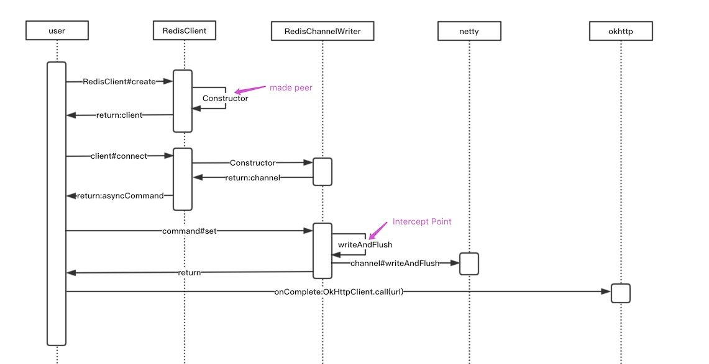

## 引言

《SkyWalking Java 插件贡献实践》：本文将基于SkyWalking 6.0.0-GA-SNAPSHOT版本，以编写Redis客户端<a href="#Lettuce">`Lettuce`</a>的SkyWalking Java Agent 插件为例，与大家分享我贡献PR的过程，希望对大家了解SkyWalking Java Agent插件有所帮助。

## 基础概念

<a href="#OpenTracing">`OpenTracing`</a>和SkyWalking链路模块几个很重要的语义概念。

* Span:可理解为一次方法调用，一个程序块的调用，或一次RPC/数据库访问。只要是一个具有完整时间周期的程序访问，都可以被认为是一个span。SkyWalking <a href="#AbstractSpan">`Span`</a>对象中的重要属性

  | 属性          | 名称     | 备注                                                       |
  | :------------ | :------- | :--------------------------------------------------------- |
  | component     | 组件     | 插件的组件名称，如：Lettuce，详见:ComponentsDefine.Class。 |
  | tag           | 标签     | k-v结构，关键标签，key详见：Tags.Class。                   |
  | peer          | 对端资源 | 用于拓扑图，若DB组件，需记录集群信息。                     |
  | operationName | 操作名称 | 若span=0，operationName将会搜索的下拉列表。                |
  | layer         | 显示     | 在链路页显示，详见SpanLayer.Class。                        |

* Trace:调用链，通过归属于其的Span来隐性的定义。一条Trace可被认为是一个由多个Span组成的有向无环图（DAG图），在SkyWalking链路模块你可以看到，Trace又由多个归属于其的trace segment组成。

* Trace segment:Segment是SkyWalking中的一个概念，它应该包括单个OS进程中每个请求的所有范围，通常是基于语言的单线程。由多个归属于本线程操作的Span组成。

## 核心API

### 跨进程ContextCarrier核心API

* 为了实现分布式跟踪，需要绑定跨进程的跟踪，并且应该传播上下文 整个过程。 这就是ContextCarrier的职责。
* 以下是实现有关跨进程传播的步骤：
  * 在客户端，创建一个新的空的ContextCarrier，将ContextCarrier所有信息放到HTTP heads、Dubbo attachments 或者Kafka messages。
  * 通过服务调用，将ContextCarrier传递到服务端。
  * 在服务端，在对应组件的heads、attachments或messages获取ContextCarrier所有消息。将服务端和客户端的链路信息绑定。

### 跨线程ContextSnapshot核心API

* 除了跨进程，跨线程也是需要支持的，例如异步线程（内存中的消息队列）和批处理在Java中很常见，跨进程和跨线程十分相似，因为都是需要传播 上下文。 唯一的区别是，不需要跨线程序列化。
* 以下是实现有关跨线程传播的步骤：
  * 使用ContextManager＃capture获取ContextSnapshot对象。
  * 让子线程以任何方式，通过方法参数或由现有参数携带来访问ContextSnapshot。
  * 在子线程中使用ContextManager#continued。

详尽的核心API相关知识，可点击阅读 《[插件开发指南-中文版本](https://github.com/apache/incubator-skywalking/blob/master/docs/others/cn/guides/Java-Plugin-Development-Guide.md)》

## 插件实践

### Lettuce操作redis代码

```java
@PostMapping("/ping")
public String ping(HttpServletRequest request) throws ExecutionException, InterruptedException {
    RedisClient redisClient = RedisClient.create("redis://" + "127.0.0.1" + ":6379");
    StatefulRedisConnection<String, String> connection0 = redisClient.connect();
    RedisAsyncCommands<String, String> asyncCommands0 = connection0.async();
    AsyncCommand<String, String, String> future = (AsyncCommand<String, String, String>)asyncCommands0.set("key_a", "value_a");
    future.onComplete(s -> OkHttpClient.call("http://skywalking.apache.org"));
    future.get();
    connection0.close();
    redisClient.shutdown();
    return "pong";
}
```

### 插件源码架构

Lettuce对Redis封装与Redisson <a href="#Redisson">`Redisson`</a> 类似，目的均是实现简单易用，且无学习曲线的Java的Redis客户端。所以要是先对Redis操作的拦截，需要学习对应客户端的源码。

### 设计插件


理解插件实现过程，找到最佳InterceptPoint位置是实现插件融入SkyWalking的核心所在。

### 代码实现

PR的url：[Support lettuce plugin](https://github.com/apache/incubator-skywalking/pull/2152)

### 实践中遇到的问题

* 多线程编程使用debug断点会将链路变成同步，建议使用run模式增加log，或者远程debug来解决。
* 多线程编程，需要使用跨线程ContextSnapshot核心API，否则链路会断裂。
* CompleteableCommand.onComplete方法有时会同步执行，这个和内部机制有关，有时候不分离线程。
* 插件编译版本若为1.7+，需要将插件放到可选插件中。因为sniffer支持的版本是1.6。

## 插件兼容

为了插件得到插件最终的兼容兼容版本，我们需要使用docker对所有插件版本的测试，具体步骤如下：

* 编写测试用例：关于如何编写测试用例，请按照[如何编写文档](https://github.com/SkywalkingTest/skywalking-agent-testcases/blob/master/docs/how-to-write-a-plugin-testcase.md)来实现。
* 提供自动测试用例。 如：[Redisson插件testcase](https://github.com/SkywalkingTest/skywalking-agent-testcases/pull/45)
* 确保本地几个流行的插件版本，在本地运行起来是和自己的预期是一致的。
* 在提供自动测试用例并在CI中递交测试后，插件提交者会批准您的插件。
* 最终得到完整的插件测试报告。

## Pull Request

### 提交PR

提交PR的时候，需要简述自己对插件的设计，这样有助于与社区的贡献者讨论完成codereview。

### 申请自动化测试

测试用例编写完成后，可以申请自动化测试，在自己的PR中会生成插件兼容版本的报告。

### 插件文档

插件文档需要更新：[Supported-list.md](https://github.com/apache/incubator-skywalking/blob/master/docs/en/setup/service-agent/java-agent/Supported-list.md)相关插件信息的支持。

插件如果为可选插件需要在[agent-optional-plugins](https://github.com/apache/incubator-skywalking/tree/master/docs/en/setup/service-agent/java-agent/agent-optional-plugins)可选插件文档中增加对应的描述。

## 注释

<a name="Lettuce"></a>Lettuce是一个完全无阻塞的Redis客户端，使用netty构建，提供反应，异步和同步数据访问。了解细节可点击阅读 [lettuce.io](https://lettuce.io/);

<a name="OpenTracing"></a>OpenTracing是一个跨编程语言的标准，了解细节可点击阅读 《[OpenTracing语义标准](https://github.com/opentracing-contrib/opentracing-specification-zh/blob/master/specification.md)》;

<a name="AbstractSpan"></a>span:org.apache.skywalking.apm.agent.core.context.trace.AbstractSpan接口定义了所有Span实现需要完成的方法;

<a name="Redisson"></a>Redisson是一个非常易用Java的Redis客户端， 它没有学习曲线，无需知道任何Redis命令即可开始使用它。了解细节可点击阅读 [redisson.org](https://redisson.org/);
