ps:本文仅写给菜鸟，以及不知道如何远程调试的程序员，并且仅仅适用skywalking的远程调试

## 概述

远程调试的目的是为了解决代码或者说程序包部署在服务器上运行，只能通过log来查看问题，以及不能跟在本地IDE运行debug那样查找问题，观看程序运行流程...
想想当你的程序运行在服务器上，你在本地的IDE随时debug，是不是很爽的感觉。

好了不废话，切入正题。

## 环境篇

IDE：推荐 [IntelliJ IDEA](https://www.jetbrains.com/idea/)

开发语言: 本文仅限于java，其他语言请自行询问google爸爸或者baidu娘娘

源代码：自行从github下载，并且确保你运行的skywalking包也源代码的一致，（也就是说你自己从源代码编译打包运行，虽然不一样也可以调试，但是你想想你在本地开发，更改完代码，没有重新运行，debug出现的诡异情况）

## 场景篇

假定有如下三台机器

| IP          |    用途    | 备注                                                |
| ----------- | :--------: | :-------------------------------------------------- |
| 10.193.78.1 | oap-server | skywalking 的oap服务（或者说collector所在的服务器） |
| 10.193.78.2 |   agent    | skywalking agent运行所在的服务器                    |
| 10.193.78.0 |    IDE     | 你自己装IDE也就是IntelliJ IDEA的机器                |

以上环境，场景请自行安装好，并确认正常运行。本文不在赘述

废话终于说完了

## 操作篇

首要条件，下载源码后，先用maven 打包编译。然后使用Idea打开源码的父目录，整体结构大致如下图
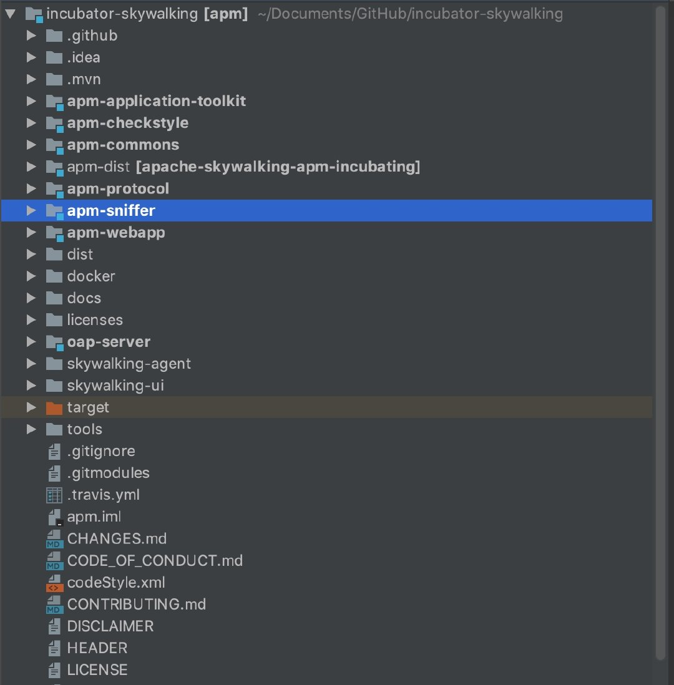

### 1 :agent调试

 #### 1)Idea 配置部分

 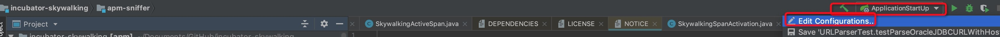
 点击Edit Configurations
 在弹出窗口中依次找到（红色线框的部分）并点击
 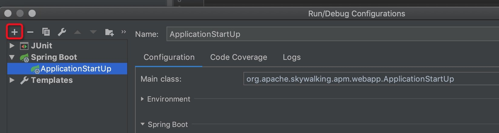
 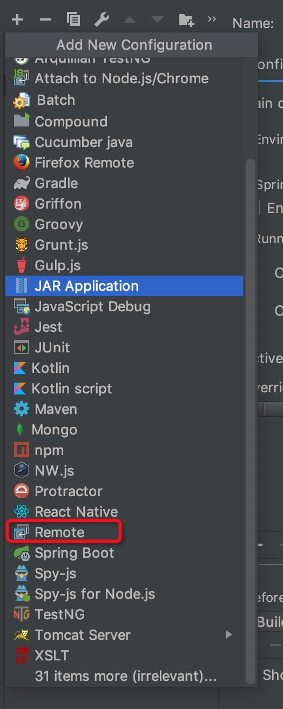
 打开的界面如下
 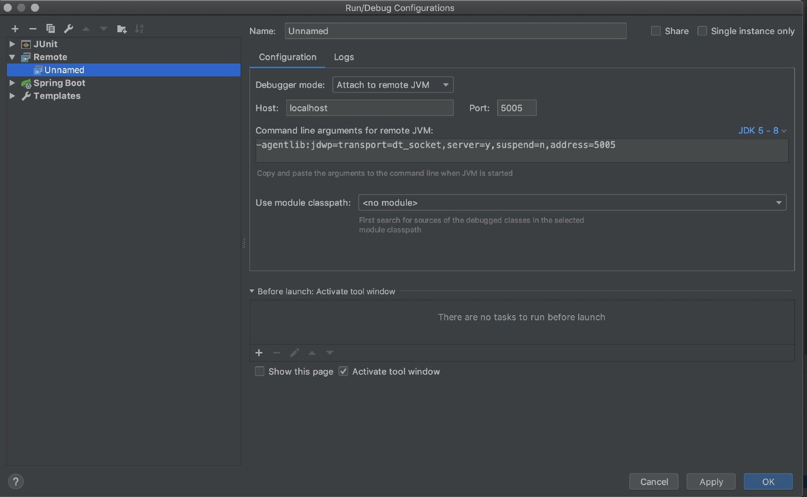

 修改Name值，自己随意，好记即可
 然后Host输入10.193.78.2 Port默认或者其他的，重要的是这个端口在10.193.78.2上没有被占用

 然后找到Use module classpath 选择 apm-agent
 最终的结果如下：
 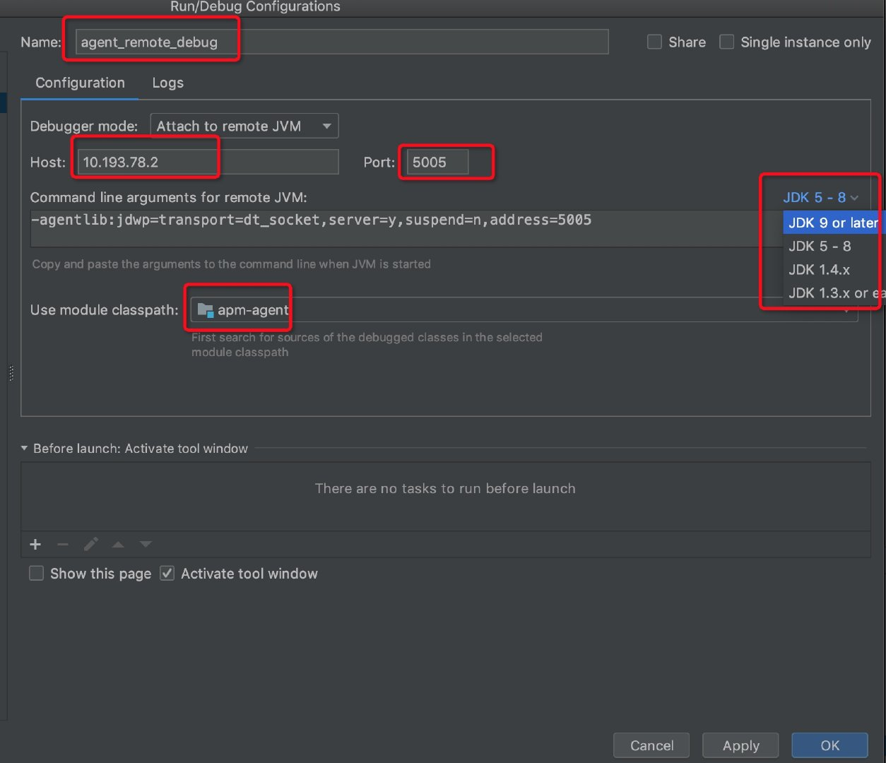

 注意选择目标agent运行的jdk版本，很重要

 然后点击Apply，并找到如下内容，并且复制待用
 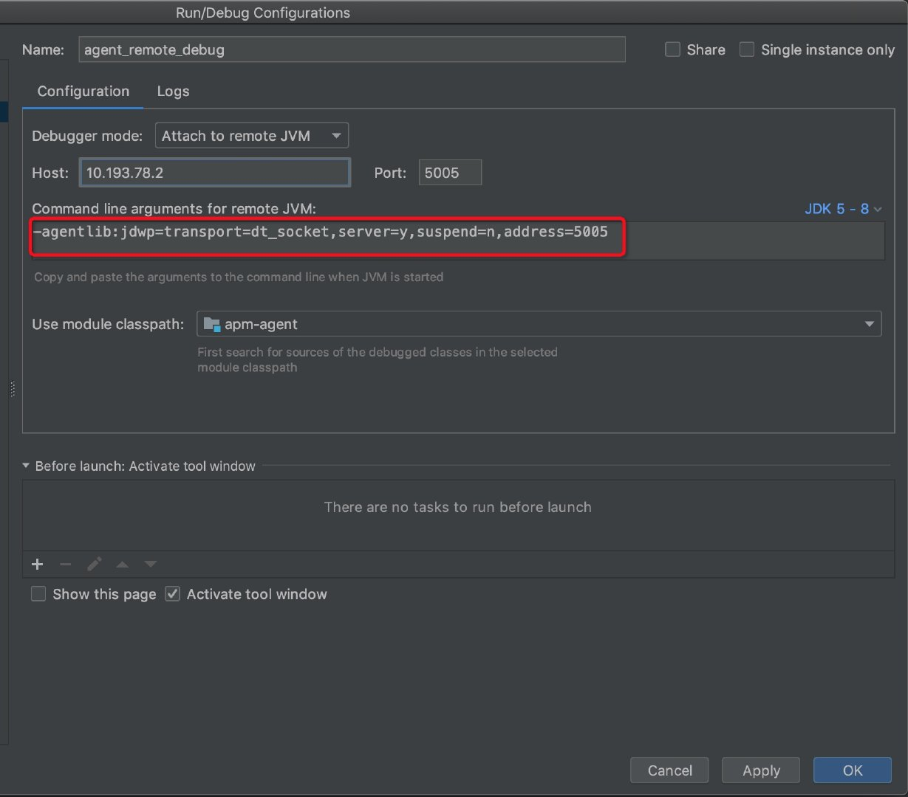

 #### 2）agent配置部分

找到agent配置的脚本，并打开，找到配置agent的地方，
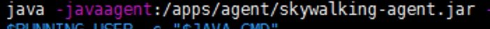
就这个地方，在这个后边加上刚才复制的内容 
最终的结果如下
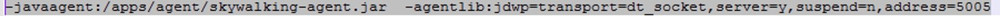
提供一个我配置的weblogic的配置（仅供参考）

然后重启应用（agent）

#### 3）调试

回到Idea中找到这个地方，并点击debug按钮，你没看错，就是红色圈住的地方

然后控制台如果出现以下字样：
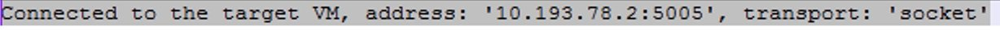
那么恭喜你，可以愉快的加断点调试了。
ps:需要注意的是agent的、
service instance的注册可能不能那么愉快的调试。因为这个注册比较快，而且是在agent启动的时候就发生的，
而远程调试也需要agent打开后才可以调试，所以，如果你手快当我没说这句话。

### 2 :oap-server的调试（也就是collector的调试）

具体过程不在赘述，和上一步的agent调试大同小异，不同的是
Use module classpath需要选择oap-server

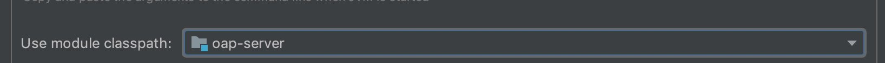 

