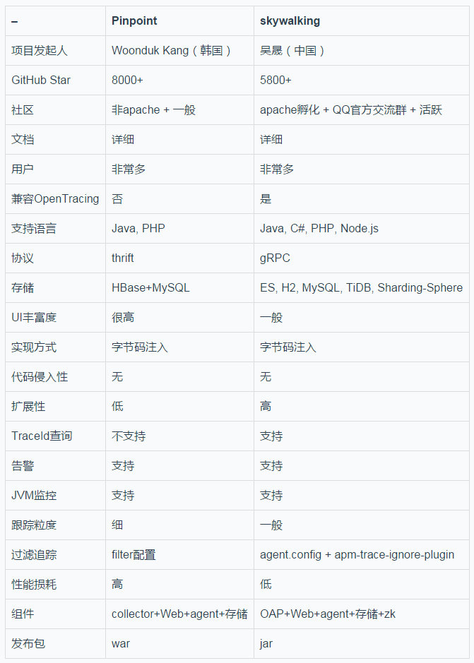
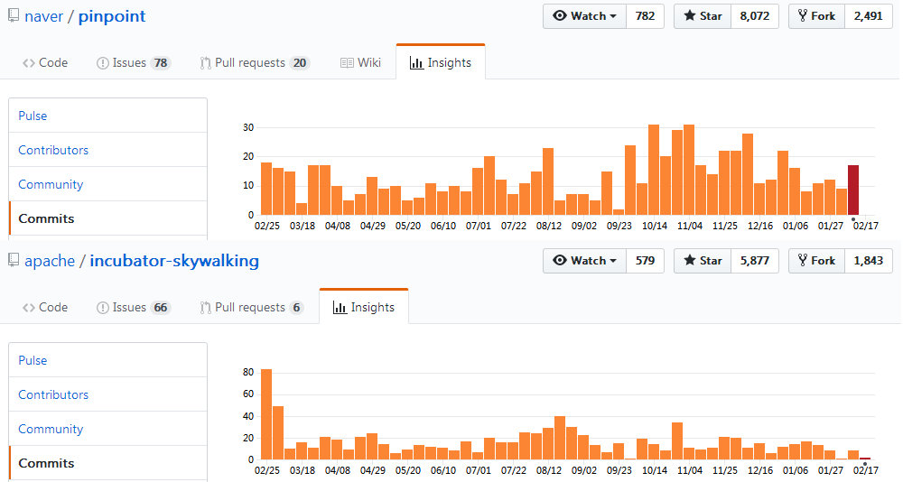
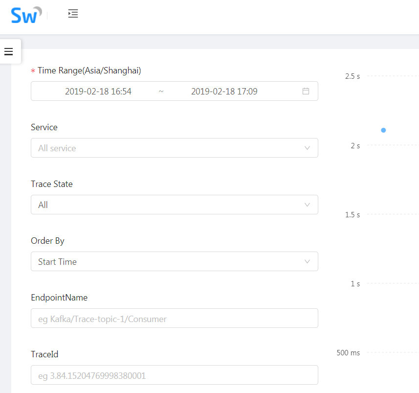
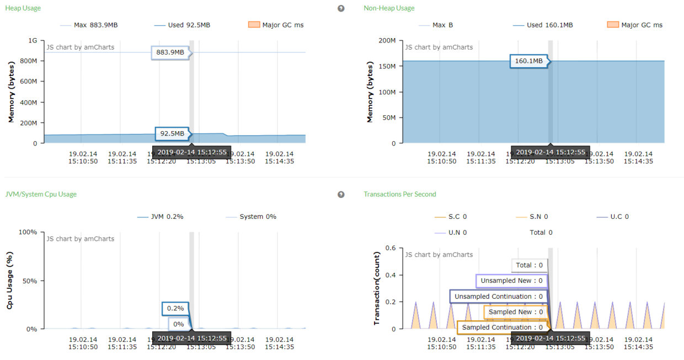
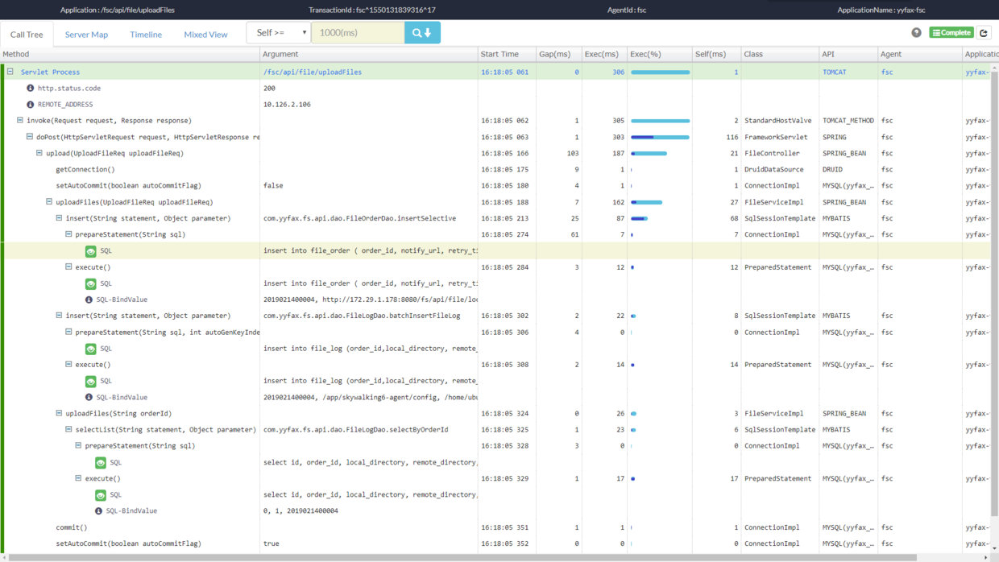
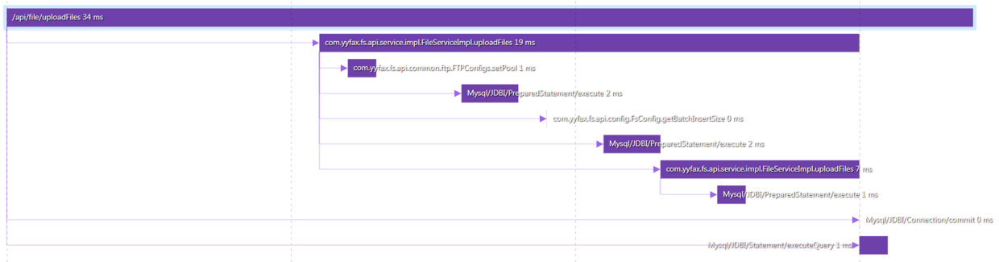
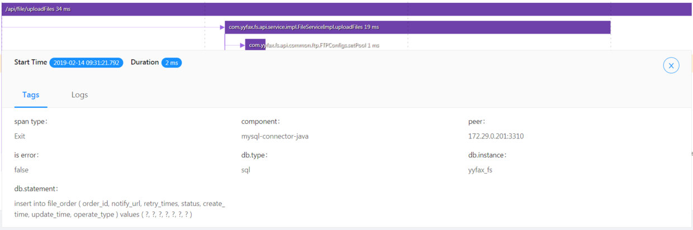
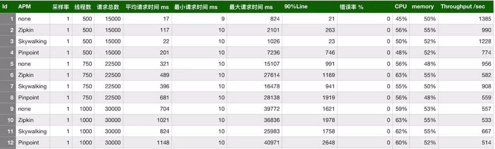
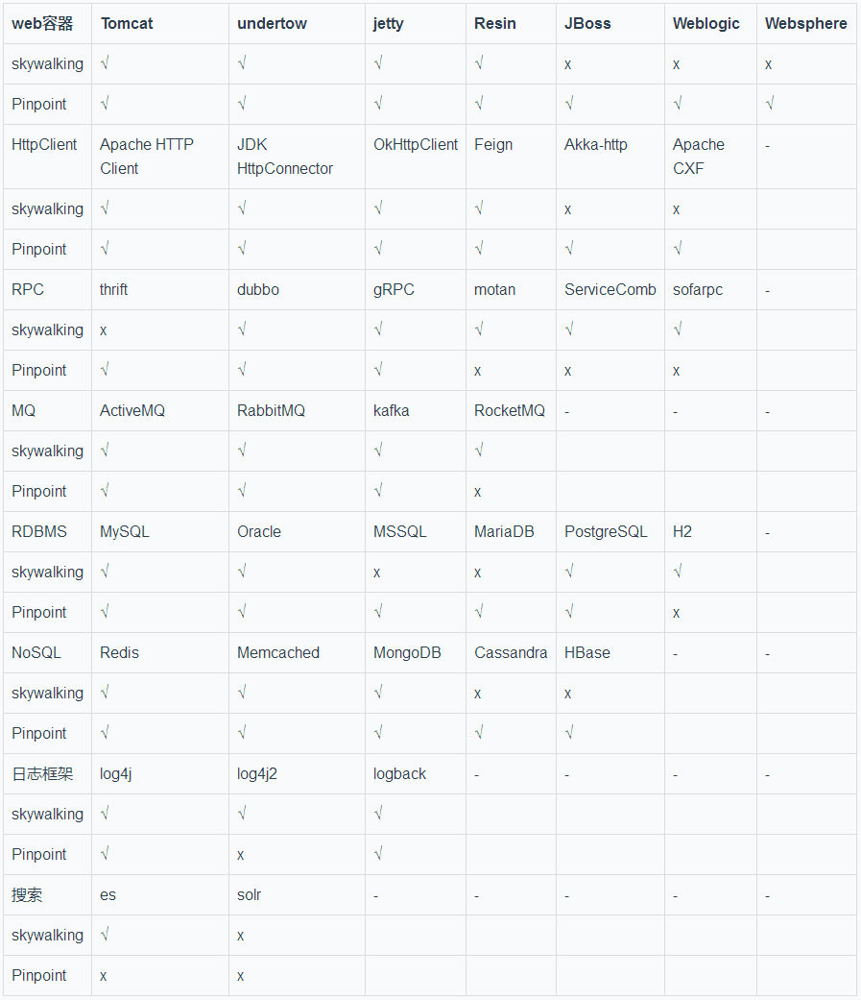

> 作者：王振飞, 写于：2019-02-24
> **说明**：此文是个人所写，版本归属作者，代表个人观点，仅供参考，不代表skywalking官方观点。
> **说明**：本次对比基于skywalking-6.0.0-GA和Pinpoint-1.8.2（截止2019-02-19最新版本）。另外，我们这次技术选型直接否定了Zipkin，其最大原因是它对代码有侵入性，CAT也是一样。这是我们所完全无法接受的。

这应该是目前最优秀的两款开源APM产品了，而且两款产品都通过字节码注入的方式，实现了对代码**完全无任何侵入**，他们的对比信息如下：

**OAP说明**: skywalking6.x才有OAP这个概念，skywalking5.x叫collector。

接下来，对每个PK项进行深入分析和对比。更多精彩和首发内容请关注公众号：【**阿飞的博客**】。

 **社区比较**

这一点上面skywalking肯定完胜。一方面，skywalking已经进入apache孵化，社区相当活跃。而且项目发起人是中国人，我们能够进入官方群（Apache SkyWalking交流群：`392443393`）和项目发起人吴晟零距离沟通，很多问题能第一时间得到大家的帮助（玩过开源的都知道，这个价值有多大）。
而Pinpoint是韩国人开发的，免不了有沟通障碍。至于github上最近一年的commit频率，skywalking和Pinpoint旗鼓相当，都是接近20的水平:

**所以，社区方面，skywalking更胜一筹。**

### **支持语言比较**

Pinpoint只支持Java和PHP，而skywalking支持5种语言：Java, C#, PHP, Node.js, Go。如果公司的服务涉及到多个开发语言，那么skywalking会是你更好的选择。并且，如果你要实现自己的探针（比如python语言），skywalking的二次开发成本也比Pinpoint更低。

> 说明：Github上有开发者为Pinpoint贡献了对Node.js的支持，请戳链接：https://github.com/peaksnail/pinpoint-node-agent。但是已经停止维护，几年没更新了！

**所以，支持语言方面，skywalking更胜一筹**。

###  **协议比较**

SkyWalking支持gRPC和http，不过建议使用gRPC，skywalking6.x版本已经不提供http方式（但是还会保留接收5.x的数据），以后会考虑删除。
而Pinpoint使用的是thrift协议。
协议本身没有谁好谁坏。

### **存储比较(重要)**

笔者认为，存储是skywalking和Pinpoint最大的差异所在，因为底层存储决定了上层功能。

Pinpoint只支持HBase，且扩展代价较大。这就意味着，如果选择Pinpoint，还要有能力hold住一套HBase集群（daocloud从Pinpoint切换到skywalking就是因为HBase的维护代价有点大）。在这方面，skywalking支持的存储就多很多，这样的话，技术选型时可以根据团队技术特点选择合适的存储，而且还可以自行扩展（不过生产环境上应该大部分是以es存储为主）。

Pinpoint只支持HBase的另一个缺陷就是，HBase本身查询能力有限（HBase只能支持三种方式查询：RowKey精确查找，SCAN范围查找，全表扫描）限制了Pinpoint的查询能力，所以其支持的查询一定是在时间的基础上（Pinpoint通过鼠标圈定一个时间范围后查看这个范围内的Trace信息）。而skywalking可以多个维度任意组合查询，例如：时间范围，服务名，Trace状态，请求路径，TraceId等。

另外，Pinpoint和skywalking都支持TTL，即历史数据保留策略。skywalking是在OAP模块的application.yml中配置从而指定保留时间。而Pinpoint是通过HBase的ttl功能实现，通过Pinpoint提供的hbase脚本`https://github.com/naver/pinpoint/blob/master/hbase/scripts/hbase-create.hbase`可以看到：ApplicationTraceIndex配置了`TTL => 5184000`，SqlMetaData_Ver2配合了`TTL => 15552000`，单位是秒。

> **说明**：es并不是完全碾压HBase，es和HBase没有绝对的好和坏。es强在检索能力，存储能力偏弱(千亿以下，es还是完全有能力hold的住的)。HBase强在存储能力，检索能力偏弱。如果搜集的日志量非常庞大，那么es存储就比较吃力。当然，没有蹩脚的中间件，只有蹩脚的程序员，无论是es还是HBase，调优才是最关键的。同样的，如果对检索能力有一定的要求，那么HBase肯定满足不了你。所以，又到了根据你的业务和需求决定的时刻了，trade-off真是无所不在。

### **UI比较**

Pinpoint的UI确实比skywalking稍微好些，尤其是服务的拓扑图展示。不过daocloud根据Pinpoint的风格为skywalking定制了一款UI。请戳链接：https://github.com/TinyAllen/rocketbot，项目介绍是：`rocketbot: A UI for Skywalking`。截图如下所示；

**所以，只比较原生UI的话，Pinpoint更胜一筹。**

### **扩展性比较**

Pinpoint好像设计之初就没有过多考虑扩展性，无论是底层的存储，还是自定义探针实现等。而skywalking核心设计目标之一就是**Pluggable**，即可插拔。

以存储为例，pinpoint完全没有考虑扩展性，而skywalking如果要自定义实现一套存储，只需要定义一个类实现接口`org.apache.skywalking.oap.server.library.module.ModuleProvider`，然后实现一些DAO即可。至于Pinpoint则完全没有考虑过扩展底层存储。

再以实现一个自己的探针为例（比如我要实现python语言的探针），Pinpoint选择thrift作为数据传输协议标准，而且为了节省数据传输大小，在传递常量的时候也尽量使用数据参考字典，传递一个数字而不是直接传递字符串等等。这些优化也增加了系统的复杂度：包括使用 Thrift 接口的难度、UDP 数据传输的问题、以及数据常量字典的注册问题等等。Pinpoint发展这么年才支持Java和PHP，可见一斑。而skywalking的数据接口就标准很多，并且支持OpenTracing协议，除了官方支持Java以外，C#、PHP和Node.js的支持都是由社区开发并维护。

还有后面会提到的告警，skywalking的可扩展性也要远好于Pinpoint。

最后，Pinpoint和skywalking都支持插件开发，Pinpoint插件开发参考：http://naver.github.io/pinpoint/1.8.2/plugindevguide.html。skywalking插件开发参考：https://github.com/apache/incubator-skywalking/blob/master/docs/en/guides/Java-Plugin-Development-Guide.md。

**所以，扩展性方面skywalking更胜一筹**。

### **告警比较**

Pinpoint和skywalking都支持自定义告警规则。

但是恼人的是，Pinpoint如果要配置告警规则，还需要安装MySQL(配置告警时的用户，用户组信息以及告警规则都持久化保存在MySQL中)，这就导致Pinpoint的维护成本又高了一些，既要维护HBase又要维护MySQL。

Pinpoint支持的告警规则有：SLOW COUNT|RATE, ERROR COUNT|RATE, TOTAL COUNT, SLOW COUNT|RATE TO CALLEE, ERROR COUNT|RATE TO CALLEE, ERROR RATE TO CALLEE, HEAP USAGE RATE, JVM CPU USAGE RATE, DATASOURCE CONNECTION USAGE RATE。

Pinpoint每3分钟周期性检查过去5分钟的数据，如果有符合规则的告警，就会发送sms/email给用户组下的所有用户。需要说明的是，实现发送sms/email的逻辑需要自己实现，Pinpoint只提供了接口`com.navercorp.pinpoint.web.alarm.AlarmMessageSender`。并且Pinpoint发现告警持续时，会递增发送sms/email的时间间隔 3min -> 6min -> 12min -> 24min，防止sms/email狂刷。

> **Pinpoint告警参考**：http://naver.github.io/pinpoint/1.8.2/alarm.html

skywalking配置告警不需要引入任何其他存储。skywalking在config/alarm-settings.xml中可以配置告警规则，告警规则支持自定义。

skywalking支持的告警规则（配置项中的名称是indicator-name）有：service_resp_time, service_sla, service_cpm, service_p99, service_p95, service_p90, service_p75, service_p50, service_instance_sla, service_instance_resp_time, service_instance_cpm, endpoint_cpm, endpoint_avg, endpoint_sla, endpoint_p99, endpoint_p95, endpoint_p90, endpoint_p75, endpoint_p50。

Skywalking通过HttpClient的方式远程调用在配置项webhooks中定义的告警通知服务地址。skywalking也支持silence-period配置，假设在TN这个时间点触发了告警，那么TN -> TN+period 这段时间内不会再重复发送该告警。

> **skywalking告警参考**：https://github.com/apache/incubator-skywalking/blob/master/docs/en/setup/backend/backend-alarm.md。目前只支持official_analysis.oal脚本中Service, Service Instance, Endpoint scope的metric，其他scope的metric需要等待后续扩展。

Pinpoint和skywalking都支持常用的告警规则配置，但是skywalking采用webhooks的方式就灵活很多：短信通知，邮件通知，微信通知都是可以支持的。而Pinpoint只能sms/email通知，并且还需要引入MySQL存储，增加了整个系统复杂度。所以，**告警方面，skywalking更胜一筹**。

### **JVM监控**

skywalking支持监控：Heap, Non-Heap, GC(YGC和FGC)。
Pinpoint能够监控的指标主要有：Heap, Non-Heap, FGC, DirectBufferMemory, MappedBufferMemory，但是没有YGC。另外，Pinpoint还支持多个指标同一时间点查看的功能。如下图所示：

**所以，对JVM的监控方面，Pinpoint更胜一筹。**

### **服务监控**

包括操作系统，和部署的服务实例的监控。
Pinpoint支持的维度有：CPU使用率，Open File Descriptor，数据源，活动线程数，RT，TPS。
skywalking支持的维度有：CPU使用率，SLA，RT，CPM（Call Per Minutes）。
所以，这方面两者旗鼓相当，没有明显的差距。

### **跟踪粒度比较**

Pinpoint在这方面做的非常好，跟踪粒度非常细。如下图所示，是Pinpoint对某个接口的trace信息：

而同一个接口skywalking的trace信息如下图所示：

> **备注**: 此截图是skywalking加载了插件`apm-spring-annotation-plugin-6.0.0-GA.jar`（这个插件允许跟踪加了@Bean, @Service, @Component and @Repository注解的spring context中的bean的方法）。

通过对比发现，**在跟踪粒度方面，Pinpoint更胜一筹**。

### **过滤追踪**

Pinpoint和skywalking都可以实现，而且配置的表达式都是基于ant风格。
Pinpoint在Web UI上配置 `filter wizard` 即可自定义过滤追踪。
skywalking通过加载apm-trace-ignore-plugin插件就能自定义过滤跟踪，skywalking这种方式更灵活，比如一台高配服务器上有若干个服务，在共用的agent配置文件apm-trace-ignore-plugin.config中可以配置通用的过滤规则，然后通过-D的方式为每个服务配置个性化过滤。

**所以，在过滤追踪方面，skywalking更胜一筹**。

### **性能损耗**

由于Pinpoint采集信息太过详细，所以，它对性能的损耗最大。而skywalking默认策略比较保守，对性能损耗很小。
有网友做过压力测试，对比如下：

> 图片来源于：https://juejin.im/post/5a7a9e0af265da4e914b46f1

**所以，在性能损耗方面，skywalking更胜一筹**。

### **发布包比较**

skywalking与时俱进，全系标配jar包，部署只需要执行start.sh脚本即可。而Pinpoint的collector和web还是war包，部署时依赖web容器（比如Tomcat）。拜托，都9012年了。

**所以，在发布包方面，skywalking更胜一筹**。

### **支持组件比较**

skywalking和Pinpoint支持的中间件对比说明：

1. **WEB容器说明**：Pinpoint支持几乎所有的WEB容器，包括开源和商业的。而wkywalking只支持开源的WEB容器，对2款大名鼎鼎的商业WEB容器Weblogic和Wevsphere都不支持。
2. **RPC框架说明**：对RPC框架的支持，skywalking简直秒杀Pinpoint。连小众的motan和sofarpc都支持。
3. **MQ说明**：skywalking比Pinpoint多支持一个国产的MQ中间件RocketMQ，毕竟RocketMQ在国内名气大，而在国外就一般了。加之skywalking也是国产的。
4. **RDBMS/NoSQL说明**：Pinpoint对RDBMS和NoSQL的支持都要略好于skywalking，RDBMS方面，skywalking不支持MSSQL和MariaDB。而NoSQL方面，skywalking不支持Cassandra和HBase。至于Pinpoint不支持的H2，完全不是问题，毕竟生产环境是肯定不会使用H2作为底层存储的。
5. **Redis客户端说明**：虽然skywalking和Pinpoint都支持Redis，但是skywalking支持三种流行的Redis客户端：Jedis，Redisson，Lettuce。而Pinpoint只支持Jedis和Lettuce，再一次，韩国人开发的Pinpoint无视了目前中国人开发的GitHub上star最多的Redis Client -- Redisson。
6. **日志框架说明**：Pinpoint居然不支持log4j2？但是已经有人开发了相关功能，详情请戳链接：[log4j plugin support log4j2 or not? https://github.com/naver/pinpoint/issues/3055](https://github.com/naver/pinpoint/issues/3055)

通过对skywalking和Pinpoint支持中间件的对比我们发现，skywalking对国产软件的支持真的是全方位秒杀Pinpoint，比如小众化的RPC框架：motan（微博出品），sofarpc，阿里的RocketMQ，Redis客户端Redisson，以及分布式任务调度框架elastic-job等。当然也从另一方面反应国产开源软件在世界上的影响力还很小。

这方面没有谁好谁坏，毕竟每个公司使用的技术栈不一样。如果你对RocketMQ有强需求，那么skywalking是你的最佳选择。如果你对es有强需求，那么skywalking也是你的最佳选择。如果HBase是你的强需求，那么Pinpoint就是你的最佳选择。如果MSSQL是你的强需求，那么Pinpoint也是你的最佳选择。总之，这里完全取决你的项目了。

### **总结**

经过前面对skywalking和Pinpoint全方位对比后我们发现，对于两款非常优秀的APM软件，有一种既生瑜何生亮的感觉。Pinpoint的优势在于：追踪数据粒度非常细、功能强大的用户界面，以及使用HBase作为存储带来的海量存储能力。而skywalking的优势在于：非常活跃的中文社区，支持多种语言的探针，对国产开源软件非常全面的支持，以及使用es作为底层存储带来的强大的检索能力，并且skywalking的扩展性以及定制化要更优于Pinpoint：

- 如果你有海量的日志存储需求，推荐Pinpoint。
- 如果你更看重二次开发的便捷性，推荐skywalking。

最后，参考上面的对比，结合你的需求，哪些不能妥协，哪些可以舍弃，从而更好的选择一款最适合你的APM软件。

### **参考链接**

- 参考[1]. https://github.com/apache/incubator-skywalking/blob/master/docs/en/setup/service-agent/java-agent/Supported-list.md
- 参考[2]. http://naver.github.io/pinpoint/1.8.2/main.html#supported-modules
- 参考[3]. https://juejin.im/post/5a7a9e0af265da4e914b46f1

---

> 如果觉得本文不错，请关注作者公众号：【**阿飞的博客**】，多谢！
