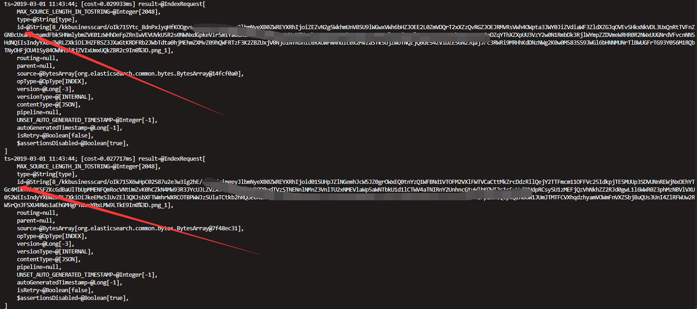
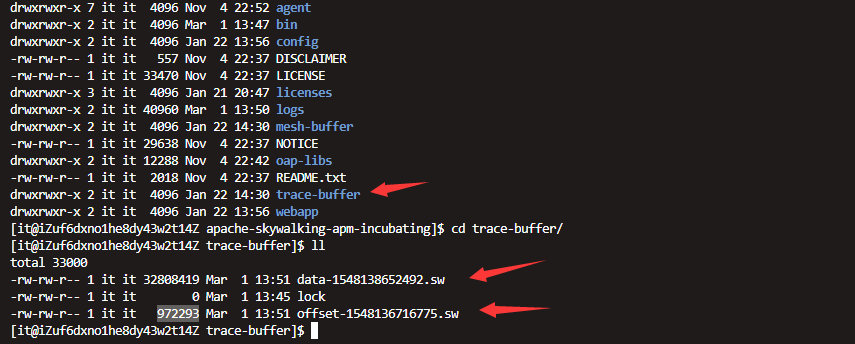

# 前言

首先描述下问题的背景，博主有个习惯，每天上下班的时候看下skywalking的trace页面的error情况。但是某天突然发现生产环境skywalking页面没有任何数据了，页面也没有显示任何的异常，有点慌，我们线上虽然没有全面铺开对接skywalking，但是也有十多个应用。看了应用agent端日志后，其实也不用太担心，对应用毫无影响。大概情况就是这样，但是问题还是要解决，下面就开始排查skywalking不可用的问题。

# 使用到的工具arthas

Arthas是阿里巴巴开源的一款在线诊断java应用程序的工具，是greys工具的升级版本，深受开发者喜爱。当你遇到以下类似问题而束手无策时，Arthas可以帮助你解决：

1.  这个类从哪个 jar 包加载的？为什么会报各种类相关的 Exception？
2.  我改的代码为什么没有执行到？难道是我没 commit？分支搞错了？
3.  遇到问题无法在线上 debug，难道只能通过加日志再重新发布吗？
4.  线上遇到某个用户的数据处理有问题，但线上同样无法 debug，线下无法重现！
5.  是否有一个全局视角来查看系统的运行状况？
6.  有什么办法可以监控到JVM的实时运行状态？
7.  Arthas采用命令行交互模式，同时提供丰富的 Tab 自动补全功能，进一步方便进行问题的定位和诊断。

项目地址：https://github.com/alibaba/arthas

# 先定位问题一

查看skywalking-oap-server.log的日志，发现会有一条异常疯狂的在输出，异常详情如下：

```
2019-03-01 09:12:11,578 - org.apache.skywalking.oap.server.core.register.worker.RegisterPersistentWorker -3264081149 [DataCarrier.IndicatorPersistentWorker.endpoint_inventory.Consumser.0.Thread] ERROR [] - Validation Failed: 1: id is too long, must be no longer than 512 bytes but was: 684;
org.elasticsearch.action.ActionRequestValidationException: Validation Failed: 1: id is too long, must be no longer than 512 bytes but was: 684;
        at org.elasticsearch.action.ValidateActions.addValidationError(ValidateActions.java:26) ~[elasticsearch-6.3.2.jar:6.3.2]
        at org.elasticsearch.action.index.IndexRequest.validate(IndexRequest.java:183) ~[elasticsearch-6.3.2.jar:6.3.2]
        at org.elasticsearch.client.RestHighLevelClient.performRequest(RestHighLevelClient.java:515) ~[elasticsearch-rest-high-level-client-6.3.2.jar:6.3.2]
        at org.elasticsearch.client.RestHighLevelClient.performRequestAndParseEntity(RestHighLevelClient.java:508) ~[elasticsearch-rest-high-level-client-6.3.2.jar:6.3.2]
        at org.elasticsearch.client.RestHighLevelClient.index(RestHighLevelClient.java:348) ~[elasticsearch-rest-high-level-client-6.3.2.jar:6.3.2]
        at org.apache.skywalking.oap.server.library.client.elasticsearch.ElasticSearchClient.forceInsert(ElasticSearchClient.java:141) ~[library-client-6.0.0-alpha.jar:6.0.0-alpha]
        at org.apache.skywalking.oap.server.storage.plugin.elasticsearch.base.RegisterEsDAO.forceInsert(RegisterEsDAO.java:66) ~[storage-elasticsearch-plugin-6.0.0-alpha.jar:6.0.0-alpha]
        at org.apache.skywalking.oap.server.core.register.worker.RegisterPersistentWorker.lambda$onWork$0(RegisterPersistentWorker.java:83) ~[server-core-6.0.0-alpha.jar:6.0.0-alpha]
        at java.util.HashMap$Values.forEach(HashMap.java:981) [?:1.8.0_201]
        at org.apache.skywalking.oap.server.core.register.worker.RegisterPersistentWorker.onWork(RegisterPersistentWorker.java:74) [server-core-6.0.0-alpha.jar:6.0.0-alpha]
        at org.apache.skywalking.oap.server.core.register.worker.RegisterPersistentWorker.access$100(RegisterPersistentWorker.java:35) [server-core-6.0.0-alpha.jar:6.0.0-alpha]
        at org.apache.skywalking.oap.server.core.register.worker.RegisterPersistentWorker$PersistentConsumer.consume(RegisterPersistentWorker.java:120) [server-core-6.0.0-alpha.jar:6.0.0-alpha]
        at org.apache.skywalking.apm.commons.datacarrier.consumer.ConsumerThread.consume(ConsumerThread.java:101) [apm-datacarrier-6.0.0-alpha.jar:6.0.0-alpha]
        at org.apache.skywalking.apm.commons.datacarrier.consumer.ConsumerThread.run(ConsumerThread.java:68) [apm-datacarrier-6.0.0-alpha.jar:6.0.0-alpha]
2019-03-01 09:12:11,627 - org.apache.skywalking.oap.server.core.register.worker.RegisterPersistentWorker -3264081198 [DataCarrier.IndicatorPersistentWorker.endpoint_inventory.Consumser.0.Thread] ERROR [] - Validation Failed: 1: id is too long, must be no longer than 512 bytes but was: 684;
org.elasticsearch.action.ActionRequestValidationException: Validation Failed: 1: id is too long, must be no longer than 512 bytes but was: 684;
        at org.elasticsearch.action.ValidateActions.addValidationError(ValidateActions.java:26) ~[elasticsearch-6.3.2.jar:6.3.2]
        at org.elasticsearch.action.index.IndexRequest.validate(IndexRequest.java:183) ~[elasticsearch-6.3.2.jar:6.3.2]
        at org.elasticsearch.client.RestHighLevelClient.performRequest(RestHighLevelClient.java:515) ~[elasticsearch-rest-high-level-client-6.3.2.jar:6.3.2]
        at org.elasticsearch.client.RestHighLevelClient.performRequestAndParseEntity(RestHighLevelClient.java:508) ~[elasticsearch-rest-high-level-client-6.3.2.jar:6.3.2]
        at org.elasticsearch.client.RestHighLevelClient.index(RestHighLevelClient.java:348) ~[elasticsearch-rest-high-level-client-6.3.2.jar:6.3.2]
        at org.apache.skywalking.oap.server.library.client.elasticsearch.ElasticSearchClient.forceInsert(ElasticSearchClient.java:141) ~[library-client-6.0.0-alpha.jar:6.0.0-alpha]
        at org.apache.skywalking.oap.server.storage.plugin.elasticsearch.base.RegisterEsDAO.forceInsert(RegisterEsDAO.java:66) ~[storage-elasticsearch-plugin-6.0.0-alpha.jar:6.0.0-alpha]
        at org.apache.skywalking.oap.server.core.register.worker.RegisterPersistentWorker.lambda$onWork$0(RegisterPersistentWorker.java:83) ~[server-core-6.0.0-alpha.jar:6.0.0-alpha]
        at java.util.HashMap$Values.forEach(HashMap.java:981) [?:1.8.0_201]
        at org.apache.skywalking.oap.server.core.register.worker.RegisterPersistentWorker.onWork(RegisterPersistentWorker.java:74) [server-core-6.0.0-alpha.jar:6.0.0-alpha]
        at org.apache.skywalking.oap.server.core.register.worker.RegisterPersistentWorker.access$100(RegisterPersistentWorker.java:35) [server-core-6.0.0-alpha.jar:6.0.0-alpha]
        at org.apache.skywalking.oap.server.core.register.worker.RegisterPersistentWorker$PersistentConsumer.consume(RegisterPersistentWorker.java:120) [server-core-6.0.0-alpha.jar:6.0.0-alpha]
        at org.apache.skywalking.apm.commons.datacarrier.consumer.ConsumerThread.consume(ConsumerThread.java:101) [apm-datacarrier-6.0.0-alpha.jar:6.0.0-alpha]
        at org.apache.skywalking.apm.commons.datacarrier.consumer.ConsumerThread.run(ConsumerThread.java:68) [apm-datacarrier-6.0.0-alpha.jar:6.0.0-alpha]
```

可以看到，上面的异常输出的时间节点，以这种频率在疯狂的刷新。通过异常message，得知到是因为skywalking在写elasticsearch时，索引的id太长了。下面是elasticsearch的源码：

```java
        if (id != null && id.getBytes(StandardCharsets.UTF_8).length > 512) {
            validationException = addValidationError("id is too long, must be no longer than 512 bytes but was: " +
                            id.getBytes(StandardCharsets.UTF_8).length, validationException);
        }
```

具体可见：[elasticsearch/action/index/IndexRequest.java#L240](https://github.com/elastic/elasticsearch/blob/5.2/core/src/main/java/org/elasticsearch/action/index/IndexRequest.java#L240)

## 问题一：

通过日志，初步定位是哪个系统的url太长，skywalking在注册url数据时触发elasticsearch针对索引id校验的异常，而skywalking注册失败后会不断的重试，所以才有了上面日志不断刷的现象。

## 问题解决：

elasticsearch client在写es前通过硬编码的方式写死了索引id的长度不能超过512字节大小。也就是我们不能通过从ES侧找解决方案了。回到异常的message，只能看到提示id太长，并没有写明id具体是什么，这个异常提示其实是不合格的，博主觉得应该把id的具体内容抛出来，问题就简单了。因为异常没有明确提示，系统又比较多，不能十多个系统依次关闭重启来验证到底是哪个系统的哪个url有问题。这个时候Arthas就派上用场了，在不重启应用不开启debug模式下，查看实例中的属性对象。下面通过Arthas找到具体的url。

从异常中得知，org.elasticsearch.action.index.IndexRequest这个类的validate方法触发的，这个方法是没有入参的，校验的id属性其实是对象本身的属性，那么我们使用Arthas的watch指令来看下这个实例id属性。先介绍下watch的用法：

### 功能说明

让你能方便的观察到指定方法的调用情况。能观察到的范围为：返回值、抛出异常、入参，通过编写 OGNL 表达式进行对应变量的查看。

### 参数说明

watch 的参数比较多，主要是因为它能在 4 个不同的场景观察对象

| 参数名称            | 参数说明                                   |
| ------------------- | ------------------------------------------ |
| _class-pattern_     | 类名表达式匹配                             |
| _method-pattern_    | 方法名表达式匹配                           |
| _express_           | 观察表达式                                 |
| _condition-express_ | 条件表达式                                 |
| \[b\]               | 在**方法调用之前**观察                     |
| \[e\]               | 在**方法异常之后**观察                     |
| \[s\]               | 在**方法返回之后**观察                     |
| \[f\]               | 在**方法结束之后**(正常返回和异常返回)观察 |
| \[E\]               | 开启正则表达式匹配，默认为通配符匹配       |
| \[x:\]              | 指定输出结果的属性遍历深度，默认为 1       |

从上面的用法说明结合异常信息，我们得到了如下的指令脚本：

watch org.elasticsearch.action.index.IndexRequest validate "target"

执行后，就看到了我们希望了解到的内容，如：



索引id的具体内容看到后，就好办了。我们暂时把定位到的这个应用启动脚本中的的skywalking agent移除后（计划后面重新设计下接口）重启了下系统验证下。果然疯狂输出的日志停住了，但是问题并没完全解决，skywalking页面上的数据还是没有恢复。

# 定位问题二

skywalking数据存储使用了elasticsearch，页面没有数据，很有可能是elasticsearch出问题了。查看elasticsearch日志后，发现elasticsearch正在疯狂的GC，日志如：

```
: 139939K->3479K(153344K), 0.0285655 secs] 473293K->336991K(5225856K), 0.0286918 secs] [Times: user=0.05 sys=0.00, real=0.03 secs] 
2019-02-28T20:05:38.276+0800: 3216940.387: Total time for which application threads were stopped: 0.0301495 seconds, Stopping threads took: 0.0001549 seconds
2019-02-28T20:05:38.535+0800: 3216940.646: [GC (Allocation Failure) 2019-02-28T20:05:38.535+0800: 3216940.646: [ParNew
Desired survivor size 8716288 bytes, new threshold 6 (max 6)
- age   1:    1220136 bytes,    1220136 total
- age   2:     158496 bytes,    1378632 total
- age   3:      88200 bytes,    1466832 total
- age   4:      46240 bytes,    1513072 total
- age   5:     126584 bytes,    1639656 total
- age   6:     159224 bytes,    1798880 total
: 139799K->3295K(153344K), 0.0261667 secs] 473311K->336837K(5225856K), 0.0263158 secs] [Times: user=0.06 sys=0.00, real=0.03 secs] 
2019-02-28T20:05:38.562+0800: 3216940.673: Total time for which application threads were stopped: 0.0276971 seconds, Stopping threads took: 0.0001030 seconds
2019-02-28T20:05:38.901+0800: 3216941.012: [GC (Allocation Failure) 2019-02-28T20:05:38.901+0800: 3216941.012: [ParNew
Desired survivor size 8716288 bytes, new threshold 6 (max 6)
```

## 问题二：

查询后得知，elasticsearch的内存配置偏大了，GC时间太长，导致elasticsearch脱离服务了。elasticsearch所在主机的内存是8G的实际内存7.6G,刚开始配置了5G的堆内存大小，可能Full GC的时候耗时太久了。查询elasticsearch官方文档后，得到如下的jvm优化建议：

-   将最小堆大小（`Xms`）和最大堆大小（`Xmx`）设置为彼此相等。
-   Elasticsearch可用的堆越多，它可用于缓存的内存就越多。但请注意，过多的堆可能会使您陷入长时间的垃圾收集暂停。
-   设置`Xmx`为不超过物理RAM的50％，以确保有足够的物理RAM用于内核文件系统缓存。
-   不要设置`Xmx`为JVM用于压缩对象指针（压缩oops）的截止值之上; 确切的截止值变化但接近32 GB。

详情见：[https://www.elastic.co/guide/en/elasticsearch/reference/6.5/heap-size.html](https://www.elastic.co/guide/en/elasticsearch/reference/6.5/heap-size.html)

## 问题解决：

根据`Xmx`不超过物理RAM的50％上面的jvm优化建议。后面将Xms和Xmx都设置成了3G。然后先停掉skywalking（由于skywalking中会缓存部分数据，如果直接先停ES，会报索引找不到的类似异常，这个大部分skywalking用户应该有遇到过），清空skywalking缓存目录下的内容，如：



在重启elasticsearch，接着启动skywalking后页面终于恢复了

# 结语

整个问题排查到解决大概花了半天时间，幸好一点也不影响线上应用的使用，这个要得益于skywalking的设计，不然就是大灾难了。然后要感谢下Arthas的技术团队，写了这么好用的一款产品并且开源了，如果没有Arthas，这个问题真的不好定位，甚至一度想到了换掉elasticsearch，采用mysql来解决索引id过长的问题。Arthas真的是线上找问题的利器，博主在Arthas刚面世的时候就关注了，并且一直在公司推广使用，在这里在硬推一波。

### 作者简介：

陈凯玲，2016年5月加入凯京科技。曾任职高级研发和项目经理，现任凯京科技研发中心架构&运维部负责人。pmp项目管理认证，阿里云MVP。热爱开源，先后开源过多个热门项目。热爱分享技术点滴，独立博客KL博客（[http://www.kailing.pub](http://www.kailing.pub/)）博主。

