## APM和调用链跟踪

随着企业经营规模的扩大，以及对内快速诊断效率和对外SLA（服务品质协议，service-level agreement)的追求，对于业务系统的掌控度的要求越来越高，主要体现在：

 - 对于第三方依赖的监控，实时/准实时了解第三方的健康状况/服务品质，降低第三方依赖对于自身系统的扰动（服务降级、故障转移）
 - 对于容器的监控，实时/准实时的了解应用部署环境（CPU、内存、进程、线程、网络、带宽）情况，以便快速扩容/缩容、流量控制、业务迁移
 - 业务方对于自己的调用情况，方便作容量规划，同时对于突发的请求也能进行异常告警和应急准备
 - 自己业务的健康、性能监控，实时/准实时的了解自身的业务运行情况，排查业务瓶颈，快速诊断和定位异常，增加对自己业务的掌控力

同时，对于企业来说，能够更精确的了解资源的使用情况，对于成本核算和控制也有非常大的裨益。

在这种情况下，一般都会引入APM（Application Performance Management & Monitoring）系统，通过各种探针采集数据，收集关键指标，同时搭配数据呈现和监控告警，能够解决上述的大部分问题。

然而随着RPC框架、微服务、云计算、大数据的发展，同时业务的规模和深度相比过往也都增加了很多，一次业务可能横跨多个模块/服务/容器，依赖的中间件也越来越多，其中任何一个节点出现异常，都可能导致业务出现波动或者异常，这就导致服务质量监控和异常诊断/定位变得异常复杂，于是催生了新的业务监控模式：调用链跟踪

 - 能够分布式的抓取多个节点的业务记录，并且通过统一的业务id（traceId，messageId，requestId等）将一次业务在各个节点的记录串联起来，方便排查业务的瓶颈或者异常点

#### 产品对比

APM和调用链跟踪均不是新诞生事务，很多公司已经有了大量的实践，不过开源的并且能够开箱即用的产品并不多，这里主要选取了Pinpoint，Skywalking，CAT来进行对比（当然也有其他的例如Zipkin，Jaeger等产品，不过总体来说不如前面选取的3个完成度高），了解一下APM和调用链跟踪在开源方面的发展状态。

###### Pinpoint

[Pinpoint](https://github.com/naver/pinpoint)是一个比较早并且成熟度也非常高的APM+调用链监控的项目，在全世界范围内均有用户使用，支持Java和PHP的探针，数据容器为HBase，其界面参考：

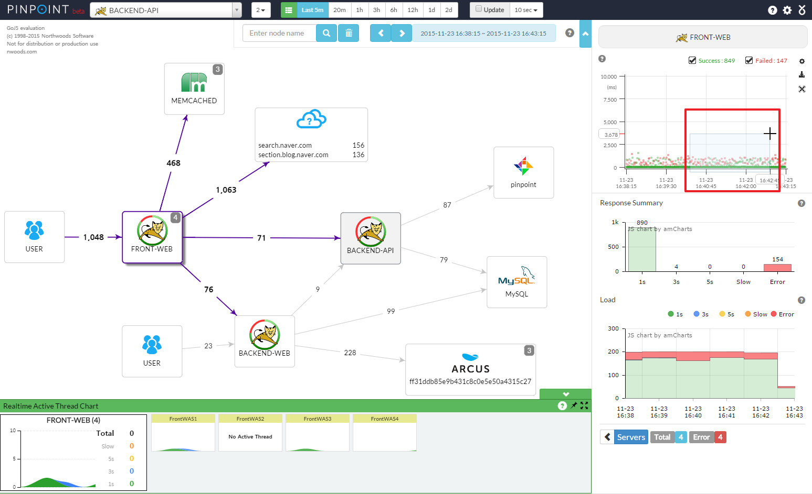

###### Skywalking

[Skywalking](https://github.com/apache/incubator-skywalking)是一个新晋的项目，最近一两年发展非常迅猛，本身支持OpenTracing规范，优秀的设计提供了良好的扩展性，支持Java、PHP、.Net、NodeJs探针，数据容器为ElasticSearch，其界面参考：

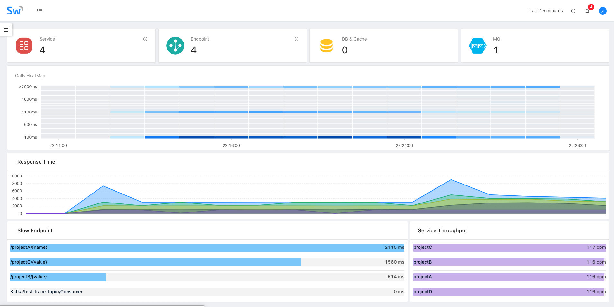

###### CAT

[CAT](https://github.com/dianping/cat)是由美团开源的一个APM项目，也历经了多年的迭代升级，拥有大量的企业级用户，对于监控和报警整合比较紧密，支持Java、C/C++、.Net、Python、Go、NodeJs，不过CAT目前主要通过侵入性的方式接入，数据容器包括HDFS（存储原始数据）和mysql（二次统计），其界面参考：

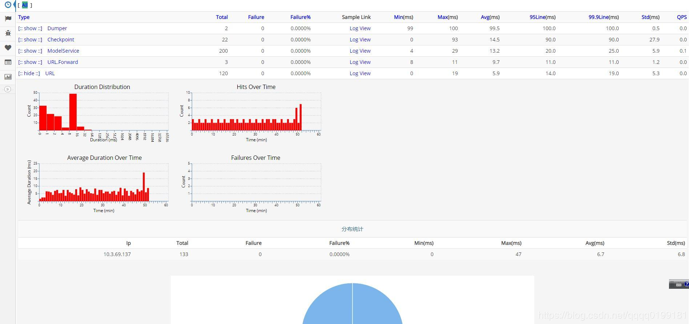

###### 横向对比

上面只是做了一个简介，那这三个项目各自有什么特色或者优势/劣势呢（三者的主要产品均针对Java，这里也主要针对Java的特性）？

- Pinpoint
  - 优势
    - 大企业/长时间验证，稳定性和完成度高
    - 探针收集的数据粒度比较细
    - HBase的数据密度较大，支持PB级别下的数据查询
    - 代码设计考虑的扩展性较弱，二次开发难度较大（探针为插件式，开发比较简单）
    - 拥有完整的APM和调用链跟踪功能
  - 劣势
    - 代码针对性强，扩展较难
    - 容器为HBase，查询功能较弱（主要为时间维度）
    - 探针的额外消耗较多（探针采集粒度细，大概10%~20%）
    - 项目趋于成熟，而扩展难度较大，目前社区活跃度偏低，基本只进行探针的增加或者升级
    - 缺少自定义指标的设计
- Skywalking
  - 优势
    - 数据容器为ES，查询支持的维度较多并且扩展潜力大
    - 项目设计采用微内核+插件，易读性和扩展性都比较强
    - 主要的研发人员为华人并且均比较活跃，能够进行更加直接的沟通
    - 拥有完整的APM和调用链跟踪功能
  - 劣势
    - 项目发展非常快，稳定性有待验证
    - ES数据密度较小，在PB级别可能会有性能压力
    - 缺少自定义指标的设计
- CAT
  - 优势
    - 大企业/长时间验证，稳定性和完成度高
    - 采用手动数据埋点而不是探针，数据采集的灵活性更强
    - 支持自定义指标
    - 代码设计考虑的扩展性较弱，并且数据结构复杂，二次开发难度较大
    - 拥有完善的监控告警机制
  - 劣势
    - 代码针对性强，扩展较难
    - 需要手动接入埋点，代码侵入性强
    - APM功能完善，但是不支持调用链跟踪

#### 基本组件

如果分别去看Pinpoint/Skywalking/CAT的整体设计，我们会发现三者更像是一个规范的三种实现，虽然各自有不同的机制和特性，但是从模块划分和功能基本是一致的：

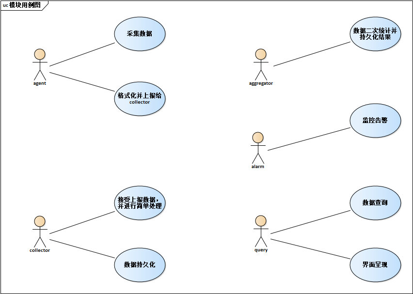

当然也有一些微小的区别：

- Pinpoint基本没有aggregator，同时query和alarm集成在了web中，只有agent，collector和web
- Skywalking则是把collector、aggregator、alarm集成为OAP（Observability Analysis Platform），并且可以通过集群部署，不同的实例可以分别承担collector或者aggregator+alarm的角色
- CAT则和Skywalking类似，把collector、aggregator、alarm集成为cat-consumer，而由于CAT有比较复杂的配置管理，所以query和配置一起集成为cat-home
- 当然最大的区别是Pinpoint和Skywalking均是通过javaagent做字节码的扩展，通过切面编程采集数据，类似于探针，而CAT的agent则更像是一个工具集，用于手动埋点

## Skywalking

前戏这么多，终于开始进入主题，介绍今天的主角：Skywalking，不过通过之前的铺垫，我们基本都知道了Skywalking期望解决的问题以及总体的结构，下面我们则从细节来看Skywalking是怎么一步一步实现的。

#### 模块构成

首先，Skywalking进行了精准的领域模型划分：

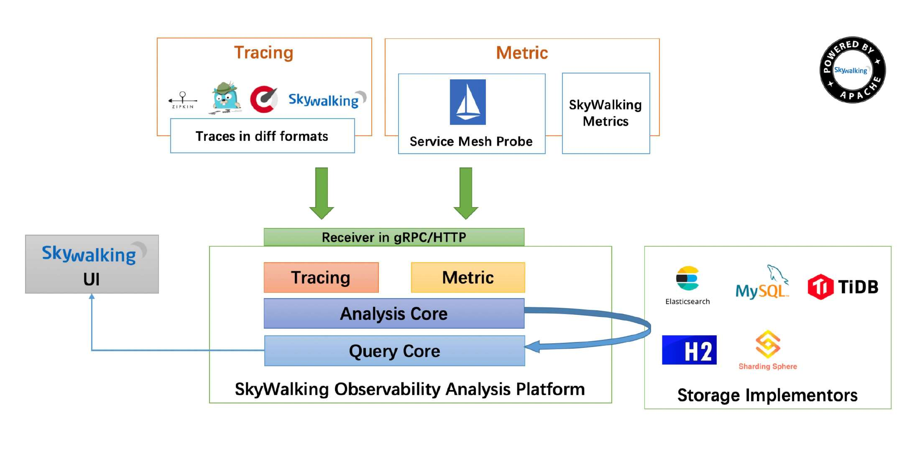

整个系统分为三部分：

- agent：采集tracing（调用链数据）和metric（指标）信息并上报
- OAP：收集tracing和metric信息通过analysis core模块将数据放入持久化容器中（ES，H2（内存数据库），mysql等等），并进行二次统计和监控告警
- webapp：前后端分离，前端负责呈现，并将查询请求封装为graphQL提交给后端，后端通过ribbon做负载均衡转发给OAP集群，再将查询结果渲染展示

而整个Skywalking（包括agent和OAP，而webapp后端业务非常简单主要就是认证和请求转发）均通过微内核+插件式的模式进行编码，代码结构和扩展性均非常强，具体设计可以参考： [从Skywalking看如何设计一个微核+插件式扩展的高扩展框架](https://linz.ink/skywalking/microcore/2018/11/26/how-to-build-micro-core-project-by-skywalking-style.html) ，Spring Cloud Gateway的GatewayFilterFactory的扩展也是通过这种plugin define的方式来实现的。

Skywalking也提供了其他的一些特性：

 - 配置重载：支持通过jvm参数覆写默认配置，支持动态配置管理
 - 集群管理：这个主要体现在OAP，通过集群部署分担数据上报的流量压力和二次计算的计算压力，同时集群也可以通过配置切换角色，分别面向数据采集（collector）和计算（aggregator，alarm），需要注意的是agent目前不支持多collector负载均衡，而是随机从集群中选择一个实例进行数据上报
 - 支持k8s和mesh
 - 支持数据容器的扩展，例如官方主推是ES，通过扩展接口，也可以实现插件去支持其他的数据容器
 - 支持数据上报receiver的扩展，例如目前主要是支持gRPC接受agent的上报，但是也可以实现插件支持其他类型的数据上报（官方默认实现了对Zipkin，telemetry和envoy的支持）
 - 支持客户端采样和服务端采样，不过服务端采样最有意义
 - 官方制定了一个数据查询脚本规范：OAL（Observability Analysis Language），语法类似Linq，以简化数据查询扩展的工作量
 - 支持监控预警，通过OAL获取数据指标和阈值进行对比来触发告警，支持webhook扩展告警方式，支持统计周期的自定义，以及告警静默防止重复告警

#### 数据容器

由于Skywalking并没有自己定制的数据容器或者使用多种数据容器增加复杂度，而是主要使用ElasticSearch（当然开源的基本上都是这样来保持简洁，例如Pinpoint也只使用了HBase），所以数据容器的特性以及自己数据结构基本上就限制了业务的上限，以ES为例：

 - ES查询功能异常强大，在数据筛选方面碾压其他所有容器，在数据筛选潜力巨大（Skywalking默认的查询维度就比使用HBase的Pinpoint强很多）
 - 支持sharding分片和replicas数据备份，在高可用/高性能/大数据支持都非常好
 - 支持批量插入，高并发下的插入性能大大增强
 - 数据密度低，源于ES会提前构建大量的索引来优化搜索查询，这是查询功能强大和性能好的代价，但是链路跟踪往往有非常多的上下文需要记录，所以Skywalking把这些上下文二进制化然后通过Base64编码放入data\_binary字段并且将字段标记为**not\_analyzed**来避免进行预处理建立查询索引

总体来说，Skywalking尽量使用ES在大数据和查询方面的优势，同时尽量减少ES数据密度低的劣势带来的影响，从目前来看，ES在调用链跟踪方面是不二的数据容器，而在数据指标方面，ES也能中规中矩的完成业务，虽然和时序数据库相比要弱一些，但在PB级以下的数据支持也不会有太大问题。

#### 数据结构

如果说数据容器决定了上限，那么数据结构则决定了实际到达的高度。Skywalking的数据结构主要为：

 - 数据维度（ES索引为skywalking_*_inventory)
   - service：服务
   - instance：实例
   - endpoint：接口
   - network_adress：外部依赖
 - 数据内容
   - 原始数据
     - 调用链跟踪数据（调用链的trace信息，ES索引为skywalking_segment，Skywalking主要的数据消耗都在这里）
     - 指标（主要是jvm或者envoy的运行时指标，例如ES索引skywalking_instance_jvm_cpu）
   - 二次统计指标
     - 指标（按维度/时间二次统计出来的例如pxx、sla等指标，例如ES索引skywalking_database_access_p75_month）
     - 数据库慢查询记录（数据库索引：skywalking_top_n_database_statement）
   - 关联关系（维度/指标之间的关联关系，ES索引为skywalking\_\*\_relation\_\*)
   - 特别记录
     - 告警信息（ES索引为skywalking_alarm_record）
     - 并发控制（ES索引为skywalking_register_lock）

其中数量占比最大的就是调用链跟踪数据和各种指标，而这些数据均可以通过OAP设置过期时间，以降低历史数据的对磁盘占用和查询效率的影响。

###### 调用链跟踪数据

作为Skywalking的核心数据，调用链跟踪数据（skywalking_segment）基本上奠定了整个系统的基础，而如果要详细的了解调用链跟踪的话，就不得不提到[openTracing](https://opentracing.io/)。

openTracing基本上是目前开源调用链跟踪系统的一个事实标准，它制定了调用链跟踪的基本流程和基本的数据结构，同时也提供了各个语言的实现。如果用一张图来表现openTracing，则是如下：

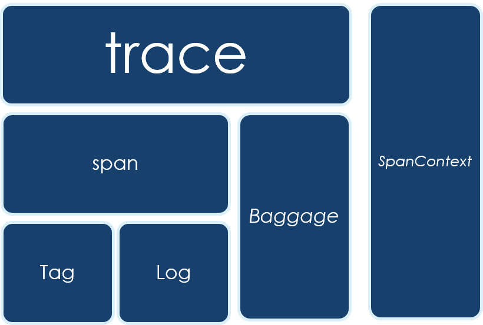

其中：

 - SpanContext：一个类似于MDC（Slfj)或者ThreadLocal的组件，负责整个调用链数据采集过程中的上下文保持和传递
 - Trace：一次调用的完整记录
   - Span：一次调用中的某个节点/步骤，类似于一层堆栈信息，Trace是由多个Span组成，Span和Span之间也有父子或者并列的关系来标志这个节点/步骤在整个调用中的位置
     - Tag：节点/步骤中的关键信息
     - Log：节点/步骤中的详细记录，例如异常时的异常堆栈
   - Baggage：和SpanContext一样并不属于数据结构而是一种机制，主要用于跨Span或者跨实例的上下文传递，Baggage的数据更多是用于运行时，而不会进行持久化

以一个Trace为例：

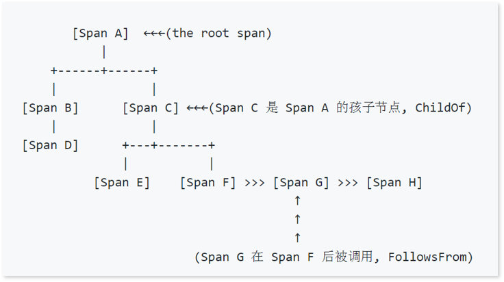

首先是外部请求调用A，然后A依次同步调用了B和C，而B被调用时会去同步调用D，C被调用的时候会依次同步调用E和F，F被调用的时候会通过异步调用G，G则会异步调用H，最终完成一次调用。

上图是通过Span之间的依赖关系来表现一个Trace，而在时间线上，则可以有如下的表达：

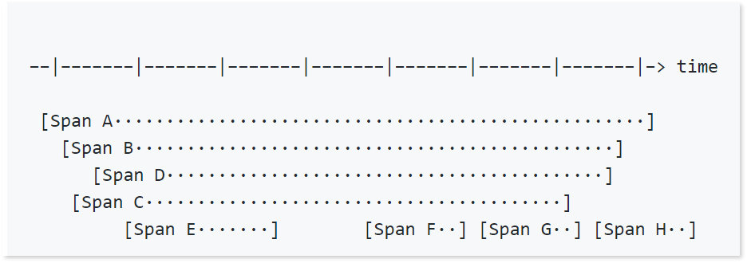

当然，如果是同步调用的话，父Span的时间占用是包括子Span的时间消耗的。

而落地到Skywalking中，我们以一条skywalking_segment的记录为例：

```
{
	"trace_id": "52.70.15530767312125341",
	"endpoint_name": "Mysql/JDBI/Connection/commit",
	"latency": 0,
	"end_time": 1553076731212,
	"endpoint_id": 96142,
	"service_instance_id": 52,
	"version": 2,
	"start_time": 1553076731212,
	"data_binary": "CgwKCjRGnPvp5eikyxsSXhD///////////8BGMz62NSZLSDM+tjUmS0wju8FQChQAVgBYCF6DgoHZGIudHlwZRIDc3FsehcKC2RiLmluc3RhbmNlEghyaXNrZGF0YXoOCgxkYi5zdGF0ZW1lbnQYAiA0",
	"service_id": 2,
	"time_bucket": 20190320181211,
	"is_error": 0,
	"segment_id": "52.70.15530767312125340"
}
```

其中：

 - trace_id：本次调用的唯一id，通过snowflake模式生成
 - endpoint_name：被调用的接口
 - latency：耗时
 - end_time：结束时间戳
 - endpoint_id：被调用的接口的唯一id
 - service_instance_id：被调用的实例的唯一id
 - version：本数据结构的版本号
 - start_time：开始时间戳
 - data_binary：里面保存了本次调用的所有Span的数据，序列化并用Base64编码，不会进行分析和用于查询
 - service_id：服务的唯一id
 - time_bucket：调用所处的时段
 - is_error：是否失败
 - segment_id：数据本身的唯一id，类似于主键，通过snowflake模式生成

这里可以看到，目前Skywalking虽然相较于Pinpoint来说查询的维度要多一些，但是也很有限，而且除了endPoint，并没有和业务有关联的字段，只能通过时间/服务/实例/接口/成功标志/耗时来进行非业务相关的查询，如果后续要增强业务相关的搜索查询的话，应该还需要增加一些用于保存动态内容（如messageId，orderId等业务关键字）的字段用于快速定位。

###### 指标

指标数据相对于Tracing则要简单得多了，一般来说就是指标标志、时间戳、指标值，而Skywalking中的指标有两种：一种是采集的原始指标值，例如jvm的各种运行时指标（例如cpu消耗、内存结构、GC信息等）；一种是各种二次统计指标（例如tp性能指标、SLA等，当然也有为了便于查询的更高时间维度的指标，例如基于分钟、小时、天、周、月）

例如以下是索引skywalking_endpoint_cpm_hour中的一条记录，用于标志一个小时内某个接口的cpm指标：

```
{
	"total": 8900,
	"service_id": 5,
	"time_bucket": 2019031816,
	"service_instance_id": 5,
	"entity_id": "7",
	"value": 148
}
```

各个字段的释义如下：

 - total：一分钟内的调用总量
 - service_id：所属服务的唯一id
 - time_bucket：统计的时段
 - service_instance_id：所属实例的唯一id
 - entity_id：接口（endpoint）的唯一id
 - value：cpm的指标值（cpm=call per minute，即total/60）

#### 工程实现

Skywalking的工程实现堪比Dubbo，框架设计和代码质量都达到非常高的水准，以dubbo为例，即使2012年发布的老版本放到当今，其设计和编码看起来也依然赏心悦目，设计简洁但是覆盖了所有的核心需求，同时又具备非常强的扩展性，二次开发非常简单，然而却又不会像Spring那样过度封装（当然Spring作为一个更加高度通用的框架，更高的封装也是有必要的）导致代码阅读异常困难。

###### agent

agent（apm-sniffer）是Skywalking的Java探针实现，主要负责：

 - 采集应用实例的jvm指标
 - 通过切向编程进行数据埋点，采集调用链数据
 - 通过RPC将采集的数据上报

当然，agent还实现了客户端采样，不过在APM监控系统里进行客户端数据采样都是没有灵魂的，所以这里就不再赘述了。

首先，agent通过 *org.apache.skywalking.apm.agent.core.boot.BootService* 实现了整体的插件化，agent启动会加载所有的BootService实现，并通过 *ServiceManager* 来管理这些插件的生命周期，采集jvm指标、gRPC连接管理、调用链数据维护、数据上报OAP这些服务均是通过这种方式扩展。

然后，agent还通过bytebuddy以javaagent的模式，通过字节码增强的机制来构造AOP环境，再提供PluginDefine的规范方便探针的开发，最终实现非侵入性的数据埋点，采集调用链数据。

最终落地到代码上则异常清晰：


```
//通过bytebuddy的AgentBuilder构造javaagent增强classLoader
new AgentBuilder.Default(byteBuddy)
    .ignore( //忽略这些包的内容，不进行增强
        nameStartsWith("net.bytebuddy.")
        .or(nameStartsWith("org.slf4j."))
        .or(nameStartsWith("org.apache.logging."))
        .or(nameStartsWith("org.groovy."))
        .or(nameContains("javassist"))
        .or(nameContains(".asm."))
        .or(nameStartsWith("sun.reflect"))
        .or(allSkyWalkingAgentExcludeToolkit())
        .or(ElementMatchers.<TypeDescription>isSynthetic()))
    //通过pluginFinder加载所有的探针扩展，并获取所有可以增强的class
    .type(pluginFinder.buildMatch())
    //按照pluginFinder的实现，去改变字节码增强类
    .transform(new Transformer(pluginFinder))
    //通过listener订阅增强的操作记录，方便调试
    .with(new Listener())
    .installOn(instrumentation);

try {
    //加载所有的service实现并启动
    ServiceManager.INSTANCE.boot();
} catch (Exception e) {
    logger.error(e, "Skywalking agent boot failure.");
}
```

agent也提供了非常简单的扩展实现机制，以增强一个普通类的方法为例，首先你需要定义一个切向点：

```
public interface InstanceMethodsInterceptPoint {

    //定义切向方法的适配器，符合适配器的class将被增强
    ElementMatcher<MethodDescription> getMethodsMatcher();

    //增强的具体实现类，classReference
    String getMethodsInterceptor();

    //是否重写参数
    boolean isOverrideArgs();
}
```

然后你还需要一个增强的实现类：

```
public interface InstanceMethodsAroundInterceptor {

    //方法真正执行前执行
    void beforeMethod(EnhancedInstance objInst, Method method, Object[] allArguments, Class<?>[] argumentsTypes,
        MethodInterceptResult result) throws Throwable;

    //方法真正执行后执行
    Object afterMethod(EnhancedInstance objInst, Method method, Object[] allArguments, Class<?>[] argumentsTypes,
        Object ret) throws Throwable;

    //当异常发生时执行
    void handleMethodException(EnhancedInstance objInst, Method method, Object[] allArguments,
        Class<?>[] argumentsTypes,
        Throwable t);
}
```

一般在执行前和执行后进行数据埋点，就可以采集到想要的数据，当然实际编程要稍微复杂一点，不过官方也实现了对应的abstract类和数据埋点工具类，所以探针的二次开发在Skywalking这个级别确实是非常简单，只需要处理好资源占用和并发问题即可。真正的难点是要对需要增强的对象非常了解，熟悉其运作机制，才能找准切向点，既要所有的流程都需要经过这个点，又可以抓取到期望抓取的上下文信息。同时，多版本的适配和测试也是非常大的工作量，官方虽然提供witness的机制（通过验证某个class是否存在来验证版本），但是作为影响全局的探针，开发和测试都是需要慎之又慎的。

###### OAP

同agent类似，OAP作为Skywalking最核心的模块，也实现了自己的扩展机制，不过在这里叫做Module，具体可以参考library-module，在module的机制下，Skywalking实现了自己必须核心组件：

 - core：整个OAP核心业务（remoting、cluster、storage、analysis、query、alarm）的规范和接口
 - cluster：集群管理的具体实现
 - storage：数据容器的具体实现
 - query：为前端提供的查询接口的具体实现
 - receiver：接收探针上报数据的接收器的具体实现
 - alarm：监控告警的具体实现

以及一个可选组件：

 - telemetry：用于监控OAP自身的健康状况

而前面提到的OAP的高扩展性则体现在核心业务的规范均定义在了core中，如果有需要自己扩展的，只需要自己单独做自己的实现，而不需要做侵入式的改动，最典型的示例则是官方支持的storage，不仅支持单机demo的内存数据库H2和经典的ES，连目前开源的Tidb都可以接入。

## 初步实践

对于Skywalking的实践我们经历了三个阶段

 - 线下测试
 - 第一次生产环境小规模测试
 - 第二次生产环境小规模测试+全量接入

#### 线下测试

###### 环境

由于是线下测试，所以我们直接使用物理机（E5-2680v2 x2, 128G)虚拟了一个集群（实际性能相比云服务器应该偏好一些）：

 - ES：单机实例，v6.5，4C8G，jvm内存分配为4G
 - OAP：单机实例，v6.1.0-SNAPSHOT，4C8G，jvm内存分配为4G
 - 应用：基于SpringCloud的4个测试实例,调用关系为A->B->C->D，QPS为200

###### 测试结果

拓扑图：

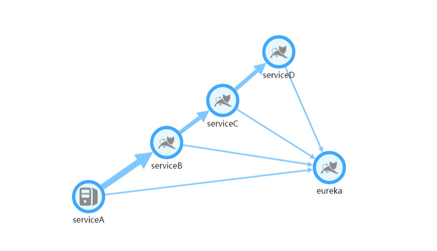

OAP机器监控：

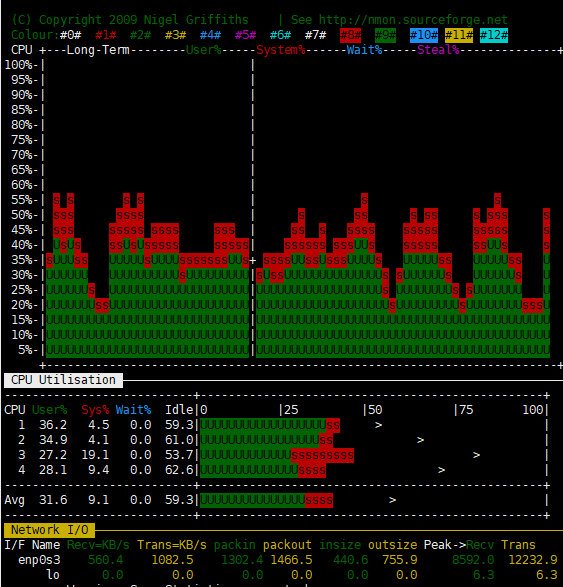

ES机器监控：

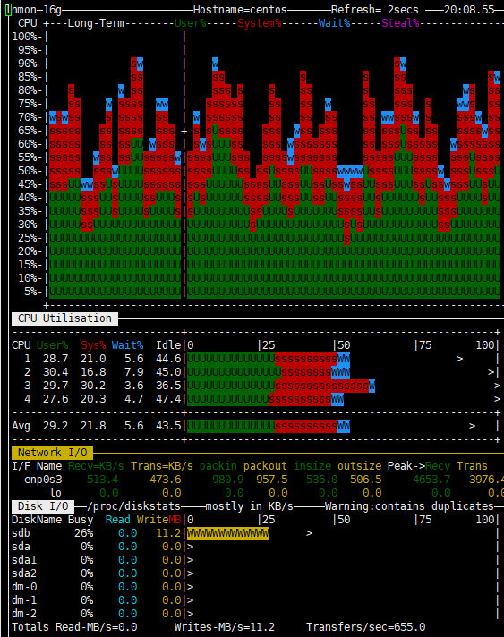

服务监控面板：

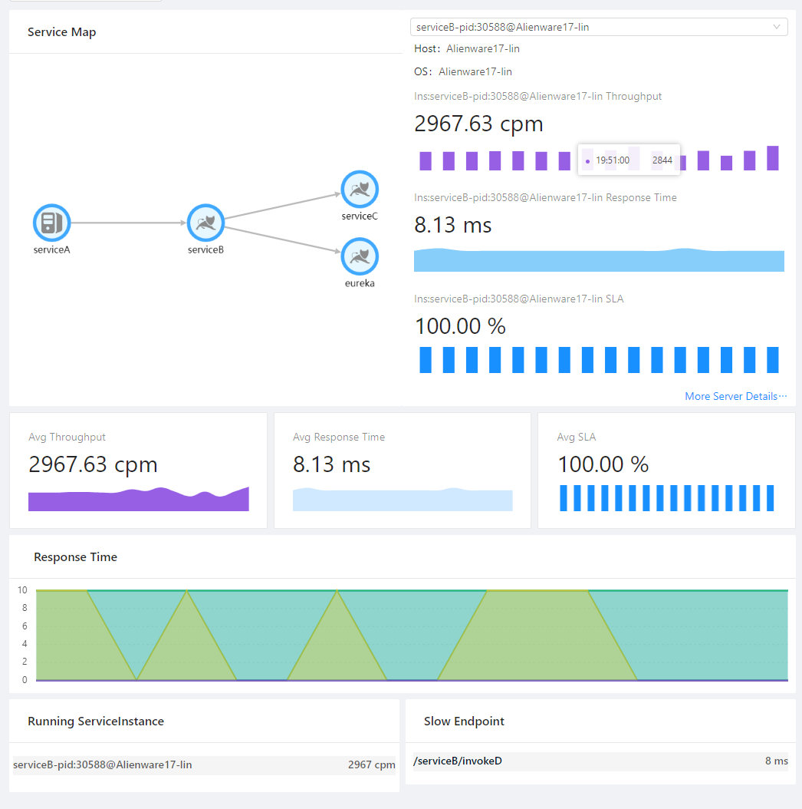

其中一个调用链记录：

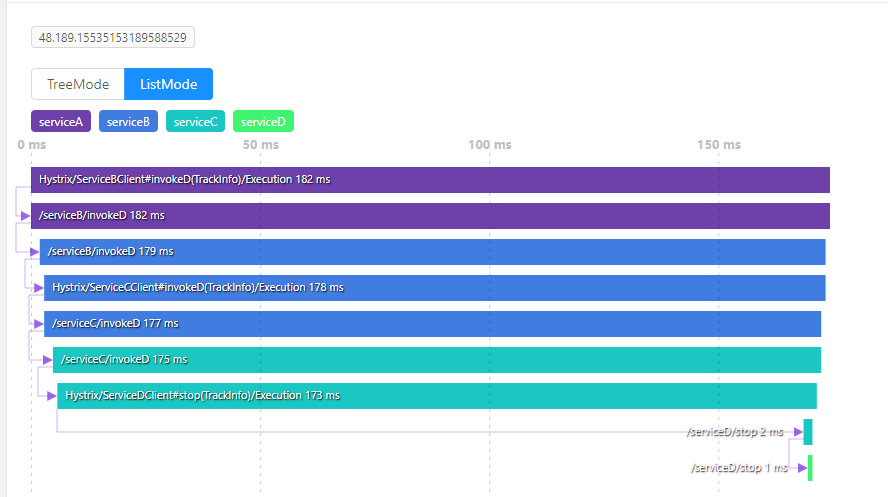

可以看出，Skywalking非常依赖CPU（不论是OAP还是ES），同时对于网络IO也有一定的要求，至于ES的文件IO在可接受范围内，毕竟确实有大量内容需要持久化。测试结果也基本达到预期要求，调用链和各个指标的监控都工作良好。

#### 第一次生产环境测试

在线下测试之后，我们再进行了一次基于实际业务针对探针的测试，测试没有发现探针的异常问题，也没有影响业务的正常运作，同时对于jvm实例影响也不是很大，CPU大概提高了5%左右，并不很明显。在这个基础上我们选择了线上的一台服务器，进行了我们第一次生产环境的测试。

###### 环境

 - ES：基于现有的一个ES集群，node x 3，v6.0
 - OAP：2C4G x 2，v6.1.0-SNAPSHOT，jvm内存分配为2G
 - 应用：两个jvm实例

测试时间：03.11-03.16

###### 测试结果

业务机器负载情况：

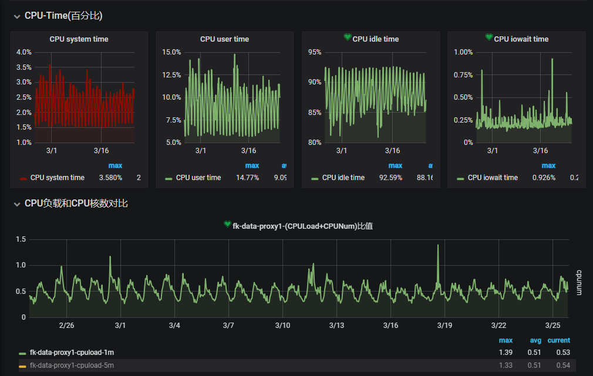

从最敏感的CPU指标上来看，增加agent并没有导致可见的CPU使用率的变化，而其他的内存、网络IO、连接数也基本没有变化。

OAP负载情况：

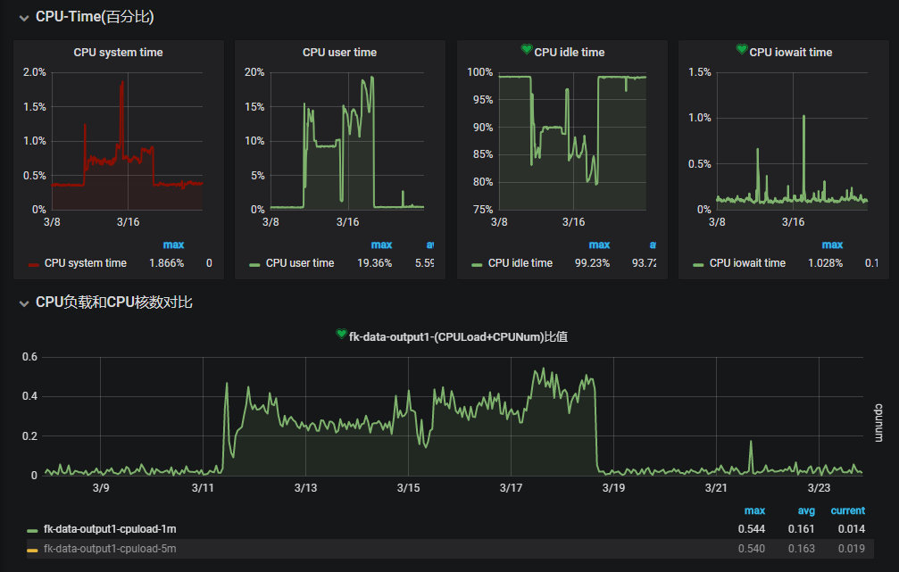

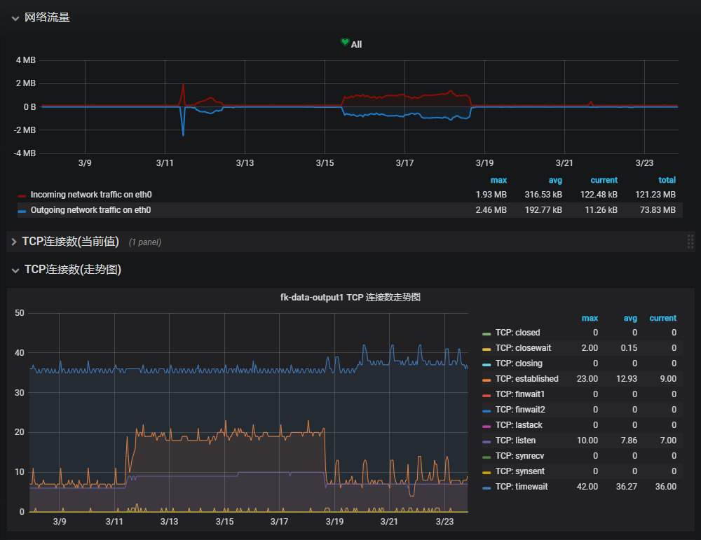

可以看到机器的CPU和网络均有较大的波动，但是也都没有真正打爆服务器，但是我们的实例却经常出现两种日志：

> One trace segment has been abandoned, cause by buffer is full.

> Collector traceSegment service doesn't response in xxx seconds.

通过阅读源码发现：

 - agent和OAP只会使用一个长连接阻塞式的交换数据，如果某次数据交换没有得到响应，则会阻塞后续的上报流程（一般长连接的RPC请求会在数据传输期间互相阻塞，但是不会在等待期间互相阻塞，当然这也是源于agent并没有并发上报的机制），所以一旦OAP在接收数据的过程中发生阻塞，就会导致agent本地的缓冲区满，最终只能将监控数据直接丢弃防止内存泄漏

而导致OAP没有及时响应的一方面是OAP本身性能不够（OAP需要承担大量的二次统计工作，通过Jstack统计，长期有超过几十个线程处于RUNNABLE状态，据吴晟描述目前OAP都是高性能模式，后续将会提供配置来支持低性能模式），另一方面可能是ES批量插入效率不够，因此我们修改了OAP的批量插入参数来增加插入频率，降低单次插入数量：

 - bulkActions: ${SW_STORAGE_ES_BULK_ACTIONS:2000 -> 20} # Execute the bulk every 2000 requests
 - bulkSize: ${SW_STORAGE_ES_BULK_SIZE:20 -> 2} # flush the bulk every 20mb
 - flushInterval: ${SW_STORAGE_ES_FLUSH_INTERVAL:10 -> 2} # flush the bulk every 10 seconds whatever the number of requests

虽然 *service doesn't response* 出现的频率明显降低，但是依然还是会偶尔出现，而每一次出现都会伴随大量的  *trace segment has been abandoned* ，推测OAP和ES可能都存在性能瓶颈（应该进行更进一步的诊断确定问题，不过当时直接和吴晟沟通，确认确实OAP非常消耗CPU资源，考虑到当时部署只是2C，并且还部署有其他业务，就没有进一步的测试）。

同时，在频繁的数据丢弃过程中，也偶发了一个bug：当agent上报数据超时并且大量丢弃数据之后，即使后续恢复正常也能通过日志看到数据正常上报，在查询界面查询的时候，会查不到这个实例上报的数据，不过在重启OAP和agent之后，之前上报的数据又能查询到，这个也和吴晟沟通过，没有其他的案例，后续想重现却也一直没有成功。

而同时还发现两个更加严重的问题：

 - 我们使用的是线上已经部署好的ES集群，其版本只有6.0，而新的Skywalking使用了6.3的查询特性，导致很多查询执行报错，只能使用最简单的查询
 - 我们的kafka集群版本也非常古老，不支持v1或者更高版本的header，而kafka的探针强依赖header来传输上下文信息，导致kafka客户端直接报错影响业务，所以也立即移除了kafka的探针

在这一次测试中，我们基本确认了agent对于应用的影响，同时也发现了一些我们和Skywalking的一些问题，留待后续测试确认。

#### 第二次生产环境测试

为了排除性能和ES版本的影响，测试Skywalking本身的可用性，参考吴晟的建议（这也是在最初技术选型的时候没有选择Pinpoint和CAT的部分原因：一方面Skywalking的功能符合我们的要求，更重要的是有更加直接和效率的和项目维护者直接沟通的渠道），所以这一次我们新申请了ES集群和OAP机器。

###### 环境

 - ES：腾讯云托管ES集群，4C16G x 3 SSD，v6.4
 - OAP：16C32G，standalone，jvm分配24G
 - 应用：2~8个jvm实例

测试时间：03.18-至今

###### 测试结果

OAP负载情况：

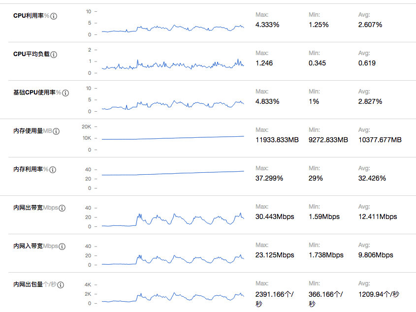

ES集群负载：

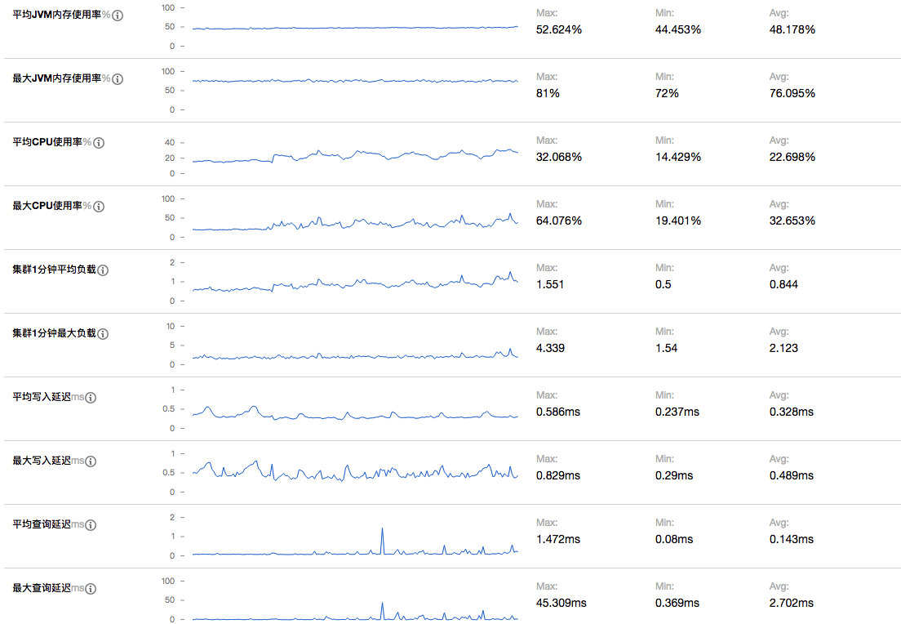

测试过程中，我们先接入了一台机器上的两个实例，完全没有遇到一测中的延迟或者数据丢弃的问题，三天后我们又接入了另外两台机器的4个实例，这之后两天我们又接入了另外两台机器的2个实例。依然没有遇到一测中的延迟或者数据丢弃的问题。

而ES负载的监控也基本验证了一测延迟的问题，Skywalking由于较高的并发插入，对于ES的性能压力很大（批量插入时需要针对每条数据分析并且构建查询索引），大概率是ES批量插入性能不够导致延迟，考虑到我们仅仅接入了8个实例，日均segment插入量大概5000万条（即日均5000万次独立调用），如果想支持更大规模的监控，对于ES容量规划势必要留够足够的冗余。同时OAP和ES集群的网络开销也不容忽视，在支撑大规模的监控时，需要集群并且receiver和aggregattor分离部署来分担网络IO的压力。

而在磁盘容量占用上，我们设置的原始数据7天过期，目前刚刚开始滚动过期，目前segment索引已经累计了314757240条记录总计158G数据，当然我们目前异常记录较少，如果异常记录较多的话，其磁盘开销将会急剧增加（span中会记录异常堆栈信息）。而由于选择的SSD，磁盘的写入和查询性能都很高，即使只有3个节点，也完全没有任何压力。

而在新版本的ES集群下，Skywalking的所有查询功能都变得可用，和我们之前自己的单独编写的异常指标监控都能完美对照。当然我们也遇到一个问题：Skywalking仅采集了调用记录，但是对于调用过程中的过程数据，除了异常堆栈其他均没有采集，导致真的出现异常也缺少充足的上下文信息还原现场，于是我们扩展了Skywalking的两个探针（我们项目目前重度依赖的组件）：OkHttp（增加对requestBody和responseBody的采集）和SpringMVC（增加了对requestBody的采集），目前工作正常，如果进一步的增加其他的探针，采集到足够的数据，那么我们基本可以脱离ELK了。

而OAP方面，CPU和内存的消耗远远低于预期的估计，CPU占用率一直较低，而分配的24G内存也仅使用了10+G，完全可以支持更大规模的接入量，不过在网络IO方面可能存在一定的风险，推测应该8C16G的容器就足以支持十万CPM级别的数据接入。

当然我们在查询也遇到了一些瓶颈，最大的问题就是无法精确的命中某一条调用记录，就如前面的分析，因为segment的数据结构问题，无法进行面向业务的查询（例如messageId、requestId、orderId等），所以如果想精确匹配某一次调用请求，需要通过各个维度的条件约束慢慢缩小范围最后定位。

## Skywalking展望

通过上述对Skywalking的剖析和实践，Skywalking确实是一个优秀的APM+调用链跟踪监控系统，能够覆盖大部分使用场景，让研发和运维能够更加实时/准实时的了解线上服务的运行情况。当然Skywailking也不是尽善尽美，例如下面就是个人觉得目前可见的不满足我们期望的：

 - 数据准实时通过gRPC上报，本地缓存的瓶颈（当然官方主要是为了简化模型，减少依赖，否则Skywalking还依赖ELK就玩得有点大了）
   - 缓存队列的长度，过长占据内存，过短容易buffer满丢弃数据
   - 优雅停机同时又不丢失缓存
 - 数据上报需要在起点上报，链路回传的时候需要携带SPAN及子SPAN的信息，当链路较长或者SPAN保存的信息较多时，会额外消耗一定的带宽
 - skywalking更多是一个APM系统而不是分布式调用链跟踪系统
   - 在整个链路的探针上均缺少输入输出的抓取
   - 在调用链的筛查上并没用进行增强，并且体现在数据结构的设计，例如TAG信息均保存在SPAN信息中，而SPAN信息均被BASE64编码作为数据保存，无法检索，最终trace的筛查只能通过时间/traceId/service/endPoint/state进行非业务相关的搜索
 - skywalking缺少对三方接口依赖的指标，这个对于系统稳定往往非常重要

而作为一个初级的使用者，个人觉得我们可以使用有限的人力在以下方向进行扩展：

 - 增加receiver：整合ELK，通过日志采集采集数据，降低异构系统的采集开发成本
 - 优化数据结构，提供基于业务关键数据的查询接口
 - 优化探针，采集更多的业务数据，争取代替传统的ELK日志简单查询，绝大部分异常诊断和定位均可以通过Skywalking即可完成
 - 增加业务指标监控的模式，能够自定义业务指标（目前官方已经在实现 [Metric Exporter](https://github.com/apache/incubator-skywalking/blob/master/docs/en/setup/backend/metric-exporter.md) ）
