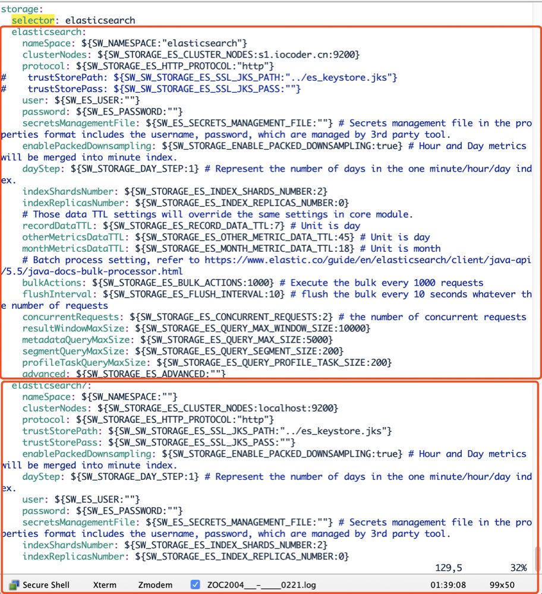
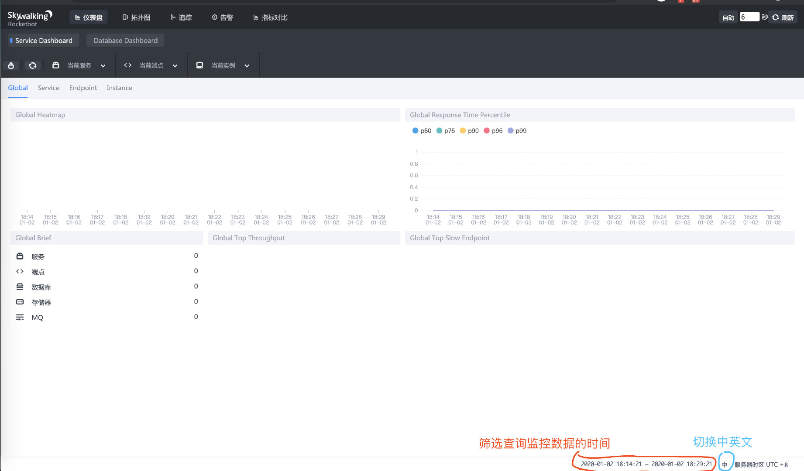
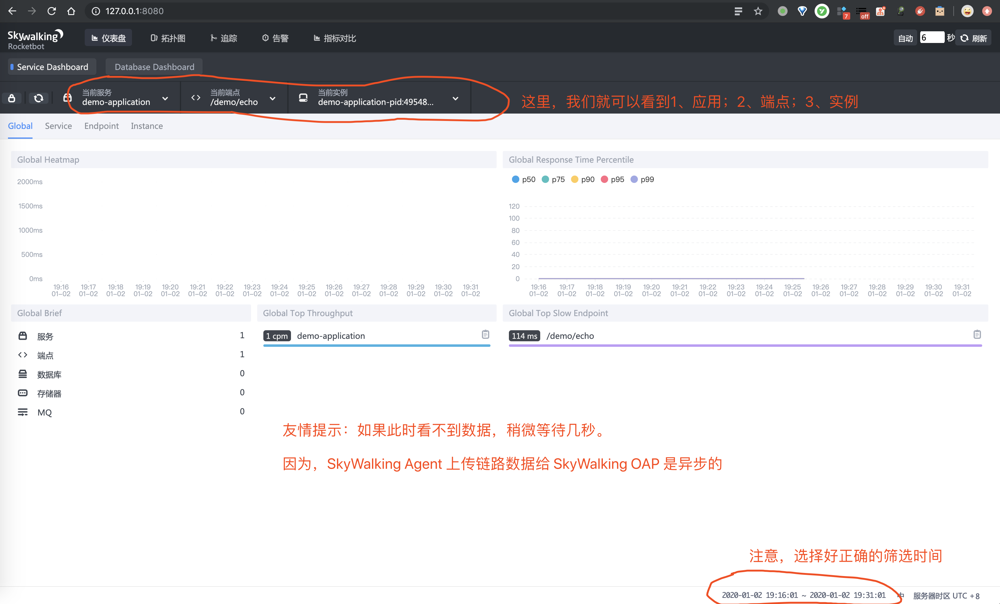
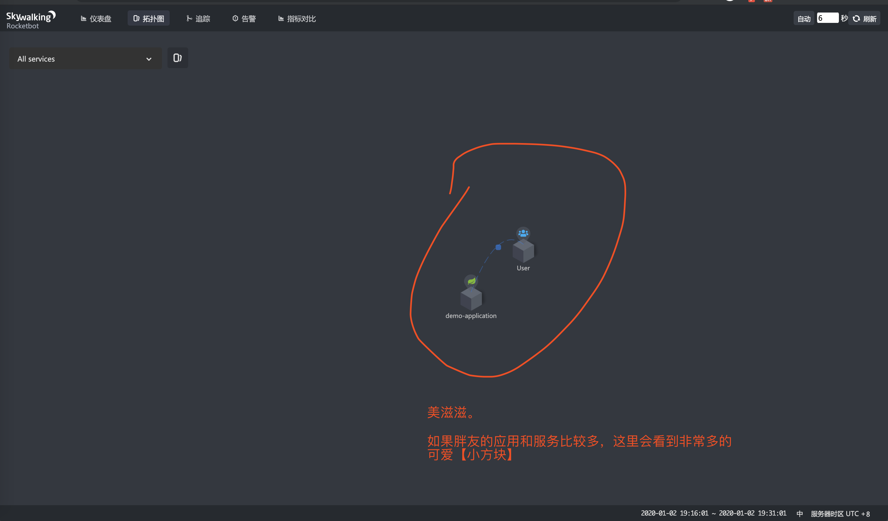
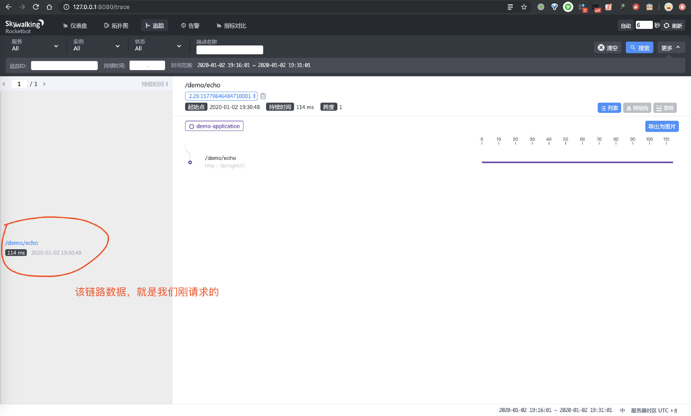
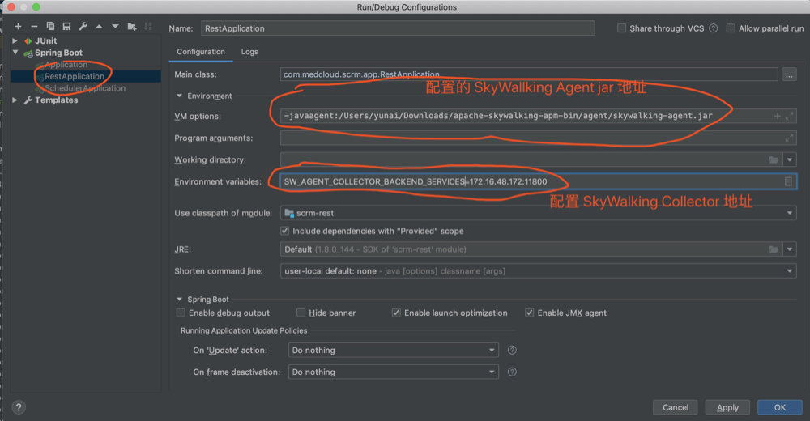
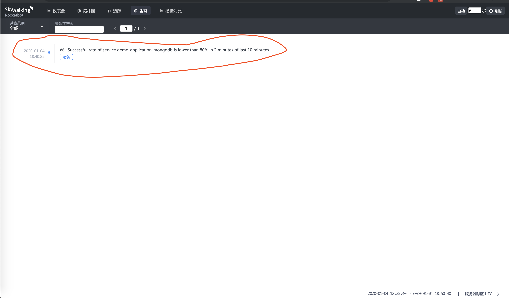

目录：

- [1. 概述](#)
- [2. 搭建 SkyWalking 单机环境](#)
- [3. 搭建 SkyWalking 集群环境](#)
- [4. 告警](#)
- [5. 注意事项](#)
- [6. Spring Boot 使用示例](#)
- [6. Spring Cloud 使用示例](#)

> - 作者：[芋道源码](https://github.com/YunaiV)
> - [原文地址](http://www.iocoder.cn/SkyWalking/install/?skywalkinng)


# 1. 概述

## 1.1 概念

SkyWalking 是什么？

> FROM <http://skywalking.apache.org/>
>
> 分布式系统的应用程序性能监视工具，专为微服务、云原生架构和基于容器（Docker、K8s、Mesos）架构而设计。
>
> 提供分布式追踪、服务网格遥测分析、度量聚合和可视化一体化解决方案。

## 1.2 功能列表

SkyWalking 有哪些功能？

> FROM <http://skywalking.apache.org/>
>
> * 多种监控手段。可以通过语言探针和 service mesh 获得监控是数据。
> * 多个语言自动探针。包括 Java，.NET Core 和 Node.JS。
> * 轻量高效。无需大数据平台，和大量的服务器资源。
> * 模块化。UI、存储、集群管理都有多种机制可选。
> * 支持告警。
> * 优秀的可视化解决方案。

## 1.3 整体架构

SkyWalking 整体架构如何？

> FROM <http://skywalking.apache.org/>
>
> 

整个架构，分成上、下、左、右四部分：

> 考虑到让描述更简单，我们舍弃掉 Metric 指标相关，而着重在 Tracing 链路相关功能。

* 上部分 **Agent** ：负责从应用中，收集链路信息，发送给 SkyWalking OAP 服务器。目前支持 SkyWalking、Zikpin、Jaeger 等提供的 Tracing 数据信息。而我们目前采用的是，SkyWalking Agent 收集 SkyWalking Tracing 数据，传递给服务器。
* 下部分 **SkyWalking OAP** ：负责接收 Agent 发送的 Tracing 数据信息，然后进行分析(Analysis Core) ，存储到外部存储器( Storage )，最终提供查询( Query )功能。
* 右部分 **Storage** ：Tracing 数据存储。目前支持 ES、MySQL、Sharding Sphere、TiDB、H2 多种存储器。而我们目前采用的是 ES ，主要考虑是 SkyWalking 开发团队自己的生产环境采用 ES 为主。
* 左部分 **SkyWalking UI** ：负责提供控台，查看链路等等。

## 1.4 官方文档

在 <https://github.com/apache/skywalking/tree/master/docs> 地址下，提供了 SkyWalking 的**英文**文档。

考虑到大多数胖友的英语水平和艿艿不相伯仲，再加上胖友一开始对 SkyWalking 比较陌生，所以比较推荐先阅读 <https://github.com/SkyAPM/document-cn-translation-of-skywalking> 地址，提供了 SkyWalking 的**中文**文档。

考虑到胖友使用 SkyWalking 的目的，是实现**分布式链路追踪**的功能，所以最好去了解下相关的知识。这里推荐阅读两篇文章：

* [《OpenTracing 官方标准 —— 中文版》](https://github.com/opentracing-contrib/opentracing-specification-zh)
* Google 论文 [《Dapper，大规模分布式系统的跟踪系统》](http://www.iocoder.cn/Fight/Dapper-translation/?self)

# 2. 搭建 SkyWalking 单机环境

考虑到让胖友更快的入门，我们来搭建一个 SkyWalking **单机**环境，步骤如下：


* 第一步，搭建一个 Elasticsearch 服务。
* 第二步，下载 SkyWalking 软件包。
* 第三步，搭建一个 SkyWalking OAP 服务。
* 第四步，启动一个 Spring Boot 应用，并配置 SkyWalking Agent。
* 第五步，搭建一个 SkyWalking UI 服务。

仅仅五步，按照艿艿标题党的性格，应该给本文取个《10 分钟快速搭建 SkyWalking 服务》标题才对，哈哈哈。

## 2.1 Elasticsearch 搭建

> FROM <https://www.elastic.co/cn/products/elasticsearch>
>
> Elasticsearch 是一个分布式、RESTful 风格的搜索和数据分析引擎，能够解决不断涌现出的各种用例。 作为 Elastic Stack 的核心，它集中存储您的数据，帮助您发现意料之中以及意料之外的情况。

参考[《Elasticsearch 极简入门》](http://www.iocoder.cn/Elasticsearch/install/?self)的[「1. 单机部署」](#)小节，搭建一个 Elasticsearch 单机服务。

不过要**注意**，本文使用的是 Elasticsearch `7.5.1` 版本。因为 SkyWalking [`6.6.0`](https://github.com/apache/skywalking/releases/tag/v6.6.0) 版本，增加了对 Elasticsearch 7.X 版本的支持。当然，如果胖友使用 Elasticsearch 6.X 版本也是可以的。

## 2.2 下载 SkyWalking 软件包

对于 SkyWalking 的软件包，有两种方式获取：

* 手动编译
* 官方包

一般情况下，我们建议使用**官方包**。手动编译，更多是尝鲜或者等着急修复的 BUG 的版本。

### 2.2.1 官方包

在 <http://skywalking.apache.org/downloads/> 下，我们下载**操作系统**对应的发布版。

这里，我们选择 [Binary Distribution for ElasticSearch 7 (Linux)](https://www.apache.org/dyn/closer.cgi/skywalking/6.6.0/apache-skywalking-apm-es7-6.6.0.tar.gz) 版本，因为艿艿是 Mac 环境，再加上想使用 Elasticsearch 7.X 版本作为存储。如果胖友想用 Elasticsearch 6.X 版本作为存储，记得下载 [Binary Distribution (Linux)](https://www.apache.org/dyn/closer.cgi/skywalking/6.6.0/apache-skywalking-apm-6.6.0.tar.gz) 版本。

**① 下载**：

```shell
# 创建目录
$ mkdir -p /Users/yunai/skywalking
$ cd /Users/yunai/skywalking

# 下载
$ wget http://mirror.bit.edu.cn/apache/skywalking/6.6.0/apache-skywalking-apm-es7-6.6.0.tar.gz
```

**② 解压**：

```shell
# 解压
$ tar -zxvf apache-skywalking-apm-es7-6.6.0.tar.gz
$ cd  apache-skywalking-apm-bin-es7

$ ls -ls
 4 drwxr-xr-x 8 root root  4096 Sep  9 15:09 agent # SkyWalking Agent
 4 drwxr-xr-x 2 root root  4096 Sep  9 15:44 bin # 执行脚本
 4 drwxr-xr-x 2 root root  4096 Sep  9 15:44 config # SkyWalking OAP Server 配置文件
32 -rwxr-xr-x 1 root root 28903 Sep  9 14:32 LICENSE
 4 drwxr-xr-x 3 root root  4096 Sep  9 15:44 licenses
32 -rwxr-xr-x 1 root root 31850 Sep  9 14:32 NOTICE
16 drwxr-xr-x 2 root root 16384 Sep  9 15:22 oap-libs # SkyWalking OAP Server
 4 -rw-r--r-- 1 root root  1978 Sep  9 14:32 README.txt
 4 drwxr-xr-x 2 root root  4096 Sep  9 15:44 webapp # SkyWalking UI
```

### 2.2.2 手动编译

> 友情提示：如果胖友没有编译 SkyWalking 源码的诉求，可以跳过本小节。

参考 [How to build project](https://github.com/apache/skywalking/blob/v6.3.0/docs/en/guides/How-to-build.md) 文章。

需要前置安装如下：

* GIT
* JDK 8+
* Maven

**① 克隆代码**：

```shell
$ git clone https://github.com/apache/skywalking.git
```

* 因为网络问题，可能克隆会有点久。

**② 初始化子模块**：

```shell
$ cd skywalking
$ git submodule init
$ git submodule update
```

**③ 编译**

```shell
$ ./mvnw clean package -DskipTests
```

* 编译过程，如果机子比较差，花费时间会比较久。

**④ 查看编译结果**

```shell
$ cd apm-dist # 编译结果目录
$ cd target
$ tar -zxvf apache-skywalking-apm-bin.tar.gz # 解压 Linux 包
$ cd apache-skywalking-apm-bin
$ ls -ls
 4 drwxr-xr-x 8 root root  4096 Sep  9 15:09 agent # SkyWalking Agent
 4 drwxr-xr-x 2 root root  4096 Sep  9 15:44 bin # 执行脚本
 4 drwxr-xr-x 2 root root  4096 Sep  9 15:44 config # SkyWalking OAP Server 配置文件
32 -rwxr-xr-x 1 root root 28903 Sep  9 14:32 LICENSE
 4 drwxr-xr-x 3 root root  4096 Sep  9 15:44 licenses
32 -rwxr-xr-x 1 root root 31850 Sep  9 14:32 NOTICE
16 drwxr-xr-x 2 root root 16384 Sep  9 15:22 oap-libs # SkyWalking OAP Server
 4 -rw-r--r-- 1 root root  1978 Sep  9 14:32 README.txt
 4 drwxr-xr-x 2 root root  4096 Sep  9 15:44 webapp # SkyWalking UI
```

## 2.3 SkyWalking OAP 搭建

**① 修改 OAP 配置文件**

> 友情提示：如果配置文件，适合 SkyWalking 6.X 版本。

```YAML
$ vi config/application.yml

storage:
  elasticsearch7:
    nameSpace: ${SW_NAMESPACE:"elasticsearch"}
    clusterNodes: ${SW_STORAGE_ES_CLUSTER_NODES:localhost:9200}
    protocol: ${SW_STORAGE_ES_HTTP_PROTOCOL:"http"}
#    trustStorePath: ${SW_SW_STORAGE_ES_SSL_JKS_PATH:"../es_keystore.jks"}
#    trustStorePass: ${SW_SW_STORAGE_ES_SSL_JKS_PASS:""}
    user: ${SW_ES_USER:""}
    password: ${SW_ES_PASSWORD:""}
    indexShardsNumber: ${SW_STORAGE_ES_INDEX_SHARDS_NUMBER:2}
    indexReplicasNumber: ${SW_STORAGE_ES_INDEX_REPLICAS_NUMBER:0}
    # Those data TTL settings will override the same settings in core module.
    recordDataTTL: ${SW_STORAGE_ES_RECORD_DATA_TTL:7} # Unit is day
    otherMetricsDataTTL: ${SW_STORAGE_ES_OTHER_METRIC_DATA_TTL:45} # Unit is day
    monthMetricsDataTTL: ${SW_STORAGE_ES_MONTH_METRIC_DATA_TTL:18} # Unit is month
    # Batch process setting, refer to https://www.elastic.co/guide/en/elasticsearch/client/java-api/5.5/java-docs-bulk-processor.html
    bulkActions: ${SW_STORAGE_ES_BULK_ACTIONS:1000} # Execute the bulk every 1000 requests
    flushInterval: ${SW_STORAGE_ES_FLUSH_INTERVAL:10} # flush the bulk every 10 seconds whatever the number of requests
    concurrentRequests: ${SW_STORAGE_ES_CONCURRENT_REQUESTS:2} # the number of concurrent requests
    resultWindowMaxSize: ${SW_STORAGE_ES_QUERY_MAX_WINDOW_SIZE:10000}
    metadataQueryMaxSize: ${SW_STORAGE_ES_QUERY_MAX_SIZE:5000}
    segmentQueryMaxSize: ${SW_STORAGE_ES_QUERY_SEGMENT_SIZE:200}
#  h2:
#    driver: ${SW_STORAGE_H2_DRIVER:org.h2.jdbcx.JdbcDataSource}
#    url: ${SW_STORAGE_H2_URL:jdbc:h2:mem:skywalking-oap-db}
#    user: ${SW_STORAGE_H2_USER:sa}
#    metadataQueryMaxSize: ${SW_STORAGE_H2_QUERY_MAX_SIZE:5000}
```

* `storage.elasticsearch7` 配置项，设置使用 Elasticsearch 7.X 版本作为存储器。
  * 这里，我们打开注释，并记得通过 `nameSpace` 设置 Elasticsearch 集群名。
* `storage.elasticsearch` 配置项，设置使用 Elasticsearch 6.X 版本作为存储器。
  * 这里，我们无需做任何改动。
  * 如果胖友使用 Elasticsearch 6.X 版本作为存储器，记得设置这个配置项，而不是 `storage.elasticsearch7` 配置项。
* `storage.h2` 配置项，设置使用 H2 作为存储器。
  * 这里，我们需要手动注释掉，因为 H2 是默认配置的存储器。 

> 友情提示：如果配置文件，适合 SkyWalking 7.X 版本。



* 重点修改 `storage` 配置项，通过 `storage.selector` 配置项来设置具体使用的存储器。
* `storage.elasticsearch` 配置项，设置使用 Elasticsearch 6.X 版本作为存储器。胖友可以主要修改 `nameSpace`、`clusterNodes` 两个配置项即可，设置使用的 Elasticsearch 的集群和命名空间。
* `storage.elasticsearch7` 配置项，设置使用 Elasticsearch 7.X 版本作为存储器。
* 还有 MySQL、H2、InfluxDB 等等存储器的配置可以选择，胖友自己根据需要去选择哈~

**② 启动 SkyWalking OAP 服务**

```Bash
$ bin/oapService.sh

SkyWalking OAP started successfully!
```

是否**真正**启动成功，胖友打开 `logs/skywalking-oap-server.log` 日志文件，查看是否有错误日志。首次启动时，因为 SkyWalking OAP 会创建 Elasticsearch 的索引，所以会“疯狂”的打印日志。最终，我们看到如下日志，基本可以代表 SkyWalking OAP 服务启动成功：

> 友情提示：因为首次启动会创建 Elasticsearch 索引，所以可能会比较慢。

```Java
2020-01-02 18:22:53,635 - org.eclipse.jetty.server.Server - 444 [main] INFO  [] - Started @35249ms
```

## 2.4 SkyWalking UI 搭建

**① 启动 SkyWalking UI 服务**

```shell
bin/webappService.sh

SkyWalking Web Application started successfully!
```

是否**真正**启动成功，胖友打开 `logs/logs/webapp.log` 日志文件，查看是否有错误日志。最终，我们看到如下日志，基本可以代表 SkyWalking UI 服务启动成功：

```Java
2020-01-02 18:27:02.824  INFO 48250 --- [main] o.a.s.apm.webapp.ApplicationStartUp      : Started ApplicationStartUp in 7.774 seconds (JVM running for 8.316)
```

如果想要修改 SkyWalking UI 服务的参数，可以编辑 `webapp/webapp.yml` 配置文件。例如说：

* `server.port` ：SkyWalking UI 服务端口。
* `collector.ribbon.listOfServers` ：SkyWalking OAP 服务地址数组。因为 SkyWalking UI 界面的数据，是通过请求 SkyWalking OAP 服务来获得的。

**② 访问 UI 界面：**

浏览器打开 `http://127.0.0.1:8080` 。界面如下图：

## 2.5 SkyWalking Agent

大多数情况下，我们在启动项目的 Shell 脚本上，通过 `-javaagent` 参数进行配置 SkyWalking Agent 。我们在 [「2.3.1 Shell」](#) 小节来看。

考虑到偶尔我们需要在 IDE 中，也希望使用 SkyWalking Agent ，所以我们在 [「2.3.2 IDEA」](#) 小节来看。

### 2.3.1 Shell

**① Agent 软件包**

我们需要将 `apache-skywalking-apm-bin/agent` 目录，拷贝到 Java 应用所在的服务器上。这样，Java 应用才可以配置使用该 SkyWalking Agent。我们来看看 Agent 目录下有哪些：

```Bash
$ ls -ls

total 35176
    0 drwxr-xr-x@  7 yunai  staff       224 Dec 24 14:20 activations
    0 drwxr-xr-x@  4 yunai  staff       128 Dec 24 14:21 bootstrap-plugins
    0 drwxr-xr-x@  3 yunai  staff        96 Dec 24 14:12 config # SkyWalking Agent 配置
    0 drwxr-xr-x@  3 yunai  staff        96 Jan  2 19:29 logs # SkyWalking Agent 日志
    0 drwxr-xr-x@ 13 yunai  staff       416 Dec 24 14:22 optional-plugins # 可选插件
    0 drwxr-xr-x@ 68 yunai  staff      2176 Dec 24 14:20 plugins # 插件
35176 -rw-r--r--@  1 yunai  staff  18006420 Dec 24 14:12 skywalking-agent.jar # SkyWalking Agent
```

* 关于 SkyWalking Agent 提供的插件列表，可以看看[《SkyWalking 文档 —— 插件支持列表》](https://github.com/SkyAPM/document-cn-translation-of-skywalking/blob/master/docs/zh/master/setup/service-agent/java-agent/Supported-list.md)。

因为艿艿是在本机测试，所以无需拷贝，SkyWalking Agent 目录是 `/Users/yunai/skywalking/apache-skywalking-apm-bin-es7/agent/`。

考虑到方便胖友，艿艿这里提供了一个最简的 Spring Boot 应用 [lab-39-demo-2.2.2.RELEASE.jar](http://static.iocoder.cn/lab-39-demo-2.2.2.RELEASE.jar)。对应 Github 仓库是 [lab-39-demo](https://github.com/YunaiV/SpringBoot-Labs/tree/master/lab-39/lab-39-demo)。

**② 配置 Java 启动脚本**

```Bash
# SkyWalking Agent 配置
export SW_AGENT_NAME=demo-application # 配置 Agent 名字。一般来说，我们直接使用 Spring Boot 项目的 `spring.application.name` 。
export SW_AGENT_COLLECTOR_BACKEND_SERVICES=127.0.0.1:11800 # 配置 Collector 地址。
export SW_AGENT_SPAN_LIMIT=2000 # 配置链路的最大 Span 数量。一般情况下，不需要配置，默认为 300 。主要考虑，有些新上 SkyWalking Agent 的项目，代码可能比较糟糕。
export JAVA_AGENT=-javaagent:/Users/yunai/skywalking/apache-skywalking-apm-bin-es7/agent/skywalking-agent.jar # SkyWalking Agent jar 地址。

# Jar 启动
java -jar $JAVA_AGENT -jar lab-39-demo-2.2.2.RELEASE.jar
```

* 通过环境变量，进行配置。
* 更多的变量，可以在 [`/work/programs/skywalking/apache-skywalking-apm-bin/agent/config/agent.config`](https://github.com/apache/skywalking/blob/master/apm-sniffer/config/agent.config) 查看。要注意，可能有些变量是被注释掉的，例如说 `SW_AGENT_SPAN_LIMIT` 对应的 `agent.span_limit_per_segment` 。

**③ 执行脚本：**

直接执行上述的 Shell 脚本，启动 Java 项目。在启动日志中，我们可以看到 SkyWalking Agent 被加载的日志。日志示例如下：

```Java
DEBUG 2020-01-02 19:29:29:400 main AgentPackagePath : The beacon class location is jar:file:/Users/yunai/skywalking/apache-skywalking-apm-bin-es7/agent/skywalking-agent.jar!/org/apache/skywalking/apm/agent/core/boot/AgentPackagePath.class.
INFO 2020-01-02 19:29:29:402 main SnifferConfigInitializer : Config file found in /Users/yunai/skywalking/apache-skywalking-apm-bin-es7/agent/config/agent.config.
```

同时，也可以在 `/Users/yunai/skywalking/apache-skywalking-apm-bin-es7/agent/agent/logs/skywalking-api.log` 查看对应的 SkyWalking Agent 日志。日志示例如下：

```Java
DEBUG 2020-01-02 19:37:22:539 SkywalkingAgent-5-ServiceAndEndpointRegisterClient-0 ServiceAndEndpointRegisterClient : ServiceAndEndpointRegisterClient running, status:CONNECTED.
```

* 这里，我们看到 `status:CONNECTED` ，表示 SkyWalking Agent 连接 SkyWalking OAP 服务成功。

**④ 简单测试**

完事，可以去 SkyWalking UI 查看是否链路收集成功。

1、首先，使用浏览器，访问下 <http://127.0.0.1:8079/demo/echo> 地址，请求下 Spring Boot 应用提供的 API。因为，我们要追踪下该链路。

2、然后，继续使用浏览器，打开 <http://127.0.0.1:8080/> 地址，进入 SkyWalking UI 界面。如下图所示：

这里，我们会看到 SkyWalking 中非常重要的三个概念：

* **服务(Service)** ：表示对请求提供相同行为的一系列或一组工作负载。在使用 Agent 或 SDK 的时候，你可以定义服务的名字。如果不定义的话，SkyWalking 将会使用你在平台（例如说 Istio）上定义的名字。

  > 这里，我们可以看到 Spring Boot 应用的**服务**为 `"demo-application"`，就是我们在环境变量 `SW_AGENT_NAME` 中所定义的。

* **服务实例(Service Instance)** ：上述的一组工作负载中的每一个工作负载称为一个实例。就像 Kubernetes 中的 pods 一样, 服务实例未必就是操作系统上的一个进程。但当你在使用 Agent 的时候, 一个服务实例实际就是操作系统上的一个真实进程。

  > 这里，我们可以看到 Spring Boot 应用的**服务**为 `{agent_name}-pid:{pid}@{hostname}`，由 Agent 自动生成。关于它，我们在[「5.1 hostname」](#)小节中，有进一步的讲解，胖友可以瞅瞅。

* **端点(Endpoint)** ：对于特定服务所接收的请求路径, 如 HTTP 的 URI 路径和 gRPC 服务的类名 + 方法签名。

  > 这里，我们可以看到 Spring Boot 应用的一个**端点**，为 API 接口 `/demo/echo`。

3、之后，点击「拓扑图」菜单，进入查看拓扑图的界面。如下图所示：

4、再之后，点击「追踪」菜单，进入查看链路数据的界面。如下图所示：

### 2.3.2 IDEA

我们统一使用 IDEA 作为开发 IDE ，所以忽略 Eclipse 的配置方式。

具体参考下图，比较简单：

# 3. 搭建 SkyWalking 集群环境

在生产环境下，我们一般推荐搭建 SkyWalking 集群环境。😈 当然，如果公司比较抠门，也可以在生产环境下使用 SkyWalking 单机环境，毕竟 SkyWalking 挂了之后，不影响业务的正常运行。

搭建一个 SkyWalking **集群**环境，步骤如下：

* 第一步，搭建一个 Elasticsearch 服务的**集群**。
* 第二步，搭建一个注册中心的**集群**。目前 SkyWalking 支持 Zookeeper、Kubernetes、Consul、Nacos 作为注册中心。
* 第三步，搭建一个 SkyWalking OAP 服务的**集群**，同时参考[《SkyWalking 文档 —— 集群管理》](https://github.com/SkyAPM/document-cn-translation-of-skywalking/blob/master/docs/zh/master/setup/backend/backend-cluster.md)，将 SkyWalking OAP 服务注册到注册中心上。
* 第四步，启动一个 Spring Boot 应用，并配置 SkyWalking Agent。另外，在设置 SkyWaling Agent 的 `SW_AGENT_COLLECTOR_BACKEND_SERVICES` 地址时，需要设置多个 SkyWalking OAP 服务的地址数组。
* 第五步，搭建一个 SkyWalking UI 服务的**集群**，同时使用 Nginx 进行负载均衡。另外，在设置 SkyWalking UI 的 `collector.ribbon.listOfServers` 地址时，也需要设置多个 SkyWalking OAP 服务的地址数组。

😈 具体的搭建过程，并不复杂，胖友自己去尝试下。

# 4. 告警

在 SkyWaling 中，已经提供了告警功能，具体可见[《SkyWalking 文档 —— 告警》](https://github.com/SkyAPM/document-cn-translation-of-skywalking/blob/master/docs/zh/master/setup/backend/backend-alarm.md)。

默认情况下，SkyWalking 已经[内置告警规则](https://github.com/SkyAPM/document-cn-translation-of-skywalking/blob/master/docs/zh/master/setup/backend/backend-alarm.md#%E9%BB%98%E8%AE%A4%E5%91%8A%E8%AD%A6%E8%A7%84%E5%88%99)。同时，我们可以参考[告警规则](https://github.com/SkyAPM/document-cn-translation-of-skywalking/blob/master/docs/zh/master/setup/backend/backend-alarm.md#%E8%A7%84%E5%88%99)，进行自定义。

在满足 SkyWalking 告警规则的触发规则时，我们在 SkyWaling UI 的告警界面，可以看到告警内容。如下图所示：

同时，我们自定义 [Webhook](https://github.com/SkyAPM/document-cn-translation-of-skywalking/blob/master/docs/zh/master/setup/backend/backend-alarm.md#webhook) ，对接 SkyWalking 的告警请求。而具体的邮箱、钉钉等告警方式，需要自己进行开发。至于自定义 WebHook 如何实现，可以参考：

* Java 语言：
  * [《基于 SkyWalking 的分布式跟踪系统 - 异常告警》](http://www.iocoder.cn/Fight/Distributed-tracking-system-based-on-SkyWalking-abnormal-alert/?self)
* Go 语言：
  * [dingding-notify-for-skywalking](https://github.com/yanmaipian/dingding-notify-for-skywalking)
  * [infra-skywalking-webhook](https://github.com/weiqiang333/infra-skywalking-webhook)

# 5. 注意事项

## 5.1 hostname 配置

在 SkyWalking 中，每个被监控的实例的名字，会包含 hostname 。格式为：`{agent_name}-pid:{pid}@{hostname}` ，例如说：`"scrm-scheduler-pid:27629@iZbp1e2xlyvr7fh67qi59oZ"` 。

因为有些服务器未正确设置 `hostname` ，所以我们一定要去修改，不然都不知道是哪个服务器上的实例（😈 鬼知道 `"iZbp1e2xlyvr7fh67qi59oZ"` 一串是哪个服务器啊）。

修改方式如下：

**1、修改 `/etc/hosts` 的 `hostname`** ：

```Bash
127.0.0.1 localhost
::1         localhost localhost.localdomain localhost6 localhost6.localdomain6
10.80.62.151 pre-app-01 # 就是这个，其中 10.80.62.151 是本机内网 IP ，pre-app-01 是 hostname 。
```

**2、修改本机 `hostname`** ：

参考 [《CentOS7 修改主机名（hostname）》](https://yq.aliyun.com/articles/427296)

```Bash
$ hostname pre-app-01 # 其中 pre-app-01 就是你希望的 hostname 。

$ hostnamectl set-hostname pre-app-01 # 其中 pre-app-01 就是你希望的 hostname 。
```

# 6. Spring Boot 使用示例

在 [《芋道 Spring Boot 链路追踪 SkyWalking 入门》](http://www.iocoder.cn/Spring-Boot/SkyWalking/?self) 中，我们来详细学习如何在 Spring Boot 中，整合并使用 SkyWalking 收集链路数据。😈 相比[「2.5 SkyWaling Agent」](#)来说，我们会提供更加丰富的示例哟。

# 7. Spring Cloud 使用示例

在 [《芋道 Spring Cloud 链路追踪 SkyWalking 入门》](http://www.iocoder.cn/Spring-Cloud/SkyWalking/?self) 中，我们来详细学习如何在 Spring Cloud 中，整合并使用 SkyWalking 收集链路数据。😈 相比[「2.5 SkyWaling Agent」](#)来说，我们会提供更加丰富的示例哟。

# 666. 彩蛋

本文仅仅是简单的 SkyWalking 入门文章，如果胖友想要更好的使用 SkyWalking，推荐通读下[《SkyWalking 文档》](https://github.com/SkyAPM/document-cn-translation-of-skywalking)。

想要进一步深入的胖友，也可以阅读如下资料：

* [《SkyWalking 源码解析》](http://www.iocoder.cn/categories/SkyWalking/?self)
* [《APM 巅峰对决：Apache Skywalking P.K. Pinpoint》](http://www.iocoder.cn/Fight/APM-Apache-Skywalking-and-Pinpoint/?self)
* [《SkyWalking 官方 —— 博客合集》](http://skywalking.apache.org/zh/blog/)

😈 最后弱弱的问一句，上完 SkyWaling 之后，有没发现自己系统各种地方慢慢慢！嘻嘻。
