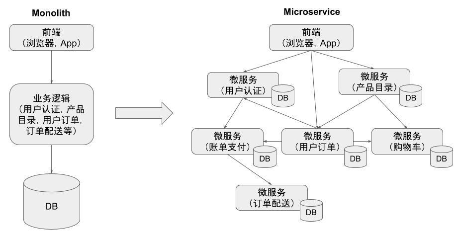
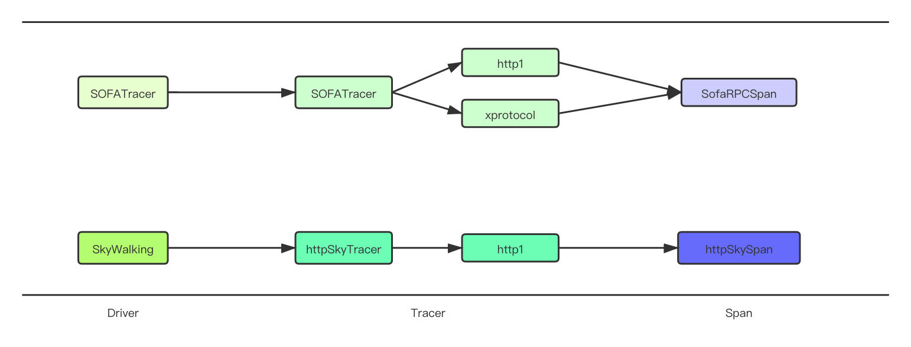
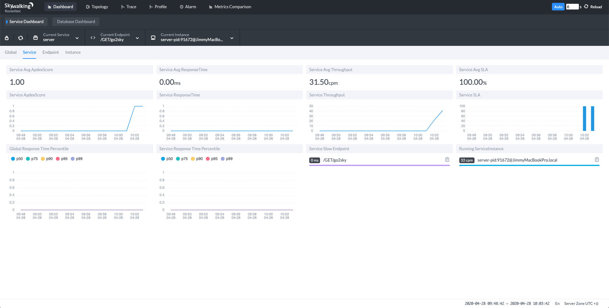
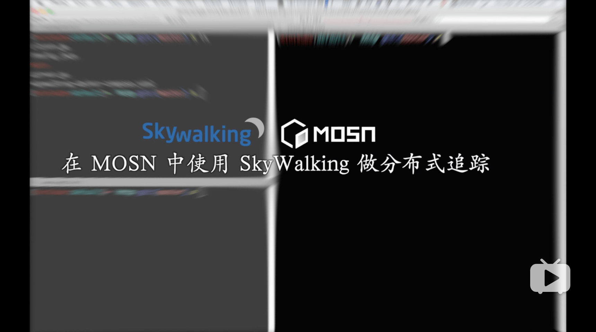

作者：[宋净超](https://jimmysong.io)、[张伟](https://github.com/arugal)

日前，云原生网络代理 MOSN v0.12.0 发布，观察性分析平台和应用性能管理系统 SkyWalking 完成了与 MOSN 的集成，作为 MOSN 中的支持的分布式追踪系统之一，旨在实现在微服务和 Service Mesh 中的更强大的可观察性。

## 背景

相比传统的巨石（Monolith）应用，微服务的一个主要变化是将应用中的不同模块拆分为了独立的进程。在微服务架构下，原来进程内的方法调用成为了跨进程的远程方法调用。相对于单一进程内的方法调用而言，跨进程调用的调试和故障分析是非常困难的，难以使用传统的代码调试程序或者日志打印来对分布式的调用过程进行查看和分析。



如上图右边所示，微服务架构中系统中各个微服务之间存在复杂的调用关系。

一个来自客户端的请求在其业务处理过程中经过了多个微服务进程。我们如果想要对该请求的端到端调用过程进行完整的分析，则必须将该请求经过的所有进程的相关信息都收集起来并关联在一起，这就是“分布式追踪”。

以上关于分布式追踪的介绍引用自 [Istio Handbook](https://www.servicemesher.com/istio-handbook/practice/distributed-tracing.html)。

## MOSN 中 tracing 的架构

MOSN 的 tracing 框架由 Driver、Tracer 和 Span 三个部分组成。

Driver 是 Tracer 的容器，管理注册的 Tracer 实例，Tracer 是 tracing 的入口，根据请求信息创建一个 Span，Span 存储当前跨度的链路信息。



目前 MOSN tracing 有 [SOFATracer](http://github.com/sofastack/sofa-tracer) 和 SkyWalking 两种实现。SOFATracer 支持 http1 和 xprotocol 协议的链路追踪，将 trace 数据写入本地日志文件中。SkyWalking 支持 http1 协议的链路追踪，使用原生的 Go 语言探针 [go2sky](https://github.com/SkyAPM/go2sky) 将 trace 数据通过 gRPC 上报到 SkyWalking 后端服务。

## 快速开始

下面将使用 Docker 和 `docker-compose` 来快速开始运行一个集成了 SkyWalking 的分布式追踪示例，该示例代码请见 [MOSN GitHub](https://github.com/mosn/mosn/tree/master/examples/codes/trace/skywalking/http)。

### 准备

安装 docker 和 docker-compose。

- [安装 docker](https://docs.docker.com/install/)

- [安装 docker-compose](https://docs.docker.com/compose/install/)

需要一个编译好的 MOSN 程序，您可以[下载 MOSN 源码](https://github.com/mosn/mosn)自行编译，或者直接下载 [MOSN v0.12.0 发行版](https://github.com/mosn/mosn/releases/tag/v0.12.0)以获取 MOSN 的运行时二进制文件。

下面将以源码编译的方式演示 MOSN 如何与 SkyWalking 集成。

```bash
cd ${projectpath}/cmd/mosn/main
go build
```

获取示例代码目录。

```bash
${targetpath} = ${projectpath}/examples/codes/trace/skywalking/http/
```

将编译好的程序移动到示例代码目录。

```bash
mv main ${targetpath}/
cd ${targetpath}
```

### 目录结构

下面是 SkyWalking 的目录结构。

```bash
* skywalking
└─── http
│           main                           # 编译完成的 MOSN 程序
|           server.go                      # 模拟的 Http Server
|           clint.go                       # 模拟的 Http Client
|           config.json                    # MOSN 配置
|           skywalking-docker-compose.yaml # skywalking docker-compose
```

### 运行说明

启动 SkyWalking oap & ui。

```bash
docker-compose -f skywalking-docker-compose.yaml up -d
```

启动一个 HTTP Server。

```bash
go run server.go
```

启动 MOSN。

```bash
./main start -c config.json
```

启动一个 HTTP Client。

```bash
go run client.go
```

打开 [http://127.0.0.1:8080](http://127.0.0.1:8080/) 查看 SkyWalking-UI，SkyWalking Dashboard 界面如下图所示。



在打开 Dashboard 后请点击右上角的 `Auto` 按钮以使页面自动刷新。

### Demo 视频

下面来看一下该 Demo 的操作视频。

[](https://www.bilibili.com/video/BV17i4y1t7mZ/)

### 清理

要想销毁 SkyWalking 后台运行的 docker 容器只需要下面的命令。

```bash
cd ${projectpath}/examples/codes/trace/skywalking/http/
docker-compose -f skywalking-docker-compose.yaml down
```

## 未来计划

在今年五月份，SkyWalking  8.0 版本会进行一次全面升级，采用新的探针协议和分析逻辑，探针将更具互感知能力，更好的在 Service Mesh 下使用探针进行监控。同时，SkyWalking 将开放之前仅存在于内核中的 metrics 指标分析体系。Prmoetheus、Spring Cloud Sleuth、Zabbix 等常用的 metrics 监控方式，都会被统一的接入进来，进行分析。此外， SkyWalking 与 MOSN 社区将继续合作：支持追踪 Dubbo 和 [SOFARPC](https://github.com/sofastack/sofa-rpc)，同时适配 sidecar 模式下的链路追踪。

## 关于 MOSN

MOSN 是一款使用 Go 语言开发的网络代理软件，由蚂蚁金服开源并经过几十万容器的生产级验证。 MOSN 作为云原生的网络数据平面，旨在为服务提供多协议、模块化、智能化、安全的代理能力。 MOSN 是 Modular Open Smart Network 的简称。 MOSN 可以与任何支持 xDS API 的 Service Mesh 集成，亦可以作为独立的四、七层负载均衡，API Gateway、云原生 Ingress 等使用。

- GitHub：<https://github.com/mosn/mosn>
- 官网：<https://mosn.io>

## 关于 Skywalking

SkyWalking 是观察性分析平台和应用性能管理系统。提供分布式追踪、服务网格遥测分析、度量聚合和可视化一体化解决方案。支持 Java、.Net Core、PHP、NodeJS、Golang、LUA 语言探针，支持 Envoy/MOSN + Istio 构建的 Service Mesh。

- GitHub：<https://github.com/apache/skywalking>
- 官网：<https://skywalking.apache.org>

关于本文中的示例请参考 [MOSN GitHub](https://github.com/mosn/mosn/tree/master/examples/cn_readme/trace/skywalking/http) 和 [MOSN 官方文档](https://mosn.io/zh/docs/configuration/trace/)。