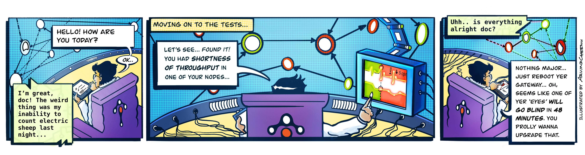
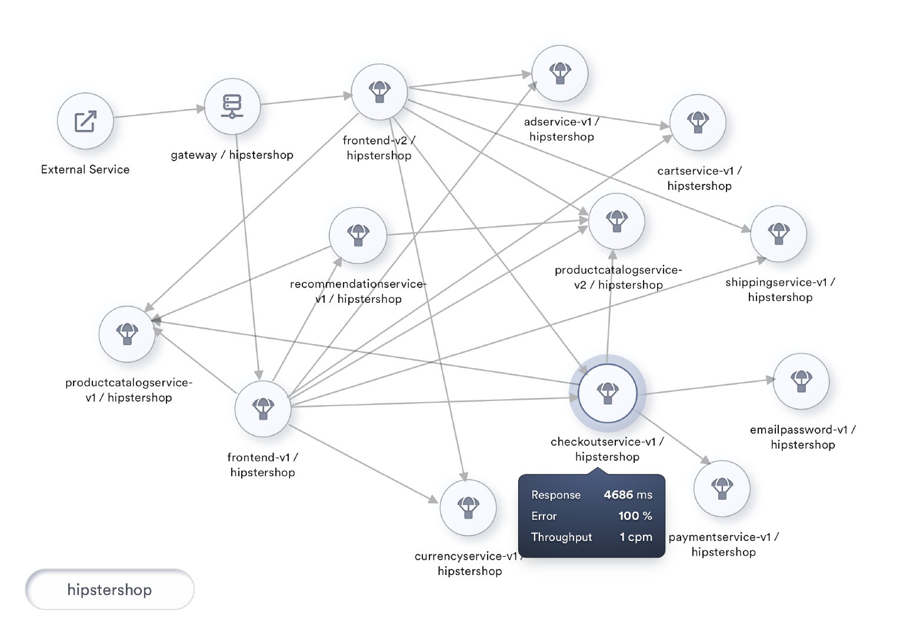
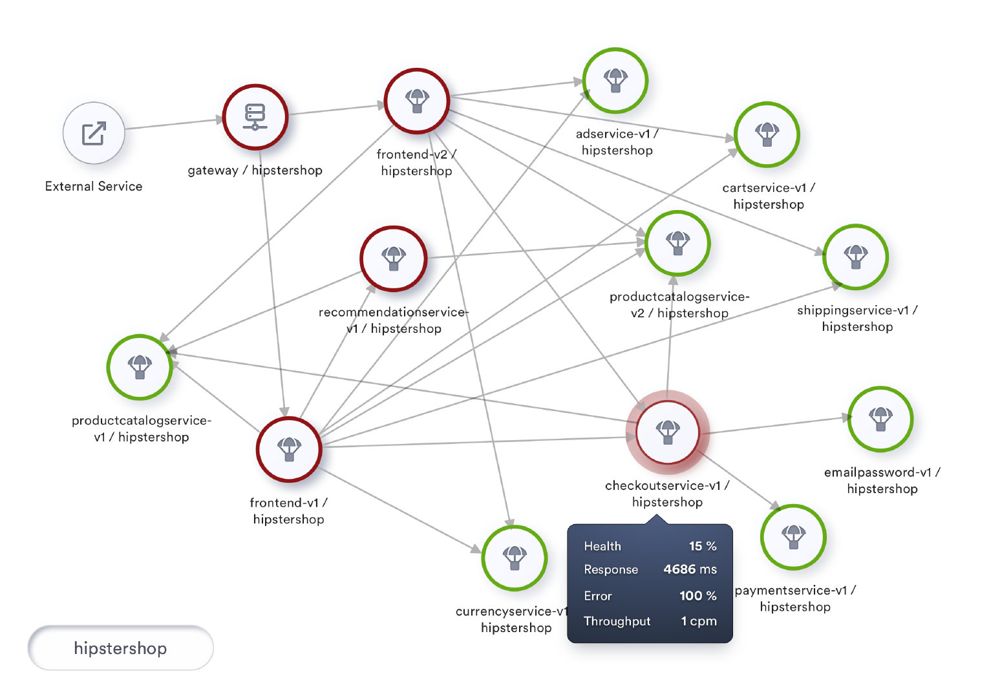
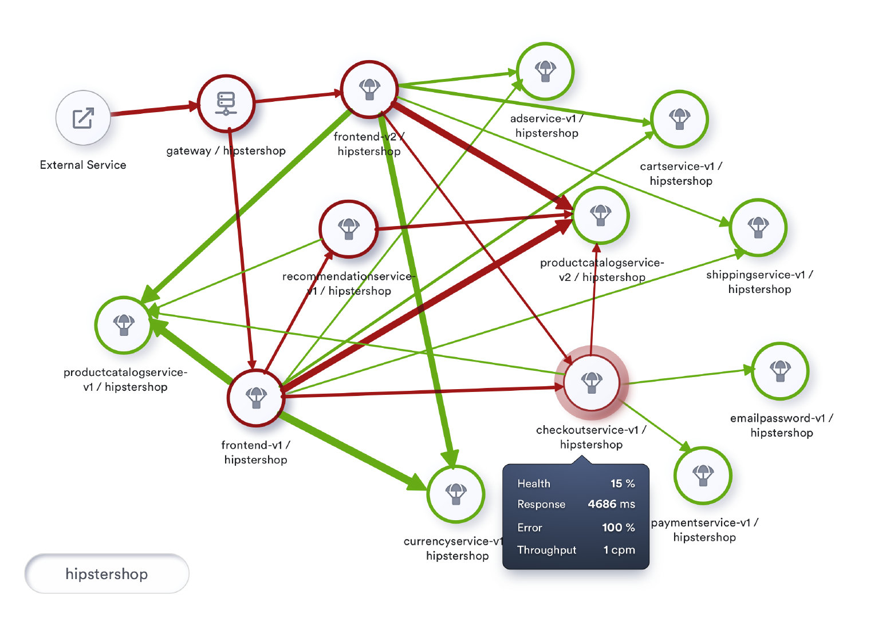
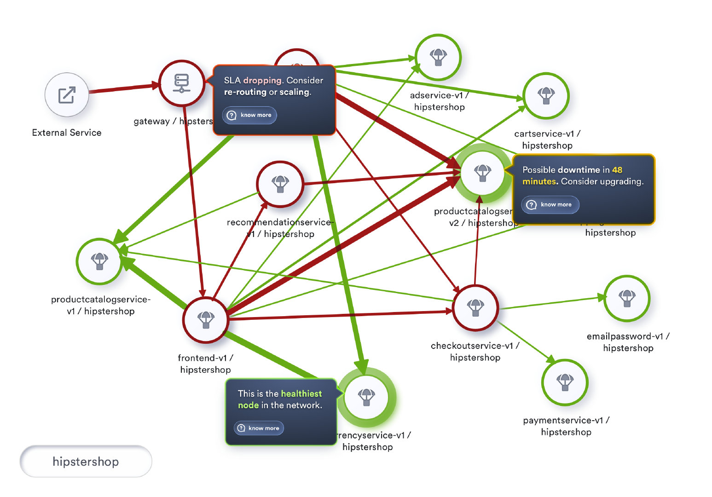

- 作者: Srinivasan Ramaswamy, tetrate
- 翻译：唐昊杰，南京大学在读学生
- 校对：吴晟
- Original link, [Tetrate.io blog](https://www.tetrate.io/blog/the-apdex-score-for-measuring-service-mesh-health/)
- July. 26th, 2020

## "你感觉怎么样" 比 "你的症状是什么" 更重要



### **背景**

最近我拜访了我的医生。每次去看病，医生都会首先问我一连串轻快的问题，比如：你今天过得怎么样？上周过的怎么样？最近有什么出行吗？你打破了自己的骑车记录吗？你的锻炼计划实施如何？最后他会问：“你有什么麻烦吗？”如果这个时候我感觉自己不太好，我会说：“我这周感觉很沉闷，临近中午的时候感觉更累。”这时他就会拿出听诊器、脉搏血氧仪和血压仪。然后，如果他觉得自己需要更深入的了解情况，他就开始列出我需要做的具体检查。

当我问他，最开始的讨论是否只是为了缓和氛围。他说：“这是必不可少的部分。它帮助我发现你感觉如何，而不是你的症状是什么。"。我们这样关于生活的开场聊天，帮助他组织了后续关于症状、调查和测试结果的问题。

在回来的路上，我不停地问自己：“我们是不是也应该用这种方式管理我们的网格(service mesh)？”

如果我把自己的健康检查和网格的健康检查进行类比，“医疗检查”就是日志分析，“调查”就是追踪，“症状”就是传统的RED指标（请求速率、请求错误和请求耗时）。那么根本的问题，就是我们在这里讨论的：健康因素（主要是网格的健康）。


### **服务网格中的健康状况**

我们可以通过RED指标来衡量任何被观察到的服务的性能。RED指标在了解每个服务的性能、可靠性和吞吐量方面提供了巨大的价值。这些指标在网格上的令人信服的可视化使得监控全部网格变得标准化和可扩展。此外，根据这些指标的阈值设置警报有助于在指标值异常的时候进行异常检测。

为了建立任何服务的上下文环境并观察它们，理想的做法是将网格可视化为一个拓扑结构。



网格的拓扑结构可视化不仅允许使用者挑选任意服务并观察其指标，还可以提供有关服务依赖和特定服务在网格上的潜在影响这些重要信息。

虽然每个服务的RED指标为使用者提供了深刻的洞察能力，但使用者更关心网格的整体响应性，而非每个单独出来的服务的响应性。

为了描述任意服务的性能（即从提交请求到收到完成了的http响应这段时间内的表现），我们会测量用户对响应性的感知。这种将响应时间与设定的阈值进行比较的衡量标准叫做Apdex。Apdex是衡量一个服务在网格中的健康程度的指标。

### **Apdex**

Apdex是根据设定的阈值和响应时间结合考虑的衡量标准。它是满意响应时间和不满意响应时间相对于总响应时间的比率。

Apdex是根据应用和服务的响应时间来衡量使用者满意程度的行业标准。它衡量的是用户对你的服务的满意程度，因为传统的指标（如平均响应时间）可能很快就会容易形成偏差。

基于满意度的响应时间，表示特定服务的往返响应时间小于设定的阈值的次数。不满意响应时间虽然意思相反，但又进一步分为容忍型和失望型。容忍型包括了了任何响应时间不超过四倍阈值的表现，而任何超过四倍阈值或遇到了错误的表现都被认为是失望型。这里提到的阈值是我们对任意服务所期望的理想响应表现。我们可以设置一个全局范围的阈值，如，500ms。

Apdex得分是满意型请求和容忍型请求与做出的总请求的比率。

每个_满意的请求_算作一个请求，而每个_容忍的请求_算作半个_满意_的请求。

一个Apdex得分从0到1的范围内取值。0是最差的分数，表示用户总是感到失望；而'1'是最好的分数（100%的响应时间是令人满意的）。

这个分数的百分比表示也可以用作服务的健康指标。


## **数学表示**

Apdex得分的实际计算是通过以下公式实现的：

```
		                   满意请求数 +  ( 容忍请求数 / 2 )

Apdex 得分  =  ------------------------------------------------------

                                总请求数
```

此公示得到的百分率，即可视为服务的健康度。


### **样例计算**


在两分钟的采样时间内，主机处理200个请求。

Apdex阈值T设置为0.5秒（500ms）。

*.	170个请求在500ms内被处理完成，它们被分类为满意型。
*.	20个请求在500ms和2秒间被处理，它们被分类为容忍型。
*.	剩余的10个请求没有被正确处理或者处理时间超过了2秒，所以它们被分类为失望型。

最终的Apdex得分是0.9，即（170 + （20 / 2））/ 200。


### **深入使用**

在接下来的层次，我们可以尝试通过根据节点的健康状况来着色节点以改进我们的拓扑可视化。此外，我们还可以在用户点击服务时将健康状况作为我们展示的信息的一部分。

Apdex规范推荐了以下Apdex质量评级，将Apdex得分分为优秀（0.94 - 1.00）、良好（0.85 - 0.93）、一般（0.70 - 0.84）、差（0.50 - 0.69）和不可接受（0.00 - 0.49）。

为了可视化网格的健康状况，我们用交通灯的颜色将我们的节点标记为健康、有风险和不健康，其中不健康表示健康率低于80%。健康率在80%到95%之间的表示有风险，健康率在95%及以上的称为健康。

让我们将这种着色融入到我们的拓扑可视化中，并将其可用性提升到一个新的水平。如果实施，我们将看到下图所示的情况。



### **更进一步**

Apdex为客户对我们服务响应性的满意度提供了可见性。更有甚者，通过将实施范围扩展到调用该服务的调用关系，我们可以进一步了解网格本身的健康状况。

两个有着相似Apdex分数的服务，为客户提供了相同的客户满意度。然而，流入服务的流量大小对于优先处理哪一服务有着巨大的帮助。流量较高的服务表明这种服务体验影响了网格上更大量的使用者。

虽然健康程度与单个服务有关，但我们也可以分析两个服务之间的交互并计算交互过程的健康程度。这种对网格上每一个交互的健康程度的计算，可以帮助我们根据整个拓扑结构中所有交互的健康程度，建立一个关键路径。

在一个大的网格中，将流量展示为另一个数字将使可视化和监控更具挑战性。我们可以根据服务的吞吐量，通过用不同的粗细程度渲染连接服务的边来改善整个可视化的效果。

一个位于高吞吐量事务的不健康的服务可能会导致资源的过度消耗。另一方面，这种可视化也为调整服务时获取最大化投资效果提供了一个很好的提示。

与调整一个偶尔使用的服务相比，调整作为高吞吐量事务的一部分的那些服务会带来指数级的收益。

实施这种包括了交互的健康状况和吞吐量的可视化，我们会看到下图所示的情况:



### **这一天即将到来**

**目前**，这些功能已经作为Tetrate服务网格平台的UI功能之一来提供给用户。该平台使用了高速可配置化、高性能的可观测性和监控性能管理平台：Apache SkyWalking ([https://skywalking.apache.org](https://skywalking.apache.org/))，SkyWalking可以监控整个网格的流量，为服务及它们的交互合计RED指标，持续计算和监控服务的健康状况，并使用户能够在服务超过特定阈值时配置报警和通知。这些功能使得SkyWalking对网格拥有全面的健康状况可见性。

有了这样强大的网格性能可视性，我们将可以在为网格准备的网络运营中心使用这种拓扑结构作为我们的HUD（Heads Up Display）。 

HUD随着时间的推移收集了解到的信息和模式，并将预测各种情况和主动提示我们潜在的重点领域以提高客户满意度。

丰富的历史数据的可视化也可以使网络工程师能够看看过去中类似的一天的网格表现。

可视化效果如下图所示。



### **总结**

综合到目前为止的所有讨论，网格的健康状况更多地是关于用户的感受，以及我们作为服务提供商可以采取积极行动来维持（如果不能增强）用户的体验。

着个人化医学的发展，现在距离我的医生给我发这样短信的日子并不遥远：“要不今天享用冰淇淋并且沿着灰色小山步道到达沙斯塔山！”相似的，我们可以通过更好地了解客户的整体健康状况为他们做更多的事情。

Tetrate的“服务网格健康程度”方法不仅提供了管理，监视和支持，而且从一开始就使基础架构保持健康以减少事故发生的可能性。在Istio，Envoy和SkyWalking的支持下，Tetrate的解决方案可为任何环境中的任何工作负载提供持续的端到端可观察性，运行时安全性和流量管理。

我们的客户应该拥有健康的系统！请分享您对使用服务网格为我们的客户带来令人兴奋和强健的体验的想法。

### **引用**

- [https://en.wikipedia.org/wiki/Apdex](https://en.wikipedia.org/wiki/Apdex)
- [https://www.apdex.org/overview.html](https://www.apdex.org/overview.html)
- [https://www.apdex.org/index.php/specifications/](https://www.apdex.org/index.php/specifications/)
- [https://skywalking.apache.org/](https://skywalking.apache.org/)
