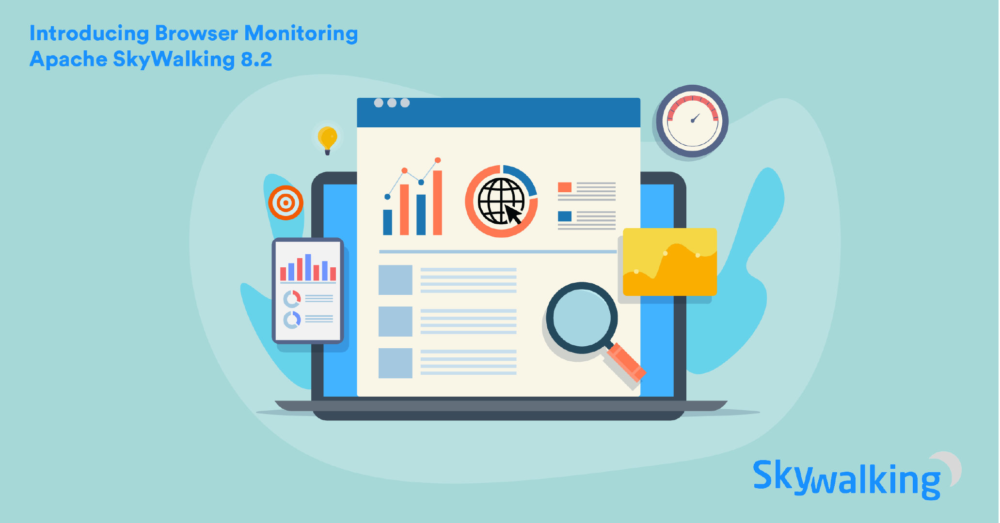
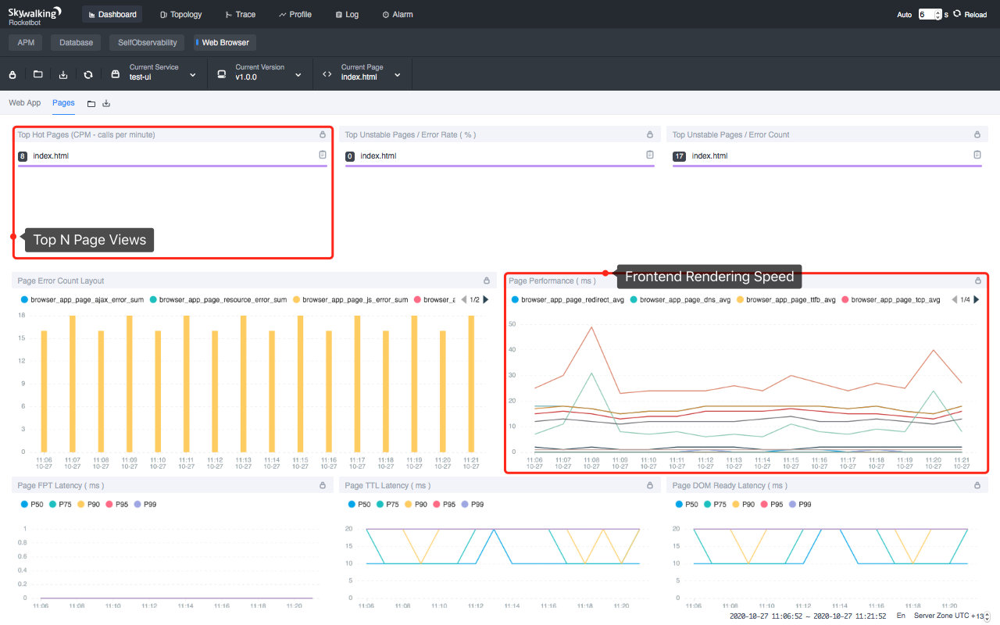

- 作者: 柯振旭, 吴晟, 高洪涛, Tevah Platt. tetrate.io
- 原文链接: [What's new with Apache SkyWalking 8.2? Browser monitoring and more](https://www.tetrate.io/blog/whats-new-with-apache-skywalking-8-2-browser-monitoring-and-more/)
- 2020 年 10 月 29 日

Apache SkyWalking，一个可观测性平台，也是一个开源的应用性能监视器（APM）项目，今日宣布 8.2 发行版全面可用。该发行版拓展了核心功能，并将其监控边界拓展到浏览器端。

### 背景

SkyWalking 是一个观测平台和 APM 工具。它可以选择性的与 Service Mesh 协同工作，为微服务、云原生和基于容器的应用提供自动的指标。该项目是全球社区支持的 Apache 顶级项目，阿里巴巴、华为、腾讯、百度、字节跳动等许多公司都在使用。

### 浏览器端监控

APM 可以帮助 SRE 和工程团队诊断系统故障，也能在系统异常缓慢之前优化它。但它是否足以让用户总是满意呢？  

在 8.2.0 版本中， SkyWalking 将它的监控边界拓展到了浏览器端，比如 Chrome ，或者 Chrome 和后端服务之间的网络。这样，我们不仅可以像以前一样监控浏览器发送给后端服务的与请求，还能看到前端的渲染速度、错误日志等信息——这些信息是获取最终用户体验的最有效指标。（目前此功能尚未拓展到物联网设备中，但这项功能使得 SkyWalking 向着这个方向前进了一步）

此外，SkyWalking浏览器监视也提供以下数据:
PV（page views，页面浏览量）， UV（unique visitors，独立访客数），浏览量前 N 的页面（Top N Page Views）等。这些数据可以为产品队伍优化他们的产品提供线索。  

### 按标签 (tag) 查询链路数据

在 SkyWalking 的 Span 数据模型中，已经有了许多被索引并可供用户查询的重要字段。但出于性能考虑，使用 Span 标签查询链路数据的功能直到现在才正式提供。在 SkyWalking 8.2.0 中，我们允许用户查询被特定标签标记的链路，这非常有用。SRE 工程师可以在生产环境中运行测试，将其打上仿真流量的标签，并稍后通过该标签查找它。

### 指标分析语言

在 8.2.0 中，仪表系统提供了一项名为MAL（Meter Analysis Language，指标分析语言）的强大分析语言。该语言允许用户在 OAP 流系统中分析并聚合（aggregate）指标数据。
表达式的结果可以被 Agent 分析器或 OpenTelemetry/Prometheus 分析器获取。  

### 复合警报规则

警报是及时发现系统失效的有效方式。一个常见的问题是，为了避免错过任何可能的问题，我们通常会配置过多的触发器（triggers）。没有人喜欢半夜被警报叫醒，结果只是因为触发系统太敏感。这种警报很嘈杂并毫无帮助。  

在 8.2.0 版本中，用户选择可以配置考虑了多个度量维度的复合警报规则。使用复合报警规则，我们可以根据需要添加尽可能多的指标来更精确地判断是否存在真正的问题，或者只是一个偶发的小问题。

一些常见的情况，如 `成功率 < 90% 但只有 1~2 个请求`，现在可以通过复合规则解决，如`流量(即每分钟调用数) > n && 成功率 < m%`。  

### 其它值得注意的功能增强

1. agent-toolkit SDK 公开了某些 API，供用户发送自定义指标。
2. Agent `exclude_plgins` 配置允许您排除某些插件（plugins）; `mount` 配置使您能够加载一套新的插件。
3. 社区贡献了超过 10 个新 Agent 插件。
4. 报警系统原生支持发送消息到 Slack，企业微信，钉钉。

### 附加资源

* 阅读更多关于[SkyWalkng 8.2 发行版重点](https://github.com/apache/skywalking/blob/v8.2.0/CHANGES.md).

* 在[推特](https://twitter.com/ASFSkyWalking)上获取更多关于 SkyWalking 的更新。

### Apache SkyWalking DevCon 报名信息

Apache SkyWalking DevCon 2020 开始报名了。
2020 年 11 月 14 日，欢迎大家[来线下参加活动和交流](https://www.huodongxing.com/event/3567284406200), 或者[报名观看线上直播](https://www.itdks.com/Home/Act/apply?id=5392&mUid=57437)。
