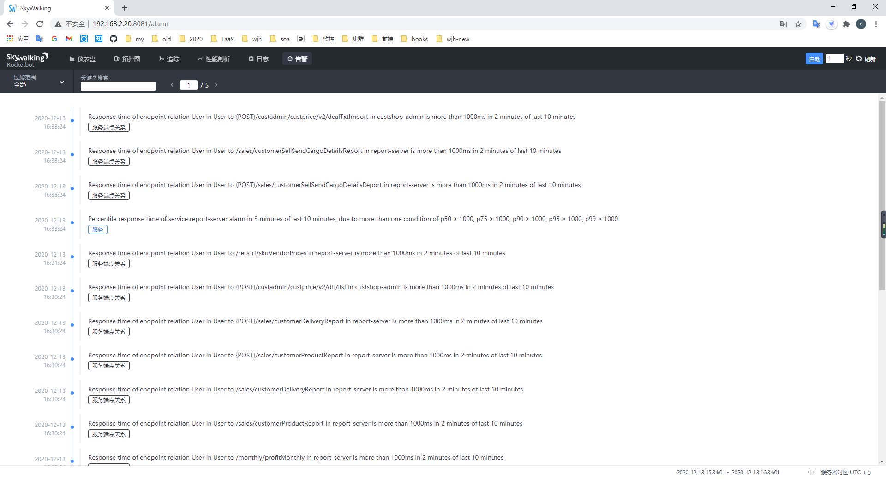
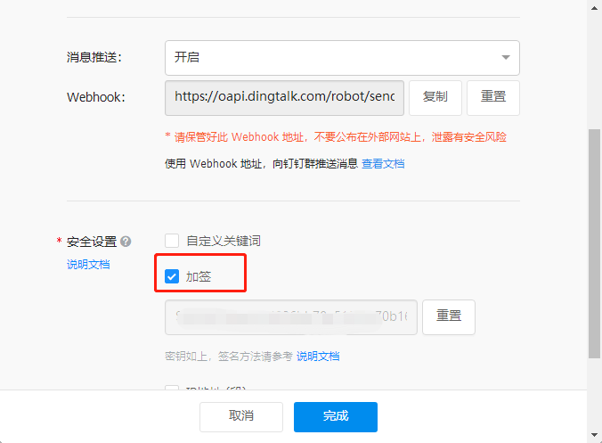
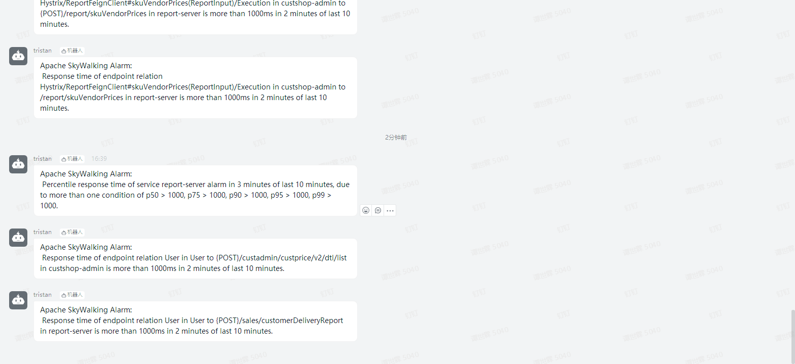

这篇文章暂时不讲告警策略, 直接看默认情况下激活的告警目标以及钉钉上的告警效果

SkyWalking内置了很多默认的告警策略, 然后根据告警策略生成告警目标, 我们可以很容易的在界面上看到



当我们想去让这些告警目标通知到我们时, 由于SkyWalking目前版本(8.3)已经自带了, 只需要简单配置一下即可

我们先来钉钉群中创建机器人并勾选加签



然后再修改告警部分的配置文件, 如果你是默认的配置文件(就像我一样), 你可以直接执行以下命令, 反之你也可以手动修改configs/alarm-settings.yml文件

```
tee <your_skywalking_path>/configs/alarm-settings.yml <<-'EOF'
dingtalkHooks:
  textTemplate: |-
    {
      "msgtype": "text",
      "text": {
        "content": "Apache SkyWalking Alarm: \n %s."
      }
    }
  webhooks:
    - url: https://oapi.dingtalk.com/robot/send?access_token=<access_token>
      secret: <加签值>
EOF
```


最终效果如下



参考文档:

https://github.com/apache/skywalking/blob/master/docs/en/setup/backend/backend-alarm.md

https://ding-doc.dingtalk.com/doc#/serverapi2/qf2nxq/uKPlK

谢谢观看, 后续我会在SkyWalking告警这块写更多实战文章
