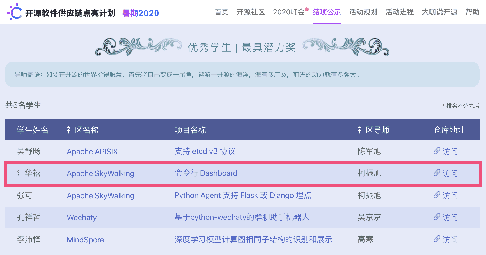
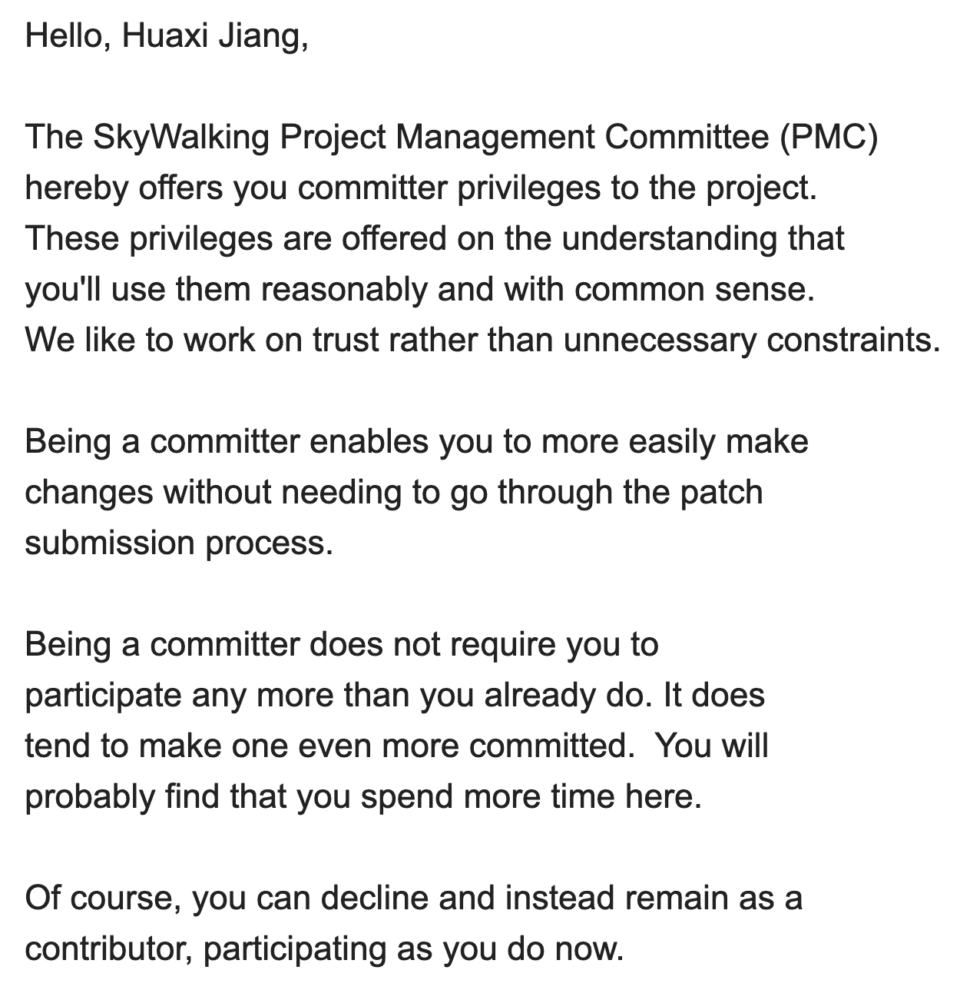

## 背景

我是一个热爱编程、热爱技术的人，⼀直以来都向往着能参与到开源项⽬中锻炼⾃⼰，但当我面对庞大而复杂的项目代码时，却感到手足无措，不知该从何开始。⽽此次的“开源软件供应链点亮计划-暑期2020”活动则正好提供了这样⼀个机会：清晰的任务要求、开源社区成员作为导师提供指导以及一笔丰厚的奖金，让我顺利地踏上了开源这条道路。

## 回顾

在“暑期2020”活动的这两个多月里，我为 SkyWalking 的命令行工具实现了一个 dashboard，此外在阅读项目源码的过程中，还发现并修复了几个 bug。到活动结束时，我共提交了11个 PR，贡献了两千多行改动，对 SkyWalking CLI 项目的贡献数量排名第二，还获得了“最具潜力奖”。

我觉得之所以能够如此顺利地完成这个项⽬主要有两个原因。一方面，我选择的 SkyWalking CLI 项⽬当时最新的版本号为0.3.0，还处于起步阶段，代码量相对较少，⽽且项⽬结构非常清晰，文档也较为详细，这对于我理解整个项⽬⾮常有帮助，从⽽能够更快地上⼿。另一方面，我的项目导师非常认真负责，每次我遇到问题，导师都会及时地为我解答，然后我提交的 PR 也能够很快地被 review。⽽且导师不时会给予我肯定的评论与⿎励，这极⼤地提⾼了我的成就感，让我更加积极地投⼊到下⼀阶段的⼯作，形成⼀个正向的循环。

## 收获

回顾整个参与过程，觉得自己收获颇多：

首先，我学习到了很多可能在学校里接触不到的新技术，了解了开源项目是如何进行协作，开源社区是如何运转治理的，以及开源文化、Apache way 等知识，仿佛进入了一个崭新而精彩的世界。

其次，我的编程能力得到了锻炼。因为开源项目对于代码的质量有较高的要求，因此我会在编程时有意识地遵守相关的规范，培养良好的编码习惯。然后在导师的 code review 中也学习到了一些编程技巧。

此外，参与开源为我的科研带来了不少灵感。因为我的研究方向是智能软件工程，旨在将人工智能技术应用在软件工程的各个环节中，这需要我在实践中发现实际问题。而开源则提供了这样一个窗口，让我足不出户即可参与到软件项目的设计、开发、测试和发布等环节。

最后也是本次活动最大的一个收获，我的贡献得到了社区的认可，被提名成为了 SkyWalking 社区的第一位学生 committer。

## 建议

最后，对于将来想要参加此类活动的同学，附上我的一些建议：

第一，选择活跃、知名的社区。社区对你的影响将是极其深远的，好的社区意味着成熟的协作流程、良好的氛围、严谨的代码规范，以及有更大几率遇到优秀的导师，这些对于你今后在开源方面的发展都是非常有帮助的。

第二，以兴趣为导向来选择项目，同时要敢于走出舒适区。我最初在选择项目时，初步确定了两个，一个是低难度的 Python 项目，另一个是中等难度的 Go 项目。当时我很纠结：因为我对 Python 语言比较熟悉，选择一个低难度的项目是比较稳妥的，但是项目的代码我看的并不是很懂，具体要怎么做我完全没有头绪；而 Go 项目是一个命令行工具，我对这个比较感兴趣，且有一个大致的思路，但是我对 Go 语言并不是很熟悉，实践经验为零。最后凭借清晰具体的 proposal 我成功申请到了 Go 项目并顺利地完成了，还在实践中快速掌握了一门新的编程语言。

这次的“暑期2020”活动虽已圆满结束，但我的开源之路才刚刚开始。
