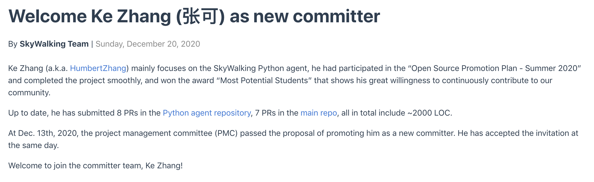

今年暑假期间我参加了开源软件供应链点亮计划—暑期 2020 的活动，在这个活动中，我主要参加了 Apache SkyWalking 的 Python Agent 的开发，最终项目顺利结项并获得了”最具潜力奖“，今天我想分享一下我参与这个活动以及开源社区的感受与收获。  

##  缘起

其实我在参加暑期 2020 活动之前就听说过 SkyWalking 了。我研究生的主要研究方向是微服务和云原生，组里的学长们之前就在使用 SkyWalking 进行一些研究工作，也是通过他们，我了解到了 OpenTracing, SkyWalking 等与微服务相关的 Tracing 工具以及 APM 等，当时我就在想如果有机会可以深度参加这些开源项目就好了。 巧的是，也正是在差不多的时候，本科的一个学长发给了我暑期 2020 活动的链接，我在其中惊喜的发现了 SkyWalking 项目。

虽然说想要参与 SkyWalking 的开发，但是真的有了机会我却有一些不自信——这可是 Star 上万的 Apache 顶级项目。万幸的是在暑期 2020 活动中，每一个社区都提供了很多题目以供选择，想参与的同学可以提前对要做的事情有所了解，并可以提前做一些准备。我当时也仔细地浏览了项目列表，最终决定申请为 Python Agent 支持 Flask 或 Django 埋点的功能。当时主要考虑的是，我对 Python 语言比较熟悉，同时也有使用 Flask 等 web 框架进行开发的经验，我认为应该可以完成项目要求。为了能让心里更有底一些，我阅读了 Python Agent 的源码，写下了对项目需要做的工作的理解，并向项目的导师柯振旭发送了自荐邮件，最终被选中去完成这个项目。

## 过程

被选中后我很激动，也把这份激动化作了参与开源的动力。我在进一步阅读源码，搭建本地环境后，用了三周左右的时间完成了 Django 项目的埋点插件的开发，毕竟我选择的项目是一个低难度的项目，而我在 Python web 方面也有一些经验。在这之后，我的导师和我进行了沟通，在我表达了想要继续做贡献的意愿之后，他给我建议了一些可以进一步进行贡献的方向，我也就继续参与 Python Agent 的开发。接下来，我陆续完成了 PyMongo 埋点插件, 插件版本检查机制, 支持使用 kafka 协议进行数据上报等功能。在提交了暑期 2020 活动的结项申请书后，我又继续参与了在端到端测试中增加对百分位数的验证等功能。

在整个过程中，我遇到过很多问题，包括对问题认识不够清晰，功能的设计不够完善等等，但是通过与导师的讨论以及 Code Review，这些问题最终都迎刃而解了。此外他还经常会和我交流项目进一步发展方向，并给我以鼓励和肯定，在这里我想特别感谢我的导师在整个项目过程中给我的各种帮助。

## 收获

参加暑期 2020 的活动带给我了很多收获，主要有以下几点：

第一是让我真正参与到了开源项目中。在之前我只向在项目代码或文档中发现的 typo 发起过一些 Pull Request，但是暑期 2020 活动通过列出项目 ＋ 导师指导的方式，明确了所要做的事情，并提供了相应的指导，降低了参与开源的门槛，使得我们学生可以参与到项目的开发中来。

第二是对我的专业研究方向也有很多启发，我的研究方向就是微服务与云原生相关，通过参与到 SkyWalking 的开发中使得我可以更好地理解研究问题中的一些概念，也让我更得心应手得使用 SkyWalking 来解决一些实际的问题。

第三是通过参与 SkyWalking Python Agent 以及其他部分的开发，我的贡献得到了社区的承认，并在最近被邀请作为 Committer 加入了社区，这对我而言是很高的认可，也提升了我的自信心。

​	

第四点就是我通过这个活动认识了不少新朋友，同时也开拓了我的视野，使得我对于开源项目与开源社区有了很多新的认识。

## 建议

最后同样是我对想要参与开源社区，想要参与此类活动的同学们的一些建议：

1. 虽然奖金很吸引人，但是还是希望大家能抱着长期为项目进行贡献的心态来参与开源项目，以这样的心态参与开源可以让你更好地理解开源社区的运作方式，也可以让你更有机会参与完成激动人心的功能，你在一个东西上付出的时间精力越多，你能收获的往往也越多。
2. 在申请项目的时候，可以提前阅读一下相关功能的源码，并结合自己的思考去写一份清晰明了的 proposal ，这样可以帮助你在申请人中脱颖而出。
3. 在开始着手去完成一个功能之前，首先理清思路，并和自己的导师或了解这一部分的人进行沟通与确认，从而尽量避免在错误的方向上浪费太多时间。

