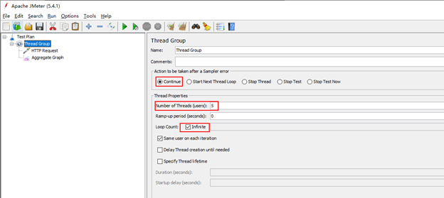
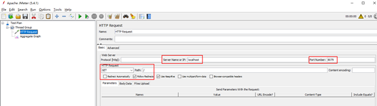
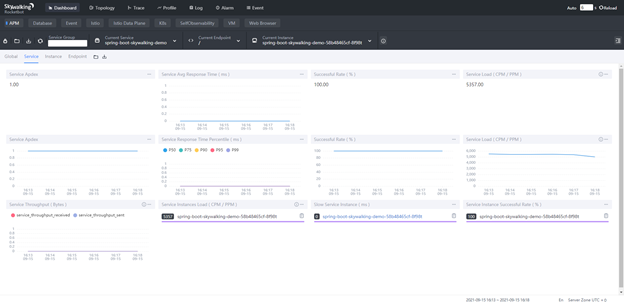
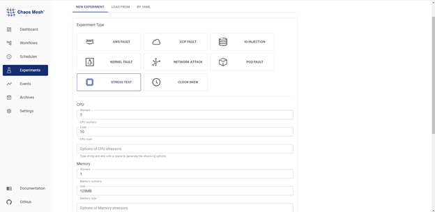
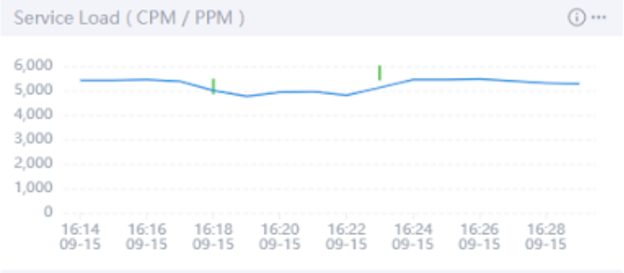
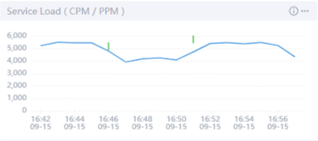
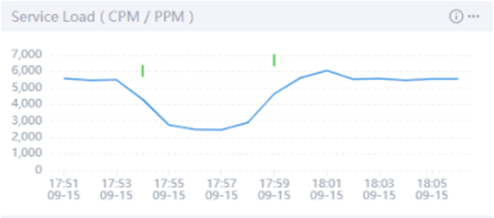

[Chaos Mesh](https://github.com/chaos-mesh/chaos-mesh) 是**一个开源的云原生混沌工程**平台，借助 Chaos Mesh，用户可以很方便地对服务注入异常故障，并配合 Chaos Dashboard 实现对整个混沌实验运行状况的监测 。然而，对混沌实验运行情况的监控并不能告诉我们应用服务性能的变化。从系统可观测性的角度来说，我们可能无法单纯通过混沌实验的动态了解故障的全貌，这也阻碍了我们对系统和故障的进一步了解，调试。

[Apache SkyWalking](https://github.com/apache/skywalking) 是一个开源的 APM (Application Performance Monitor) 系统，可以对云原生服务提供监控、跟踪、诊断等功能。SkyWalking [支持](https://skywalking.apache.org/docs/main/latest/en/concepts-and-designs/event/#how-to-configure-alarms-for-events)收集 Event（事件），可在 Dashboard 中查看分布式系统中发生了哪些事件，并可以直观地观测到不同 Event 对服务性能造成的影响，和 Chaos Mesh 结合使用，便可为混沌实验造成的服务影响提供监控。

本教程将分享如何通过将 SkyWalking 和 Chaos Mesh 结合，运用 Event 信息监控，实时了解混沌实验对应用服务性能造成的影响。  

## 准备工作

* 创建 Skywalking 集群，具体可以参考 [SkyWalking Readme](https://github.com/apache/skywalking-kubernetes#install)。
* 部署 Chaos Mesh，推荐使用 [helm 安装](https://chaos-mesh.org/docs/production-installation-using-helm/)。
* 安装 Java 测试工具 [JMeter](https://jmeter.apache.org/index.html) （其他工具亦可，仅用于增加服务负载）
* 如果仅作为 Demo 使用，可以参考 [chaos-mesh-on-skywalking](https://github.com/chaos-mesh/chaos-mesh-on-skywalking) 这个仓库进行配置

## Step 1 - 访问 SkyWalking 集群 

安装 SkyWalking 后，就可以访问它的UI了，但因为还没有服务进行监控，这里还需要添加服务并进行 Agent 埋点设置。本文选用轻量级微服务框架 Spring Boot 作为埋点对象搭建一个简易 Demo 环境。

可以参考 [chaos-mesh-on-skywalking](https://github.com/chaos-mesh/chaos-mesh-on-skywalking) 仓库中的 [demo-deployment.yaml ](https://github.com/chaos-mesh/chaos-mesh-on-skywalking/blob/master/demo-deployment.yaml)文件创建。之后使用 `kubectl apply -f demo-deployment.yaml -n skywalking` 进行部署。部署成功后即可在SkyWalking-UI 中看到实时监控的服务信息。

**注意**：因为 Spring Boot 的端口也是8080，在端口转发时要避免和 **SkyWalking **的端口冲突，比如使用 `kubectl port-forward svc/spring-boot-skywalking-demo 8079:8080 -n skywalking` 。

## Step 2 - 部署 SkyWalking Kubernetes Event Exporter 

[SkyWalking Kubernetes Event Exporter](https://github.com/apache/skywalking-kubernetes-event-exporter) 可以用来监控和过滤 Kubernetes 集群中的 Event ，通过设置过滤条件筛选出需要的 Event，并将这些 Event 发送到 SkyWalking 后台， 这样就可以通过 SkyWalking 观察到你的 Kubernetes 集群中的Event 何时影响到服务的各项指标了。如果想要一条命令部署，可以参考此[配置](https://github.com/chaos-mesh/chaos-mesh-on-skywalking/blob/master/exporter-deployment.yaml)创建 yaml 文件 ，设置 filters 和 exporters 的参数后，使用 `kubectl apply` 进行部署。

## Step 3 - 使用 JMeter 对服务加压

为了达到更好的观察效果，需要先对 Spring Boot 增加服务负载，本文选择使用 JMeter 这一使用广泛的 Java 压力测试工具来对服务加压。

### 通过 JMeter 对 `localhost:8079` 进行压测，添加5个线程持续进行加压。

通过 SkyWalking Dashboard 可以看到，目前访问成功率为100%，服务负载大约在5300 CPM (Calls Per Minute）。

## Step 4 - Chaos Mesh 注入故障，观察效果

做好了这些准备工便可以使用 Chaos Dashboard 进行压力场景模拟，并在实验进程中观察服务性能的变化。

以下使用不同 Stress Chaos 配置，观测对应服务性能变化：

* CPU 负载10%，内存负载128 MB 。

  混沌实验开始和结束的时间点标记可以通过右侧开关显示在在图表中，将鼠标移至短线出可以看到是实验的 Applied 或 Recovered。可以看到两个绿色短线之间的时间段里，服务处理调用的的性能降低，为4929 CPM，在实验结束后，性能恢复正常。

  

* CPU load 增加到50%，发现服务负载进一步降低至4307 CPM。

  

* 极端情况下 CPU 负载达到100%，服务负载降至无混沌实验时的40% 。

  

因为 Linux 系统下的进程调度并不会让某个进程一直占据 CPU，所以即使实在 CPU 满载的极端情况下，该部署的 Spring Boot Demo 仍可以处理40%的访问请求。

## 小结

通过 SkyWalking 与 Chaos Mesh 的结合，我们可以清晰的观察到服务在何时受到混沌实验的影响，在注入混沌后服务的表现性能又将如何。SkyWalking 与 Chaos Mesh 的结合使得我们轻松地观察到了服务在各种极端情况下的表现，增强了我们对服务的信心。

Chaos Mesh 在 2021 年成长了许多。为了更多地了解用户在实践混沌工程方面的经验，以便持续完善和提升对用户的支持，社区发起了 Chaos Mesh 用户问卷调查，点击【阅读原文】参与调查，谢谢！

[https://www.surveymonkey.com/r/X78WQPC](https://www.surveymonkey.com/r/X78WQPC)

欢迎大家加入 Chaos Mesh 社区，加入 CNCF Slack (slack.cncf.io) 底下的 Chaos Mesh 频道: project-chaos-mesh，一起参与到项目的讨论与开发中来！大家在使用过程发现 Bug 或缺失什么功能，也可以直接在 GitHub ([https://github.com/chaos-mesh](https://github.com/chaos-mesh)) 上提 Issue 或 PR。