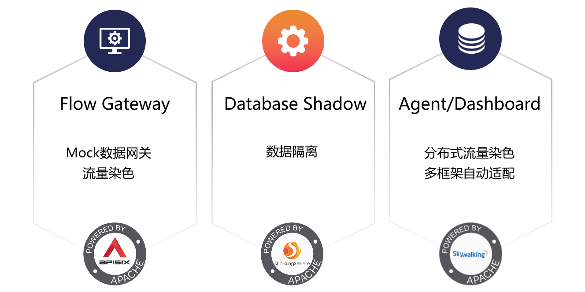
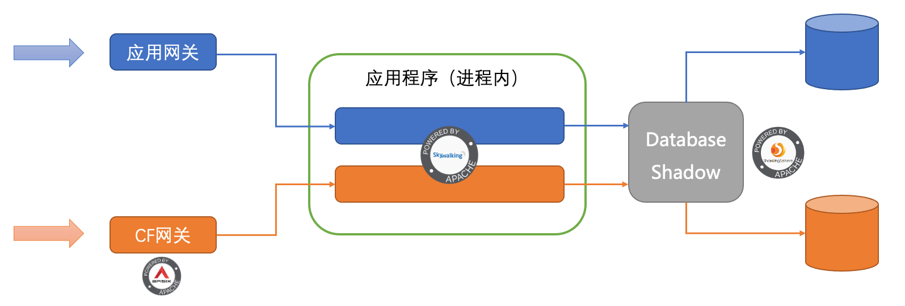
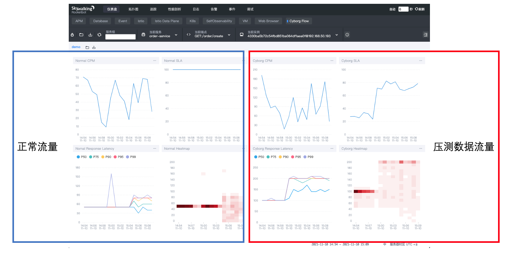

随着业务与用户量的持续发展，系统的瓶颈也逐渐出现。尤其在一些节假日、突发的营销活动中，访问量激增可能会导致系统性能下降，甚至造成系统瘫痪。
全链路压测可以很好的帮助我们预先演练高峰流量，从而提前模拟出系统的执行情况，帮助我们预估系统容量。当流量真正来临时，也可以更从容面对。
Apache SkyWalking 联合 Apache APISIX 及 Apache ShardingSphere，三大顶级开源社区通力合作，共同打造生产级可用的全链路压测解决方案，CyborgFlow。

## 介绍

CyborgFlow 是一款面向生产级可用的全链路压测解决方案。总共由三个组件组成，如下图所示。

* Flow Gateway: 压测流量网关。当流量到达该组件时，则会将请求认定为压测流量，并将压测流量标识传递至上游服务。
* Database Shadow: 数据库中间件。当数据库中间件感知到当前流量为压测流量时，则会将数据库操作路由至影子表中进行操作。
* Agent/Dashboard: 分布式监控系统。与业务系统紧密结合，当感知到压测请求后，自动将其标识传递至上游，无需业务代码改造。并且利用分析能力，构建Dashboard来便于查看流量情况。

以此，便覆盖了单个请求的完整生命周期，在网关层构建压测标识，到业务系统透传标识，最终将请求与影子表交互。同时整个流程拥有完整的监控分析。

## 原理

依托于三大社区合作，让这一切变得简单易用。下图为全链路压测系统的运行原理，橙色和蓝色分别代表正常流量和压测流量。

### Flow Gateway

Flow Gateway 作为压测流量网关，主要负责接收流量，并传递压测流量表示至上游。

1. 添加 [skywalking插件](https://github.com/apache/apisix/blob/master/docs/en/latest/plugins/skywalking.md) 构建链路入口。
2. 依据 [proxy-rewrite插件](https://github.com/apache/apisix/blob/master/docs/en/latest/plugins/proxy-rewrite.md) 将压测流量标识注入到上游的请求头中。

### Agent/Dashboard

该组件中则分为两部分内容说明。

#### Agent

Agent与业务程序拥有相同生命周期，负责压测流量标识在各个业务系统之间传递，并与 Database Shadow 交互。

1. SkyWalking Agent通过读取从Flow Gateway传递的压测流量标识，利用 [透传协议](https://skywalking.apache.org/docs/main/latest/en/protocols/skywalking-cross-process-correlation-headers-protocol-v1/) 将该标识在应用之间传递。
2. 当准备进行数据库调用时，则通过判断是否包含压测流量标识来决定是否SQL调用时追加压测流量标识(`/* cyborg-flow: true */`)。
3. 当检测到当前请求包含压测流量标识后，将该数据与Trace绑定，用于Dashboard数据分析。

#### Dashboard

Dashboard 用于压测过程进行中的监控数据分析，并最终以图表的方式进行展示。

1. 接收来自Agent中上报的Trace数据，并依据`OAL`中的Tag过滤器(`.filter(tags contain "cyborg-flow:true")`)来生成压测与非压测的指标数据。
2. 利用指标数据便可以在Dashboard中创建图表进行观察。

### Database Shadow

Database Shadow 作为 Proxy 在业务程序与数据库中间完成数据交互，当检测到压测流量时则会将SQL传递至影子表中处理。

1. 检测下游传递的数据库语句中是否包含压测流量标识(`/* cyborg-flow: true */`)，存在时则将SQL交给由用户配置的影子表中处理。

## 快速上手

下面将带你快速将Cyborg Flow集成至你的项目中。相关组件的下载请至 [Github Release](https://github.com/SphereEx/CyborgFlow/releases/tag/v0.1.0) 中下载，目前已发布 0.1.0 版本。

### 部署 Database Shadow

1. 解压缩**cyborg-database-shadow.tar.gz**。
2. 将 `conf/config-shadow.yaml` 文件中的业务数据库与影子数据库配置为自身业务中的配置。
3. 启动 Database Shadow服务，启动脚本位于`bin/start.sh`中。

如需了解更详细的部署参数配置，请参考 [官方文档](https://github.com/SphereEx/CyborgFlow/blob/main/cyborg-database-shadow/README_ZH.md#%E5%BF%AB%E9%80%9F%E5%BC%80%E5%A7%8B) 。

### 部署 Cyborg Dashboard

1. 解压缩**cyborg-dashboard.tar.gz**。
2. 启动后端与UI界面服务，用于链路数据解析与界面展示，启动脚本位于`bin/startup.sh`中。
3. 接下来就可以通过打开浏览器并访问`http://localhost:8080/`，此页面为Cyborg Dashboard界面，由于目前尚未部署任何业务程序，所以暂无任何数据。

如需了解更详细的部署参数配置，请参考 [后端服务](https://skywalking.apache.org/docs/main/latest/en/setup/backend/backend-setup/) 与 [UI界面服务](https://skywalking.apache.org/docs/main/latest/en/setup/backend/ui-setup/) 的安装文档。

### 部署 Cyborg Agent 到业务程序中

1. 解压缩**cyborg-agent.tar.gz**.
2. 修改`config/agent.config`中的`collector.backend_service`为 Cyborg Dashboard 中后端地址(默认为`11800`端口)，用于将监控数据上报至 Cyborg Dashboard 。
3. 修改业务程序中与数据库的链接，将其更改为 Database Shadow 中的配置。默认访问端口为`3307`，用户名密码均为`root`。
4. 当程序启动时，增加该参数到启动命令中：`-jar path/to/cyborg-agent/skywalking-agent.jar`。

如需了解更详细的部署参数配置，请参考 [Agent安装文档](https://skywalking.apache.org/docs/skywalking-java/latest/en/setup/service-agent/java-agent/readme/) 。

### 部署 Flow Gateway

1. 参考 [Flow Gateway 快速开始](https://github.com/SphereEx/CyborgFlow/blob/main/cyborg-flow-gateway/README_ZH.md#%E5%BF%AB%E9%80%9F%E5%BC%80%E5%A7%8B%E5%9F%BA%E4%BA%8E-centos-7) 进行下载 Apache APISIX 并配置相关插件。
2. 基于 [APISIX 创建路由文档](https://apisix.apache.org/zh/docs/apisix/getting-started#%E7%AC%AC%E4%BA%8C%E6%AD%A5%EF%BC%9A%E5%88%9B%E5%BB%BA%E8%B7%AF%E7%94%B1) 进行路由创建。

### 完成！

最后，通过Flow Gateway访问业务系统资源，便完成了一次压测流量请求。

1. 压测流量最终访问至影子表进行数据操作。
2. 如下图所示，通过观察 Cyborg Dashboard 便可以得知压测与非压测请求的执行情况。

## 总结

在本文中，我们详细介绍了Cyborg Flow中的各个组件的功能、原理，最终搭配快速上手来快速将该系统与自己的业务系统结合。
如果在使用中有任何问题，欢迎来[共同讨论](https://github.com/SphereEx/CyborgFlow/discussions)。
