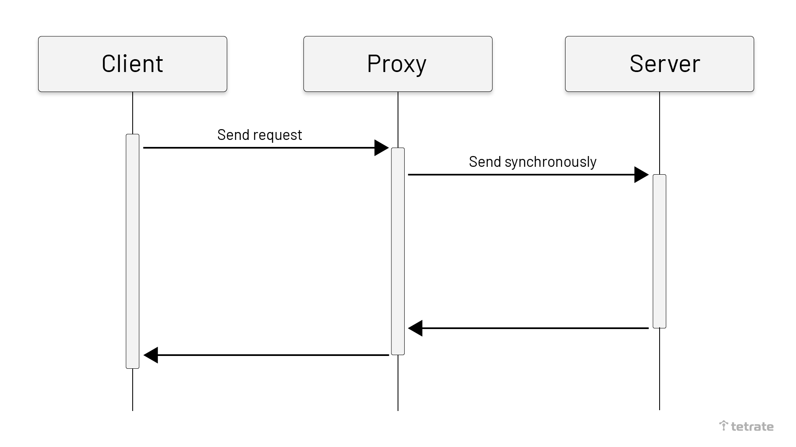
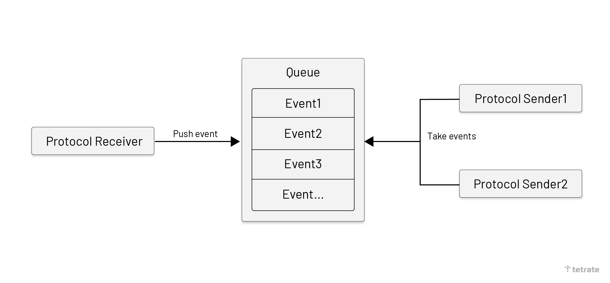
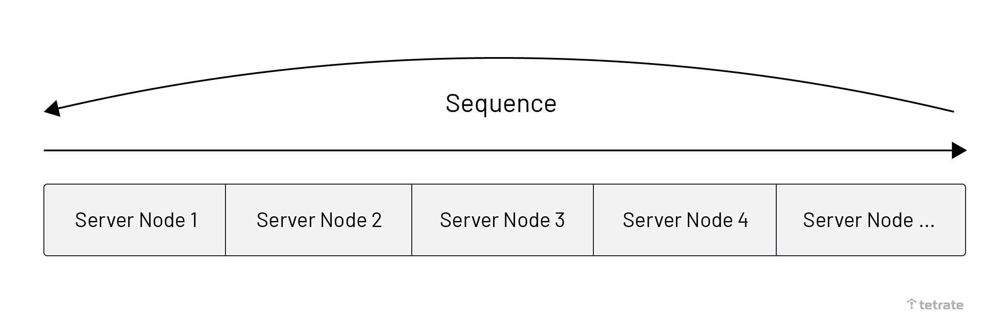
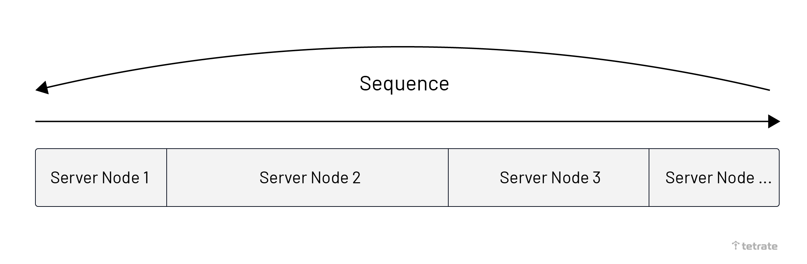
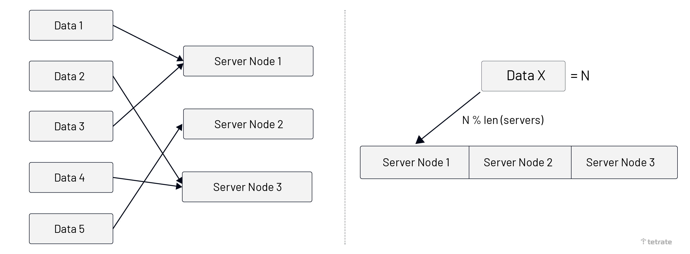
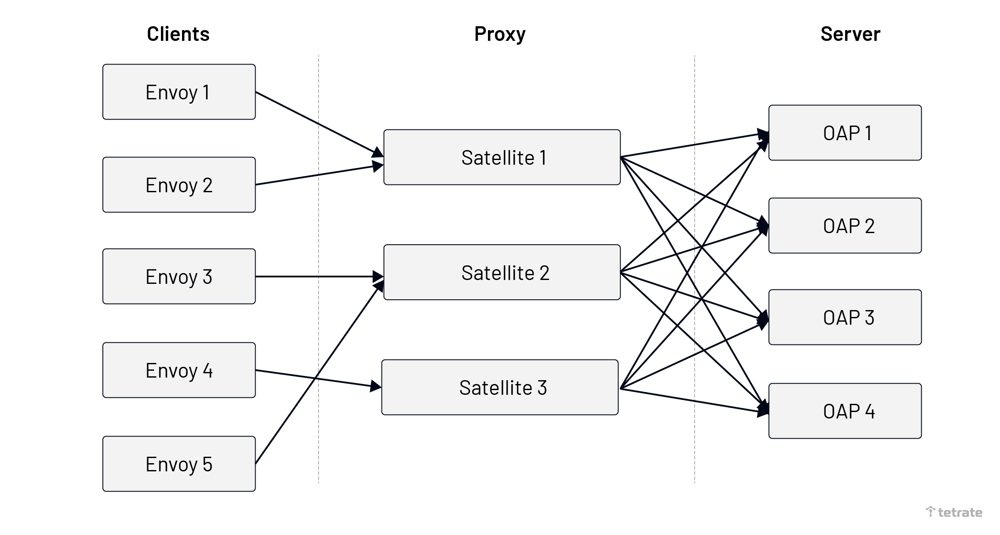
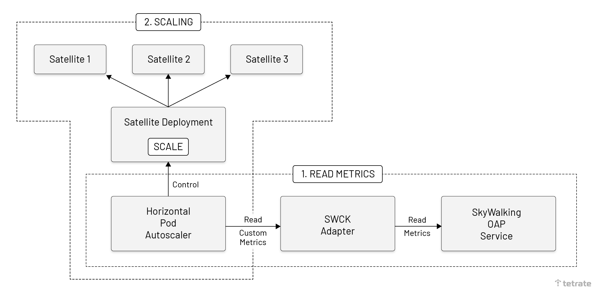
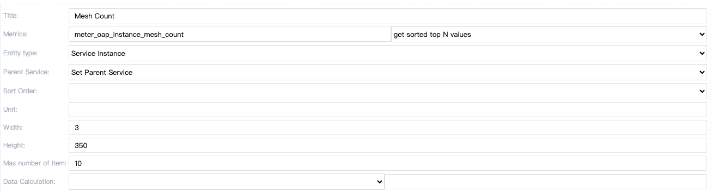
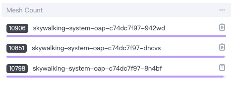
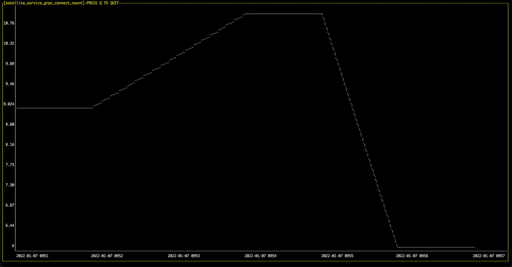

## 背景介绍

在 Apache SkyWalking 生态系统中，OAP 通过 SkyWalking Agent、Envoy 或其他数据源获得度量、追踪、日志和事件数据。在 gRPC 协议下，它通过与单个服务器节点进行通信来传输数据。只有当连接中断时，才会使用基于 DNS 轮流模式的重新连接策略。当新的服务在运行时被添加，或者由于观察到的服务的流量增加而使 OAP 负载保持高位时，OAP 集群需要为增加的流量进行扩容。由于所有现有的代理已经连接到以前的节点，新的 OAP 节点的负载会比较小。即使没有扩展，OAP 节点的负载也会不平衡，因为代理会由于启动阶段的随机策略而保持连接。在这些情况下，保持所有节点的健康状态，还能在需要时进行扩展，将成为一个挑战。

在这篇文章中，我们主要讨论如何解决 SkyWalking 中的这一挑战。

## 如何实现负载均衡

SkyWalking 主要使用 gRPC 协议进行数据传输，所以本文主要介绍 gRPC 协议中的负载均衡。

### 代理人或客户端

根据 [gRPC 官方负载均衡博客](https://grpc.io/blog/grpc-load-balancing/)，有两种负载均衡的方法。

1. **客户端**。客户端感知到多个后端服务，并使用负载均衡算法为每个 RPC 选择一个后端服务。
2. **代理**。客户端将信息发送到代理服务器，代理服务器将信息负载均衡到后端服务。

从可观察性系统结构的角度来看。

| 类别   | 优点                               | 缺点                                                         |
| ------ | ---------------------------------- | ------------------------------------------------------------ |
| 客户端 | 由于消除了额外的跳跃，所以性能很高 | 复杂的客户端（集群感知、负载均衡、健康检查等）确保每个要连接的数据源提供复杂的客户端功能 |
| 代理   | 客户端简单                         | 高延迟                                                       |

我们选择代理模式是出于以下原因：

1. 可观察的数据对时间不是很敏感，传输造成的一点延迟是可以接受的。多跳一点是可以接受的，对客户端没有影响。
2. 作为一个观察性平台，我们不能 / 不应该要求改变客户端。他们做出自己的技术决定，并可能有自己的商业考虑。

### 传输政策

在代理模式下，我们应该确定下行和上行之间的传输路径。

不同的数据协议需要不同的处理策略。有两种传输政策：

1. **同步**：适用于需要在客户端交换数据的协议，如 SkyWalking 动态配置服务。这种类型的协议提供实时结果。
2. **异步批处理**：当客户端不关心上游的处理结果，而只关心传输的数据（如追踪报告、日志报告等）时使用。

同步策略要求代理在收到客户端消息时向上游服务器发送消息，并同步返回响应数据给下游客户端。通常情况下，只有少数协议需要使用同步策略。

如下图所示，在客户端向代理发送请求后，代理将同步向服务器发送消息。当代理机构收到结果后，会返回给客户端。



异步批处理策略意味着数据被异步地分批发送到上游服务器。这种策略比较常见，因为 SkyWalking 中的大多数协议主要是基于数据报告的。我们认为将队列作为一个缓冲区可以起到很好的效果。异步批处理策略是按照以下步骤执行的：

1. 代理接收数据并将其包装成一个事件对象。
2. 一个事件被添加到队列中。
3. 当达到循环时间或队列元素达到固定数量时，队列中的元素将被并行消耗并发送至 OAP。

使用队列的好处是：

1. 将数据接收和发送分开，以减少相互影响。
2. 区间量化机制可用于组合事件，这有助于加快向 OAP 发送事件的速度。
3. 使用多线程的消费队列事件可以更充分地利用网络 IO。

如下图所示，在代理收到消息后，代理将把消息包装成一个事件并推送到队列中。消息发送者将从队列中获取批量事件，并将其发送给上游的 OAP。



### 路由

路由算法被用来将消息路由到单一的上游服务器节点。

Round-Robin 算法从上游服务节点的列表中按顺序选择节点。这种算法的优点是，每个节点被选择的次数是平均的。当数据的大小接近时，每个上游节点可以处理相同数量的数据内容。



在 Weight Round-Robin 中，每个上游服务器节点都有一个相应的路由权重比。与Round-Robin 不同的是，每个上游节点根据其权重有更多机会被路由。这种算法更适合在上游服务器节点机器配置不同时使用。



Fixed 算法是一种混合算法。它可以保证相同的数据被路由到同一个上游服务器节点，当上游服务器规模缩小时，它仍然保持对同一节点的路由；除非上游节点不存在，否则它将重新路由。这种算法主要用于 SkyWalking Meter 协议，因为该协议需要确保同一服务实例的指标被发送到同一 OAP 节点。路由步骤如下：

1. 根据数据内容生成一个独特的识别字符串，越短越好。数据量是可控的。
2. 从 LRU Cache 中获取身份的上游节点，如果存在就使用它。
3. 根据识别结果，生成相应的哈希值，并从上游列表中找到上游服务器节点。
4. 将上游服务器节点和标识之间的映射关系保存到 LRU Cache。

这种算法的优点是尽可能地将数据与上游服务器节点绑定，因此上游服务器可以更好地处理连续数据。缺点是需要占用一定的内存空间来保存相应的关系。

如下图所示，图片被分为两部分：

1. 左边表示相同的数据内容总是被路由到同一个服务器节点。
2. 右侧代表数据路由算法。从数据中获得数字，并使用余数算法获得位置。



我们选择使用 Round-Robin 和 Fixed 算法的组合进行路由。

1. Fixed 路由算法适用于特定的协议，主要在向 SkyWalking Meter 协议传递度量数据时使用。
2. 默认使用 Round-Robin 算法。当 SkyWalking OAP 集群被部署时，节点的配置需要尽可能的相同，所以就没有必要使用 Weight Round-Robin 算法。

## 如何平衡负载均衡器本身？

Proxy 仍然需要处理从客户端到自身的负载均衡问题，特别是在生产环境中部署 Proxy 集群时。

有三种方法来解决这个问题：

1. **连接管理**：在客户端使用 max_connection * 配置来指定每个连接的最大连接时间。欲了解更多信息，请阅读提案。
2. **集群感知**：代理有集群感知，当负载不均衡时，主动断开连接，让客户端重新接上代理。
3. **资源限制 + HPA**：限制每个代理的连接资源情况，达到资源限制时不再接受新连接。并利用 Kubernetes 的 HPA 机制来动态扩展代理的数量。

| 类别 | 连接管理                                                  | 集群感知                                                     | 资源限制 + HPA               |
| ---- | --------------------------------------------------------- | ------------------------------------------------------------ | ---------------------------- |
| 优点 | 使用简单                                                  | 确保每个代理中的连接数是相对的                               | 使用简单                     |
| 缺点 | 每个客户端需要确保数据不丢失；客户端需要接受 GOWAY 的响应 | 可能导致某些节点上的流量突然增加；每个客户端需要确保数据不丢失 | 流量不会在每个实例中特别均衡 |

我们选择 Limit+HPA 是出于这些原因：

1. 易于配置和使用代理，根据基本的数据指标，容易理解。
2. 没有因连接中断而导致的数据丢失。客户端不需要实施任何其他协议来防止数据丢失，特别是当客户端是一个商业产品时。
3. 代理集群中每个节点的连接不需要特别平衡，只要代理节点本身是高性能的。

## SkyWalking-Satellite

我们已经在 [SkyWalking-Satellite](https://github.com/apache/skywalking-satellite) 项目中实现了这个代理。它被用于客户端和 SkyWalking OAP 之间，有效地解决了负载均衡问题。

系统部署后，Satellite 会接受来自客户端的流量，Satellite 会通过 Kubernetes 标签选择器或手动配置感知 OAP 的所有节点，并将流量负载均衡到上游的 OAP 节点。

如下图所示，单个客户仍与单个 Satellite 保持连接，Satellite 将与每个 OAP 建立连接，并向 OAP 节点发送负载均衡信息。

 

在扩展 Satellite 时，我们需要在 Kubernetes 中部署 [SWCK](https://github.com/apache/skywalking-swck) 适配器并配置 HPA。SWCK 是 SkyWalking 用户的平台，提供、升级、维护 SkyWalking 的相关组件，并使其在 Kubernetes 上原生工作。

部署完成后，将进行以下步骤：

1. 从 OAP 中读取度量。HPA 要求 SWCK 指标适配器动态地读取 OAP 中的指标。
2. 扩大 Satellite 的规模。Kubernetes HPA 感觉到指标值符合预期，所以 Satellite 会自动进行扩展。

如下图所示，用虚线来划分这两部分。HPA 使用 SWCK 适配器来读取 OAP 中的度量。当达到阈值时，HPA 将对 Satellite 部署进行扩展。



## 例子

在本节中，我们将展示两种情况。

1. SkyWalking 扩展：在 SkyWalking OAP 扩展之后，流量将通过 Satellite 自动实现负载均衡。
2. Satellite 扩展：Satellite 自身的流量负载均衡。

注意：所有命令都可以通过 [GitHub](https://github.com/mrproliu/sw-satellite-demo-scripts/tree/1180c23e8f3bb36778307f9ae15395274ca039b3) 访问。

### SkyWalking 扩展

我们将使用 [bookinfo 应用程序](https://istio.io/latest/docs/examples/bookinfo/)演示如何将 Apache SkyWalking 8.9.1 与 Apache SkyWalking-Satellite 0.5.0 + 集成，并通过 Envoy ALS 协议观察服务网格。

在开始之前，请确保你已经有一个 Kubernetes 环境。

#### **安装 Istio**

Istio 提供了一个非常方便的方法来配置 Envoy 代理并启用访问日志服务。下面的步骤：

1. 在本地安装 istioctl 以帮助管理 Istio 服务网格。
2. 将 Istio 安装到 Kubernetes 环境中，使用演示配置配置文件，并启用 Envoy ALS。将 ALS 消息传输到 Satellite 上。我们稍后将部署的 Satellite。
3. 将标签添加到默认命名空间中，这样 Istio 就可以在你以后部署应用程序时自动注入 Envoy 挎包代理。

```sh
# install istioctl
export ISTIO_VERSION=1.12.0
curl -L https://istio.io/downloadIstio | sh - 
sudo mv $PWD/istio-$ISTIO_VERSION/bin/istioctl /usr/local/bin/

# install istio
istioctl install -y --set profile=demo \
	--set meshConfig.enableEnvoyAccessLogService=true \
	--set meshConfig.defaultConfig.envoyAccessLogService.address=skywalking-system-satellite.skywalking-system:11800

# enbale envoy proxy in default namespace
kubectl label namespace default istio-injection=enabled
```

#### **安装 SWCK**

SWCK 为用户部署和升级基于 Kubernetes 的 SkyWalking 相关组件提供了便利。Satellite 的自动扩展功能也主要依赖于 SWCK。更多信息，你可以参考[官方文档](https://github.com/apache/skywalking-swck/blob/master/docs/operator.md#guides-of-operator-deployment)。

```sh
# Install cert-manager
kubectl apply -f https://github.com/jetstack/cert-manager/releases/download/v1.3.1/cert-manager.yaml

# Deploy SWCK
mkdir -p skywalking-swck && cd skywalking-swck
wget https://dlcdn.apache.org/skywalking/swck/0.6.1/skywalking-swck-0.6.1-bin.tgz
tar -zxvf skywalking-swck-0.6.1-bin.tgz
cd config
kubectl apply -f operator-bundle.yaml
```

#### **部署 Apache SkyWalking 和 Apache SkyWalking-Satellite**

我们提供了一个简单的脚本来部署 SkyWalking 的 OAP、用户界面和 Satellite。

```sh
# Create the skywalking components namespace
kubectl create namespace skywalking-system
kubectl label namespace skywalking-system swck-injection=enabled
# Deploy components
kubectl apply -f https://raw.githubusercontent.com/mrproliu/sw-satellite-demo-scripts/5821a909b647f7c8f99c70378e197630836f45f7/resources/sw-components.yaml
```

#### **部署 Bookinfo 应用程序** 

```sh
export ISTIO_VERSION=1.12.0
kubectl apply -f https://raw.githubusercontent.com/istio/istio/$ISTIO_VERSION/samples/bookinfo/platform/kube/bookinfo.yaml
kubectl wait --for=condition=Ready pods --all --timeout=1200s
kubectl port-forward service/productpage 9080
```

接下来，请打开你的浏览器并访问 http://localhost:9080。你应该能够看到 Bookinfo 应用程序。多次刷新网页以产生足够的访问日志。

然后，你可以在 SkyWalking WebUI 上看到 Bookinfo 应用程序的拓扑结构和指标。这时，你可以看到，Satellite 正在工作。

#### **部署监控器**

我们需要安装 OpenTelemetry Collector 来收集 OAP 中的指标并对其进行分析。

```sh
# Add OTEL collector
kubectl apply -f https://raw.githubusercontent.com/mrproliu/sw-satellite-demo-scripts/5821a909b647f7c8f99c70378e197630836f45f7/resources/otel-collector-oap.yaml

kubectl port-forward -n skywalking-system  service/skywalking-system-ui 8080:80
```

接下来，请打开浏览器，访问 http://localhost:8080/，并在仪表板上创建一个新项目。下图中的 SkyWalking Web UI 显示了数据内容的应用方式。

 

#### 扩容 OAP

通过部署扩容 OAP 的数量。

```sh
kubectl scale --replicas=3 -n skywalking-system deployment/skywalking-system-oap
```

#### 完成

一段时间后，你会看到 OAP 的数量变成了 3 个，而且 ALS 的流量被平衡到每个 OAP。



### 扩容 Satellite

在我们完成了 SkyWalking Scaling 之后，我们将进行 Satellite Scaling 演示。

#### **部署 SWCK HPA**

SWCK 提供了一个适配器来实现 Kubernetes 外部指标，通过读取 SkyWalking OAP 中的指标来适应 HPA。我们将 Satellite 中的度量服务暴露给 OAP，并配置 HPA 资源来自动扩展 Satellite。

将 SWCK 适配器安装到 Kubernetes 环境中。

```sh
kubectl apply -f skywalking-swck/config/adapter-bundle.yaml
```

创建 HPA 资源，并限制每个 Satellite 最多可处理 10 个连接。

```sh
kubectl apply -f https://raw.githubusercontent.com/mrproliu/sw-satellite-demo-scripts/5821a909b647f7c8f99c70378e197630836f45f7/resources/satellite-hpa.yaml
```

然后，你可以看到我们在一个 Satellite 上有 9 个连接。一个特使代理可能建立多个连接到 Satellite。

```sh
$ kubectl get HorizontalPodAutoscaler -n skywalking-system
NAME       REFERENCE                                TARGETS   MINPODS   MAXPODS   REPLICAS   AGE
hpa-demo   Deployment/skywalking-system-satellite   9/10      1         3         1          5m18s
```

#### 扩容应用

扩容应用程序可以建立更多与 Satellite 的连接，以验证 HPA 是否生效。

```sh
kubectl scale --replicas=3 deployment/productpage-v1 deployment/details-v1
```

#### 完成

默认情况下，Satellite 将部署一个实例，一个实例只能接受 11 个连接。HPA 资源限制一个 Satellite 处理 10 个连接，并使用一个稳定窗口使 Satellite 稳定扩展。在这种情况下，我们在扩展后将 Bookinfo 应用程序部署在 10 多个实例中，这意味着将有 10 多个连接建立到 Satellite 上。

所以在 HPA 资源运行后，Satellite 会自动扩展到 2 个实例。你可以通过[官方文档](https://kubernetes.io/docs/tasks/run-application/horizontal-pod-autoscale/#algorithm-details)了解复制的计算算法。运行下面的命令来查看运行状态。

```sh
$ kubectl get HorizontalPodAutoscaler -n skywalking-system --watch
NAME       REFERENCE                                TARGETS   MINPODS   MAXPODS   REPLICAS   AGE
hpa-demo   Deployment/skywalking-system-satellite   11/10     1         3         1          3m31s
hpa-demo   Deployment/skywalking-system-satellite   11/10     1         3         1          4m20s
hpa-demo   Deployment/skywalking-system-satellite   11/10     1         3         2          4m38s
hpa-demo   Deployment/skywalking-system-satellite   11/10     1         3         2          5m8s
hpa-demo   Deployment/skywalking-system-satellite   6/10      1         3         2          5m23s
```

通过观察 “连接数 “指标，我们将能够看到，当每个 gRPC 的连接数超过 10 个连接时，那么 Satellite 就会通过 HPA 规则自动进行扩展。结果是，连接数下降到正常状态（在这个例子中，小于 10 个）

```sh
swctl metrics linear --name satellite_service_grpc_connect_count --service-name satellite::satellite-service
```


