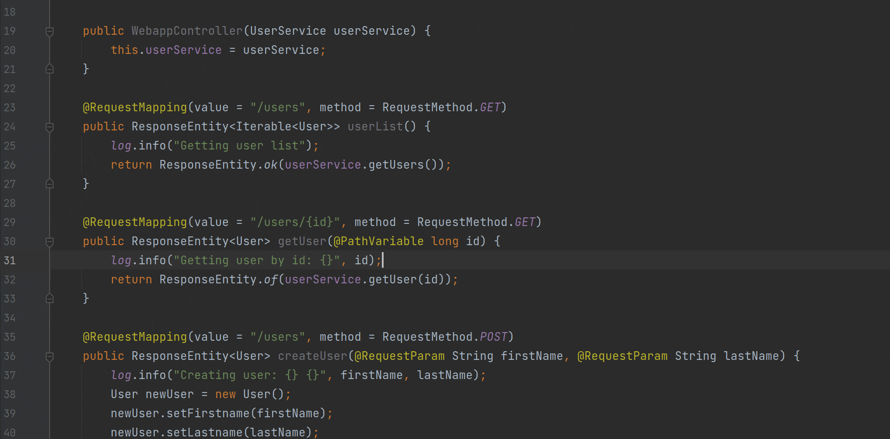
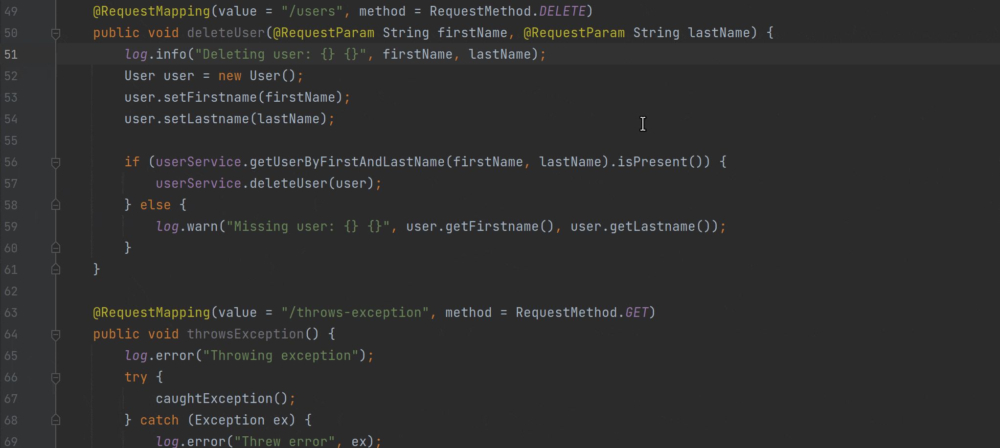
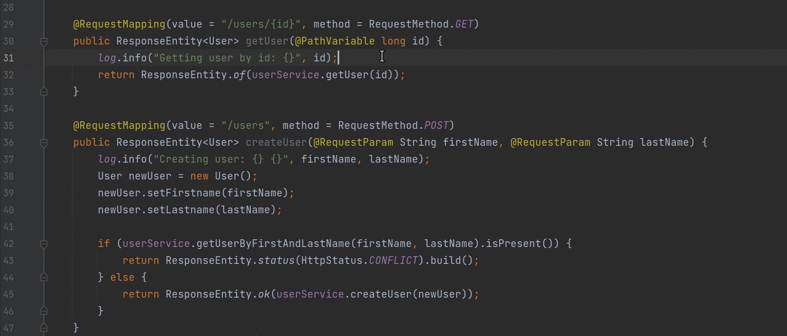

## 介绍

> 最具影响力技术是那些消失的技术。他们交织在日常生活中，直到二者完全相融。 - 马克韦瑟

马克韦瑟在 1980 年代后期预言，影响最深远的技术是那些消失在空气中的技术。根据韦瑟的说法，“只要人们足够熟知它，就不会再意识到它。”正如韦瑟所说，这种消失的现象不仅限于技术，更是人类的心理。正是这种经验使我们能够摆脱低层次的思考，进入更高层次的思考。一旦我们不再被平凡的细节所阻碍，我们就可以自如地专注于新的目标。

随着 APM（应用性能管理） 变得越来越普遍，这种认识变得更加重要。随着越来越多的应用程序使用 APM 部署，底层源代码抽象表示的数量也在增加。虽然这为组织内的许多非开发角色提供了巨大的价值，但它确实对那些必须将这些表示转化为可供使用的概念（即源代码）的开发角色提出了额外的挑战。对此，韦瑟相当简洁的总结为“不应要求程序员在不访问源代码的情况下工作，就像不应要求汽车机械师在不查看引擎的情况下工作一样”。

尽管如此，APM 收集更多信息只是为了产生充足的新抽象表示。在本文中，我们将介绍开源实时编码平台 Source++ 中的一个新概念，旨在让开发人员更直观地监控生产应用程序。

## 实时查看

> 而且我们真的不明白，数百个指标之后，是什么让程序更容易理解、修改、重复使用或借用。我不认为我们能够从程序到它们的抽象接口中找到答案。答案在源代码中。 - 马克韦瑟

随着 APM 从“有了更好”转变为“必须拥有”，有一个基本特性阻碍了它们的普及。它们必须从意识中消失。作为开发人员，我们不应急于打开浏览器以更好地理解底层源代码。答案就在源代码中。相反，我们应该改进我们的工具，以便源代码直观地告诉我们需要了解的内容。想想如果失败的代码总是表明它是如何以及为什么失败的，生活会多么简单。这就是 Source++ 背后的理念。

在我们的上一篇博客文章中，我们讨论了不间断断点 Extending Apache SkyWalking（天空漫步扩展服务器）。在那篇文章中，我们介绍了一个名为 Live Instruments（实时工具） 的概念，开发人员可以使用它轻松调试实时生产应用程序，而无需离开他们的 IDE（电子集成驱动器）。今天，我们将讨论如何通过一个名为 Live Views（实时查看）的新概念将现有的 SkyWalking（天空漫步）安装集成到您的 IDE（电子集成驱动器） 中。与专为调试实时应用程序而设计的 Live Instruments（实时工具） 不同，Live Views（实时查看）旨在提高应用程序的理解力和领悟力。这是通过输入到 Live Command Palette（实时命令板）中的各种命令来完成的。

### 实时命令板

Live Command Palette (LCP) 是一个上下文命令提示符，包含在 Source++ JetBrains 插件中，允许开发人员从他们的 IDE（电子集成驱动器）控制和查询实时应用程序。 LCP 通过键盘快捷键 (Ctrl+Shift+S) 打开，允许开发人员轻松查看与他们当前正在查看的源代码相关的指标。 目前支持以下实时视图命令：

#### 命令：查看（概览/活动/跟踪/日志）

视图命令显示带有当前源代码的实时操作数据的上下文弹出窗口。 这些命令允许开发人员查看根据相关指标过滤的传统 SkyWalking（天空漫步）运营数据。

#### 命令：观看日志

观看日志命令允许开发人员实时跟踪正在运行的应用程序的各个日志语句。通过此命令开发人员无需手动滚动日志就可以查找特定日志语句的实例。

#### 命令：（显示/隐藏）快速统计

显示快速统计命令显示实时端点指标，以便快速了解端点的活动。 使用此命令，开发人员可以快速评估端点的状态并确定端点是否按预期运行。

## 未来的工作

> 好的工具是无形的工具。我所说的无形，是指这个工具不会侵入你的意识；你专注于任务，而不是工具。眼镜是一个很好的工具——你看的是世界，而不是眼镜。 - 马克韦瑟

Source++ 旨在扩展 SkyWalking（天空漫步），使 SkyWalking（天空漫步）本身变得不可见。为此，我们计划支持自定义开发人员命令。开发人员将能够构建自定义命令，以及与团队共享的命令。这些命令将识别上下文、类型和条件，从而允许广泛的操作。随着更多命令的添加，开发人员将能够公开 SkyWalking（天空漫步）提供的所有内容，同时专注于最重要的源代码。
