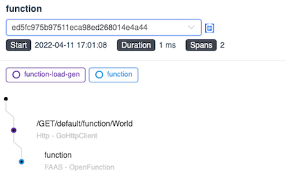

随着无人驾驶在行业的不断发展和技术的持续革新，规范化、常态化的真无人运营逐渐成为事实标准，而要保障各个场景下的真无人业务运作，一个迫切需要解决的现状就是业务链路长，出现问题难以定位。本文由此前于 KubeSphere 直播上的分享整理而成，主要介绍 SkyWalking 的基本概念和使用方法，以及在无人驾驶领域的一系列实践。



## 行业背景
驭势科技（UISEE）是国内领先的无人驾驶公司。致力于为全行业、全场景提供 AI 驾驶服务,做赋能出行和物流新生态的 AI 驾驶员。早在三年前， 驭势科技已在机场和厂区领域实现了“去安全员” 无人驾驶常态化运营的重大突破，落地“全场景、真无人、全天候”的自动驾驶技术，并由此迈向大规模商用。要保证各个场景下没有安全员参与的业务运作，我们在链路追踪上做了一系列实践。

对于无人驾驶来说，从云端到车端的链路长且复杂，任何一层出问题都会导致严重的后果；然而在如下图所示的链路中，准确迅速地定位故障服务并不容易，经常遇到多个服务层层排查的情况。我们希望做到的事情，就是在出现问题以后，能够尽快定位到源头，从而快速解决问题，以绝后患。


## 前提条件
### SkyWalking 简介


[Apache SkyWalking](https://skywalking.apache.org/) 是一个开源的可观察性平台，用于收集、分析、聚集和可视化来自服务和云原生基础设施的数据。SkyWalking 通过简单的方法，提拱了分布式系统的清晰视图，甚至跨云。它是一个现代的 APM（Application Performence Management），专门为云原生、基于容器的分布式系统设计。它在逻辑上被分成四个部分。探针、平台后端、存储和用户界面。

- **探针**收集数据并根据 SkyWalking 的要求重新格式化（不同的探针支持不同的来源）。
- **平台后端**支持数据聚合、分析以及从探针接收数据流的过程，包括 Tracing、Logging、Metrics。
- **存储系统**通过一个开放/可插拔接口容纳 SkyWalking 数据。用户可以选择一个现有的实现，如 ElasticSearch、H2、MySQL、TiDB、InfluxDB，或实现自定义的存储。
- **UI**是一个高度可定制的基于网络的界面，允许 SkyWalking 终端用户可视化和管理 SkyWalking 数据。

综合考虑了对各语言、各框架的支持性、可观测性的全面性以及社区环境等因素，我们选择了 SkyWalking 进行链路追踪。

### 链路追踪简介
关于链路追踪的基本概念，可以参看吴晟老师翻译的 [OpenTracing 概念和术语](https://link.segmentfault.com/?enc=q1lzCJRhfh95RIedPCDqGw%3D%3D.b%2BljJx4TgV4x%2BL8GhbAFQBIcNDkcjjdwXDSg8sC%2FVstKogfnXaU6Gi2pYyp4ib%2BOL4VKmRmMhysiLsRyw2gvFDhsryXKVeddg5djhaqM01s%3D) 以及 [OpenTelemetry](https://opentelemetry.io/)。在这里，择取几个重要的概念供大家参考：

- **Trace**：代表一个潜在的分布式的存在并行数据或者并行执行轨迹的系统。一个 Trace 可以认为是多个 Span 的有向无环图（DAG）。简单来说，在微服务体系下，一个 Trace 代表从第一个服务到最后一个服务经历的一系列的服务的调用链。


- **Span**：在服务中埋点时，最需要关注的内容。一个 Span 代表系统中具有开始时间和执行时长的逻辑运行单元。举例来说，在一个服务发出请求时，可以认为是一个 Span 的开始；在这个服务接收到上游服务的返回值时，可以认为是这个 Span 的结束。Span 之间通过嵌套或者顺序排列建立逻辑因果关系。在 SkyWalking 中，Span 被区分为：
   - LocalSpan：服务内部调用方法时创建的 Span 类型
   - EntrySpan：请求进入服务时会创建的 Span 类型（例如处理其他服务对于本服务接口的调用）
   - ExitSpan：请求离开服务时会创建的 Span 类型（例如调用其他服务的接口）
- **TraceSegment**：SkyWalking 中的概念，介于 Trace 和 Span 之间，是一条 Trace 的一段，可以包含多个 Span。一个 TraceSegment 记录了一个线程中的执行过程，一个 Trace 由一个或多个 TraceSegment 组成，一个 TraceSegment 又由一个或多个 Span 组成。
- **SpanContext**：代表跨越进程上下文，传递到下级 Span 的状态。一般包含 Trace ID、Span ID 等信息。
- **Baggage**：存储在 SpanContext 中的一个键值对集合。它会在一条追踪链路上的所有 Span 内全局传输，包含这些 Span 对应的 SpanContext。Baggage 会随着 Trace 一同传播。
   - SkyWalking 中，上下文数据通过名为 `sw8` 的头部项进行传递，值中包含 8 个字段，由 `-` 进行分割（包括 Trace ID，Parent Span ID 等等）
   - 另外 SkyWalking 中还提供名为 `sw8-correlation` 的扩展头部项，可以传递一些自定义的信息

## 快速上手
以 Go 为例，介绍如何使用 SkyWalking 在服务中埋点。

### 部署
我们选择使用 Helm Chart 在 Kubernetes 中进行部署。
```bash
export SKYWALKING_RELEASE_NAME=skywalking  # change the release name according to your scenario
export SKYWALKING_RELEASE_NAMESPACE=default  # change the namespace to where you want to install SkyWalking
export REPO=skywalking

helm repo add ${REPO} https://apache.jfrog.io/artifactory/skywalking-helm                                
helm install "${SKYWALKING_RELEASE_NAME}" ${REPO}/skywalking -n "${SKYWALKING_RELEASE_NAMESPACE}" \
  --set oap.image.tag=8.8.1 \
  --set oap.storageType=elasticsearch \
  --set ui.image.tag=8.8.1 \
  --set elasticsearch.imageTag=6.8.6
```

### 埋点
部署完以后，需要在服务中进行埋点，以生成 Span 数据：主要的方式即在服务的入口和出口创建 Span。在代码中，首先我们会创建一个 Reporter，用于向 SkyWalking 后端发送数据。接下来，我们需要创建一个名为 `"example"` 的 Tracer 实例。此时，我们就可以使用 Tracer 实例来创建 Span。 在 Go 中，主要利用 `context.Context` 来创建以及传递 Span。
```go
import "github.com/SkyAPM/go2sky"
// configure to export to OAP server
r, err := reporter.NewGRPCReporter("oap-skywalking:11800")
if err != nil {
    log.Fatalf("new reporter error %v \n", err)
}
defer r.Close()
tracer, err := go2sky.NewTracer("example", go2sky.WithReporter(r))
```

#### 服务内部
在下面的代码片段中，通过 `context.background()` 生成的 Context 创建了一个 Root Span，同时在创建该 Span 的时候，也会产生一个跟这 个 Span 相关联的 Context。利用这个新的 Context，就可以创建一个与 Root Span 相关联的 Child Span。
```go
// create root span
span, ctx, err := tracer.CreateLocalSpan(context.Background())
// create sub span w/ context above
subSpan, newCtx, err := tracer.CreateLocalSpan(ctx)
```

#### 服务间通信
在服务内部，我们会利用 Context 传的递来进行 Span 的创建。但是如果是服务间通信的话，这也是链路追踪最为广泛的应用场景，肯定是没有办法直接传递 Context 参数的。这种情况下，应该怎么做呢？一般来说，SkyWalking 会把 Context 中与当前 Span 相关的键值对进行编码，后续在服务通信时进行传递。例如，在 HTTP 协议中，一般利用请求头进行链路传递。再例如 gRPC 协议，一般想到的就是利用 Metadata 进行传递。

在服务间通信的时候，我们会利用 EntrySpan 和 ExitSpan 进行链路的串联。以 HTTP 请求为例，在创建 EntrySpan 时，会从请求头中获取到 Span 上下文信息。而在 ExitSpan 中，则在请求中注入了上下文。这里的上下文是经过了 SkyWalking 编码后的字符串，以便在服务间进行传递。除了传递 Span 信息，也可以给 Span 打上 Tag 进行标记。例如，记录 HTTP 请求的方法，URL 等等，以便于后续数据的可视化。
```go
//Extract context from HTTP request header `sw8`
span, ctx, err := tracer.CreateEntrySpan(r.Context(), "/api/login", func(key string) (string, error) {
		return r.Header.Get(key), nil
})

// Some operation
...

// Inject context into HTTP request header `sw8`
span, err := tracer.CreateExitSpan(req.Context(), "/service/validate", "tomcat-service:8080", func(key, value string) error {
		req.Header.Set(key, value)
		return nil
})

// tags
span.Tag(go2sky.TagHTTPMethod, req.Method)
span.Tag(go2sky.TagURL, req.URL.String())
```
但是，我们可能也会用到一些不那么常用的协议，比如说 MQTT 协议。在这些情况下，应该如何传递上下文呢？关于这个问题，我们在自定义插件的部分做了实践。

#### UI
经过刚才的埋点以后，就可以在 SkyWalking 的 UI 界面看到调用链。SkyWalking 官方提供了一个 Demo 页面，有兴趣可以一探究竟：
> UI [http://demo.skywalking.apache.org](http://demo.skywalking.apache.orgUsername)  
> Username _skywalking_   Password _skywalking_


## 插件体系
如上述埋点的方式，其实是比较麻烦的。好在 SkyWalking 官方提供了很多插件，一般情况下，直接接入插件便能达到埋点效果。SkyWalking 官方为多种语言都是提供了丰富的插件，对一些主流框架都有插件支持。由于我们部门使用的主要是 Go 和 Python 插件，下文中便主要介绍这两种语言的插件。同时，由于我们的链路复杂，用到的协议较多，不可避免的是也需要开发一些自定义插件。下图中整理了 Go 与 Python 插件的主要思想，以及我们开发的各框架协议自定义插件的研发思路。


### 官方插件
#### Go · Gin 插件
Gin 是 Go 的 Web 框架，利用其中间件，可以进行链路追踪。由于是接收请求，所以需要在中间件中，创建一个 EntrySpan，同时从请求头中获取 Span 的上下文的信息。获取到上下文信息以后，还需要再进行一步操作：把当前请求请求的上下文 `c.Request.Context()`, 设置成为刚才创建完 EntrySpan 时生成的 Context。这样一来，这个请求的 Context 就会携带有 Span 上下文信息，可以用于在后续的请求处理中进行后续传递。
```go
func Middleware(engine *gin.Engine, tracer *go2sky.Tracer) gin.HandlerFunc {
	return func(c *gin.Context) {
		span, ctx, err := tracer.CreateEntrySpan(c.Request.Context(), getOperationName(c), func(key string) (string, error) {
			return c.Request.Header.Get(key), nil
		})
        // some operation
		c.Request = c.Request.WithContext(ctx)
		c.Next()
		span.End()
	}
}
```

#### Python · requests
Requests 插件会直接修改 Requests 库中的`request`函数，把它替换成 SkyWalking 自定义的`_sw_request`函数。在这个函数中，创建了 ExitSpan，并将 ExitSpan 上下文注入到请求头中。在服务安装该插件后，实际调用 Requests 库进行请求的时候，就会携带带有上下文的请求体进行请求。
```python
def install():
    from requests import Session
    _request = Session.request
    
    def _sw_request(this: Session, method, url, other params...):
        span = get_context().new_exit_span(op=url_param.path or '/', peer=url_param.netloc,
                                         component=Component.Requests)

        with span:
            carrier = span.inject()
            span.layer = Layer.Http

            if headers is None:
                headers = {}
            for item in carrier:
                headers[item.key] = item.val

                span.tag(TagHttpMethod(method.upper()))
                span.tag(TagHttpURL(url_param.geturl()))

                res = _request(this, method, url, , other params...n)
                # some operation
                return res
                        
    Session.request = _sw_request
```

### 自定义插件
#### Go · Gorm
Gorm 框架是 Go 的 ORM 框架。我们自己在开发的时候经常用到这个框架，因此希望能对通过 Gorm 调用数据库的链路进行追踪。

Gorm 有自己的插件体系，会在数据库的操作前调用`BeforeCallback`函数，数据库的操作后调用`AfterCallback`函数。于是在`BeforeCallback`中，我们创建 ExitSpan，并在`AfterCallback`里结束先前在`BeforeCallback`中创建的 ExitSpan。
```go
func (s *SkyWalking) BeforeCallback(operation string) func(db *gorm.DB) {
    // some operation
    return func(db *gorm.DB) {
        tableName := db.Statement.Table
        operation := fmt.Sprintf("%s/%s", tableName, operation)
        
        span, err := tracer.CreateExitSpan(db.Statement.Context, operation, peer, func(key, value string) error {
            return nil
        })
        // set span from db instance's context to pass span
        db.Set(spanKey, span)
    }
}
```
需要注意的是，因为 Gorm 的插件分为 Before 与 After 两个 Callback，所以需要在两个回调函数间传递 Span，这样我们才可以在`AfterCallback`中结束当前的 Span。
```go
func (s *SkyWalking) AfterCallback() func(db *gorm.DB) {
    // some operation
    return func(db *gorm.DB) {
        // get span from db instance's context
        spanInterface, _ := db.Get(spanKey)
        span, ok := spanInterface.(go2sky.Span)
        if !ok {
            return
        }
        
        defer span.End()
        // some operation 
    }
}
```

#### Python · MQTT
在 IoT 领域，MQTT 是非常常用的协议，无人驾驶领域自然也相当依赖这个协议。

以 Publish 为例，根据官方插件的示例，我们直接修改 paho.mqtt 库中的`publish`函数，改为自己定义的`_sw_publish`函数。在自定义函数中，创建 ExitSpan，并将上下文注入到 MQTT 的 Payload 中。
```python
def install():
    from paho.mqtt.client import Client
    
    _publish = Client.publish
    Client.publish = _sw_publish_func(_publish)
    
    def _sw_publish_func(_publish):
        def _sw_publish(this, topic, payload=None, qos=0, retain=False, properties=None):
            # some operation
            with get_context().new_exit_span(op="EMQX/Topic/" + topic + "/Producer" or "/",
                                       peer=peer) as span:
                carrier = span.inject()
                span.layer = Layer.MQ
                span.component = Component.RabbitmqProducer
                payload = {} if payload is None else json.loads(payload)
                payload['headers'] = {}
                for item in carrier:
                    payload['headers'][item.key] = item.val
              # ...
                                    
    return _sw_publish
```
可能这个方式不是特别优雅：因为我们目前使用 MQTT 3.1 版本，此时尚未引入 Properties 属性（类似于请求头）。直到 MQTT 5.0，才对此有相关支持。我们希望在升级到 MQTT 5.0 以后，能够将上下文注入到 Properties 中进行传递。

## 无人驾驶领域的实践
虽然这些插件基本上涵盖了所有的场景，但是链路追踪并不是只要接入插件就万事大吉。在一些复杂场景下，尤其无人驾驶领域的链路追踪，由于微服务架构中涉及的语言环境、中间件种类以及业务诉求通常都比较丰富，导致在接入全链路追踪的过程中，难免遇到各种主观和客观的坑。下面选取了几个典型例子和大家分享。

### **【问题一】Kong 网关的插件链路接入**
我们的请求在进入服务之前，都会通过 API 网关 Kong，同时我们在 Kong 中定义了一个自定义权限插件，这个插件会调用权限服务接口进行授权。如果只是单独单纯地接入 SkyWalking Kong  插件，对于权限服务的调用无法在调用链中体现。所以我们的解决思路是，直接地在权限插件里进行埋点，而不是使用官方的插件，这样就可以把对于权限服务的调用也纳入到调用链中。


### 【问题二】 Context 传递 
我们有这样一个场景：一个服务，使用 Gin Web 框架，同时在处理 HTTP 请求时调用上游服务的 gRPC 接口。起初以为只要接入 Gin 的插件以及 gRPC 的插件，这个场景的链路就会轻松地接上。但是结果并不如预期。


最后发现，Gin 提供一个 Context`c`；同时对于某一个请求，可以通过`c.Request.Context()`获取到请求的 Context`reqCtx`，二者不一致；接入 SkyWalking 提供的 Gin 插件后，修改的是`reqCtx`，使其包含 Span 上下文信息；而现有服务，在 gRPC 调用时传入的 Context 是`c`，所以一开始 HTTP -> gRPC 无法连接。最后通过一个工具函数，复制了`reqCtx`的键值对到`c`后，解决了这个问题。

### 【问题三】官方 Python·Redis 插件 Pub/Sub 断路
由于官方提供了 Python ·Redis 插件，所以一开始认为，安装了 Redis 插件，对于一切 Redis 操作，都能互相连接。但是实际上，对于 Pub/Sub 操作，链路会断开。

查看代码后发现，对于所有的 Redis 操作，插件都创建一个 ExitSpan；也就是说该插件其实仅适用于 Redis 作缓存等情况；但是在我们的场景中，需要进行 Pub/Sub 操作。这导致两个操作都会创建 ExitSpan，而使链路无法相连。通过改造插件，在 Pub 时创建 ExitSpan，在 Sub 时创建 EntrySpan 后，解决该问题。

### **【问题四】MQTT Broker 的多种 DataBridge 接入**
一般来说，对 MQTT 的追踪链路是 Publisher -> Subscriber，但是在我们的使用场景中，存在 MQTT broker 接收到消息后，通过规则引擎调用其他服务接口这种特殊场景。这便不是 Publisher -> Subscriber，而是 Publisher -> HTTP。


我们希望能够从 MQTT  Payload 中取出 Span 上下文，再注入到 HTTP 的请求头中。然而规则引擎调用接口时，没有办法自定义请求头，所以我们最后的做法是，约定好参数名称，将上下文放到请求体中，在服务收到请求后，从请求体中提取 Context。

### **【问题五】Tracing 与 Logging 如何结合**
很多时候，只有 Tracing 信息，对于问题排查来说可能还是不充分的，我们非常的期望也能够把 Tracing 和 Logging 进行结合。


如上图所示，我们会把所有服务的 Tracing 的信息发送到 SkyWalking，同时也会把这个服务产生的日志通过 Fluent Bit 以及 Fluentd 发送到 ElasticSearch。对于这种情况，我们只需要在日志中去记录 Span 的上下文，比如记录 Trace ID 或者 Span ID 等，就可以在 Kibana 里面去进行对于 Trace ID 的搜索，来快速的查看同一次调用链中的日志。

当然，SkyWalking 它本身也提供了自己的日志收集和分析机制，可以利用 Fluentd 或者 Fluent Bit 等向 SkyWalking 后端发送日志（我们选用了 Fluentd）。当然，像 SkyWalking 后端发送日志的时候，也要符合其[日志协议](https://skywalking.apache.org/docs/main/latest/en/protocols/log-data-protocol/)，即可在 UI 上查看相应日志。

本文介绍了 SkyWalking 的使用方法、插件体系以及实践踩坑等，希望对大家有所帮助。总结一下，SkyWalking 的使用的确是有迹可循的，一般来说我们只要接入插件，基本上可以涵盖大部分的场景，达到链路追踪的目的。但是也要注意，很多时候需要具体问题具体分析，尤其是在链路复杂的情况下，很多地方还是需要根据不同场景来进行一些特殊处理。

最后，我们正在使用的 FaaS 平台 [OpenFunction](https://openfunction.dev) 近期也接入了 SkyWalking 作为其 [链路追踪的解决方案](https://openfunction.dev/docs/best-practices/skywalking-solution-for-openfunction/)：

<div style='padding:0.1em; background-color:#e8f7ff; color:black; padding:1em; border: 1px solid #abd2da;' markdown="1">

OpenFunction 提供了插件体系，并预先定义了 SkyWalking `pre`/`post` 插件；编写函数时，用户无需手动埋点，只需在 OpenFunction 配置文件中简单配置，即可开启 SkyWalking 插件，达到链路追踪的目的。

  
</div>
<br />

在感叹 OpenFunction 动作迅速的同时，也能够看到 SkyWalking 已成为链路追踪领域的首要选择之一。

# 参考资料

- OpenTracing 文档：[https://wu-sheng.gitbooks.io/opentracing-io/content/pages/spec.html](https://wu-sheng.gitbooks.io/opentracing-io/content/pages/spec.html)
- SkyWalking 文档：[https://skywalking.apache.org/docs/main/latest/readme/](https://skywalking.apache.org/docs/main/latest/readme/)
- SkyWalking GitHub：[https://github.com/apache/skywalking](https://github.com/apache/skywalking)
- SkyWalking go2sky GitHub：[https://github.com/SkyAPM/go2sky](https://github.com/SkyAPM/go2sky)
- SkyWalking Python GitHub：[https://github.com/apache/skywalking-python](https://github.com/apache/skywalking-python)
- SkyWalking Helm Chart：[https://github.com/apache/skywalking-kubernetes](https://github.com/apache/skywalking-kubernetes)
- SkyWalking Solution for OpenFunction [https://openfunction.dev/docs/best-practices/skywalking-solution-for-openfunction/](https://openfunction.dev/docs/best-practices/skywalking-solution-for-openfunction/)
