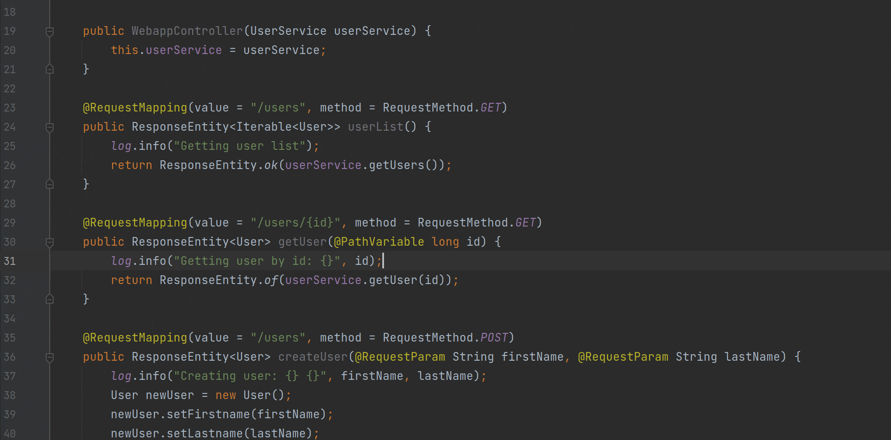
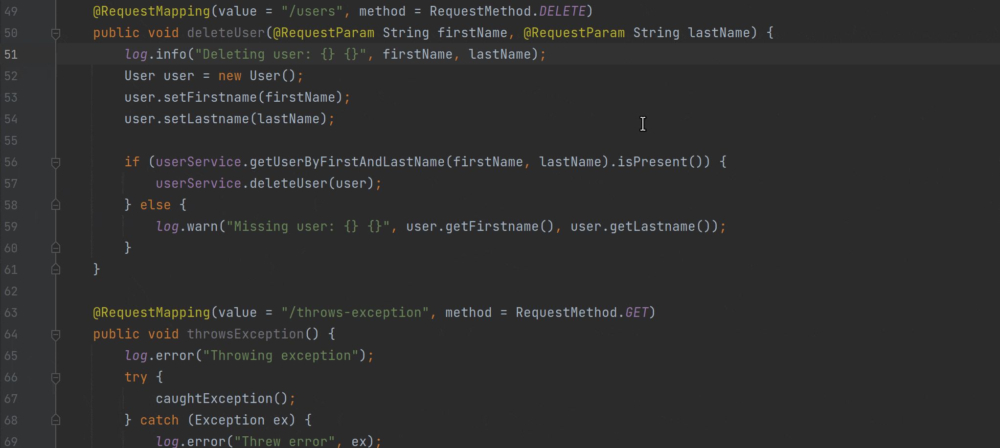
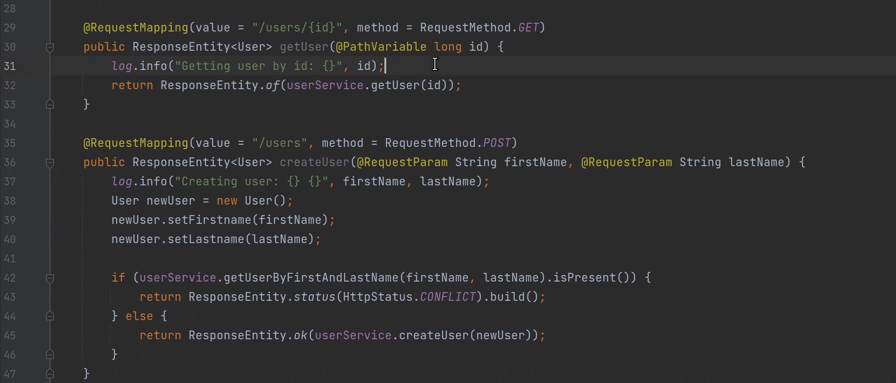

Read this post in original language: [English](https://skywalking.apache.org/blog/2022-04-14-integrating-skywalking-with-source-code/)

## 介绍

> 最具影响力的技术是那些消失的技术。他们交织在日常生活中，直到二者完全相融。 - 马克韦瑟

马克韦瑟在 1980 年代后期预言，影响最深远的技术是那些消失在空气中的技术。

“当人们足够熟知它，就不会再意识到它。”

正如韦瑟所说，这种消失的现象不只源于技术，更是人类的心理。
正是这种经验使我们能够摆脱对底层的考量，进入更高层次的思考。
一旦我们不再被平凡的细枝末节所阻碍，我们就可以自如地专注于新的目标。

随着 APM(应用性能管理系统) 变得越来越普遍，这种认识变得更加重要。随着更多的应用程序开始使用 APM 部署，底层源代码抽象表示的数量也在同步增加。
虽然这为组织内的许多非开发角色提供了巨大的价值，但它确实也对开发人员提出了额外的挑战 -
他们必须将这些表示转化为可操作的概念（即源代码）。
对此，韦瑟相当简洁的总结道,“就像不应要求汽车机械师在不查看引擎的情况下工作一样，我们不应要求程序员在不访问源代码的情况下工作”。

尽管如此，APM 收集更多信息只是为了产生充足的新抽象表示。
在本文中，我们将介绍开源实时编码平台 [Source++](https://github.com/sourceplusplus/live-platform) 中的一个新概念，旨在让开发人员更直观地监控生产应用程序。

## 实时查看

> 我们尚且不理解在收集了数百个指标之后，是什么让程序更容易理解、修改、重复使用或借用。
我不认为我们能够通过原理程序本身而到它们的抽象接口中找到答案。答案就在源代码之中。 - 马克韦瑟

随着 APM 从“有了更好”转变为“必须拥有”，有一个基本特性阻碍了它们的普及。
它们必须从意识中消失。作为开发人员，我们不应急于打开浏览器以更好地理解底层源代码，答案就在源代码中。
相反，我们应该改进我们的工具，以便源代码直观地告诉我们需要了解的内容。
想想如果失败的代码总是表明它是如何以及为什么失败的，生活会多么简单。这就是 Source++ 背后的理念。

在我们的上一篇博客中，我们讨论了不间断断点 [Extending Apache SkyWalking](https://skywalking.apache.org/blog/2021-12-06-extend-skywalking-with-nbb/)。
我们介绍了一个名为 **Live Instruments**(实时埋点) 的概念，开发人员可以使用它轻松调试实时生产应用程序，而无需离开他们的开发环境。
而今天，我们将讨论如何通过一个名为 **Live Views**（实时查看）的新概念将现有部署的 SkyWalking 集成到您的 IDE 中。
与专为调试实时应用程序而设计的 Live Instruments (实时埋点) 不同，Live Views（实时查看）旨在提高对应用程序的理解和领悟。
这将通过输入到 Live Command Palette (实时命令面板) 中的各种命令来完成。

### 实时命令面板

Live Command Palette (LCP) 是一个当前上下文场景下的命令行面板，这个组件包含在 [Source++ JetBrains 插件中](https://github.com/sourceplusplus/interface-jetbrains)，它允许开发人员从 IDE 中直接控制和对实时应用程序发起查询。

LCP 通过键盘快捷键 (`Ctrl+Shift+S`) 打开，允许开发人员轻松了解与他们当前正在查看的源代码相关的运行指标。

目前 LCP 支持以下实时查看命令：

#### 命令：`view`（overview/activity/traces/Logs）- 查看 总览/活动/追踪/日志

`view` 查看命令会展示一个与当前源码的实时运维数据关联的弹窗。
这些命令允许开发人员查看根据相关指标过滤的传统 SkyWalking 的运维数据。

#### 命令：`watch log` - 实时监听日志

本日志命令允许开发人员实时跟踪正在运行的应用程序的每一条日志。
通过此命令开发人员无需手动查阅大量日志就可以查找特定日志语句的实例。

#### 命令：(show/hide) quick stats （显示/隐藏）快速统计

`show quick stats` 显示快速统计命令显示实时端点指标，以便快速了解端点的活动。
使用此命令，开发人员可以快速评估端点的状态并确定端点是否按预期正常运行。

## 未来的工作

> 好工具是无形的。我所指的无形，是指这个工具不会侵入你的意识；
你专注于任务，而不是工具。
眼镜就是很好的工具——你看的是世界，而不是眼镜。 - 马克韦瑟

Source++ 旨在扩展 SkyWalking，使 SkyWalking 本身变得无需感知。
为此，我们计划支持自定义的开发人员命令。
开发人员将能够构建自定义命令，以及与团队共享的命令。
这些命令将识别上下文、类型和条件，从而允许广泛的操作。
随着更多命令的添加，开发人员将能够洞悉 SkyWalking 所提供的所有功能，同时专注于最重要的源码。

如果您觉得这些功能有用，请考虑尝试使用 Source++。
您可以通过 [JetBrains Marketplace](https://plugins.jetbrains.com/plugin/12033-source-)
或直接从您的 JetBrains IDE 安装插件。
如果您有任何疑问，[请到这提 issue](https://github.com/sourceplusplus/interface-jetbrains/issues)。

欢迎随时反馈！
