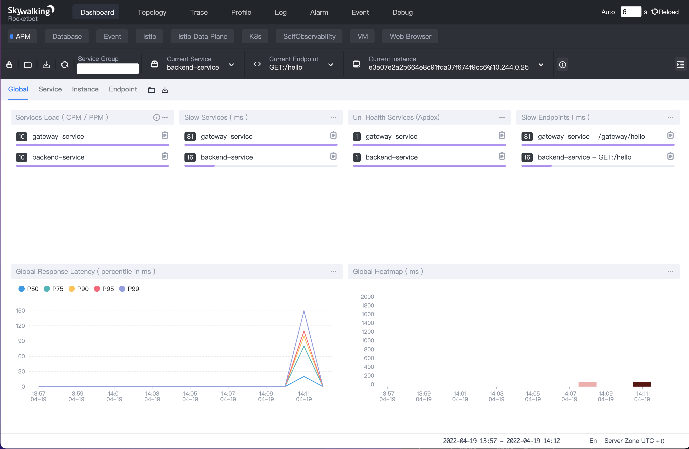
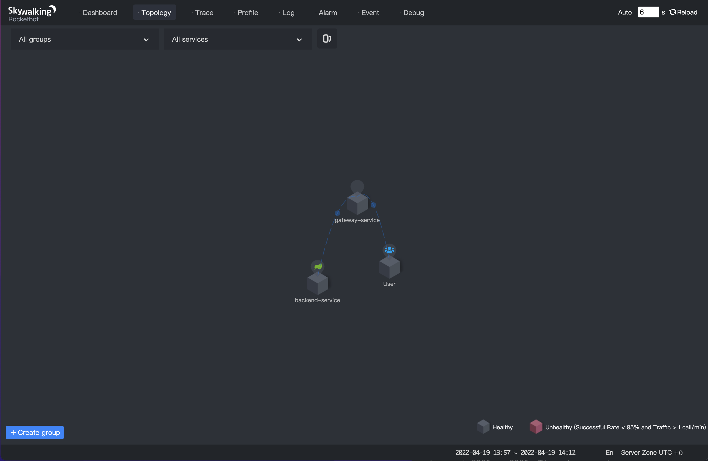

### 目录

1. [介绍](#1.-介绍)
2. [主要特点](#2.-主要特点)
3. [安装SWCK](#3.-安装SWCK)
4. [部署demo应用](#4.-部署demo应用)
5. [验证注入器](#5.-验证注入器)
6. [结束语](#6.-结束语)


## 1. 介绍


### 1.1 SWCK 是什么？

[SWCK](https://github.com/apache/skywalking-swck)是部署在 Kubernetes 环境中，为 Skywalking 用户提供服务的平台，用户可以基于该平台使用、升级和维护 SkyWalking 相关组件。

实际上，SWCK 是基于 [kubebuilder](https://book.kubebuilder.io/) 开发的Operator，为用户提供自定义资源（ CR ）以及管理资源的控制器（ Controller ），所有的自定义资源定义（CRD）如下所示：

- [JavaAgent](https://github.com/apache/skywalking-swck/blob/master/docs/operator.md#javaagent)
- [OAP](https://github.com/apache/skywalking-swck/blob/master/docs/operator.md#oap)
- [UI](https://github.com/apache/skywalking-swck/blob/master/docs/operator.md#ui)
- [Storage](https://github.com/apache/skywalking-swck/blob/master/docs/operator.md#storage)
- [Satellite](https://github.com/apache/skywalking-swck/blob/master/docs/operator.md#satellite)
- [Fetcher](https://github.com/apache/skywalking-swck/blob/master/docs/operator.md#fetcher)


### 1.2 java 探针注入器是什么？

对于 java 应用来说，用户需要将 java 探针注入到应用程序中获取元数据并发送到 Skywalking 后端。为了让用户在 Kubernetes 平台上更原生地使用 java 探针，我们提供了 java 探针注入器，该注入器能够将 java 探针通过 sidecar 方式注入到应用程序所在的 pod 中。 java 探针注入器实际上是一个[Kubernetes Mutation Webhook控制器](https://kubernetes.io/docs/reference/access-authn-authz/admission-controllers/)，如果请求中存在 [annotations](https://kubernetes.io/docs/concepts/overview/working-with-objects/annotations/) ，控制器会拦截 pod 事件并将其应用于 pod 上。


## 2. 主要特点

- **透明性**。用户应用一般运行在普通容器中而 java 探针则运行在初始化容器中，且两者都属于同一个 pod 。该 pod 中的每个容器都会挂载一个共享内存卷，为 java 探针提供存储路径。在 pod 启动时，初始化容器中的 java 探针会先于应用容器运行，由注入器将其中的探针文件存放在共享内存卷中。在应用容器启动时，注入器通过设置 JVM 参数将探针文件注入到应用程序中。用户可以通过这种方式实现 java 探针的注入，而无需重新构建包含 java 探针的容器镜像。
- **可配置性**。注入器提供两种方式配置 java 探针：全局配置和自定义配置。默认的全局配置存放在 [configmap](https://kubernetes.io/docs/concepts/configuration/configmap/) 中，用户可以根据需求修改全局配置，比如修改 `backend_service` 的地址。此外，用户也能通过 annotation 为特定应用设置自定义的一些配置，比如不同服务的 `service_name` 名称。详情可见  [java探针说明书](https://github.com/apache/skywalking-swck/blob/master/docs/java-agent-injector.md)。
- **可观察性**。每个 java 探针在被注入时，用户可以查看名为 `JavaAgent` 的 CRD 资源，用于观测注入后的 java 探针配置。详情可见 [JavaAgent说明](https://github.com/apache/skywalking-swck/blob/master/docs/javaagent.md)。


## 3. 安装SWCK

在接下来的几个步骤中，我们将演示如何从0开始搭建单机版的 Kubernetes 集群，并在该平台部署0.6.1版本的 SWCK。


### 3.1 工具准备

首先，你需要安装一些必要的工具，如下所示：

1.  [kind](http://kind.sigs.k8s.io)，用于创建单机版 Kubernetes集群。
2.  [kubectl](https://kubernetes.io/docs/tasks/tools/)，用于和Kubernetes 集群交互。


### 3.2 搭建单机版 Kubernetes集群

在安装完 [kind](http://kind.sigs.k8s.io) 工具后，可通过如下命令创建一个单机集群。

> 注意！如果你的终端配置了代理，在运行以下命令之前最好先关闭代理，防止一些意外错误的发生。

```sh
$ kind create cluster --image=kindest/node:v1.19.1
```

在集群创建完毕后，可获得如下的pod信息。

```sh
$ kubectl get pod -A                          
NAMESPACE            NAME                                         READY   STATUS    RESTARTS   AGE
kube-system          coredns-f9fd979d6-57xpc                      1/1     Running   0          7m16s
kube-system          coredns-f9fd979d6-8zj8h                      1/1     Running   0          7m16s
kube-system          etcd-kind-control-plane                      1/1     Running   0          7m23s
kube-system          kindnet-gc9gt                                1/1     Running   0          7m16s
kube-system          kube-apiserver-kind-control-plane            1/1     Running   0          7m23s
kube-system          kube-controller-manager-kind-control-plane   1/1     Running   0          7m23s
kube-system          kube-proxy-6zbtb                             1/1     Running   0          7m16s
kube-system          kube-scheduler-kind-control-plane            1/1     Running   0          7m23s
local-path-storage   local-path-provisioner-78776bfc44-jwwcs      1/1     Running   0          7m16s
```


### 3.3 安装证书管理器(cert-manger)

 SWCK 的证书都是由证书管理器分发和验证，需要先通过如下命令安装[证书管理器cert-manger](https://cert-manager.io/docs/)。

```sh
$ kubectl apply -f https://github.com/jetstack/cert-manager/releases/download/v1.3.1/cert-manager.yaml
```

验证 cert-manger 是否安装成功。

```sh
$ kubectl get pod -n cert-manager
NAME                                       READY   STATUS    RESTARTS   AGE
cert-manager-7dd5854bb4-slcmd              1/1     Running   0          73s
cert-manager-cainjector-64c949654c-tfmt2   1/1     Running   0          73s
cert-manager-webhook-6bdffc7c9d-h8cfv      1/1     Running   0          73s
```


### 3.4 安装SWCK

 java 探针注入器是 SWCK 中的一个组件，首先需要按照如下步骤安装 SWCK：

1. 输入如下命令获取 SWCK 的 yaml 文件并部署在 Kubernetes 集群中。

```sh
$ curl -Ls https://archive.apache.org/dist/skywalking/swck/0.6.1/skywalking-swck-0.6.1-bin.tgz | tar -zxf - -O ./config/operator-bundle.yaml | kubectl apply -f -
```

2. 检查 SWCK 是否正常运行。

```sh
$ kubectl get pod -n skywalking-swck-system
NAME                                                  READY   STATUS    RESTARTS   AGE
skywalking-swck-controller-manager-7f64f996fc-qh8s9   2/2     Running   0          94s
```


### 3.5 安装 Skywalking 组件 — OAPServer 和 UI

1. 在 `default` 命名空间中部署 OAPServer 组件和 UI 组件。

```sh
$ kubectl apply -f https://raw.githubusercontent.com/apache/skywalking-swck/master/operator/config/samples/default.yaml
```

2. 查看 OAPServer 组件部署情况。

```sh
$ kubectl get oapserver
NAME      INSTANCES   RUNNING   ADDRESS
default   1           1         default-oap.default
```

3. 查看 UI 组件部署情况。

```sh
$ kubectl get ui
NAME      INSTANCES   RUNNING   INTERNALADDRESS      EXTERNALIPS   PORTS
default   1           1         default-ui.default                 [80]
```


## 4. 部署demo应用

在第3个步骤中，我们已经安装好 SWCK 以及相关的 Skywalking 组件，接下来按照全局配置以及自定义配置两种方式，通过两个 java 应用实例，分别演示如何使用 SWCK 中的 java 探针注入器。


### 4.1 设置全局配置

当 SWCK 安装完成后，默认的全局配置就会以 configmap 的形式存储在系统命令空间中，可通过如下命令查看。

```sh
$  kubectl get configmap skywalking-swck-java-agent-configmap -n skywalking-swck-system -oyaml
apiVersion: v1
data:
  agent.config: |-
    # The service name in UI
    agent.service_name=${SW_AGENT_NAME:Your_ApplicationName}

    # Backend service addresses.
    collector.backend_service=${SW_AGENT_COLLECTOR_BACKEND_SERVICES:127.0.0.1:11800}

    # Please refer to https://skywalking.apache.org/docs/skywalking-java/latest/en/setup/service-agent/java-agent/configurations/#table-of-agent-configuration-properties to get more details.
```

在 `kind` 创建的 Kubernetes 集群中， SkyWalking 后端地址和 configmap 中指定的地址可能不同，我们需要使用真正的 OAPServer 组件的地址 `default-oap.default` 来代替默认的 `127.0.0.1` ，可通过修改 configmap 实现。

```sh
$ kubectl edit configmap skywalking-swck-java-agent-configmap -n skywalking-swck-system
configmap/skywalking-swck-java-agent-configmap edited

$ kubectl get configmap skywalking-swck-java-agent-configmap -n skywalking-swck-system -oyaml
apiVersion: v1
data:
  agent.config: |-
    # The service name in UI
    agent.service_name=${SW_AGENT_NAME:Your_ApplicationName}

    # Backend service addresses.
    collector.backend_service=${SW_AGENT_COLLECTOR_BACKEND_SERVICES:default-oap.default:11800}

    # Please refer to https://skywalking.apache.org/docs/skywalking-java/latest/en/setup/service-agent/java-agent/configurations/#table-of-agent-configuration-properties to get more details.
```


### 4.2 设置自定义配置

在实际使用场景中，我们需要使用 Skywalking 组件监控不同的 java 应用，因此不同应用的探针配置可能有所不同，比如应用的名称、应用需要使用的插件等。为了支持自定义配置，注入器提供 annotation 来覆盖默认的全局配置。接下来我们将分别以基于 `spring boot` 以及 `spring cloud gateway` 开发的两个简单java应用为例进行详细说明，你可以使用这两个应用的[源代码](https://github.com/dashanji/swck-spring-cloud-k8s-demo)构建镜像。

```sh
# build the springboot and springcloudgateway image 
$ git clone https://github.com/dashanji/swck-spring-cloud-k8s-demo 
$ cd swck-spring-cloud-k8s-demo && make

# check the image
$ docker images
REPOSITORY     TAG       IMAGE ID       CREATED          SIZE
gateway        v0.0.1    51d16251c1d5   48 minutes ago   723MB
app            v0.0.1    62f4dbcde2ed   48 minutes ago   561MB

# load the image into the cluster
$ kind load docker-image app:v0.0.1 && kind load docker-image gateway:v0.0.1
```


### 4.3 部署 spring boot 应用

1. 创建 `springboot-system` 命名空间。

```sh
$ kubectl create namespace springboot-system
```

2. 给 `springboot-system` 命名空间打上标签使能 java 探针注入器。

```sh
$ kubectl label namespace springboot-system swck-injection=enabled
```

3. 接下来为 spring boot 应用对应的部署文件 `springboot.yaml` ，其中使用了 annotation 覆盖默认的探针配置，比如 `service_name` ，将其覆盖为 `backend-service` 。

> 需要注意的是，在使用 annotation 覆盖探针配置之前，需要增加 `strategy.skywalking.apache.org/agent.Overlay: "true"` 来使覆盖生效。

```yaml
apiVersion: apps/v1
kind: Deployment
metadata:
  name: demo-springboot
  namespace: springboot-system
spec:
  selector:
    matchLabels:
      app: demo-springboot
  template:
    metadata:
      labels:
        swck-java-agent-injected: "true"  # enable the java agent injector
        app: demo-springboot
      annotations:
        strategy.skywalking.apache.org/agent.Overlay: "true"  # enable the agent overlay
        agent.skywalking.apache.org/agent.service_name: "backend-service"
    spec:
      containers:
      - name: springboot
        imagePullPolicy: IfNotPresent
        image: app:v0.0.1
        command: ["java"]
        args: ["-jar","/app.jar"]
---
apiVersion: v1
kind: Service
metadata:
  name: demo
  namespace: springboot-system
spec:
  type: ClusterIP
  ports:
  - name: 8085-tcp
    port: 8085
    protocol: TCP
    targetPort: 8085
  selector:
    app: demo-springboot
```

4. 在 `springboot-system` 命名空间中部署 `spring boot` 应用。

```sh
$ kubectl apply -f springboot.yaml
```

5. 查看部署情况。

```sh
$ kubectl get pod -n springboot-system
NAME                               READY   STATUS    RESTARTS   AGE
demo-springboot-7c89f79885-dvk8m   1/1     Running   0          11s
```

6. 通过 `JavaAgent` 查看最终注入的 java 探针配置。

```sh
$ kubectl get javaagent -n springboot-system
NAME                            PODSELECTOR           SERVICENAME       BACKENDSERVICE
app-demo-springboot-javaagent   app=demo-springboot   backend-service   default-oap.default:11800
```


### 4.4 部署 spring cloud gateway 应用

1. 创建 `gateway-system` 命名空间。

```sh
$ kubectl create namespace gateway-system
```

2. 给 `gateway-system` 命名空间打上标签使能 java 探针注入器。

```sh
$ kubectl label namespace gateway-system swck-injection=enabled
```

3. 接下来为 spring cloud gateway 应用对应的部署文件 `springgateway.yaml` ，其中使用了 annotation 覆盖默认的探针配置，比如 `service_name` ，将其覆盖为 `gateway-service` 。此外，在使用 `spring cloud gateway` 时，我们需要在探针配置中添加 `spring cloud gateway` 插件。

> 需要注意的是，在使用 annotation 覆盖探针配置之前，需要增加 `strategy.skywalking.apache.org/agent.Overlay: "true"` 来使覆盖生效。

```yaml
apiVersion: apps/v1
kind: Deployment
metadata:
  labels:
    app: demo-gateway
  name: demo-gateway
  namespace: gateway-system
spec:
  selector:
    matchLabels:
      app: demo-gateway
  template:
    metadata:
      labels:
        swck-java-agent-injected: "true"
        app: demo-gateway
      annotations:
        strategy.skywalking.apache.org/agent.Overlay: "true"
        agent.skywalking.apache.org/agent.service_name: "gateway-service"     
        optional.skywalking.apache.org: "cloud-gateway-3.x" # add spring cloud gateway plugin
    spec:
      containers:
      - image: gateway:v0.0.1
        name: gateway
        command: ["java"]
        args: ["-jar","/gateway.jar"]
---
apiVersion: v1
kind: Service
metadata:
  name: service-gateway
  namespace: gateway-system
spec:
  type: ClusterIP
  ports:
  - name: 9999-tcp
    port: 9999
    protocol: TCP
    targetPort: 9999
  selector:
    app: demo-gateway
```

4. 在 `gateway-system` 命名空间中部署 `spring cloud gateway` 应用。

```sh
$ kubectl apply -f springgateway.yaml
```

5. 查看部署情况。

```sh
$ kubectl get pod -n gateway-system
NAME                           READY   STATUS    RESTARTS   AGE
demo-gateway-758899c99-6872s   1/1     Running   0          15s
```

6. 通过 `JavaAgent` 获取最终注入的java探针配置。

```sh
$ kubectl get javaagent -n gateway-system
NAME                         PODSELECTOR        SERVICENAME       BACKENDSERVICE
app-demo-gateway-javaagent   app=demo-gateway   gateway-service   default-oap.default:11800
```


## 5. 验证注入器

1. 当完成上述步骤后，我们可以查看被注入pod的详细状态，比如被注入的`agent`容器。

```sh
# get all injected pod
$ kubectl get pod -A -lswck-java-agent-injected=true
NAMESPACE           NAME                               READY   STATUS    RESTARTS   AGE
gateway-system      demo-gateway-5bb77f6d85-lt4z7      1/1     Running   0          69s
springboot-system   demo-springboot-7c89f79885-lkb5j   1/1     Running   0          75s

# view detailed state of the injected pod [demo-springboot]
$ kubectl describe pod -l app=demo-springboot -n springboot-system
...
Events:
  Type   Reason   Age                From                           Message
  ----   ------  ----                ----                           -------
  ...
  Normal Created  91s  kubelet,kind-control-plane Created  container inject-skywalking-agent
  Normal Started  91s  kubelet,kind-control-plane Started  container inject-skywalking-agent
  ...
  Normal Created  90s  kubelet,kind-control-plane Created  container springboot
  Normal Started  90s  kubelet,kind-control-plane Started  container springboot

# view detailed state of the injected pod [demo-gateway] 
$ kubectl describe pod -l app=demo-gateway -n gateway-system
...
Events:
  Type   Reason   Age            From                         Message
  ----   ------  ----            ----                         -------
  ...
  Normal Created 2m20s kubelet,kind-control-plane Created container inject-skywalking-agent
  Normal Started 2m20s kubelet,kind-control-plane Started container inject-skywalking-agent
  ...
  Normal Created 2m20s kubelet,kind-control-plane Created container gateway
  Normal Started 2m20s kubelet,kind-control-plane Started container gateway
```

2. 现在我们可以将服务绑定在某个端口上并通过 web 浏览器查看采样数据。首先，我们需要通过以下命令获取`gateway`服务和`ui`服务的信息。

```sh
$ kubectl get service service-gateway -n gateway-system
NAME              TYPE        CLUSTER-IP      EXTERNAL-IP   PORT(S)    AGE
service-gateway   ClusterIP   10.99.181.145   <none>        9999/TCP   9m19s

$ kubectl get service default-ui
NAME         TYPE        CLUSTER-IP      EXTERNAL-IP   PORT(S)   AGE
default-ui   ClusterIP   10.111.39.250   <none>        80/TCP    82m
```

3. 接下来分别启动2个终端将`service-gateway` 以及 `default-ui` 绑定到本地端口上，如下所示：

```sh
$ kubectl port-forward service/service-gateway -n gateway-system 9999:9999
Forwarding from 127.0.0.1:9999 -> 9999
Forwarding from [::1]:9999 -> 9999
```

```sh
$ kubectl port-forward service/default-ui 8090:80                     
Forwarding from 127.0.0.1:8090 -> 8080
Forwarding from [::1]:8090 -> 8080
```

4. 使用以下命令通过`spring cloud gateway` 网关服务暴露的端口来访问 `spring boot` 应用服务。

```sh
$ for i in {1..10}; do curl http://127.0.0.1:9999/gateway/hello && echo ""; done
Hello World!
Hello World!
Hello World!
Hello World!
Hello World!
Hello World!
Hello World!
Hello World!
Hello World!
Hello World!
```

5. 我们可以在 web 浏览器中输入 `http://127.0.0.1:8090` 来访问探针采集到的数据。



6. 所有服务的拓扑图如下所示。



7. 查看 `gateway-service` 网关服务的 trace 信息。


8. 查看 `backend-service` 应用服务的 trace 信息。


## 6. 结束语

如果你的应用部署在 Kubernetes 平台中，且需要 Skywalking 提供监控服务， SWCK 能够帮助你部署、升级和维护 Kubernetes 集群中的 Skywalking 组件。除了本篇博客外，你还可以查看 [SWCK文档](https://github.com/apache/skywalking-swck/blob/master/docs/operator.md#operator-usage-guide) 以及 [java探针注入器文档](https://github.com/apache/skywalking-swck/blob/master/docs/java-agent-injector.md) 获取更多的信息。如果你觉得这个项目好用，请给 [SWCK](https://github.com/apache/skywalking-swck) 一个star! 如果你有任何疑问，欢迎在[Issues](https://github.com/apache/skywalking/issues)或者[Discussions](https://github.com/apache/skywalking/discussions)中提出。

