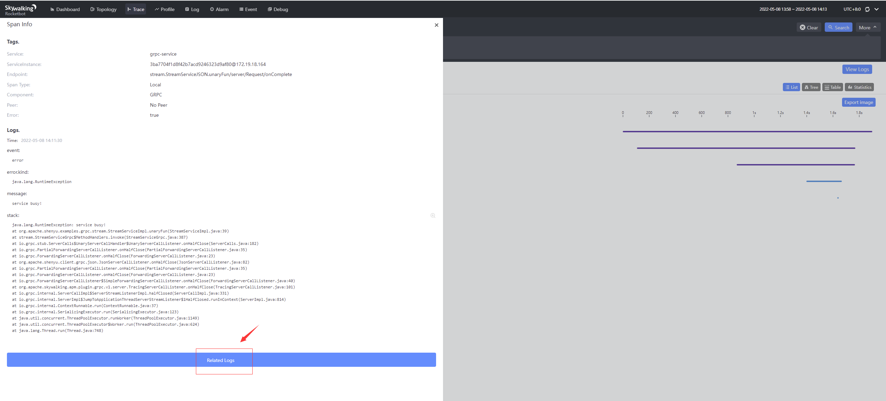
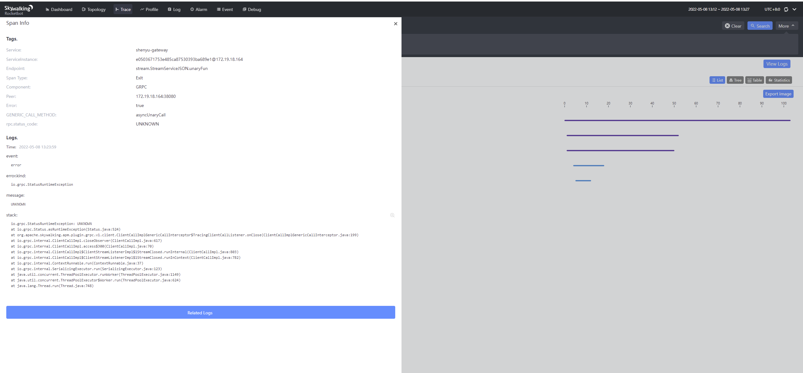

### 目录

1. [SkyWalking和ShenYu介绍](#1.-SkyWalking和ShenYu介绍)
2. [ApacheShenYu插件实现原理](#2.-ApacheShenYu插件实现原理)
3. [给gRPC插件增加泛化调用追踪并保持兼容](#3.-给gRPC插件增加泛化调用追踪并保持兼容)
4. [ShenYu网关可观测性实践](#4.-ShenYu网关可观测性实践)
5. [总结](#5.-总结)

## 1.SkyWalking和ShenYu介绍

### 1.1 SkyWalking

[SkyWalking](https://github.com/hutaishi/skywalking)是一个针对微服务、分布式系统、云原生的应用性能监控(APM)和可观测性分析平台(OAP),
拥有强大的功能，提供了多维度应用性能分析手段，包含分布式拓扑图、应用性能指标、分布式链路追踪、日志关联分析和告警。同时还拥有非常丰富的生态。广泛应用于各个公司和开源项目。

### 1.2 Apache ShenYu (incubating)

[Apache ShenYu (incubating)](https://github.com/apache/incubator-shenyu)是一个高性能，多协议，易扩展，响应式的API网关。
兼容各种主流框架体系，支持热插拔，用户可以定制化开发，满足用户各种场景的现状和未来需求，经历过大规模场景的锤炼。
支持丰富的协议：`Http`、`Spring Cloud`、`gRPC`、`Dubbo`、`SOFARPC`、`Motan`、`Tars`等等。

## 2.ApacheShenYu插件实现原理

ShenYu的异步和以往接触的异步有一点不一样，是一种全链路异步，每一个插件的执行都是异步的，并且线程切换并不是单一固定的情况(和各个插件实现有关)。
网关会发起各种协议类型的服务调用，现有的SkyWalking插件发起服务调用的时候会创建ExitSpan(同步或异步).  网关接收到请求会创建异步的EntrySpan。
异步的EntrySpan需要和同步或异步的ExitSpan串联起来，否则链路会断。
串联方案有2种：
- **快照传递**： 将创建EntrySpan之后的快照通过某种方式传递到创建ExitSpan的线程中。  
 目前这种方式应用在异步的WebClient插件中，该插件能接收异步快照。ShenYu代理Http服务或SpringCloud服务便是通过快照传递实现span串联。
- **LocalSpan中转**
 其它Rpc类插件不像异步WebClient那样可以接收快照实现串联。尽管你可以改动其它Rpc插件让其接收快照实现串联，但不推荐也没必要，
 因为可以通过在创建ExitSpan的线程中，创建一个LocalSpan就可以实现和ExitSpan串联，然后将异步的EntrySpan和LocalSpan通过`快照传递`的方式串联。这样实现完全可以不改动原先插件的代码。

span连接如下图所示:  

也许你会问是否可以在一个通用的插件里面创建LocalSpan,而不是ShenYu Rpc插件分别创建一个？
答案是不行，因为需要保证LocalSpan和ExitSpan在同一个线程，而ShenYu是全链路异步. 在实现上创建LocalSpan的代码是复用的。

## 3. 给gRPC插件增加泛化调用追踪并保持兼容

现有的SkyWalking gRPC插件只支持通过存根的方式发起的调用。而对于网关而言并没有proto文件，网关采取的是泛化调用(不通过存根)，所以追踪rpc请求，你会发现链路会在网关节点断掉。
在这种情况下，需要让gRPC插件支持泛化调用，而同时需要保持兼容，不影响原先的追踪方式。实现上通过判断请求参数是否是动态消息(DynamicMessage)，如果不是则走原先通过存根的追踪逻辑，
如果是则走泛化调用追踪逻辑。另外的兼容则是在grpc新旧版本的差异，以及获取服务端IP各种情况的兼容，感兴趣的可以看看源码。

## 4. ShenYu网关可观测性实践
上面讲解了SkyWalking ShenYu插件的实现原理，下面部署应用看下效果。SkyWalking功能强大，除了了链路追踪需要开发插件外，其它功能强大功能开箱即用。
这里只描述链路追踪和应用性能剖析部分，如果想体验SkyWalking功能的强大，请参考[SkyWalking官方文档](https://skywalking.apache.org/)

### 4.1 部署应用

- 将SkyWalking Agent打包后(` ./mvnw clean package -Pall -DskipTests`, 推荐直接从[官网下载](https://skywalking.apache.org/downloads/) )，对于shenyu网关的追踪，将shenyu插件放到plugins目录下
- 对要追踪的服务，启动jar的命令加入如下参数：`-javaagent:skywalking-agent.jar's path -DSW_AGENT_NAME=Your_ApplicationName`
- 本地环境体验效果可以直接使用H2数据库，开箱即用，生产环境根据具体情况改动agent.config

### 4.2 向网关发起请求
通过postman客户端向网关发起各种服务。

### 4.3 请求拓扑图

### 4.4 请求链路(以gRPC为例)

正常链路：  

异常链路：  

点击链路节点变可以看到对应的节点信息和异常信息  
服务提供者span

网关请求span

### 4.5 服务指标监控

服务指标监控

### 4.6 数据库指标监控

### 4.7 JVM监控

### 4.8 接口分析

### 4.9 异常日志和异常链路分析
[日志配置见官方文档](https://skywalking.apache.org/docs/skywalking-java/latest/en/setup/service-agent/java-agent/application-toolkit-logback-1.x/)

日志监控

异常日志对应的分布式链路追踪详情

## 5. 总结
SkyWalking在可观测性方面对指标、链路追踪、日志有着非常全面的支持，功能强大，简单易用，专为大型分布式系统、微服务、云原生、容器架构而设计，拥有丰富的生态。
使用SkyWalking为Apache ShenYu (incubating)提供强大的可观测性支持，让ShenYu如虎添翼。最后，如果你对高性能响应式网关感兴趣，可以关注
[Apache ShenYu (incubating)](https://github.com/apache/incubator-shenyu) 。
同时感谢SkyWalking这么优秀的开源软件对行业所作的贡献。