### 目录

1. [SkyWalking 和 ShenYu 介绍](#1.-SkyWalking和ShenYu介绍)
2. [ApacheShenYu 插件实现原理](#2.-ApacheShenYu插件实现原理)
3. [给 gRPC 插件增加泛化调用追踪并保持兼容](#3.-给gRPC插件增加泛化调用追踪并保持兼容)
4. [ShenYu 网关可观测性实践](#4.-ShenYu网关可观测性实践)
5. [总结](#5.-总结)

## 1.SkyWalking 和 ShenYu 介绍

### 1.1 SkyWalking

[SkyWalking](https://github.com/hutaishi/skywalking)是一个针对微服务、分布式系统、云原生的应用性能监控(APM)和可观测性分析平台(OAP),
拥有强大的功能，提供了多维度应用性能分析手段，包含分布式拓扑图、应用性能指标、分布式链路追踪、日志关联分析和告警。同时还拥有非常丰富的生态。广泛应用于各个公司和开源项目。

### 1.2 Apache ShenYu (incubating)

[Apache ShenYu (incubating)](https://github.com/apache/incubator-shenyu)是一个高性能，多协议，易扩展，响应式的 API 网关。
兼容各种主流框架体系，支持热插拔，用户可以定制化开发，满足用户各种场景的现状和未来需求，经历过大规模场景的锤炼。
支持丰富的协议：`Http`、`Spring Cloud`、`gRPC`、`Dubbo`、`SOFARPC`、`Motan`、`Tars`等等。

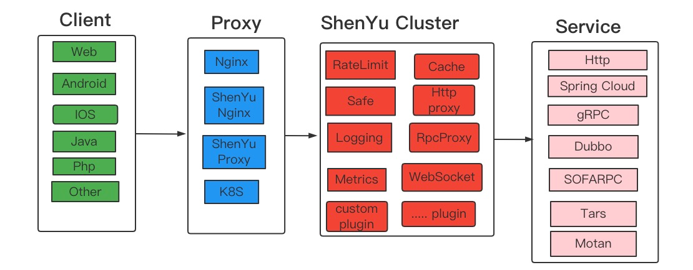

## 2.ApacheShenYu 插件实现原理

ShenYu 的异步和以往接触的异步有一点不一样，是一种全链路异步，每一个插件的执行都是异步的，并且线程切换并不是单一固定的情况(和各个插件实现有关)。
网关会发起各种协议类型的服务调用，现有的 SkyWalking 插件发起服务调用的时候会创建 ExitSpan(同步或异步). 网关接收到请求会创建异步的 EntrySpan。
异步的 EntrySpan 需要和同步或异步的 ExitSpan 串联起来，否则链路会断。
串联方案有 2 种：

- **快照传递**： 将创建 EntrySpan 之后的快照通过某种方式传递到创建 ExitSpan 的线程中。  
  目前这种方式应用在异步的 WebClient 插件中，该插件能接收异步快照。ShenYu 代理 Http 服务或 SpringCloud 服务便是通过快照传递实现 span 串联。
- **LocalSpan 中转**：
  其它 RPC 类插件不像异步 WebClient 那样可以接收快照实现串联。尽管你可以改动其它 RPC 插件让其接收快照实现串联，但不推荐也没必要，
  因为可以通过在创建 ExitSpan 的线程中，创建一个 LocalSpan 就可以实现和 ExitSpan 串联，然后将异步的 EntrySpan 和 LocalSpan 通过`快照传递`的方式串联。这样实现完全可以不改动原先插件的代码。

span 连接如下图所示:  
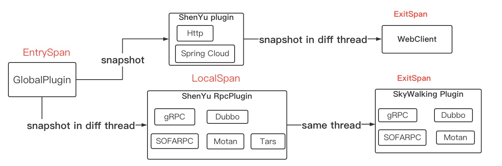

也许你会问是否可以在一个通用的插件里面创建 LocalSpan,而不是 ShenYu RPC 插件分别创建一个？
答案是不行，因为需要保证 LocalSpan 和 ExitSpan 在同一个线程，而 ShenYu 是全链路异步. 在实现上创建 LocalSpan 的代码是复用的。

## 3. 给 gRPC 插件增加泛化调用追踪并保持兼容

现有的 SkyWalking gRPC 插件只支持通过存根的方式发起的调用。而对于网关而言并没有 proto 文件，网关采取的是泛化调用(不通过存根)，所以追踪 rpc 请求，你会发现链路会在网关节点断掉。
在这种情况下，需要让 gRPC 插件支持泛化调用，而同时需要保持兼容，不影响原先的追踪方式。实现上通过判断请求参数是否是动态消息(DynamicMessage)，如果不是则走原先通过存根的追踪逻辑，
如果是则走泛化调用追踪逻辑。另外的兼容则是在 gRPC 新旧版本的差异，以及获取服务端 IP 各种情况的兼容，感兴趣的可以看看源码。

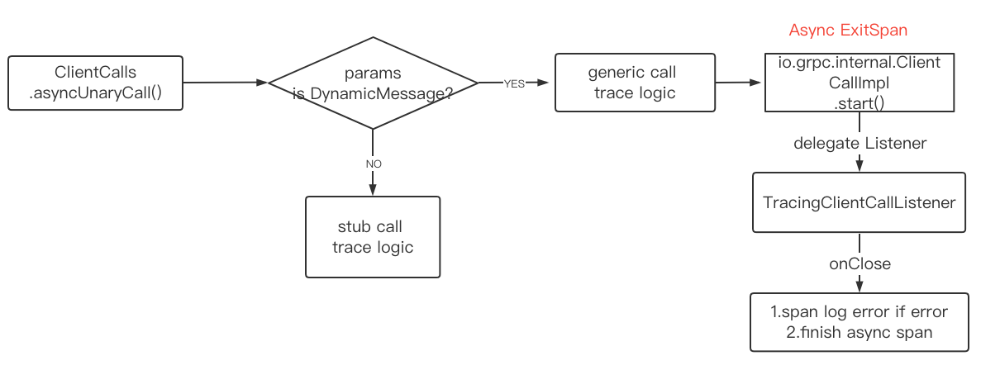

## 4. ShenYu 网关可观测性实践

上面讲解了 SkyWalking ShenYu 插件的实现原理，下面部署应用看下效果。SkyWalking 功能强大，除了了链路追踪需要开发插件外，其它功能强大功能开箱即用。
这里只描述链路追踪和应用性能剖析部分，如果想体验 SkyWalking 功能的强大，请参考[SkyWalking 官方文档](https://skywalking.apache.org/)。  
版本说明：

- skywalking-java: `8.11.0-SNAPSHOT`源码构建。说明：shenyu 插件会在 8.11.0 版本发布，可能会在 5 月或 6 月初步发布它。Java 代理正处于常规发布阶段。
- skywalking: `9.0.0` V9 版本

用法说明:  
SkyWalking 的设计非常易用，配置和激活插件请参考官方文档。

- [SkyWalking Documentation](https://skywalking.apache.org/docs/main/latest/readme/)
- [SkyWalking Java Agent Documentation](https://skywalking.apache.org/docs/skywalking-java/latest/readme/)

### 4.1 向网关发起请求

通过`postman`客户端或者其它方式向网关发起各种服务请求

### 4.2 请求拓扑图

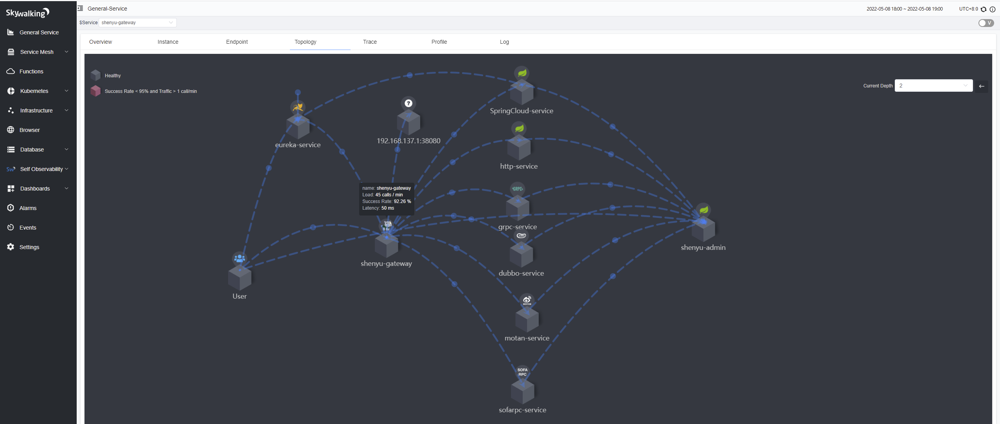

---

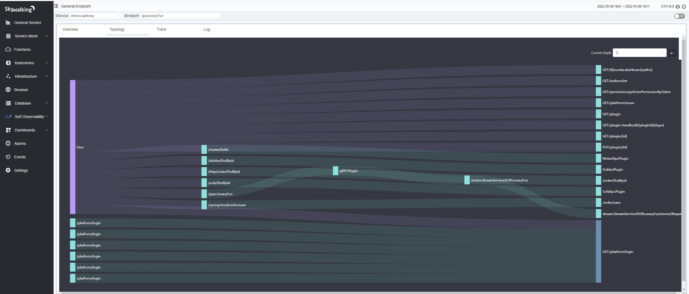

### 4.3 请求链路(以 gRPC 为例)

#### 正常链路：

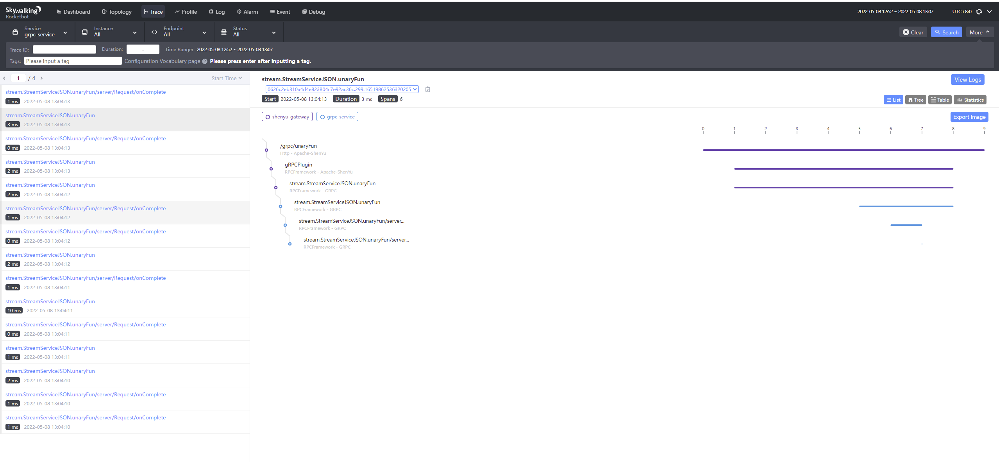

#### 异常链路：

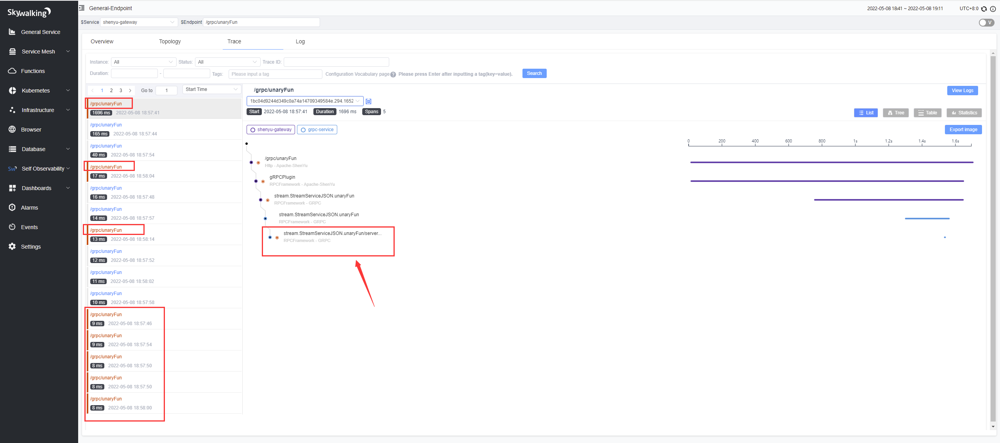

点击链路节点变可以看到对应的节点信息和异常信息

#### 服务提供者 span

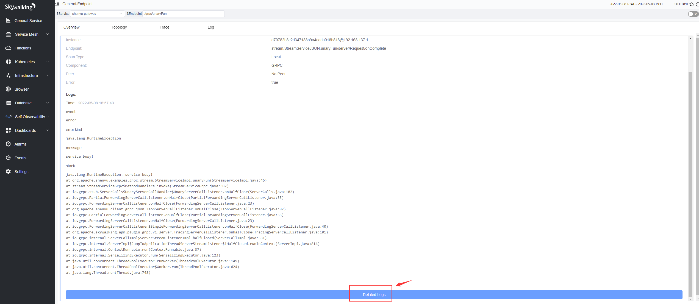

#### 网关请求 span

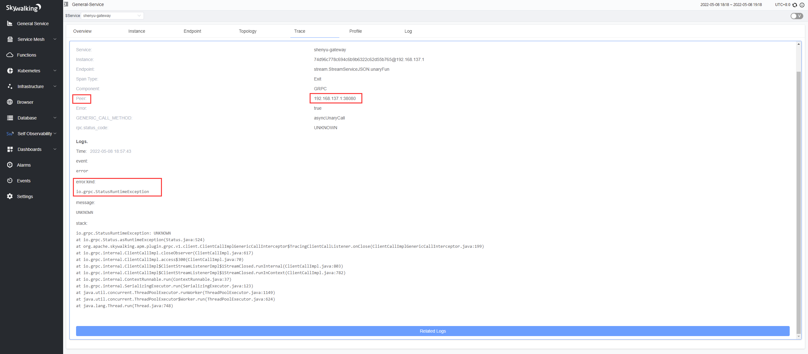

### 4.4 服务指标监控

服务指标监控
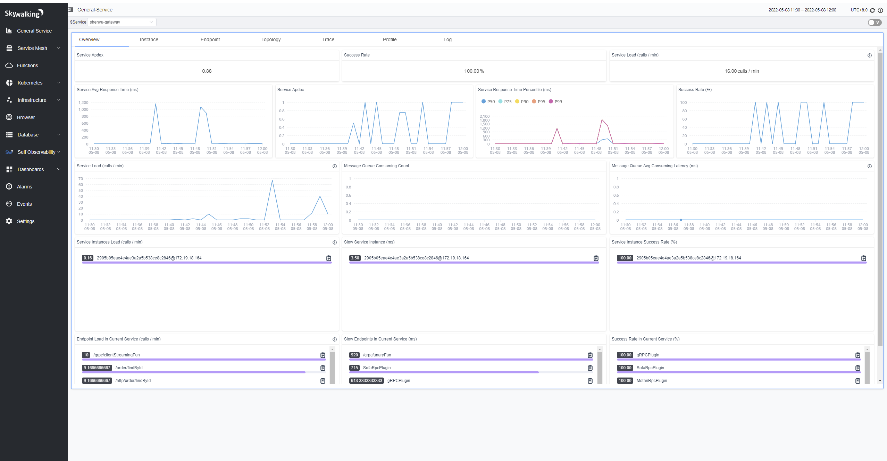

### 4.5 网关后台指标监控

#### 数据库监控:

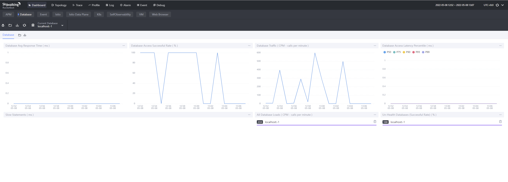

#### 线程池和连接池监控

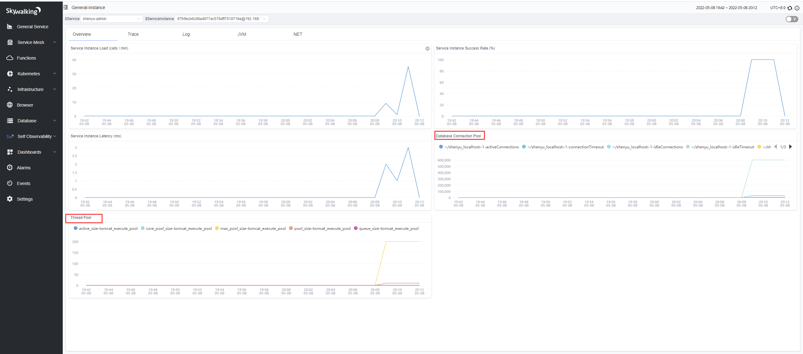

### 4.6 JVM 监控

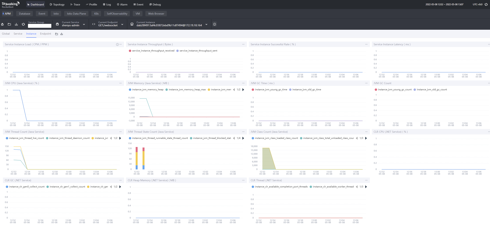

### 4.7 接口分析

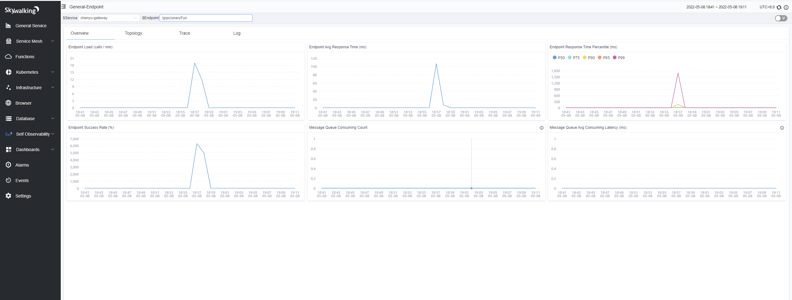

### 4.8 异常日志和异常链路分析

[日志配置见官方文档](https://skywalking.apache.org/docs/skywalking-java/latest/en/setup/service-agent/java-agent/application-toolkit-logback-1.x/)

日志监控
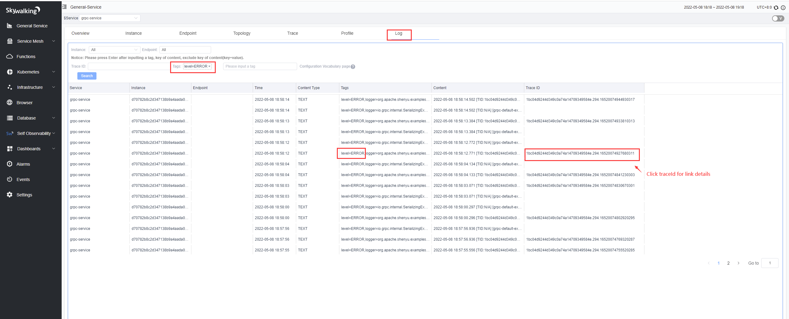

异常日志对应的分布式链路追踪详情
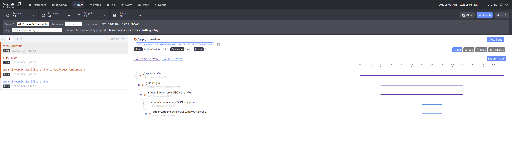

## 5. 总结

SkyWalking 在可观测性方面对指标、链路追踪、日志有着非常全面的支持，功能强大，简单易用，专为大型分布式系统、微服务、云原生、容器架构而设计，拥有丰富的生态。
使用 SkyWalking 为 Apache ShenYu (incubating)提供强大的可观测性支持，让 ShenYu 如虎添翼。最后，如果你对高性能响应式网关感兴趣，可以关注
[Apache ShenYu (incubating)](https://github.com/apache/incubator-shenyu) 。
同时感谢 SkyWalking 这么优秀的开源软件对行业所作的贡献。
