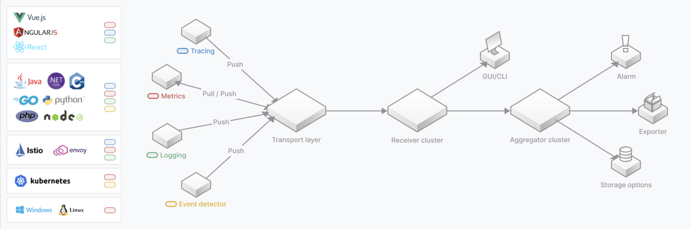
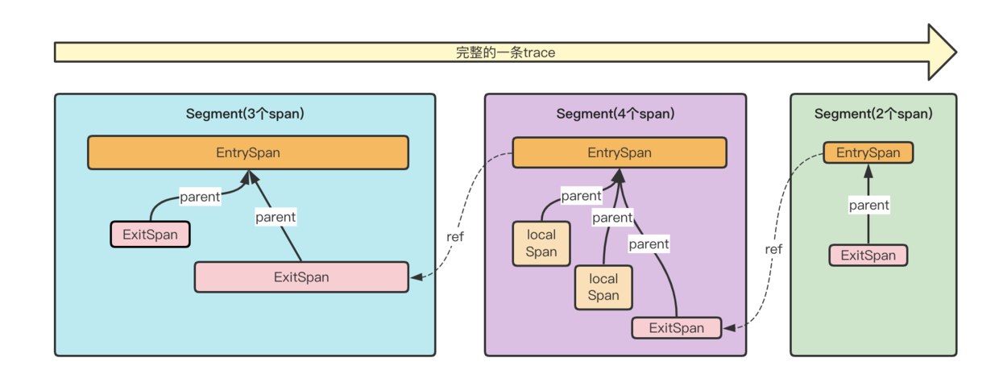
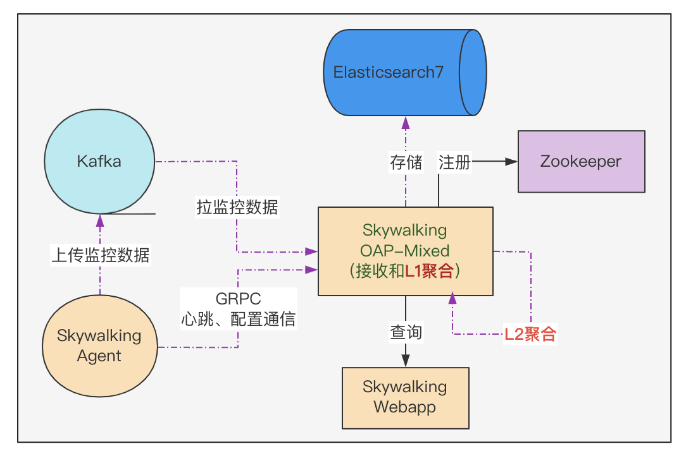
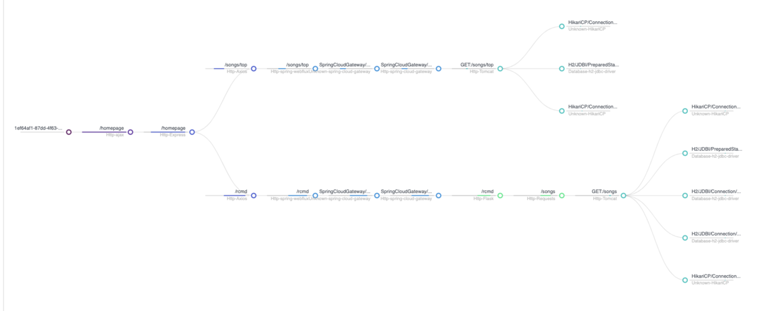
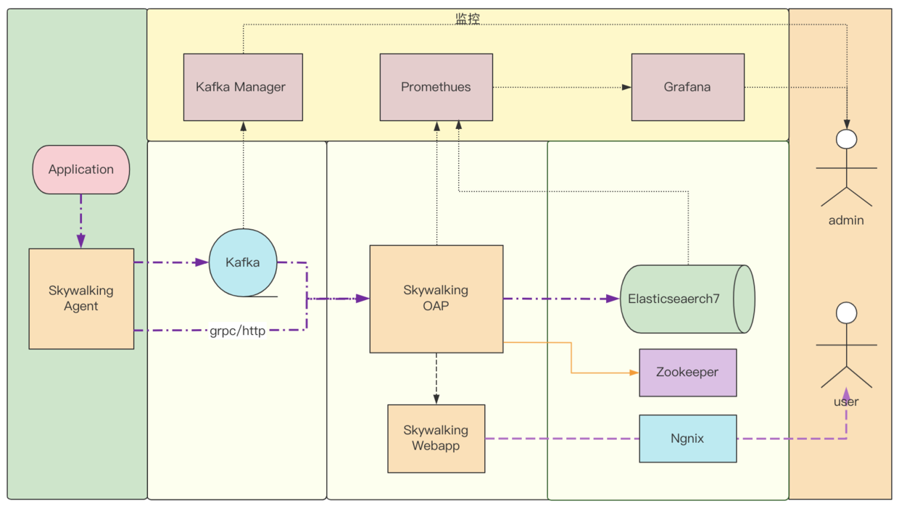
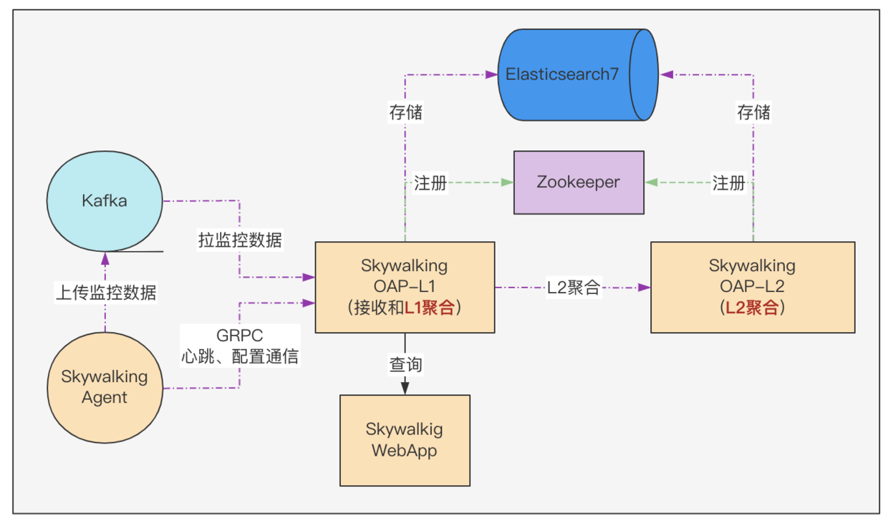
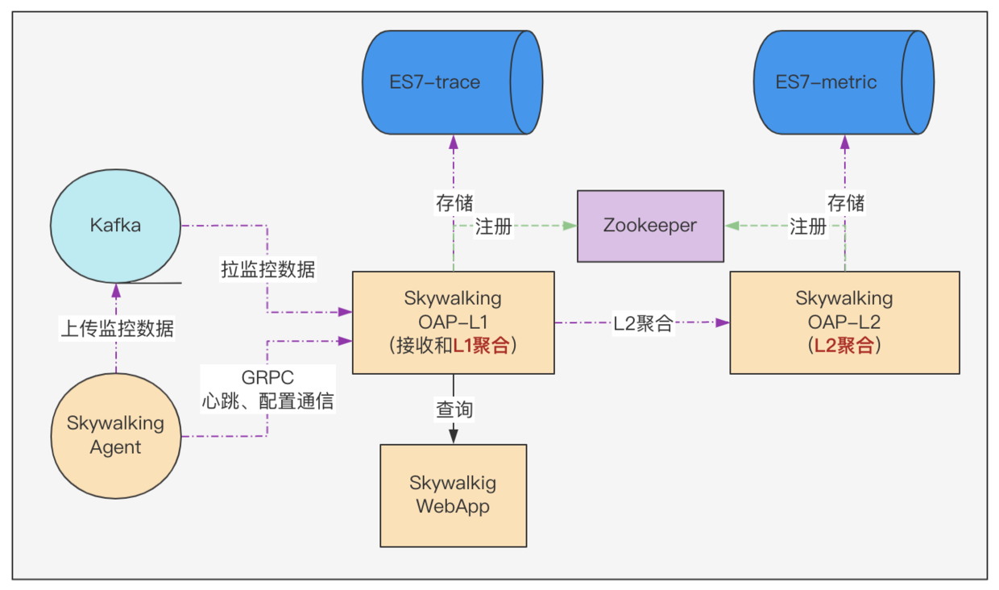
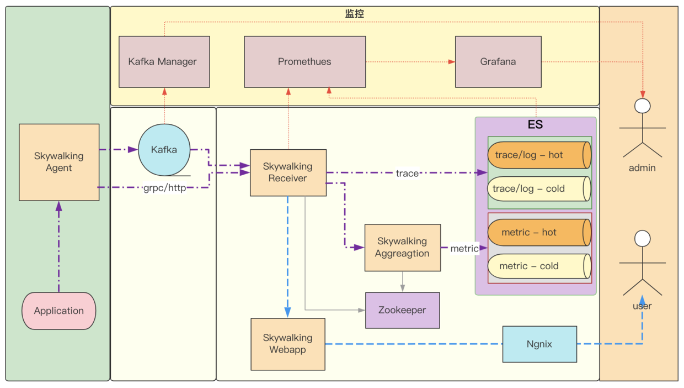

### 目录

1. 开篇
2. 为什么需要全链路监控
3. 为什么选择 SkyWalking
4. 预研
5. POC
6. 优化
7. 未来

### 1、开篇

自从 SkyWalking 开始在公司推广，时不时会在排查问题的人群中听到这样的话：“你咋还没接 SkyWalking？接入后，一眼就看出是哪儿的问题了..."，正如同事所说的，在许多情况下，SkyWalking 就是这么秀。作为实践者，我非常感谢 SkyWalking，因为这款国产全链路监控产品给公司的的伙伴们带来了实实在在的帮助；也特别感谢公司的领导和同事们，正因为他们的支持和帮助，才让这套 SkyWalking（V8.5.0）系统从起初的有用进化到现在的好用；**从几十亿的 Segment 储能上限、几十秒的查询耗时，优化到千亿级的 Segment 储能、毫秒级的查询耗时**。

小提示：

- SkyWalking 迭代速度很快，公司使用的是 8.5.0 版本，其新版本的性能肯定有改善。
- Segment 是 SkyWalking 中提出的概念，表示一次请求在某个服务内的执行链路片段的合集，一个请求在多个服务中先后产生的 Segment 串起来构成一个完整的 Trace，如下图所示：

SkyWalking 的这次实践，截止到现在有一年多的时间，回顾总结一下这段历程中的些许积累和收获，愿能反哺社区，给有需求的道友提供个案例借鉴；也希望能收获到专家们的指导建议，把项目做得更好。因为安全约束，要把有些内容和谐掉，但也努力把这段历程中那些**靓丽的风景，**尽可能完整的呈现给大家。

### 2、为什么需要全链路监控

随着微服务架构的演进，单体应用按照服务维度进行拆分，组织架构也随之演进以横向、纵向维度拆分；一个业务请求的执行轨迹，也从单体应用时期一个应用实例内一个接口，变成多个服务实例的多个接口；对应到组织架构，可能跨越多个 BU、多个 Owner。虽然微服务架构高内聚低耦合的优势是不言而喻的，但是低耦合也有明显的副作用，它在现实中给跨部门沟通、协作带来额外的不可控的开销；因此开发者尤其是终端业务侧的架构师、管理者，特别需要一些可以帮助理解系统拓扑和用于分析性能问题的工具，便于在架构调整、性能检测和发生故障时，缩减沟通协作方面的精力和时间耗费，快速定位并解决问题。

我所在的**平安健康互联网股份有限公司**（文中简称公司），是微服务架构的深度实践者。公司用互联网技术搭建医疗服务平台，致力于**构筑专业的医患桥梁，提供专业、全面、高品质、一站式企业健康管理服务**。为了进一步提高系统服务质量、提升问题响应效率，部门在 21 年结合自身的一些情况，决定对现行的全链路监控系统进行升级，目的与以下网络中常见的描述基本一致：

- 快速发现问题
- 判断故障影响范围
- 梳理服务依赖并判断依赖的合理性
- 分析链路性能并实施容量规划

### 3、为什么选择 SkyWalking

在做技术选型时，网络中搜集的资料显示，谷歌的 Dapper 系统，算是链路追踪领域的始祖。受其公开论文中提出的概念和理念的影响，一些优秀的企业、个人先后做出不少非常 nice 的产品，有些还在社区开源共建，如：韩国的 Pinpoint，Twitter 的 Zipkin，Uber 的 Jaeger 及中国的 SkyWalking 等，我司选型立项的过程中综合考虑的因素较多，这里只归纳一下 SkyWalking 吸引我们的 2 个优势：

1. 产品的完善度高：

   - java 生态，功能丰富
   - 社区活跃，迭代迅速

2. 链路追踪、拓扑分析的能力强：
   - 插件丰富，探针无侵入。
   - 采用先进的**流式拓扑分析**设计

“好东西不需要多说,实际行动告诉你“，这句话我个人非常喜欢，关于 SkyWalking 的众多的优点，网络上可以找到很多，此处先不逐一比较、赘述了。

### 4、预研

当时最新版本 8.5.0，梳理分析 8.x 的发布记录后，评估此版本的核心功能是蛮稳定的，于是基于此版本开始了 SkyWalking 的探索之旅。当时的认知是有限的，串行思维模型驱使我将关注的问题聚焦在**架构原理是怎样**、**有什么副作用**这 2 个方面：

1. 架构和原理：

   - agent 端 主要关注 Java Agent 的机制、SkyWalking Agent 端的配置、插件的工作机制、数据采集及上报的机制。
   - 服务端 主要关注 角色和职责、模块和配置、数据接收的机制、指标构建的机制、指标聚合的机制及指标存储的机制。
   - 存储端 主要关注 数据量，存储架构要求以及资源评估。

2. 副作用：
   - 功能干扰
   - 性能损耗

#### 4.1 架构和原理

SkyWalking 社区很棒，官网文档和官方出版的书籍有较系统化的讲解，因为自己在 APM 系统以及 Java Agent 方面有一些相关的经验沉淀，通过在这两个渠道的学习，对 Agent 端和 OAP(服务端)很快便有了较系统化的认知。在做系统架构选型时，评估数据量会比较大（成千上万的 JVM 实例数，每天采集的 Segment 数量可能是 50-100 亿的级别），所以传输通道选择 Kafka、存储选择 Elasticsearch，如此简易版的架构以及数据流转如下图所示：

这里有几处要解释一下：

1. Agent 上报数据给 OAP 端，有 grpc 通道和 kafka 通道，当时就盲猜 grpc 通道可能撑不住，所以选择 kafka 通道来削峰；kafka 通道是在 8.x 里加入的。
2. 千亿级的数据用 ES 来做存储肯定是可以的。
3. 图中 L1 聚合的意思是：SkyWalking OAP 服务端 接收数据后，构建 metric 并完成 metric 的 Level-1 聚合，这里简称 L1 聚合。
4. 图中 L2 聚合的意思是：服务端 基于 metric 的 Level-1 聚合结果，再做一次聚合，即 Level-2 聚合，这里简称 L2 聚合。后续把纯 Mixed 角色的集群拆成了两个集群。

#### 4.2 副作用

对于质量团队和接入方来说，他们最关注的问题是，接入 SkyWalking 后：

- 是否对应用有功能性干扰
- 在运行期能带来哪些性能损耗

这两个问题从 3 个维度来得到答案：

1. 网络资料显示：

   - Agent 带来的性能损耗在 5%以内
   - 未搜到功能性干扰相关的资料（盲猜没有这方面问题）

2. 实现机制评估：

   - 字节码增强机制是 JVM 提供的机制，SkyWalking 使用的字节码操控框架 ByteBuddy 也是成熟稳定的；通过自定义 ClassLoader 来加载管理插件类，不会产生冲突和污染。
   - Agent 内插件开发所使用的 AOP 机制是基于模板方法模式实现的，风控很到位，即使插件的实现逻辑有异常也不影响用户逻辑的执行；
   - 插件采集数据跟上报逻辑之间用了一个**轻量级的无锁环形队列**进行解耦，算是一种保护机制；这个队列在 MPSC 场景下性能还不错；队列采用满时丢弃的策略，不会有积压阻塞和 OOM。

3. 性能测试验证
   - 测试的老师针对 dubbo、http 这两种常规 RPC 通信场景，进行压力测试和稳定性测试，结果与网络资料描述一致，符合预期。

### 5、POC

在 POC 阶段，接入几十个种子应用，在非生产环境试点观察，同时完善插件补全链路，对接公司的配置中心，对接发布系统，完善自监控.全面准备达到推广就绪状态。

#### 5.1 对接发布系统

为了对接公司的发布系统，方便系统的发布，将 SkyWalking 应用拆分为 4 个子应用：

| 应用           | 介绍                                          |
| :------------- | :-------------------------------------------- |
| Webapp         | Skywalking 的 web 端                          |
| Agent          | Skywalking 的 Agent 端                        |
| OAP-Receiver   | skywakling 的服务端，角色是 Mixed 或 Receiver |
| OAP-Aggregator | skywalking 的服务端，角色是 Aggregator        |

这里有个考虑，暂定先使用纯 Mixed 角色的单集群，有性能问题时就试试 Receiver+Aggregator 双角色集群模式，最终选哪种视效果而定。

SkyWalking Agent 端是基于 Java Agent 机制实现的，采用的是启动挂载模式；启动挂载需在启动脚本里加入挂载 Java Agent 的逻辑，发布系统实现这个功能需要注意 2 点：

1. 启动脚本挂载 SkyWalking Agent 的环节，尽量让用户无感知。
2. 发布系统在挂载 Agent 的时候，给 Agent 指定应用名称和所属分组信息。

SkyWalking Agent 的发布和升级也由发布系统来负责；Agent 的升级采用了灰度管控的方案，控制的粒度是应用级和实例级两种：

1. 按照应用灰度，可给应用指定使用什么版本的 Agent
2. 按照应用的实例灰度，可给应用指定其若干实例使用什么版本的 Agent

#### 5.2 完善插件补全链路

针对公司 OLTP 技术栈，量身定制了插件套，其中大部分在开源社区的插件库中有，缺失的部分通过自研快速补齐。

这些插件给各组件的核心环节埋点，采集数据上报给 SkyWalking 后，Web 端的【追踪】页面就能勾勒出丰满完美的请求执行链路；这对架构师理解真实架构，测试同学验证逻辑变更和分析性能损耗，开发同学精准定位问题都非常的有帮助。这里借官方在线 Demo 的截图一用（抱歉后端程序员，五毛特效都没做出来，丰满画面还请自行脑补）

**友情小提示**：移除不用的插件对程序编译打包和减少应用启动耗时很有帮助。

#### 5.3 压测稳测

测试的老师，针对 SkyWalking Agent 端的插件套，设计了丰富的用例，压力测试和稳定性测试的结果都符合预期；每家公司的标准不尽一致，此处不再赘述。

#### 5.4 对接自研的配置中心

把应用中繁杂的配置交给配置中心来管理是非常必要的，配置中心既能提供启动时的静态配置，又能管理运行期的动态配置，而且外部化配置的机制特别容易满足容器场景下应用的无状态化要求。啰嗦一下，举 2 个例子：

1. 调优时，修改参数的值不用来一遍开发到测试再到生产的发布。
2. 观测系统状态，修改日志配置后不需要来一遍开发到测试再到生产的发布。

Skywaling 在外接配置中心这块儿，适配了市面中主流的配置中心产品。而公司的配置中心是自研的，需要对接一下，得益于 SkyWalking 提供的模块化管理机制，只用扩展一个模块即可。

在 POC 阶段，梳理服务端各模块的功能，能感受到其配置化做的不错，配置项很丰富，管控的粒度也很细；在 POC 阶段几乎没有变动，除了对 Webapp 模块的外部化配置稍作改造，与配置中心打通以便在配置中心管理 Webapp 模块中 Ribbon 和 Hystrix 的相关配置。

#### 5.5 完善自监控

自监控是说监控 SkyWalking 系统内各模块的运转情况：

| 组件     | 监控方案      | 说明                                                       |
| :------- | :------------ | :--------------------------------------------------------- |
| kafka    | kafka-manager | 它俩是老搭档了                                             |
| Agent 端 | Skywalking    | Agent 端会发心跳信息给服务端，可在 Web 端看到 Agent 的信息 |
| OAP 集群 | prometheus    | 指标还算丰富，感觉缺的可以自己补充                         |
| ES 集群  | prometheus    | 指标还算丰富                                               |

完善自监控后的架构如下图所示：

#### 5.6 自研 Native 端 SDK

公司移动端的应用很核心，也要使用链路追踪的功能，社区缺了这块，于是基于 SkyWalking 的协议，移动端的伙伴们自研了一套 SDK，弥补了 Native 端链路数据的缺失，也在后来的秒开页面指标统计中发挥了作用。随着口口相传，不断有团队提出需求、加入建设，所以也在持续迭代中；内容很多，这里先不展开。

#### 5.7 小结

POC 阶段数据量不大，主要是发现系统的各种功能性问题，查缺补漏。

### 6、优化

SkyWalking 的正式推广采用的是城市包围农村的策略；公司的核心应用作为第一批次接入，这个策略有几个好处：

1. 核心应用的监管是重中之重，优先级默认最高。
2. 核心应用的上下游应用，会随着大家对 SkyWalking 依赖的加深，而逐步自主接入。

当然安全是第一位的，无论新系统多好、多厉害，其引入都需遵守安全稳定的前提要求。既要安全又要快速还要方便，于是基于之前 Agent 灰度接入的能力，在发布系统中增加应用 Owner**自助式灰度接入和快速卸载**SkyWalking Agent 的能力，即应用负责人可自主选择哪个应用接入，接入几个实例，倘若遇到问题仅通过重启即可完成快速卸载；这个能力在推广的前期发挥了巨大的作用；毕竟安全第一，信任也需逐步建立。

随着应用的接入、使用，我们也逐渐遇到了一些问题，这里按照时间递增的顺序将问题和优化效果快速的介绍给大家，更多技术原理的内容计划在【SkyWalking(v8.5.0)调优系列】补充。开始之前有几个事项要说明：

1. 下文中提到的数字仅代表我司的情况，标注的 Segment 数量是处理这个问题的那段时间的情况，并不是说达到这个数量才开始出现这个现象。
2. 这些数值以及当时的现象，受到宿主机配置、Segment 数据的大小、存储处理能力等多种因素的影响；请关注调整的过程和效果，不必把数字和现象对号入座哈。

#### 6.1 启动耗时：

##### 问题：

有同事反馈应用启动变慢，排查发现容器中多数应用启动的总耗时，在接入 SkyWalking 前是 2 秒，接入后变成了 16 秒以上，公司很多核心应用的实例数很多，这样的启动损耗对它们的发布影响太大。

##### 优化：

1. 记录启动耗时并随着其他启动数据上报到服务端，方便查看对比。
2. 优化 Kafka Reporter 的启动过程，将启动耗时减少了 3-4 秒。
3. 优化类匹配和增强环节（重点）后，容器中的应用启动总耗时从之前 16 秒以上降低到了 3 秒内。
4. 梳理 Kafka 启动和上报的过程中，顺带调整了 Agent 端的数据上报到 kafka 的分区选择策略，将一个 JVM 实例中的数据全部发送到同一个的分区中，如此在 L1 层的聚合就完成了 JVM 实例级的 Metric 聚合，需注意调整 Kafka 分片数来保证负载均衡。

#### 6.2 kafka 积压-6 亿 segment/天

##### 问题：

SkyWalking OAP 端消费慢，导致 Kafka 中 Segment 积压。未能达到能用的目标。

##### 优化：

从 SkyWalking OAP 端的监控指标中没有定位出哪个环节的问题，把服务端单集群拆为双集群，即把 Mixed 角色的集群 ，修改为 Receiver 角色（接收和 L1 聚合）的集群 ，并加入 Aggregation 角色（L2 聚合）的集群，调整成了双集群模式，数据流传如下图所示：

#### 6.3 kafka 积压-8 亿 segment/天

##### 问题：

SkyWalking OAP 端消费慢，导致 Kafka 中 Segment 积压，监控指标能看出是在 ES 存储环节慢，未能达到能用的目标。

##### 优化：

1. 优化 segment 保存到 ES 的批处理过程，调整 BulkProcessor 的线程数和批处理大小。
2. 优化 metrics 保存到 ES 的批处理过程，调整批处理的时间间隔、线程数、批处理大小以及刷盘时间。

#### 6.4 kafka 积压-20 亿 segment/天

##### 问题：

Aggregation 集群的实例持续 Full GC，Receiver 集群通过 grpc 给 Aggregation 集群发送 metric 失败。未能达到能用的目标。

##### 优化：

1. 增加 ES 节点、分片，效果不明显。
2. ES 集群有压力，但无法精准定位出是什么数据的什么操作引发的。采用分治策略，尝试将数据拆分，从 OAP 服务端读写逻辑调整，将 ES 单集群拆分为 trace 集群 和 metric 集群；之后对比 ES 的监控指标明确看出是 metric 集群读写压力太大。

3. 优化 Receiver 集群 metric 的 L1 聚合，完成 1 分钟的数据聚合后，再提交给 Aggregation 集群做 L2 聚合。
4. Aggregation 集群 metric 的 L2 聚合是基于 db 实现的，会有 空读-写-再读-累加-更新写 这样的逻辑，每次写都会有读，调整逻辑是：提升读的性能，优化缓存机制减少读的触发；调整间隔，避免触发累加和更新。
5. 将 metric 批量写 ES 操作调整成 BulkProcessor。
6. ES 的 metric 集群 使用 SSD 存储，增加节点数和分片数。

这一次的持续优化具有里程碑式的意义，Kafka 消费很快，OAP 各机器的 Full GC 没了，ES 的各方面指标也很稳定；接下来开始优化查询，提升易用性。

#### 6.5 trace 查询慢-25 亿 segment/天

##### 问题：

Web 端【追踪】页中的查询都很慢，仅保存了 15 天的数据，按照 traceId 查询耗时要 20 多秒，按照条件查询 trace 列表的耗时更糟糕；这给人的感受就是“一肚子墨水倒不出来”，未能达到好用的目标。

##### 优化：

ES 查询优化方面的信息挺多，但通过百度筛选出解决此问题的有效方案，就要看咱家爱犬的品类了；当时搜集整理了并尝试了 N 多优化条款，可惜没有跟好运偶遇，结论是颜值不可靠。言归正传，影响读写性能的基本要素有 3 个：读写频率，数据规模，硬件性能；trace 的情况从这三个维度来套一套模板：

| 要素     | trace 的情况                                                       | 备注 |
| :------- | :----------------------------------------------------------------- | :--- |
| 读写频率 | 宏观来看是写多读少的状况                                           |      |
| 数据规模 | 按照每天 50 亿个 segment 来算，半个月是 750 亿，1 个月是 1500 亿。 |      |
| 硬件性能 | 普通硬盘速度一般                                                   |      |

这个分析没有得出具有指导意义的结论，读写频率这里粒度太粗，用户的使用情况跟时间也有紧密的关系，情况大概是：

1. 当天的数据是读多写多（当天不断有新数据写入，基于紧急响应的需求，问题出现时可能是近实时的排查处理）。
2. 前一天的数据是读多写少（一般也会有问题隔天密集上报的情况，0 点后会有前一天数据延迟到达的情况）。
3. 再早的话无新数据写入，数据越早被读的概率也越小。

基于以上分析，增加时间维度并细化更多的参考因素后，分析模型变成了这样：

| 要素           | 当天    | 当天-1  | 当天-2 ~ 当天-N |
| :------------- | :------ | :------ | :-------------- |
| 写频率         | 多      | 少      | 无              |
| 读（查询）频率 | 多      | 多      | 少              |
| 读响应速度要求 | 快      | 快      | 慢点也行        |
| 数据规模       | 50 亿   | 50 亿   | 50 亿\* (N-2)   |
| 宿主机性能要求 | 高      | 高      | 次高            |
| 硬盘速度要求   | 高(SSD) | 高(SSD) | 次高(机械)      |
| 硬件成本       | 高      | 高      | 次高            |
| 期望成本       | 低      | 低      | 低              |

从上表可以看出，整体呈现出 hot-warm 数据架构的需求之势，近 1-2 天为 hot 数据，之前的为 warm 数据；恰好 ES7 提供了 hot-warm 架构支持，按照 hot-warm 改造后架构如下图所示：

1. 恰逢公司 ES 中台调优版的 ES 发布，其内置的 ZSTD 压缩算法 空间压缩效果非常显著。
2. 对 trace 集群进行 hot-warm 架构调整，查询耗时从 20 多秒变成了 2-3 秒，效果是非常明显的。
3. 从查询逻辑进一步调整，充分利用 ES 的数据分片、路由机制，把全量检索调整为精准检索，即降低检索时需要扫描的数据量，把 2-3 秒优化到毫秒。

这里要炫一个 5 毛特效，这套机制下，Segment 数据即使是保留半年的，按照 TraceId 查询的耗时也是毫秒。

至此完成了**查询千亿级 Trace 数据只要毫秒级耗时**的阶段性优化。

#### 6.6 仪表盘和拓扑查询慢

##### 问题：

Web 端的【拓扑】页，在开始只有几十个应用的时候，虽然很慢，但还是能看到数据，随着应用增多后，【拓扑】页面数据请求一直是超时(配置的 60s 超时)的，精力有限，先通过功能降级把这个页面隐藏了；【仪表盘】的指标查询也非常的慢，未能达到好用的目标。

##### 优化：

Web 端的【仪表盘】页和【拓扑】页是对 SkyWalking 里 metric 数据的展现，metric 数据同 trace 数据一样满足 hot-warm 的特征。

1. metric 集群采用 hot-warm 架构调整，之后仪表盘中的查询耗时也都减小为毫秒级。
2. 【拓扑】页接口依然是超时(60s)，对拓扑这里做了几个针对性的调整：
   - 把内部的循环调用合并，压缩调用次数。
   - 去除非必要的查询。
   - 拆分隔离通用索引中的数据，避免互相干扰。
   - 全量检索调整为精准检索，即降低检索时需要扫描的数据量。

至此完成了**拓扑页数据查询毫秒级耗时**的阶段性优化。

#### 6.7 小结

SkyWalking 调优这个阶段，恰逢上海疫情封城，既要为生存抢菜，又要翻阅学习着各种 ES 原理、调优的文档资料，一行一行反复的品味思考 SkyWalking 相关的源码，尝试各种方案去优化它，梦中都在努力提升它的性能。疫情让很多人变得焦虑烦躁，但以我的感受来看在系统的性能压力下疫情不值一提。**凡事贵在坚持**，时间搞定了诸多困难，调优的效果是很显著的。

可能在*业务价值驱动*的价值观中这些技术优化不产生直接业务价值，顶多是五毛特效，但从其他维度来看它价值显著：

1. 对个人来说，技术有提升。
2. 对团队来说，实战练兵提升战力，团队协作加深友情；特别感谢 ES 中台这段时间的鼎力支持！
3. 对公司来说，易用性的提升将充分发挥 SkyWalking 的价值，在问题发生时，给到同事们切实、高效的帮助，使得问题可以被快速响应；须知战争拼的是保障。

这期间其实也是有考虑过其他的 2 个方案的：

1. 使用降低采样率的兜底方案；但为了得到更准确的指标数据，以及后续其他的规划而坚持了全采样。
2. 采用 ClickHouse 优化存储；因为公司有定制优化的 ES 版本，所以就继续在 ES 上做存储优化，刚好借此机会验证一下。后续【全链路结构化日志】的存储会使用 ClickHouse。

这个章节将内容聚焦在落地推广时期技术层面的准备和调优，未描述团队协调、推广等方面的情况；因每个公司情况不同，所以并未提及；但其实对多数公司来说，有些项目的推广比技术本身可能难度更大，这个项目也遇到过一些困难，PM 去推广是既靠能力又靠颜值， 以后有机会再与大家探讨。

### 7、未来

H5、Native 以及后端应用都在持续接入中，相应的 SDK 也在不断的迭代；目前正在基于已建立的链路通道，完善【全链路业务状态追踪】和【全链路结构化日志追踪】，旨在给运营、客服、运维、开发等服务在一线的同事们提供多视角一站式的观测平台，全方位提升系统服务质量、提高问题响应速度。
