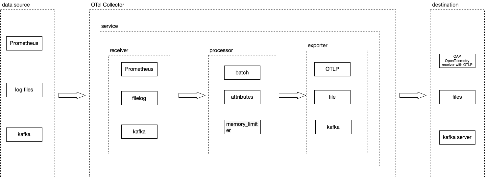

SKyWalking OAP 现有的 [OpenTelemetry receiver](https://skywalking.apache.org/docs/main/next/en/setup/backend/opentelemetry-receiver/) 可以通过[OTLP](https://github.com/open-telemetry/opentelemetry-specification/blob/main/specification/protocol/otlp.md)协议接收指标(metrics)，并且使用[MAL](https://skywalking.apache.org/docs/main/next/en/concepts-and-designs/mal/)实时分析相关指标。从OAP 9.4.0开始，SkyWalking 新增了[AWS Firehose receiver](https://skywalking.apache.org/docs/main/next/en/setup/backend/aws-firehose-receiver/)，用来接收，分析CloudWatch metrics数据。本文将以EKS和S3为例介绍SkyWalking OAP 接收，分析 AWS 服务的指标数据的过程

### EKS

#### OpenTelemetry Collector

[OpenTelemetry (OTel)](https://opentelemetry.io/) 是一系列tools，API，SDK，可以生成，收集，导出遥测数据，比如 指标(metrics)，日志(logs)和链路信息(traces)，而OTel Collector主要负责收集、处理和导出遥测数据，Collector由以下主要组件组成: 
1. receiver: 负责获取遥测数据，不同的receiver支持不同的数据源，比如prometheus ，kafka，otlp，
2. processor：在receiver和exporter之间处理数据，比如增加或者删除attributes，
3. exporter：负责发送数据到不同的后端，比如kafka，SkyWalking OAP(通过OTLP)
4. service: 作为一个单元配置启用的组件，只有配置的组件才会被启用

###### OpenTelemetry Protocol Specification(OTLP)

[OTLP](https://github.com/open-telemetry/opentelemetry-specification/blob/main/specification/protocol/otlp.md) 主要描述了如何通过gRPC，HTTP协议接收(拉取)指标数据。SKyWalking OAP的 [OpenTelemetry receiver](https://skywalking.apache.org/docs/main/next/en/setup/backend/opentelemetry-receiver/) 实现了OTLP/gRPC协议，通过OTLP/gRPC exporter可以将指标数据导出到OAP。通常一个Collector的数据流向如下:



#### 使用OTel监控EKS

EKS的监控就是通过OTel实现的，只需在EKS集群中以`DaemonSet ` 的方式部署 OpenTelemetry Collector，使用 [AWS Container Insights Receiver](https://github.com/open-telemetry/opentelemetry-collector-contrib/blob/main/receiver/awscontainerinsightreceiver/README.md) 作为receiver，并且设置otlp exporter的地址为OAP的的地址即可。另外需要注意的是OAP根据attribute `job_name : aws-cloud-eks-monitoring` 作为EKS metrics的标识，所以还需要再collector中配置一个processor来增加这个属性

###### OTel Collector配置demo

```yaml

extensions:
  health_check:
receivers:
  awscontainerinsightreceiver:
processors:
# 为了OAP能够正确识别EKS metrics，增加job_name attribute
  resource/job-name:
    attributes:
    - key: job_name   
      value: aws-cloud-eks-monitoring
      action: insert     

# 指定OAP作为 exporters
exporters:
  otlp:
    endpoint: oap-service:11800 
    tls:
      insecure: true
  logging:
      loglevel: debug          
service:
  pipelines:
    metrics:
      receivers: [awscontainerinsightreceiver]
      processors: [resource/job-name]
      exporters: [otlp,logging]
  extensions: [health_check]
  
```

SkyWalking OAP 默认统计 Node，Pod，Service 三个维度的网络、磁盘、CPU等相关的指标数据，这里仅展示了部分内容

######  Pod 维度


######  Service 维度


###### EKS监控完整配置

<details>
<summary>Click here to view complete k8s resource configuration </summary>

```yaml

apiVersion: v1
kind: ServiceAccount
metadata:
  name: aws-otel-sa
  namespace: aws-otel-eks

---
kind: ClusterRole
apiVersion: rbac.authorization.k8s.io/v1
metadata:
  name: aoc-agent-role
rules:
  - apiGroups: [""]
    resources: ["pods", "nodes", "endpoints"]
    verbs: ["list", "watch"]
  - apiGroups: ["apps"]
    resources: ["replicasets"]
    verbs: ["list", "watch"]
  - apiGroups: ["batch"]
    resources: ["jobs"]
    verbs: ["list", "watch"]
  - apiGroups: [""]
    resources: ["nodes/proxy"]
    verbs: ["get"]
  - apiGroups: [""]
    resources: ["nodes/stats", "configmaps", "events"]
    verbs: ["create", "get"]
  - apiGroups: [""]
    resources: ["configmaps"]
    resourceNames: ["otel-container-insight-clusterleader"]
    verbs: ["get","update"]
  - apiGroups: ["coordination.k8s.io"]
    resources: ["leases"]
    verbs: ["create","get","update"]    

---
kind: ClusterRoleBinding
apiVersion: rbac.authorization.k8s.io/v1
metadata:
  name: aoc-agent-role-binding
subjects:
  - kind: ServiceAccount
    name: aws-otel-sa
    namespace: aws-otel-eks
roleRef:
  kind: ClusterRole
  name: aoc-agent-role
  apiGroup: rbac.authorization.k8s.io

---
apiVersion: v1
kind: ConfigMap
metadata:
  name: otel-agent-conf
  namespace: aws-otel-eks
  labels:
    app: opentelemetry
    component: otel-agent-conf
data:
  otel-agent-config: |
    extensions:
      health_check:

    receivers:
      awscontainerinsightreceiver:

    processors:
      resource/job-name:
        attributes:
        - key: job_name   
          value: aws-cloud-eks-monitoring
          action: insert     

    exporters:
      otlp:
        endpoint: oap-service:11800
        tls:
          insecure: true
      logging:
          loglevel: debug          

    service:
      pipelines:
        metrics:
          receivers: [awscontainerinsightreceiver]
          processors: [resource/job-name]
          exporters: [otlp,logging]
      extensions: [health_check]

---

apiVersion: apps/v1
kind: DaemonSet
metadata:
  name: aws-otel-eks-ci
  namespace: aws-otel-eks
spec:
  selector:
    matchLabels:
      name: aws-otel-eks-ci
  template:
    metadata:
      labels:
        name: aws-otel-eks-ci
    spec:
      containers:
        - name: aws-otel-collector
          image: amazon/aws-otel-collector:v0.23.0
          env:
         	  # Specify region
            - name: AWS_REGION
              value: "ap-northeast-1"
            - name: K8S_NODE_NAME
              valueFrom:
                fieldRef:
                  fieldPath: spec.nodeName
            - name: HOST_IP
              valueFrom:
                fieldRef:
                  fieldPath: status.hostIP
            - name: HOST_NAME
              valueFrom:
                fieldRef:
                  fieldPath: spec.nodeName
            - name: K8S_NAMESPACE
              valueFrom:
                 fieldRef:
                   fieldPath: metadata.namespace
          imagePullPolicy: Always
          command:
            - "/awscollector"
            - "--config=/conf/otel-agent-config.yaml"
          volumeMounts:
            - name: rootfs
              mountPath: /rootfs
              readOnly: true
            - name: dockersock
              mountPath: /var/run/docker.sock
              readOnly: true
            - name: varlibdocker
              mountPath: /var/lib/docker
              readOnly: true
            - name: containerdsock
              mountPath: /run/containerd/containerd.sock
              readOnly: true
            - name: sys
              mountPath: /sys
              readOnly: true
            - name: devdisk
              mountPath: /dev/disk
              readOnly: true
            - name: otel-agent-config-vol
              mountPath: /conf
            - name: otel-output-vol  
              mountPath: /otel-output
          resources:
            limits:
              cpu:  200m
              memory: 200Mi
            requests:
              cpu: 200m
              memory: 200Mi
      volumes:
        - configMap:
            name: otel-agent-conf
            items:
              - key: otel-agent-config
                path: otel-agent-config.yaml
          name: otel-agent-config-vol
        - name: rootfs
          hostPath:
            path: /
        - name: dockersock
          hostPath:
            path: /var/run/docker.sock
        - name: varlibdocker
          hostPath:
            path: /var/lib/docker
        - name: containerdsock
          hostPath:
            path: /run/containerd/containerd.sock
        - name: sys
          hostPath:
            path: /sys
        - name: devdisk
          hostPath:
            path: /dev/disk/
        - name: otel-output-vol  
          hostPath:
            path: /otel-output
      serviceAccountName: aws-otel-sa
        
```

</details>


### S3

#### Amazon CloudWatch

[Amazon CloudWatch](https://docs.aws.amazon.com/AmazonCloudWatch/latest/monitoring/WhatIsCloudWatch.html) 是AWS提供的监控服务，负责收集AWS 服务，资源的指标数据，CloudWatch metrics stream 负责将指标数据转换为流式处理数据，支持输出json，OTel v0.7.0 两种格式。

#### Amazon Kinesis Data Firehose (Firehose)

[Firehose](https://aws.amazon.com/cn/kinesis/data-firehose/) 是一项提取、转换、加载（ETL）服务，可以将流式处理数据以可靠方式捕获、转换和提供到数据湖、数据存储(比如S3)和分析服务中。

为了确保外部服务能够正确地接收指标数据， AWS提供了 [Kinesis Data Firehose HTTP Endpoint Delivery Request and Response Specifications (Firehose Specifications)](https://docs.aws.amazon.com/firehose/latest/dev/httpdeliveryrequestresponse.html)。Firhose以POST的方式推送Json数据

###### Json数据示例

```json
{
  "requestId": "ed4acda5-034f-9f42-bba1-f29aea6d7d8f",
  "timestamp": 1578090901599
  "records": [
    {
      "data": "aGVsbG8="
    },
    {
      "data": "aGVsbG8gd29ybGQ="
    }
  ]
}
```
1. requestId:  请求id，可以实现去重，debug目的
2. timestamp:  Firehose 产生该请求的时间戳(毫秒)
3. records: 实际投递的记录
	1.  data: 投递的数据，以base64编码数据，可以是json或者OTel v0.7.0格式，取决于CloudWatch数据数据的格式(稍后会有描述)。Skywalking目前支持OTel v0.7.0格式


##### aws-firehose-receiver

`aws-firehose-receiver` 就是提供了一个实现了Firehose Specifications的HTTP Endpoint:`/aws/firehose/metrics`。下图展示了通过CloudWatch监控DynamoDB，S3等服务，并利用Firehose将指标数据发送到SKywalking OAP的数据流向


从上图可以看到 `aws-firehose-receiver` 将数据转换后交由 `OpenTelemetry-receiver`处理 ，所以  [OpenTelemetry receiver](https://skywalking.apache.org/docs/main/next/en/setup/backend/opentelemetry-receiver/) 中配置的 `otel-rules` 同样可以适用CloudWatch metrics

###### 注意

*  因为 Kinesis Data Firehose 要求，必须在AWS Firehose receiver 前放置一个Gateway用来建立HTTPS链接。`aws-firehose-receiver` 将从v9.5.0开始支持HTTPS协议
*  TLS 证书必须是CA签发的

#### 逐步设置S3监控

1. 进入 S3控制台，通过 `Amazon S3 >> Buckets >> (Your Bucket) >> Metrics >> metrics >> View additional charts >> Request metrics` 为 `Request metrics` 创建filter


2. 进入Amazon Kinesis 控制台，创建一个delivery stream， `Source`选择 `Direct PUT`, `Destination` 选择 `HTTP Endpoint`. 并且设置`HTTP endpoint URL` 为 `https://your_domain/aws/firehose/metrics`。其他配置项:
	*  `Buffer hints`: 设置缓存的大小和周期
	* `Access key` 与aws-firehose-receiver中的AccessKey一致即可
	* `Retry duration`: 重试周期
	* `Backup settings`: 备份设置，可选地将投递的数据同时备份到S3。


3.  进入 CloudWatch控制台，`Streams` 标签创建CloudWatch Stream。并且在`Select your Kinesis Data Firehose stream`项中配置第二步创建的delivery stream。注意需要设置`Change output format` 为 `OpenTelemetry v0.7.0`。


至此，S3监控配置设置完成。目前SkyWalking默认收集的S3 metrics 展示如下


### 其他服务

目前SkyWalking官方支持EKS，S3，DynamoDB监控。
用户也参考 [OpenTelemetry receiver](https://skywalking.apache.org/docs/main/next/en/setup/backend/opentelemetry-receiver/) 配置OTel rules来收集，分析AWS其他服务的CloudWatch metrics，并且通过[自定义dashboard](https://skywalking.apache.org/docs/main/next/en/ui/readme/)展示

### 资料

* [Monitoring S3 metrics with Amazon CloudWatch](https://docs.aws.amazon.com/AmazonS3/latest/userguide/cloudwatch-monitoring.html)
* [Monitoring DynamoDB metrics with Amazon CloudWatch](https://docs.aws.amazon.com/amazondynamodb/latest/developerguide/monitoring-cloudwatch.html)
* [Supported metrics in AWS Firehose receiver of OAP](https://skywalking.apache.org/docs/main/next/en/setup/backend/aws-firehose-receiver/)
* [Configuration Vocabulary | Apache SkyWalking](https://skywalking.apache.org/docs/main/next/en/setup/backend/configuration-vocabulary/)