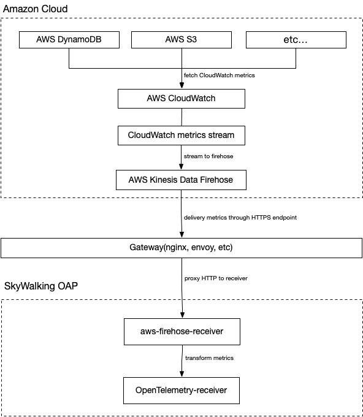

## 背景
[Apache SkyWalking](https://skywalking.apache.org/)  是一个开源应用性能管理系统，帮助用户收集和聚合日志、追踪、指标和事件，并在 UI 上显示。从 OAP 9.4.0 开始，SkyWalking 新增了 [AWS Firehose receiver](https://skywalking.apache.org/docs/main/next/en/setup/backend/aws-firehose-receiver/)，用来接收，计算CloudWatch metrics的数据。本文将以DynamoDB为例，展示如何使用 SkyWalking接收并计算 CloudWatch metrics 数据，以监控Amazon Web Services。

## 什么是 Amazon CloudWatch 与 Amazon Kinesis Data Firehose ？

[Amazon CloudWatch](https://aws.amazon.com/cn/cloudwatch/) 是一个指标存储库, 此工具可从 AWS中 ( 如 DynamoDB ) 收集原始数据，近实时处理为可读取的指标。同时，我们也可以使用**指标流**持续地将 CloudWatch 指标流式传输到所选的目标位置，实现近实时传送和低延迟。SkyWalking 利用此特性，创建指标流并将其导向 Amazon Kinesis Data Firehose 传输流，并由后者进一步传输处理。

[Amazon Kinesis Data Firehose](https://aws.amazon.com/cn/kinesis/data-firehose/)是一项提取、转换、加载服务，可以将流式处理数据以可靠方式捕获、转换和提供到数据湖、数据存储和分析服务中。SkyWalking利用此特性，将指标流最终导向 aws-firehose-receiver，交由OAP计算并最终展示指标。

整体过程流程图如下：



###### 注意

-   由于 Kinesis Data Firehose 规定，HTTP端点的URL必须使用HTTPS协议，且必须使用443端口。同时，此URL必须由Gateway代理并转发到真正的aws-firehose-receiver。
-   TLS 证书必须由CA签发的，自签证书不会被 Kinesis Data Firehose 信任。

## 设置DynamoDB监控
接下来以DynamoDB为例说明使用OAP 收集CloudWatch metrics 前，aws中必要的设置:

1. 进入 [Kinesis 控制台](https://console.aws.amazon.com/kinesis/home)，创建数据流， `Source`选择 `Direct PUT`, `Destination` 选择 `HTTP Endpoint`. 并且设置`HTTP Endpoint URL` 为 `Gateway对应URL`。 其余配置选项可由需要自行配置。


2. 进入 [CloudWatch 控制台](https://console.aws.amazon.com/cloudwatch/home)，在左侧控制面板中选择`Metrics-Stream`，点击Create metric stream。其中，`namespace` 选择 `AWS/DynamoDB`。同时，根据需要，也可以增加其他命名空间。 `Kinesis Data Firehose`选择在第一步中创建好的数据流。最后，设置输出格式为opentelemetry0.7。其余配置选项可由需要自行配置。


至此，DynamoDB监控配置的AWS方面设置完成。
## SkyWalking OAP 指标处理分析
SkyWalking 利用 aws-firehose-receiver 接收并解码由Gateway转发来的 AWS 指标流，交由[Opentelemetry-receiver](https://github.com/apache/skywalking/tree/master/oap-server/server-receiver-plugin/otel-receiver-plugin)进行处理，转化为SkyWalking metrics。并由[Meter Analysis Language (MAL)](https://skywalking.apache.org/docs/main/next/en/concepts-and-designs/mal/)进行指标的分析与聚合，最终呈现在UI上。

其中 MAL 部分以及 UI 部分，SkyWalking支持用户自由定制，从而更多样性的展示指标数据。详情请参考[MAL doc](https://skywalking.apache.org/docs/main/next/en/concepts-and-designs/mal/) 以及 [UI doc](https://skywalking.apache.org/docs/main/next/en/ui/readme/)。


## 典型指标分析
### 作用域
SkyWalking中，有作用域 ( scope ) 的概念。通过作用域, 我们可以对指标进行更合理的分类与聚合。在对DynamoDB的监控中，使用到了其中两种作用域———Service和Endpoint。

Service表示一组工作负荷，这些工作负荷为传入请求提供相同的行为。常用作服务的集群级别作用域，在AWS中，用户的账户更接近集群的概念。 所以SkyWalking将AWS account id作为key，将AWS账户映射为Service类型。

同理，Endpoint表示一种逻辑概念，常用于服务中用于传入请求的路径，例如 HTTP URI 路径或 gRPC 服务类 + 方法签名，也可以表示数据库中的表结构。所以SkyWalking将DynamoDB表映射为Endpoint类型。
### 指标

| 指标名称 | 含义 |
| --- | --- |
| AccountMaxReads / AccountMaxWrites | 账户可以使用的最大 读取/写入 容量单位数。 |
| AccountMaxTableLevelReads / AccountMaxTableLevelWrites | 账户的表或全局二级索引可以使用的最大 读取/写入 容量单位数。 |
| AccountProvisionedReadCapacityUtilization / AccountProvisionedWriteCapacityUtilization | 账户使用的预置 读取/写入 容量单位百分比。 |
| MaxProvisionedTableReadCapacityUtilization / MaxProvisionedTableWriteCapacityUtilization | 账户的最高预调配 读取/写入 表或全局二级索引使用的预调配读取容量单位百分比。 |

以上为一些常用的账户指标(Serivce 作用域)。它们是DynamoDB中的各种配置信息，SkyWalking通过对这些指标的监控，可以完整的展示出数据库配置的变动情况。

| 指标名称 | 含义 |
| --- | --- |
| ConsumedReadCapacityUnits / ConsumedWriteCapacityUnits | 指定时间段内占用的 读取/写入 容量单位数 |
| ReturnedItemCount | `Query`、`Scan` 或 `ExecuteStatement`（可选择）操作在指定时段内返回的项目数。 |
| SuccessfulRequestLatency | 指定时间段内对于 DynamoDB 或 Amazon DynamoDB Streams 的成功请求的延迟。 |
| TimeToLiveDeletedItemCount | 指定时间段内按存活时间 (TTL) 删除的项目数。 |

以上为一些常用的表指标(Endpoint作用域)，它们也会被聚合到账户指标中。这些指标一般用于分析数据库的性能，用户可以通过它们判断出数据库配置的合理程度。例如，用户可以通过ConsumedReadCapicityUnits / ConsumedReadCapicityUnits，跟踪预置吞吐量的使用，从而判断表或账户的预制吞吐量的合理性。关于预置吞吐量，请参见[读/写容量模式](https://docs.aws.amazon.com/amazondynamodb/latest/developerguide/ProvisionedThroughputIntro.html)。

| 指标名称 | 含义 |
| --- | --- |
| UserErrors |在指定时间段内生成 HTTP 400 状态代码的对 DynamoDB 或 Amazon DynamoDB Streams 的请求。HTTP 400 通常表示客户端错误，如参数组合无效，尝试更新不存在的表或请求签名错误。 |
| SystemErrors |在指定的时间段内生成 HTTP 500 状态代码的对 DynamoDB 或 Amazon DynamoDB Streams 的请求。HTTP 500 通常指示内部服务错误。 |
| ThrottledRequests | 超出资源（如表或索引）预置吞吐量限制的 DynamoDB 请求。|
| TransactionConflict | 由于同一项目的并发请求之间的事务性冲突而被拒绝的项目级请求。 |

以上为一些常用的错误指标，其中UserErrors为用户级别指标，其余为表级别指标。用户可以在这些指标上设置告警，如果警告出现，那么可能说明数据库的使用出现了一些问题，需要用户自行查看验证。

### 注意
SkyWalking对于DynamoDB的指标选取直接来源于CloudWatch metrics， 您也可以通过[CloudWatch metrics doc](https://docs.aws.amazon.com/amazondynamodb/latest/developerguide/metrics-dimensions.html)来获取指标详细信息。

## Demo
在本节中，我们将演示如何利用terraform创建一个DynamoDB表，以及可以产生指标流的其他AWS服务，并部署Skywalking完成指标收集。

首先，您需要一个正在运行的网关实例，例如 [NGINX](https://www.nginx.com/)，它负责接收AWS传来的指标流并且转发到aws-firehose-receiver。注意, 网关需要配置证书以便接受HTTPS协议的请求。

下面是一个NGINX的示例配置。配置不要求完全一致，只要能将收到的HTTPS请求发送到`oap所在host:12801/aws/firehose/metrics`即可。

```
server {
        listen       443 ssl;
        
        ssl_certificate     /crt/test.pem;
        ssl_certificate_key  /crt/test.key; 
        
        ssl_session_timeout  5m;   
        ssl_ciphers ECDHE-RSA-AES128-GCM-SHA256:ECDHE:ECDH:AES:HIGH:!NULL:!aNULL:!MD5:!ADH:!RC4; 
        ssl_protocols TLSv1 TLSv1.1 TLSv1.2;  
        ssl_prefer_server_ciphers on; 
    
        location /aws/firehose/metrics {
            proxy_pass http://test.xyz:12801/aws/firehose/metrics;
        }
    }
```

### 部署SkyWalking
SkyWalking的部署方式有很多种，您可以直接从[release页面](https://github.com/apache/skywalking/releases/tag/v9.4.0)中直接获取。

当然，如果您更习惯于 Kubernetes，您也可以从[SkyWalking-kubernetes](https://github.com/apache/skywalking-kubernetes)找到相应部署方式。

请注意，无论使用哪种部署方式，请确保OAP和UI的版本为9.4.0以上，并且需要开放12801端口。

下面是一个使用helm指令部署的示例：

```
export SKYWALKING_RELEASE_VERSION=4.3.0 
export SKYWALKING_RELEASE_NAME=skywalking  
export SKYWALKING_RELEASE_NAMESPACE=default

helm install "${SKYWALKING_RELEASE_NAME}" \
  oci://registry-1.docker.io/apache/skywalking-helm \
  --version "${SKYWALKING_RELEASE_VERSION}" \
  -n "${SKYWALKING_RELEASE_NAMESPACE}" \
  --set oap.image.tag=9.4.0 \
  --set oap.storageType=elasticsearch \
  --set ui.image.tag=9.4.0 \
  --set oap.ports.firehose=12801
```

### 开启对应AWS服务

terraform 配置文件如下（实例修改于[Terraform Registry - kinesis_firehose_delivery_stream](https://registry.terraform.io/providers/hashicorp/aws/latest/docs/resources/kinesis_firehose_delivery_stream)）：
<details>
<summary>terraform 配置文件 </summary>
    
```
provider "aws" {
  region = "ap-northeast-1"
  access_key = "在这里填入您的access_key"
  secret_key = "在这里填入您的secret_key"
}
resource "aws_dynamodb_table" "basic-dynamodb-table" {
  name           = "GameScores"
  billing_mode   = "PROVISIONED"
  read_capacity  = 20
  write_capacity = 20
  hash_key       = "UserId"
  range_key      = "GameTitle"

  attribute {
    name = "UserId"
    type = "S"
  }

  attribute {
    name = "GameTitle"
    type = "S"
  }

  attribute {
    name = "TopScore"
    type = "N"
  }

  ttl {
    attribute_name = "TimeToExist"
    enabled        = true
  }

  global_secondary_index {
    name               = "GameTitleIndex"
    hash_key           = "GameTitle"
    range_key          = "TopScore"
    write_capacity     = 10
    read_capacity      = 10
    projection_type    = "INCLUDE"
    non_key_attributes = ["UserId"]
  }

  tags = {
    Name        = "dynamodb-table-1"
    Environment = "production"
  }
}

resource "aws_cloudwatch_metric_stream" "main" {
  name          = "my-metric-stream"
  role_arn      = aws_iam_role.metric_stream_to_firehose.arn
  firehose_arn  = aws_kinesis_firehose_delivery_stream.http_stream.arn
  output_format = "opentelemetry0.7"

  include_filter {
    namespace = "AWS/DynamoDB"
  }
}

# https://docs.aws.amazon.com/AmazonCloudWatch/latest/monitoring/CloudWatch-metric-streams-trustpolicy.html
data "aws_iam_policy_document" "streams_assume_role" {
  statement {
    effect = "Allow"

    principals {
      type        = "Service"
      identifiers = ["streams.metrics.cloudwatch.amazonaws.com"]
    }

    actions = ["sts:AssumeRole"]
  }
}

resource "aws_iam_role" "metric_stream_to_firehose" {
  name               = "metric_stream_to_firehose_role"
  assume_role_policy = data.aws_iam_policy_document.streams_assume_role.json
}

# https://docs.aws.amazon.com/AmazonCloudWatch/latest/monitoring/CloudWatch-metric-streams-trustpolicy.html
data "aws_iam_policy_document" "metric_stream_to_firehose" {
  statement {
    effect = "Allow"

    actions = [
      "firehose:PutRecord",
      "firehose:PutRecordBatch",
    ]

    resources = [aws_kinesis_firehose_delivery_stream.http_stream.arn]
  }
}
resource "aws_iam_role_policy" "metric_stream_to_firehose" {
  name   = "default"
  role   = aws_iam_role.metric_stream_to_firehose.id
  policy = data.aws_iam_policy_document.metric_stream_to_firehose.json
}

resource "aws_s3_bucket" "bucket" {
  bucket = "metric-stream-test-bucket"
}

resource "aws_s3_bucket_acl" "bucket_acl" {
  bucket = aws_s3_bucket.bucket.id
  acl    = "private"
}

data "aws_iam_policy_document" "firehose_assume_role" {
  statement {
    effect = "Allow"

    principals {
      type        = "Service"
      identifiers = ["firehose.amazonaws.com"]
    }

    actions = ["sts:AssumeRole"]
  }
}

resource "aws_iam_role" "firehose_to_s3" {
  assume_role_policy = data.aws_iam_policy_document.firehose_assume_role.json
}

data "aws_iam_policy_document" "firehose_to_s3" {
  statement {
    effect = "Allow"

    actions = [
      "s3:AbortMultipartUpload",
      "s3:GetBucketLocation",
      "s3:GetObject",
      "s3:ListBucket",
      "s3:ListBucketMultipartUploads",
      "s3:PutObject",
    ]

    resources = [
      aws_s3_bucket.bucket.arn,
      "${aws_s3_bucket.bucket.arn}/*",
    ]
  }
}

resource "aws_iam_role_policy" "firehose_to_s3" {
  name   = "default"
  role   = aws_iam_role.firehose_to_s3.id
  policy = data.aws_iam_policy_document.firehose_to_s3.json
}

resource "aws_kinesis_firehose_delivery_stream" "http_stream" {
  name        = "metric-stream-test-stream"
  destination = "http_endpoint"

  http_endpoint_configuration {
    name       = "test_http_endpoint"
    url        = "这里填入Gateway的url"
    role_arn   = aws_iam_role.firehose_to_s3.arn
  }
  s3_configuration {
    role_arn   = aws_iam_role.firehose_to_s3.arn
    bucket_arn = aws_s3_bucket.bucket.arn
  }
}
```
</details>

使用步骤：

1.获取AWS账户的access_key以及secret_key。( 关于如何获取，请参考：[create-access-key](https://aws.amazon.com/premiumsupport/knowledge-center/create-access-key/) )

2.将上一步中获取的access_key与secret_key填入对应位置，并将您的网关对应 url 填入 `aws_kinesis_firehose_delivery_stream` 配置的对应位置中。

3.复制以上内容并保存到main.tf文件中。

4.在对应路径下执行以下代码。

```
terraform init
terraform apply
```

至此，需要的AWS服务已全部建立成功，您可以检查您的控制台，查看服务是否成功创建。
### 完成！

如果以上步骤全部成功，请耐心等待约五分钟。之后您可以访问SkyWalking UI，查看指标变动情况


目前，SkyWalking 默认收集的指标展示如下：

**账户指标:**


**表指标：**


##### 现已支持的服务

目前SkyWalking官方支持EKS，S3，DynamoDB监控。
用户也参考 [OpenTelemetry receiver](https://skywalking.apache.org/docs/main/next/en/setup/backend/opentelemetry-receiver/) 配置OTEL rules来收集，计算AWS其他服务的CloudWatch metrics，并且通过[自定义dashboard](https://skywalking.apache.org/docs/main/next/en/ui/readme/)展示。

#### 相关的资料

* [Monitoring S3 metrics with Amazon CloudWatch](https://docs.aws.amazon.com/AmazonS3/latest/userguide/cloudwatch-monitoring.html)
* [Monitoring DynamoDB metrics with Amazon CloudWatch](https://docs.aws.amazon.com/amazondynamodb/latest/developerguide/monitoring-cloudwatch.html)
* [Supported metrics in AWS Firehose receiver of OAP](https://skywalking.apache.org/docs/main/next/en/setup/backend/aws-firehose-receiver/)
* [Configuration Vocabulary | Apache SkyWalking](https://skywalking.apache.org/docs/main/next/en/setup/backend/configuration-vocabulary/)
