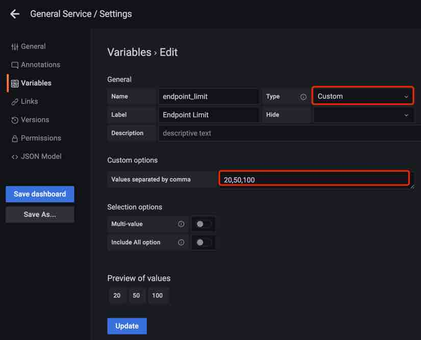

## 背景

Apache SkyWalking 作为分布式系统的应用性能监控工具，提供了对云原生架构下的分布式系统的监控、跟踪、诊断能力。[Prometheus](https://prometheus.io/docs/introduction/overview/#what-is-prometheus) 是一个开源系统监控和警报工具包，具有活跃的生态系统。特别是 Prometheus 指标通过 [导出器和集成](https://prometheus.io/docs/instrumenting/exporters/#exporters-and-integrations) 得到广泛支持。 [PromQL](https://prometheus.io/docs/prometheus/latest/querying/basics/#querying-prometheus) 作为 Prometheus 查询语言，包含一组表达式并公开 HTTP API 以读取指标。

[SkyWalking 支持通过 OpenTelemetry 收集器](https://opentelemetry.io/ecosystem/integrations/) 摄取 Prometheus 指标，并通过这些指标的聚合计算提供多种系统监控，例如 Linux 监控和 Kubernetes 监控。SkyWalking 已经为用户提供了 [原生 UI](https://skywalking.apache.org/docs/main/next/en/ui/readme/) 和 [GraphQL API](https://skywalking.apache.org/docs/main/next/en/api/query-protocol/)。但为了提供更广泛的生态整合能力，从 9.4.0 开始，它提供了 PromQL 服务，已经支持 PromQL 的第三方系统或可视化平台（如 Grafana），可以通过它获取指标。SkyWalking 用户在与不同系统集成时将从中受益。

## SkyWalking 中的 PromQL 服务是什么？

PromQL 服务是 SkyWalking 原生 GraphQL 查询之上的查询引擎，具有由 Prometheus 表达式提供支持的附加查询阶段计算能力。它可以接受 PromQL HTTP API 请求，解析 Prometheus 表达式，并在 Prometheus 指标和 SkyWalking 指标之间进行转换。


PromQL 服务遵循 PromQL 的所有协议和语法，用户可以像使用 PromQL 一样使用它。由于 SkyWalking 在度量分类、格式、存储等方面与 Prometheus 有根本不同，因此 PromQL 服务不必实现完整的 PromQL 功能。[有关详细信息](https://skywalking.apache.org/docs/main/next/en/api/promql-service/#promql-service)，请参阅文档。

## SkyWalking 基本概念 

以下是用户使用 PromQL 服务需要了解的一些基本概念和与 Prometheus 的区别： Prometheus 指标指定命名格式和结构，实际指标名称和标签由客户端提供商确定，并存储详细信息。用户使用 PromQL 中的表达式聚合和计算指标。与 Prometheus 不同，SkyWalking 的度量机制是围绕以下具有层次结构的核心概念构建的：

- 层（Layer）：表示计算机科学中的一个抽象框架，如 Operating System（OS_LINUX 层）、Kubernetes（k8s 层）。该层将是从不同技术检测到的不同服务的所有者。[可以在此处](https://github.com/apache/skywalking/blob/master/oap-server/server-core/src/main/java/org/apache/skywalking/oap/server/core/analysis/Layer.java)
  
    找到所有层定义。
    
- 服务：表示一组 / 一组工作负载，它为传入请求提供相同的行为。
- 服务实例：服务组中的单个工作负载。
- 端点：传入请求的服务路径。
- 进程：操作系统进程。在某些场景下，`service instance` 不是一个进程，比如一个 Kubernetes Pod 可能包含多个进程。

Metric 名称和属性（标签）由 SkyWalking OAP 服务器根据数据源以及 OAL 和 MAL 配置。SkyWalking 提供了对时间序列指标进行下采样（down-sampling），并生成不同时间段数据（分钟、小时、天）的能力。

SkyWalking 指标流如下：


### 流量

- Service/ServiceRelation/Instance/ServiceInstanceRelation/Endpoint/EndpointRelation/Process/ProcessRelation 的元数据。包括名称、层、属性、它们之间的关系等。

### 指标

- 名称（Name）：指标名称，来自 OAL 和 MAL 的配置。
- 实体（Entity）：表示指标的归属，用于查询。一个 Entity 根据 `Scope` 不同会包含如下信息： Scope 代表指标级别，在查询阶段代表 Scope catalog，Scope catalog 为所有的 scope 提供了高维的分类，层次结构。

| Scope | 实体信息 |
| --- | --- |
| Service | 服务（包括图层信息） |
| ServiceInstance | 服务、服务实例 |
| Endpoint | 服务、端点 |
| ServiceRelation | 服务，目标服务 |
| ServiceInstanceRelation | 服务实例、目标服务实例 |
| EndpointRelation | 端点、目标端点 |
| Process | 服务、服务实例、流程 |
| ProcessRelation | 进程、服务实例、DestProcess |
- 值：
1. 单值：long
2. 标签值：文本，`label1,value1|label2,value2|...` ，例如 `L2 aggregation,5000 | L1 aggregation,8000`
- TimeBucket：时间精确到分钟、小时、天

## 如何使用 PromQL 服务

### 设置

PromQL 服务在 v9.4.0 之后默认开启，不需要额外配置。例如，可以使用 OAP 环境变量配置默认端口：

```
restHost: ${SW_PROMQL_REST_HOST:0.0.0.0}
restPort: ${SW_PROMQL_REST_PORT:9090}
restContextPath: ${SW_PROMQL_REST_CONTEXT_PATH:/}
restMaxThreads: ${SW_PROMQL_REST_MAX_THREADS:200}
restIdleTimeOut: ${SW_PROMQL_REST_IDLE_TIMEOUT:30000}
restAcceptQueueSize: ${SW_PROMQL_REST_QUEUE_SIZE:0}
```

### 使用 Prometheus 表达式 

PromQL 通过 Prometheus 表达式匹配指标。这是一个典型的 Prometheus 指标。


为了匹配指标，Prometheus 表达式如下：


在 PromQL 服务中，这些保留的标签将被解析为度量名称和实体信息字段以及用于查询的其他标签。映射如下。

| SkyWalking 概念 | Prometheus 表达 |
| --- | --- |
| 指标名称 | 指标名称 |
| 层 | 标签 |
| 服务 | 标签 |
| 服务实例 | 标签 <服务实例> |
| 端点 | 标签 |
| …… | …… |

例如，以下表达式用于匹配查询指标：service_cpm、service_instance_cpm、endpoint_cpm

```
service_cpm {service='agent::songs', layer='GENERAL'}
service_instance_cpm {service='agent::songs', service_instance='agent::songs_instance_1', layer='GENERAL'}
endpoint_cpm {service='agent::songs', endpoint='GET:/songs', layer='GENERAL'}
```

### 典型查询示例 

在这里，我们将 [SkyWalking Showcase](https://skywalking.apache.org/docs/skywalking-showcase/next/readme/) 部署作为 Playground 来演示如何使用 PromQL 获取 SkyWalking 指标。


以下示例可用于通过 PromQL 服务查询服务的元数据和指标。

### 获取指标名称 

查询：

```
http://localhost:9099/api/v1/label/__name__/values
```

结果：

```json
{
    "status": "success",
    "data": [
        "meter_mysql_instance_qps",
        "service_cpm",
        "envoy_cluster_up_rq_active",
        "instance_jvm_class_loaded_class_count",
        "k8s_cluster_memory_requests",
        "meter_vm_memory_used",
        "meter_apisix_sv_bandwidth_unmatched",
        "meter_vm_memory_total",
        ...
    ]
}
```

### 选择一个指标并获取标签 

查询：

```
http://localhost:9099/api/v1/labels?match []=service_cpm
```

结果：

```json
{
  "status": "success",
  "data": [
    "layer",
    "service",
    "top_n",
    "order"
  ]
}
```

### 从特定层获取服务 

查询：

```
http://127.0.0.1:9099/api/v1/series?match []=service_traffic {layer='GENERAL'}&start=1677479336&end=1677479636
```

结果：

```json
{
    "status": "success",
    "data": [
        {"__name__": "service_traffic",
            "service": "agent::songs",
            "scope": "Service",
            "layer": "GENERAL"
        },
        {"__name__": "service_traffic",
            "service": "agent::recommendation",
            "scope": "Service",
            "layer": "GENERAL"
        },
        {"__name__": "service_traffic",
            "service": "agent::app",
            "scope": "Service",
            "layer": "GENERAL"
        },
        {"__name__": "service_traffic",
            "service": "agent::gateway",
            "scope": "Service",
            "layer": "GENERAL"
        },
        {"__name__": "service_traffic",
            "service": "agent::frontend",
            "scope": "Service",
            "layer": "GENERAL"
        }
    ]
}
```

### 查询服务的特定指标 

查询：

```
http://127.0.0.1:9099/api/v1/query?query=service_cpm {service='agent::songs', layer='GENERAL'}
```

结果：

```json
{
  "status": "success",
  "data": {
    "resultType": "vector",
    "result": [
      {"metric": {
          "__name__": "service_cpm",
          "layer": "GENERAL",
          "scope": "Service",
          "service": "agent::songs"
        },"value": [
          1679559960,
          "6"
        ]
      }
    ]
  }
}
```

关于`range query`和不同的`metrics type for query` 可以参考 [这里的](https://skywalking.apache.org/docs/main/next/en/api/promql-service) 文档。

## 构建 Grafana Dashboard

从上面我们知道了 PromQL 服务的机制和查询方式，现在我们可以为上面的服务示例构建 Grafana Dashboard。**注**：以下所有配置均基于 Grafana 9.1.0 版本。

SkyWalking Showcase 提供了 `General Service` 和 `Service Mesh` 层等 Dashboard 文件，我们可以通过导入 Dashboard JSON 文件快速为层服务创建 Dashboard。

部署 Grafana 应用程序后，请按照以下步骤操作：

### 配置数据源

首先，我们需要创建一个数据源： 在数据源配置面板中，选择 `Prometheus` 并设置 URL 为 OAP 服务器地址，默认端口为 `9090`。 `SkyWalking` 如果有多个 Prometheus 数据源，请在此处设置数据源名称。


### 导入 Dashboard 文件 

1. 创建一个名为 `SkyWalking` 的 Dashboard 文件夹。
   
    
    
2. 将 Dashboard 文件导入到 Grafana 中，有两种获取文件的方式：
    1. 来自 [SkyWalking Showcase](https://github.com/apache/skywalking-showcase/tree/main/deploy/platform/config/promql/dashboards)
    2. 转到 SkyWaking Demo：[在 Grafana 上预览指标](https://skywalking.apache.org/#demo)，并将其从 `General Service` Dashboard 导出。
    
    
    
3. 完毕！现在我们可以看到 Dashboard 正在运行，服务位于下拉列表中，指标显示在面板上。
   
    
    

这是一种简单的构建方式，但是如果我们想要自定义它，我们需要知道它是如何工作的。

### Dashboard 的工作原理 

### Dashboard 设置 

打开 `Settings-Variables` 我们可以看到如下变量：


让我们看看每个变量的作用：

1. **$DS_SkyWalking**
   
    这是一个数据源 ty 变量，它指定了之前定义为 `SkyWalking` 的 Prometheus 数据源。
    
    
    
2. **$layer**
   
    这是一个常量类型，因为在 'General Service' Dashboard 中，所有服务都属于 'GENERAL' 层，因此可以在每个查询中直接使用它们。注意，当您自定义其他层时，必须在 `Layer` 上面定义该值。
    
    
    
3. **$service**
   
    查询类型变量，为下拉列表获取该层下的所有服务名称。
    
    查询表达式：
    
    ```
    label_values (service_traffic {layer='$layer'}, service)
    ```
    
    查询表达式将查询 HTTP API `/api/v1/series`，以获取 `$layer` 中服务元数据，并根据标签（服务）提取服务名称。
    
    
    
4. **$service_instance**
   
    与 `$service` 一样，是一个查询变量，用于在下拉列表中选择服务的所有实例。
    
    查询表达式：
    
    ```
    label_values (instance_traffic {layer='$layer', service='$service'}, service_instance)
    ```
    
    这里的查询表达式不仅指定了 `$layer` 还包含 `$service` 变量，用于关联下拉列表的服务。
    
5. **$endpoint**
   
    与 `$service` 一样，是一个查询变量，用于在下拉列表中选择服务的所有端点。
    
    查询表达式：
    
    ```
    label_values (endpoint_traffic {layer='$layer', service='$service', keyword='$endpoint_keyword', limit='$endpoint_limit'}, endpoint)
    ```
    
    此处的查询表达式指定 `$layer` 和 `$service` 用于与下拉列表的服务相关联的。并且还接受 `$endpoint_keyword` 和 `$endpoint_limit` 变量作为过滤条件。
    
6. **$endpoint_keyword**
   
    一个文本类型的变量，用户可以输入它来过滤 `$endpoint` 的返回值。
    
    
    
7.  **$endpoint_limit**
    
    自定义类型，用户可以选择它以限制返回端点的最大数量。
    
    
    

### Dashboard 配置 

这个 Dashboard 上有几个典型的指标面板，让我们看看它是如何配置的。

### 普通值指标

选择 `Time series chart` 面板 `Service Apdex` 并单击 `edit。`


1. 查询表达式
   
    ```
    service_apdex {service='$service', layer='$layer'} / 10000
    ```
    
    指标范围为 `Service`，添加 `service` 和 `layer` 标签用于匹配，label 值使用上面配置的变量。该计算 `Divided by 10000` 用于匹配结果单位。查询文档可以参考 [这里](https://skywalking.apache.org/docs/main/next/en/api/promql-service/#common-value-metrics)。
    
2. 设置 `Query options --> Min interval = 1m`，因为 SkyWalking 中的指标最小时间段是 1m。
3. 设置 `Connect null values --> AlwaysShow points --> Always`，因为当查询间隔大于 1 小时或 1 天时，SkyWalking 返回小时 / 天步长指标值。

### 标签值指标

选择 `Time series chart` 面板 `Service Response Time Percentile` 并单击 `edit`。


1. 查询表达式
   
    ```
    service_percentile {service='$service', layer='$layer', labels='0,1,2,3,4', relabels='P50,P75,P90,P95,P99'}
    ```
    
    指标范围为 `Service`，添加 `service` 和 `layer` 标签用于匹配，label 值使用上面配置的变量。添加 `labels='0,1,2,3,4'` 过滤结果标签，并添加 `relabels='P50,P75,P90,P95,P99'` 重命名结果标签。查询文档可以参考 [这里](https://skywalking.apache.org/docs/main/next/en/api/promql-service/#labeled-value-metrics)。
    
2. 设置 `Query options --> Min interval = 1m`，因为 SkyWalking 中的指标最小时间段是 1m。
3. 设置 `Connect null values --> AlwaysShow points --> Always`，因为当查询间隔 > 1 小时或 1 天时，SkyWalking 返回小时 / 天步长指标值。
4. 设置 `Legend` 为 `{{label}}` 来展示。

### 排序指标

选择 `Time series chart` 面板 `Service Response Time Percentile` 并单击 `edit`。


1. 查询表达式
   
    ```
    service_instance_cpm {parent_service='$service', layer='$layer', top_n='10', order='DES'}
    ```
    
    该表达式用于查询服务下的排序指标，因此添加标签 `parent_service` 和 `layer` 进行匹配。添加 `top_n='10'` 和 `order='DES'` 过滤结果。查询文档可以参考 [这里](https://skywalking.apache.org/docs/main/next/en/api/promql-service/#sort-metrics)。
    
2. 设置 `Query options --> Min interval = 1m`，因为 SkyWalking 中的指标最小时间段是 1m。
3. 设置 `Calculation --> Latest*`。
4. 设置 `Legend` 为 `{{service_instance}}` 来展示。

## 结论

在这篇文章中，我们介绍了 SkyWalking 中的 PromQL 服务是什么以及它的背景。详细介绍了 PromQL 服务的使用方法和 SkyWalking 相关的基本概念，展示了如何使用 PromQL 服务为 SkyWalking 构建 Grafana Dashboard。

未来，将会有更多的集成利用这个协议，比如 CI/CD、HPA（缩放）等。
