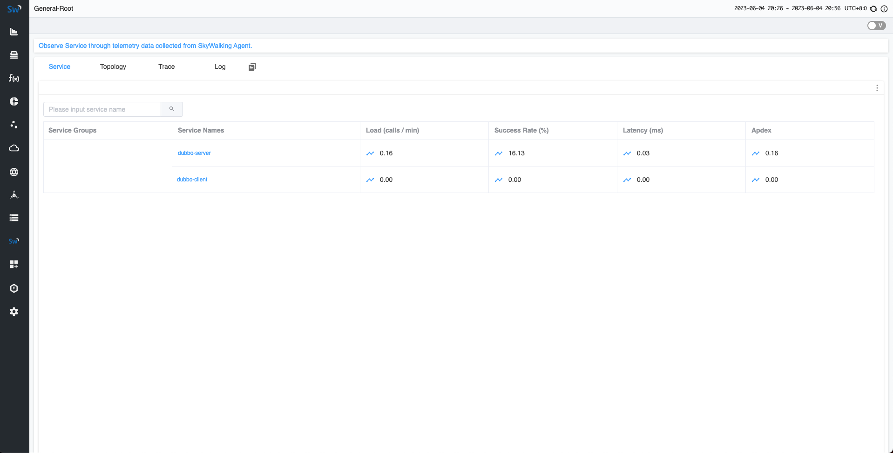
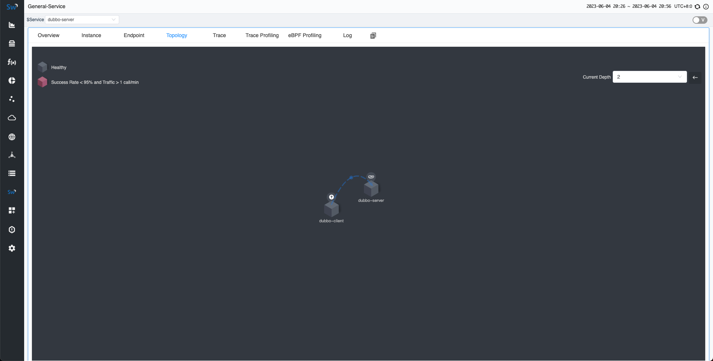

本文演示如何将应用程序与 SkyWalking Go 集成，并在 SkyWalking UI 中查看结果。

以前，如果你想要在 SkyWalking 中监控 Golang 应用程序，需要将项目与 [go2sky](https://github.com/skyapm/go2sky) 项目集成，并手动编写各种带有 go2sky 插件的框架。现在，我们有一个全新的项目（ [Skywalking Go](https://github.com/apache/skywalking-go) ），允许你将 Golang 项目集成到 SkyWalking 中，几乎不需要编码，同时提供更大的灵活性和可扩展性。

在本文中，我们将指导你快速将 skywalking-go 项目集成到 Golang 项目中。

演示包括以下步骤：

1. **部署 SkyWalking**：这涉及设置 SkyWalking 后端和 UI 程序，使你能够看到最终效果。
2. **使用 SkyWalking Go 编译 Golang**：在这里，你将把 SkyWalking Go Agent 编译到要监控的 Golang 程序中。
3. **应用部署**：你将导出环境变量并部署应用程序，以促进你的服务与 SkyWalking 后端之间的通信。
4. **在 SkyWalking UI 上可视化**：最后，你将发送请求并在 SkyWalking UI 中观察效果。

## 部署 SkyWalking

请从官方 SkyWalking 网站下载 [SkyWalking APM 程序](https://skywalking.apache.org/downloads/#SkyWalkingAPM) 。然后执行以下两个命令来启动服务:

```bash
# 启动 OAP 后端
> bin/oapService.sh
# 启动 UI
> bin/webappService.sh
```

接下来，你可以访问地址 `http://localhost:8080/` 。此时，由于尚未部署任何应用程序，因此你将看不到任何数据。

## 使用 SkyWalking GO 编译 Golang

这里将演示如何将 [Dubbo-go](https://github.com/apache/dubbo-go) 程序与SkyWalking Go Agent集成。请依次执行如下命令来创建一个新的项目: 

```bash
# 安装dubbo-go基础环境
> export GOPROXY="https://goproxy.cn"
> go install github.com/dubbogo/dubbogo-cli@latest
> dubbogo-cli install all
# 创建demo项目
> mkdir demo && cd demo
> dubbogo-cli newDemo .
# 升级dubbo-go依赖到最新版本
> go get -u dubbo.apache.org/dubbo-go/v3
```

在项目的根目录中执行以下命令。此命令将下载 skywalking-go 所需的依赖项：

```bash
go get github.com/apache/skywalking-go
```

接下来，请分别在服务端和客户端的`main`包中引入。包含之后，代码将会更新为：

```go
// go-server/cmd/server.go
package main

import (
	"context"
)

import (
	"dubbo.apache.org/dubbo-go/v3/common/logger"
	"dubbo.apache.org/dubbo-go/v3/config"
	_ "dubbo.apache.org/dubbo-go/v3/imports"

	"helloworld/api"
	
	// 引入skywalking-go
	_ "github.com/apache/skywalking-go"
)

type GreeterProvider struct {
	api.UnimplementedGreeterServer
}

func (s *GreeterProvider) SayHello(ctx context.Context, in *api.HelloRequest) (*api.User, error) {
	logger.Infof("Dubbo3 GreeterProvider get user name = %s\n", in.Name)
	return &api.User{Name: "Hello " + in.Name, Id: "12345", Age: 21}, nil
}

// export DUBBO_GO_CONFIG_PATH= PATH_TO_SAMPLES/helloworld/go-server/conf/dubbogo.yaml
func main() {
	config.SetProviderService(&GreeterProvider{})
	if err := config.Load(); err != nil {
		panic(err)
	}
	select {}
}
```

在客户端代码中除了需要引入skywalking-go之外，还需要在main方法中的最后一行增加主携程等待语句，以防止因为客户端快速关闭而无法将Tracing数据异步发送到SkyWalking后端：

```go
package main

import (
	"context"
)

import (
	"dubbo.apache.org/dubbo-go/v3/common/logger"
	"dubbo.apache.org/dubbo-go/v3/config"
	_ "dubbo.apache.org/dubbo-go/v3/imports"

	"helloworld/api"

	// 引入skywalking-go
	_ "github.com/apache/skywalking-go"
)

var grpcGreeterImpl = new(api.GreeterClientImpl)

// export DUBBO_GO_CONFIG_PATH= PATH_TO_SAMPLES/helloworld/go-client/conf/dubbogo.yaml
func main() {
	config.SetConsumerService(grpcGreeterImpl)
	if err := config.Load(); err != nil {
		panic(err)
	}

	logger.Info("start to test dubbo")
	req := &api.HelloRequest{
		Name: "laurence",
	}
	reply, err := grpcGreeterImpl.SayHello(context.Background(), req)
	if err != nil {
		logger.Error(err)
	}
	logger.Infof("client response result: %v\n", reply)
	// 增加主携程等待语句
	select {}
}
```

接下来，请从官方 SkyWalking 网站下载 [Go Agent 程序](https://skywalking.apache.org/downloads/#GoAgent)。当你使用 `go build` 命令进行编译时，请在 **bin** 目录中找到与当前操作系统匹配的代理程序，并添加 `-toolexec="/path/to/go-agent -a` 参数。例如，请使用以下命令：

```bash
# 进入项目主目录
> cd demo
# 分别编译服务端和客户端
# -toolexec 参数定义为go-agent的路径
# -a 参数用于强制重新编译所有依赖项
> cd go-server && go build -toolexec="/path/to/go-agent" -a -o go-server cmd/server.go && cd ..
> cd go-client && go build -toolexec="/path/to/go-agent" -a -o go-client cmd/client.go && cd ..
```

## 应用部署

在开始部署应用程序之前，你可以通过环境变量更改 SkyWalking 中当前应用程序的服务名称。你还可以更改其配置，例如服务器端的地址。有关详细信息，请[参阅文档](https://skywalking.apache.org/docs/skywalking-go/next/en/advanced-features/settings-override/) 。

在这里，我们分别启动两个终端窗口来分别启动服务端和客户端。

在服务端，将服务的名称更改为`dubbo-server`：

```bash
# 导出dubbo-go服务端配置文件路径
export DUBBO_GO_CONFIG_PATH=/path/to/demo/go-server/conf/dubbogo.yaml
# 导出skywalking-go的服务名称
export SW_AGENT_NAME=dubbo-server

./go-server/go-server
```

在客户端，将服务的名称更改为`dubbo-client`：

```bash
# 导出dubbo-go客户端配置文件路径
export DUBBO_GO_CONFIG_PATH=/path/to/demo/go-client/conf/dubbogo.yaml
# 导出skywalking-go的服务名称
export SW_AGENT_NAME=dubbo-client

./go-client/go-client
```

## 在 SkyWalking UI 上可视化

现在，由于客户端会自动像服务器端发送请求，现在就可以在 SkyWalking UI 中观察结果。

几秒钟后，重新访问 `http://localhost:8080` 的 SkyWalking UI。能够在主页上看到部署的 `dubbo-server` 和 `dubbo-client` 服务。



此外，在追踪页面上，可以看到刚刚发送的请求。


并可以在拓扑图页面中看到服务之间的关系。



## 总结

在本文中，我们指导你快速开发`dubbo-go`服务，并将其与 SkyWalking Go Agent 集成。这个过程也适用于你自己的 Golang 服务。最终，可以在 SkyWalking 服务中查看显示效果。如果你有兴趣了解 SkyWalking Go 代理当前支持的框架，请[参阅此文档](https://skywalking.apache.org/docs/skywalking-go/next/en/agent/support-plugins/)。

将来，我们将继续扩展 SkyWalking Go 的功能，添加更多插件支持。所以，请继续关注！
