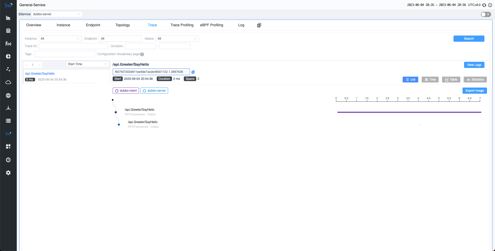

本文演示如何将应用程序与 SkyWalking Go 集成，并在 SkyWalking UI 中查看结果。

以前，如果你想要在 SkyWalking 中监控 Golang 应用程序，需要将项目与 [go2sky](https://github.com/skyapm/go2sky) 项目集成，并手动编写各种带有 go2sky 插件的框架。现在，我们有一个全新的项目（[Skywalking Go](https://github.com/apache/skywalking-go) ），允许你将 Golang 项目集成到 SkyWalking 中，几乎不需要编码，同时提供更大的灵活性和可扩展性。

在本文中，我们将指导你快速将 skywalking-go 项目集成到 Golang 项目中。

演示包括以下步骤：

1. **部署 SkyWalking**：这涉及设置 SkyWalking 后端和 UI 程序，使你能够看到最终效果。
2. **使用 SkyWalking Go 编译 Golang**：在这里，你将把 SkyWalking Go Agent 编译到要监控的 Golang 程序中。
3. **应用部署**：你将导出环境变量并部署应用程序，以促进你的服务与 SkyWalking 后端之间的通信。
4. **在 SkyWalking UI 上可视化**：最后，你将发送请求并在 SkyWalking UI 中观察效果。

## 部署 SkyWalking

请从官方 SkyWalking 网站下载 [SkyWalking APM 程序](https://skywalking.apache.org/downloads/#SkyWalkingAPM) 。然后执行以下两个命令来启动服务:

```bash
# 启动 OAP 后端
> bin/oapService.sh
# 启动 UI
> bin/webappService.sh
```

接下来，你可以访问地址 `http://localhost:8080/` 。此时，由于尚未部署任何应用程序，因此你将看不到任何数据。

## 使用 SkyWalking GO 编译 Golang

这里有一个简单的业务应用程序，启动了一个 HTTP 服务。

```go
package main

import "net/http"

func main() {
	http.HandleFunc("/hello", func(writer http.ResponseWriter, request *http.Request) {
		writer.Write([]byte("Hello World"))
	})
	err := http.ListenAndServe(":8000", nil)
	if err != nil {
		panic(err)
	}
}
```

在项目的根目录中执行以下命令。此命令将下载 skywalking-go 所需的依赖项：

```bash
go get github.com/apache/skywalking-go
```

接下来，请将其包含在项目的 `main` 包中。包含之后，代码将会更新为：

```go
package main

import (
	"net/http"
	_ "github.com/apache/skywalking-go"
)

func main() {
	http.HandleFunc("/hello", func(writer http.ResponseWriter, request *http.Request) {
		writer.Write([]byte("Hello World"))
	})
	err := http.ListenAndServe(":8000", nil)
	if err != nil {
		panic(err)
	}
}
```

接下来，请从官方 SkyWalking 网站下载 [Go Agent 程序](https://skywalking.apache.org/downloads/#GoAgent) 。当你使用 `go build` 命令进行编译时，请在 **bin** 目录中找到与当前操作系统匹配的代理程序，并添加 `-toolexec="/path/to/go-agent" -a` 参数。例如，请使用以下命令：

```bash
go build -toolexec="/path/to/go-agent" -a -o test .
```

## 应用部署

在开始部署应用程序之前，你可以通过环境变量更改 SkyWalking 中当前应用程序的服务名称。你还可以更改其配置，例如服务器端的地址。有关详细信息，请[参阅文档](https://skywalking.apache.org/docs/skywalking-go/next/en/advanced-features/settings-override/) 。

在这里，我们只是将当前服务的名称更改为 `demo`。

接下来，你可以启动应用程序：

```bash
export SW_AGENT_NAME=demo

./test
```

## 在 SkyWalking UI 上可视化

现在，向应用程序发送请求并在 SkyWalking UI 中观察结果。

几秒钟后，重新访问 `http://localhost:8080` 的 SkyWalking UI。能够在主页上看到部署的 `demo` 服务。


此外，在追踪页面上，可以看到刚刚发送的请求。



## 总结

在本文中，我们指导你快速开发 `demo` 服务，并将其与 SkyWalking Go Agent 集成。这个过程也适用于你自己的 Golang 服务。最终，可以在 SkyWalking 服务中查看显示效果。如果你有兴趣了解 SkyWalking Go 代理当前支持的框架，请[参阅此文档](https://skywalking.apache.org/docs/skywalking-go/next/en/agent/support-plugins/) 。

将来，我们将继续扩展 SkyWalking Go 的功能，添加更多插件支持。所以，请继续关注！
