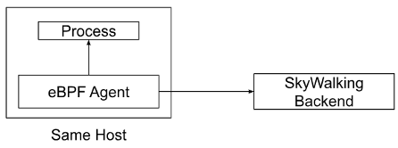
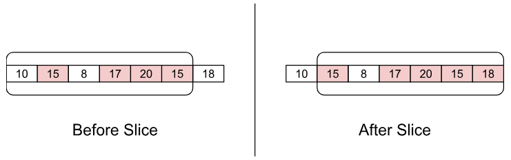
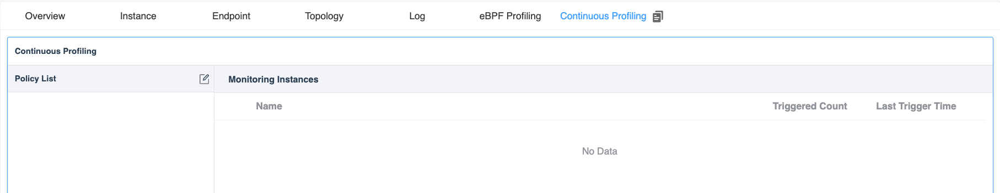
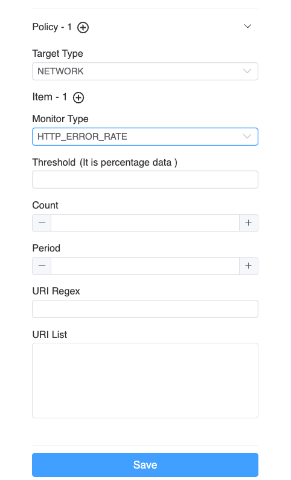
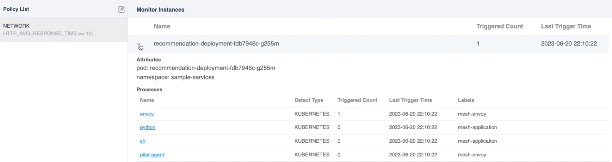
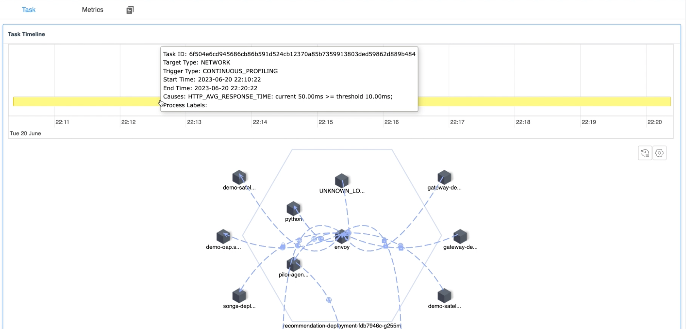
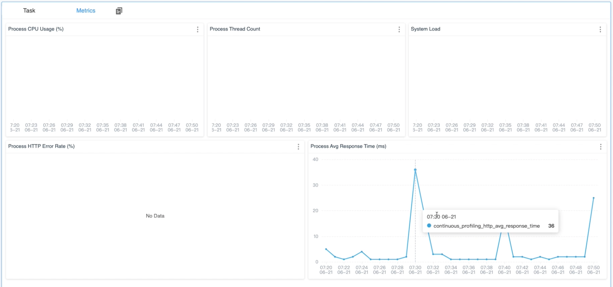

# 背景

在之前的文章中，我们讨论了如何使用 SkyWalking 和 eBPF 来检测性能问题，包括[进程](/blog/2022-07-05-pinpoint-service-mesh-critical-performance-impact-by-using-ebpf)和[网络](/zh/diagnose-service-mesh-network-performance-with-ebpf)。这些方法可以很好地定位问题，但仍然存在一些挑战：

1. **任务启动的时间**: 当需要进行性能监控时，解决需要性能监控的进程始终是一个挑战。通常需要手动参与，以标识进程和所需的性能分析类型，这会在崩溃恢复期间耗费额外的时间。根本原因定位和崩溃恢复时间有时会发生冲突。在实际情况中，重新启动可能是恢复的第一选择，同时也会破坏崩溃的现场。
2. **任务的资源消耗**: 确定分析范围的困难。过宽的分析范围会导致需要更多的资源。我们需要一种方法来管理资源消耗并了解哪些进程需要性能分析。
3. **工程师能力**: 通常由整个团队负责呼叫，其中有初级和高级工程师，即使是高级工程师也对复杂的分布式系统有其理解限制，单个人几乎无法理解整个系统。

**持续剖析（Continuous Profiling）** 是解决上述问题的新机制。

# 自动剖析

由于性能分析的资源消耗和高经验要求，因此引入一种方法以缩小范围并由高级 SRE 工程师创建策略自动剖析。因此，在 9.5.0 中，SkyWalking 首先引入了预设策略规则，以低功耗方式监视特定服务的 eBPF 代理，并在必要时自动运行剖析。

## 策略

策略规则指定了如何监视目标进程并确定在满足某些阈值条件时应启动何种类型的分析任务。

这些策略规则主要包括以下配置信息：

1. **监测类型**: 这指定了应在目标进程上实施什么样的监测。
2. **阈值确定**: 这定义了如何确定目标进程是否需要启动分析任务。
3. **触发任务**: 这指定了应启动什么类型的性能分析任务。

### 监测类型

监测类型是通过观察指定进程的数据值来生成相应的指标来确定的。这些指标值可以促进后续的阈值判断操作。在 eBPF 观测中，我们认为以下指标最能直接反映程序的当前性能：

| 监测类型          | 单位   | 描述                                                         |
| ----------------- | ------ | ------------------------------------------------------------ |
| 系统负载          | 负载   | 在指定时间段内的系统负载平均值。                             |
| 进程 CPU          | 百分比 | 进程的 CPU 使用率百分比。                                    |
| 进程线程计数      | 计数   | 进程中的线程数。                                             |
| HTTP 错误率       | 百分比 | 导致错误响应（例如，4xx 或 5xx 状态代码）的 HTTP 请求的百分比。 |
| HTTP 平均响应时间 | 毫秒   | HTTP 请求的平均响应时间。                                    |

### 相关网络监测

监测网络类型的指标不像获取基本进程信息那么简单。它需要启动 eBPF 程序并将其附加到目标进程以进行观测。这类似于我们在先前文章中介绍的[网络分析任务](/zh/diagnose-service-mesh-network-performance-with-ebpf)，不同的是我们不再收集数据包的完整内容。相反，我们仅收集与指定 HTTP 前缀匹配的消息的内容。

通过使用此方法，我们可以大大减少内核向用户空间发送数据的次数，用户空间程序可以使用更少的系统资源来解析数据内容。这最终有助于节省系统资源。

### 指标收集器

eBPF 代理会定期报告以下进程度量，以指示进程性能：

| 名称                   | 单位     | 描述                                       |
| ---------------------- | -------- | ------------------------------------------ |
| process_cpu            | (0-100)% | CPU 使用率百分比                           |
| process_thread_count   | 计数     | 进程中的线程数                             |
| system_load            | 计数     | 最近一分钟的平均系统负载，每个进程的值相同 |
| http_error_rate        | (0-100)% | 网络请求错误率百分比                       |
| http_avg_response_time | 毫秒     | 网络平均响应持续时间                       |

### 阈值确定

对于阈值的确定，eBPF 代理是基于其自身内存中的目标监测进程进行判断，而不是依赖于 SkyWalking 后端执行的计算。这种方法的优点在于，它不必等待复杂后端计算的结果，减少了复杂交互所带来的潜在问题。

通过使用此方法，eBPF 代理可以在条件满足后立即启动任务，而无需任何延迟。

它包括以下配置项：

1. **阈值**: 检查监测值是否符合指定的期望值。
2. **周期**: 监控数据的时间周期（秒），也可以理解为最近的持续时间。
3. **计数**: 检测期间触发阈值的次数（秒），也可以理解为最近持续时间内指定阈值规则触发的总次数（秒）。一旦满足计数检查，指定的分析任务将被开始。

### 触发任务

当 eBPF Agent 检测到指定策略中的阈值决策符合规则时，根据预配置的规则可以启动相应的任务。对于每个不同的目标性能任务，它们的任务启动参数都不同：

- **On/Off CPU Profiling**: 它会自动对符合条件的进程进行性能分析，缺省情况下监控时间为 `10` 分钟。
- **Network Profiling**: 它会对当前机器上同一 **Service Instance** 中的所有进程进行网络性能分析，以防问题的原因因被收集进程太少而无法实现，缺省情况下监控时间为 `10` 分钟。

一旦任务启动，当前进程将在一定时间内不会启动新的剖析任务。主要原因是为了防止因低阈值设置而频繁创建任务，从而影响程序执行。缺省时间为 `20` 分钟。

## 数据流

图 1 展示了持续剖析功能的数据流：



*图 1: 持续剖析的数据流*

### eBPF Agent进行进程跟踪

首先，我们需要确保 eBPF Agent 和要监测的进程部署在同一台主机上，以便我们可以从进程中收集相关数据。当 eBPF Agent 检测到符合策略的阈值验证规则时，它会立即为目标进程触发剖析任务，从而减少任何中间步骤并加速定位性能问题的能力。

### 滑动窗口

滑动窗口在 eBPF Agent 的阈值决策过程中发挥着至关重要的作用，如图 2 所示：



*图 2: eBPF Agent 中的滑动窗口*

数组中的每个元素表示指定时间内的数据值。当滑动窗口需要验证是否负责某个规则时，它从最近的一定数量的元素 (period 参数) 中获取每个元素的内容。如果一个元素超过了阈值，则标记为红色并计数。如果红色元素的数量超过一定数量，则被认为触发了任务。

使用滑动窗口具有以下两个优点：

1. **快速检索最近的内容**：使用滑动窗口，无需进行复杂的计算。你可以通过简单地读取一定数量的最近数组元素来了解数据。
2. **解决数据峰值问题**：通过计数进行验证，可以避免数据点突然增加然后快速返回正常的情况。使用多个值进行验证可以揭示超过阈值是频繁还是偶然发生的。

### eBPF Agent与OAP后端通讯

eBPF Agent 定期与 SkyWalking 后端通信，涉及三个最关键的操作：

1. **策略同步**：通过定期的策略同步，eBPF Agent 可以尽可能地让本地机器上的进程与最新的策略规则保持同步。
2. **指标发送**：对于已经被监视的进程，eBPF Agent 定期将收集到的数据发送到后端程序。这就使用户能够实时查询当前数据值，用户也可以在出现问题时将此数据与历史值或阈值进行比较。
3. **剖析任务报告**：当 eBPF 检测到某个进程触发了策略规则时，它会自动启动性能任务，从当前进程收集相关信息，并将其报告给 SkyWalking 后端。这使用户可以从界面了解**何时、为什么和触发了什么类型的剖析任务**。

# 演示

接下来，让我们快速演示持续剖析功能，以便你更具体地了解它的功能。

## 部署 SkyWalking Showcase

SkyWalking Showcase 包含完整的示例服务，并可以使用 SkyWalking 进行监视。有关详细信息，请查看[官方文档](https://skywalking.apache.org/docs/skywalking-showcase/next/readme/)。

在此演示中，我们只部署服务、最新发布的 SkyWalking OAP 和 UI。

```bash
export SW_OAP_IMAGE=apache/skywalking-oap-server:9.5.0
export SW_UI_IMAGE=apache/skywalking-ui:9.5.0
export SW_ROVER_IMAGE=apache/skywalking-rover:0.5.0

export FEATURE_FLAGS=mesh-with-agent,single-node,elasticsearch,rover
make deploy.kubernetes
```

部署完成后，请运行以下脚本以打开 SkyWalking UI：http://localhost:8080/。

```bash
kubectl port-forward svc/ui 8080:8080 --namespace default
```

## 创建持续剖析策略

目前，持续剖析功能在 **Service Mesh** 面板的 **Service** 级别中默认设置。



*图 3: 持续策略选项卡*

通过点击 `Policy List` 旁边的编辑按钮，可以创建或更新当前服务的策略。



*图 4: 编辑持续剖析策略*

支持多个策略。每个策略都有以下配置。

1. **Target Type**：指定符合阈值决策时要触发的剖析任务的类型。
2. **Items**：对于相同目标的剖析任务，可以指定一个或多个验证项目。只要一个验证项目符合阈值决策，就会启动相应的性能分析任务。
   1. **Monitor Type**：指定要为目标进程执行的监视类型。
   2. **Threshold**：根据监视类型的不同，需要填写相应的阈值才能完成验证工作。
   3. **Period**：指定你要监测的最近几秒钟的数据数量。
   4. **Count**：确定最近时间段内触发的总秒数。
   5. **URI 正则表达式/列表**：这适用于 HTTP 监控类型，允许 URL 过滤。

## 完成

单击保存按钮后，你可以看到当前已创建的监控规则，如图 5 所示：



*图 5: 持续剖析监控进程*

数据可以分为以下几个部分：

1. **策略列表**：在左侧，你可以看到已创建的规则列表。
2. **监测摘要列表**：选择规则后，你可以看到哪些 pod 和进程将受到该规则的监视。它还总结了当前 pod 或进程在**过去 48 小时**内触发的性能分析任务数量，以及最后一个触发时间。该列表还按触发次数降序排列，以便你快速查看。

当你单击特定进程时，将显示一个新的仪表板以列出指标和触发的剖析结果。



*图 6: 持续剖析触发的任务*

当前图包含以下数据内容：

1. 任务时间轴：它列出了过去 48 小时的所有剖析任务。当鼠标悬停在任务上时，它还会显示详细信息：
   1. **任务的开始和结束时间**：它指示当前性能分析任务何时被触发。
   2. **触发原因**：它会显示为什么会对当前进程进行剖析，并列出当剖析被触发时超过阈值的度量值，以便你快速了解原因。
2. **任务详情**：与前几篇文章介绍的 CPU 剖析和网络剖析类似，它会显示当前任务的火焰图或进程拓扑图，具体取决于剖析类型。

同时，在 **Metrics** 选项卡中，收集与剖析策略相关的指标以检索历史趋势，以便在剖析的触发点提供全面的解释。



*图 7: 持续剖析指标*

# 结论

在本文中，我详细介绍了 SkyWalking 和 eBPF 中持续剖析功能的工作原理。通常情况下，它涉及将 eBPF Agent 服务部署在要监视的进程所在的同一台计算机上，并以低资源消耗监测目标进程。当它符合阈值条件时，它会启动更复杂的 CPU 剖析和网络剖析任务。

在未来，我们将提供更多功能。敬请期待！

- Twitter：[ASFSkyWalking](https://x.com/AsfSkyWalking)
- Slack：向邮件列表 (`dev@skywalking.apache.org`) 发送“Request to join SkyWalking Slack”，我们会邀请你加入。
- 订阅我们的 [Medium 列表](https://medium.com/@AsfSkyWalking)。
