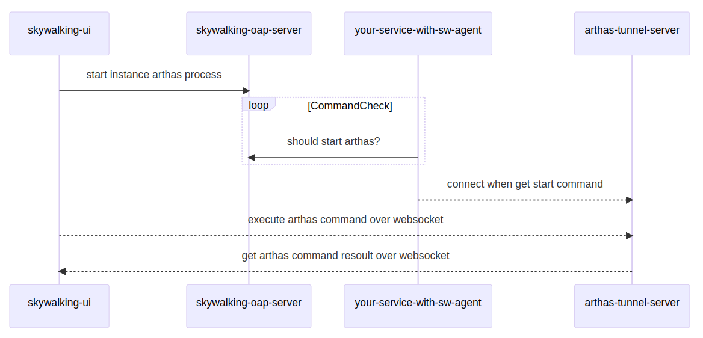
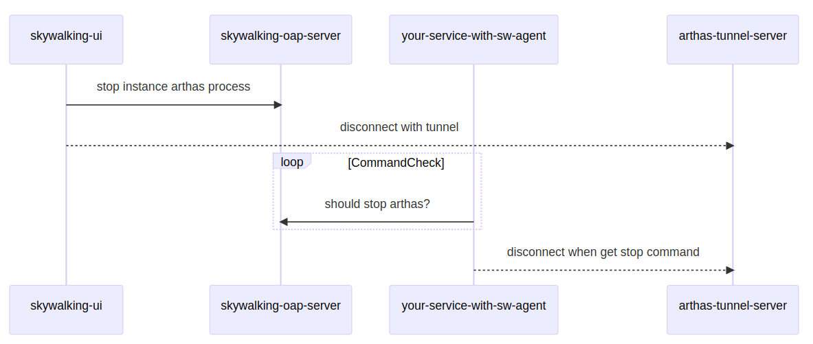

## 背景介绍
Arthas 是一款常用的 Java 诊断工具，我们可以在 SkyWalking 监控到服务异常后，通过 Arthas 进一步分析和诊断以快速定位问题。

在 Arthas 实际使用中，通常由开发人员拷贝或者下载安装包到服务对应的VM或者容器中，attach 到对应的 Java 进程进行问题排查。这一过程不可避免的会造成服务器敏感运维信息的扩散，
而且在分秒必争的问题排查过程中，这些繁琐的操作无疑会浪费大量时间。

SkyWalking Java Agent 伴随 Java 服务一起启动，并定期上报服务、实例信息给OAP Server。我们可以借助 SkyWalking Java Agent 的插件化能力，开发一个 Arthas 控制插件，
由该插件管理 Arthas 运行生命周期，通过页面化的方式，完成Arthas的启动与停止。最终实现效果可以参考下图：


要完成上述功能，我们需要实现以下几个关键点：
1. 开发 agent arthas-control-plugin，执行 arthas 的启动与停止命令
2. 开发 oap arthas-controller-module ，下发控制命令给 arthas agent plugin
3. 定制 skywalking-ui, 连接 arthas-tunnel-server，发送 arthas 命令并获取执行结果

以上各个模块之间的交互流程如下图所示：

### connect


### disconnect


本文涉及的所有代码均已发布在 github [skywalking-x-arthas](https://github.com/weixiang1862/skywalking-x-arthas) 上，如有需要，大家可以自行下载代码测试。
文章后半部分将主要介绍代码逻辑及其中包含的SkyWalking扩展点。

## agent arthas-control-plugin
首先在 skywalking-java/apm-sniffer/apm-sdk-plugin 下创建一个 arthas-control-plugin，
该模块在打包后会成为 skywalking-agent/plugins 下的一个插件， 其目录结构如下：
```
arthas-control-plugin/
├── pom.xml
└── src
    └── main
        ├── java
        │   └── org
        │       └── apache
        │           └── skywalking
        │               └── apm
        │                   └── plugin
        │                       └── arthas
        │                           ├── config
        │                           │   └── ArthasConfig.java    # 模块配置
        │                           ├── service
        │                           │   └── CommandListener.java # boot service，监听 oap command
        │                           └── util
        │                               ├── ArthasCtl.java       # 控制 arthas 的启动与停止
        │                               └── ProcessUtils.java
        ├── proto
        │   └── ArthasCommandService.proto                       # 与oap server通信的 grpc 协议定义
        └── resources
            └── META-INF
                └── services                                     # boot service spi service
                    └── org.apache.skywalking.apm.agent.core.boot.BootService

16 directories, 7 files
```
在 ArthasConfig.java 中，我们定义了以下配置，这些参数将在 arthas 启动时传递。

以下的配置可以通过 agent.config 文件、system prop、env variable指定。
关于 skywalking-agent 配置的初始化的具体流程，大家可以参考 [SnifferConfigInitializer](https://github.com/apache/skywalking-java/blob/main/apm-sniffer/apm-agent-core/src/main/java/org/apache/skywalking/apm/agent/core/conf/SnifferConfigInitializer.java) 。
```java
public class ArthasConfig {
    public static class Plugin {
        @PluginConfig(root = ArthasConfig.class)
        public static class Arthas {
            // arthas 目录
            public static String ARTHAS_HOME;
            // arthas 启动时连接的tunnel server
            public static String TUNNEL_SERVER;
            // arthas 会话超时时间
            public static Long SESSION_TIMEOUT;
            // 禁用的 arthas command
            public static String DISABLED_COMMANDS;
        }
    }
}
```
接着，我们看下 CommandListener.java 的实现，CommandListener 实现了 BootService 接口，
并通过 resources/META-INF/services 下的文件暴露给 ServiceLoader。

BootService 的定义如下，共有prepare()、boot()、onComplete()、shutdown()几个方法，这几个方法分别对应插件生命周期的不同阶段。
```java
public interface BootService {
    void prepare() throws Throwable;

    void boot() throws Throwable;

    void onComplete() throws Throwable;

    void shutdown() throws Throwable;

    default int priority() {
        return 0;
    }
}
```
在 [ServiceManager](https://github.com/apache/skywalking-java/blob/main/apm-sniffer/apm-agent-core/src/main/java/org/apache/skywalking/apm/agent/core/boot/ServiceManager.java) 类的 boot() 方法中，
定义了BootService 的 load 与启动流程，该方法 由SkyWalkingAgent 的 premain 调用，在主程序运行前完成初始化与启动：
```java
public enum ServiceManager {
    INSTANCE;
    ...
    ...
    public void boot() {
        bootedServices = loadAllServices();

        prepare();
        startup();
        onComplete();
    }
    ...
    ...
}
```
回到我们 CommandListener 的 boot 方法，该方法在 agent 启动之初定义了一个定时任务，这个定时任务会轮询 oap ，查询是否需要启动或者停止arthas:
```java
public class CommandListener implements BootService, GRPCChannelListener {
    ...
    ...
    @Override
    public void boot() throws Throwable {
        getCommandFuture = Executors.newSingleThreadScheduledExecutor(
            new DefaultNamedThreadFactory("CommandListener")
        ).scheduleWithFixedDelay(
            new RunnableWithExceptionProtection(
                this::getCommand,
                t -> LOGGER.error("get arthas command error.", t)
            ), 0, 2, TimeUnit.SECONDS
        );
    }
    ...
    ...
}
```
getCommand方法中定义了start、stop的处理逻辑，分别对应页面上的 connect 和 disconnect 操作。
这两个 command 有分别转给 ArthasCtl 的 startArthas 和 stopArthas 两个方法处理，用来控制 arthas 的启停。

在 startArthas 方法中，启动arthas-core.jar 并使用 skywalking-agent 的 serviceName 和 instanceName 注册连接至配置文件中指定的arthas-tunnel-server。

ArthasCtl 逻辑参考自 Arthas 的  [BootStrap.java](https://github.com/alibaba/arthas/blob/master/boot/src/main/java/com/taobao/arthas/boot/Bootstrap.java) ，由于不是本篇文章的重点，这里不再赘述，感兴趣的小伙伴可以自行查看。
```java
switch (commandResponse.getCommand()) {
    case START:
        if (alreadyAttached()) {
            LOGGER.warn("arthas already attached, no need start again");
            return;
        }
        try {
            arthasTelnetPort = SocketUtils.findAvailableTcpPort();
            ArthasCtl.startArthas(PidUtils.currentLongPid(), arthasTelnetPort);
        } catch (Exception e) {
            LOGGER.info("error when start arthas", e);
        }
        break;
    case STOP:
        if (!alreadyAttached()) {
            LOGGER.warn("no arthas attached, no need to stop");
            return;
        }
        try {
            ArthasCtl.stopArthas(arthasTelnetPort);
            arthasTelnetPort = null;
        } catch (Exception e) {
            LOGGER.info("error when stop arthas", e);
        }
        break;
}
```
看完 arthas 的启动与停止控制逻辑，我们回到 CommandListener 的 statusChanged 方法，
由于要和 oap 通信，这里我们按照惯例监听 grpc channel 的状态，只有状态正常时才会执行上面的getCommand轮询。
```java
public class CommandListener implements BootService, GRPCChannelListener {
    ...
    ...
    @Override
    public void statusChanged(final GRPCChannelStatus status) {
        if (GRPCChannelStatus.CONNECTED.equals(status)) {
            Object channel = ServiceManager.INSTANCE.findService(GRPCChannelManager.class).getChannel();
            // DO NOT REMOVE Channel CAST, or it will throw `incompatible types: org.apache.skywalking.apm.dependencies.io.grpc.Channel
            // cannot be converted to io.grpc.Channel` exception when compile due to agent core's shade of grpc dependencies.
            commandServiceBlockingStub = ArthasCommandServiceGrpc.newBlockingStub((Channel) channel);
        } else {
            commandServiceBlockingStub = null;
        }
        this.status = status;
    }
    ...
    ...
}
```
上面的代码，细心的小伙伴可能会发现，getChannel() 的返回值被向上转型成了 Object, 而在下面的 newBlockingStub 方法中，又强制转成了 Channel。

看似有点多此一举，其实不然，我们将这里的转型去掉,尝试编译就会收到下面的错误：
```
[ERROR] Failed to execute goal org.apache.maven.plugins:maven-compiler-plugin:3.10.1:compile (default-compile) on project arthas-control-plugin: Compilation failure
[ERROR] .../CommandListener.java:[59,103] 不兼容的类型: org.apache.skywalking.apm.dependencies.io.grpc.Channel无法转换为io.grpc.Channel
```
上面的错误提示 ServiceManager.INSTANCE.findService(GRPCChannelManager.class).getChannel() 的返回值类型是 org.apache.skywalking.apm.dependencies.io.grpc.Channel，无法被赋值给 io.grpc.Channel 引用。

我们查看GRPCChannelManager的getChannel()方法代码会发现，方法定义的返回值明明是 io.grpc.Channel，为什么编译时会报上面的错误？

其实这是skywalking-agent的一个小魔法，由于 agent-core 最终会被打包进 skywalking-agent.jar，启动时由系统类装载器（或者其他父级类装载器）直接装载，
为了防止所依赖的类库和被监控服务的类发生版本冲突，agent 核心代码在打包时使用了maven-shade-plugin, 该插件会在 maven package 阶段改变 grpc 依赖的包名，
我们在源代码里看到的是 io.grpc.Channel，其实在真正运行时已经被改成了 org.apache.skywalking.apm.dependencies.io.grpc.Channel，这便可解释上面编译报错的原因。

除了grpc以外，其他一些 well-known 的 dependency 也会进行 shade 操作，详情大家可以参考 [apm-agent-core pom.xml](https://github.com/apache/skywalking-java/blob/main/apm-sniffer/apm-agent-core/pom.xml) ：
```xml
<plugin>
    <artifactId>maven-shade-plugin</artifactId>
    <executions>
        <execution>
            <phase>package</phase>
            <goals>
                <goal>shade</goal>
            </goals>
            <configuration>
                ...
                ...
                <relocations>
                    <relocation>
                        <pattern>${shade.com.google.source}</pattern>
                        <shadedPattern>${shade.com.google.target}</shadedPattern>
                    </relocation>
                    <relocation>
                        <pattern>${shade.io.grpc.source}</pattern>
                        <shadedPattern>${shade.io.grpc.target}</shadedPattern>
                    </relocation>
                    <relocation>
                        <pattern>${shade.io.netty.source}</pattern>
                        <shadedPattern>${shade.io.netty.target}</shadedPattern>
                    </relocation>
                    <relocation>
                        <pattern>${shade.io.opencensus.source}</pattern>
                        <shadedPattern>${shade.io.opencensus.target}</shadedPattern>
                    </relocation>
                    <relocation>
                        <pattern>${shade.io.perfmark.source}</pattern>
                        <shadedPattern>${shade.io.perfmark.target}</shadedPattern>
                    </relocation>
                    <relocation>
                        <pattern>${shade.org.slf4j.source}</pattern>
                        <shadedPattern>${shade.org.slf4j.target}</shadedPattern>
                    </relocation>
                </relocations>
                ...
                ...
            </configuration>
        </execution>
    </executions>
</plugin>
```
除了上面的注意点以外，我们来看一下另一个场景，假设我们需要在 agent plugin 的 interceptor 中使用 plugin 中定义的 BootService 会发生什么？

我们回到 BootService 的加载逻辑，为了加载到 plugin 中定义的BootService，ServiceLoader 指定了类装载器为AgentClassLoader.getDefault()，
（这行代码历史非常悠久，可以追溯到2018年：[Allow use SkyWalking plugin to override service in Agent core. #1111](https://github.com/apache/skywalking/pull/1111) ），
由此可见，plugin 中定义的 BootService 的 classloader 是 AgentClassLoader.getDefault()：
```java
void load(List<BootService> allServices) {
    for (final BootService bootService : ServiceLoader.load(BootService.class, AgentClassLoader.getDefault())) {
        allServices.add(bootService);
    }
}
```
再来看下 interceptor 的加载逻辑，[InterceptorInstanceLoader.java](https://github.com/apache/skywalking-java/blob/main/apm-sniffer/apm-agent-core/src/main/java/org/apache/skywalking/apm/agent/core/plugin/loader/InterceptorInstanceLoader.java) 
的 load 方法规定了如果父加载器相同，plugin 中的 interceptor 将使用一个新创建的 AgentClassLoader （在绝大部分简单场景中，plugin 的 interceptor 都由同一个 AgentClassLoader 加载）：
```java
public static <T> T load(String className,
    ClassLoader targetClassLoader) throws IllegalAccessException, InstantiationException, ClassNotFoundException, AgentPackageNotFoundException {
    ...
    ...
    pluginLoader = EXTEND_PLUGIN_CLASSLOADERS.get(targetClassLoader);
    if (pluginLoader == null) {
        pluginLoader = new AgentClassLoader(targetClassLoader);
        EXTEND_PLUGIN_CLASSLOADERS.put(targetClassLoader, pluginLoader);
    }
    ...
    ...
}
```
按照类装载器的委派机制，interceptor 中如果用到了 BootService，也会由当前的类的装载器去装载。
所以 ServiceManager 中装载的 BootService 和 interceptor 装载的 BootService 并不是同一个 （一个 class 文件被不同的 classloader 装载了两次），如果在 interceptor 中 调用 BootService 方法，同样会发生 cast 异常。
由此可见，目前的实现并不支持我们在interceptor中直接调用 plugin 中 BootService 的方法，如果需要调用，只能将 BootService 放到 agent-core 中，由更高级别的类装载器优先装载。

这其实并不是 skywalking-agent 的问题，skywalking agent plugin 专注于自己的应用场景，只需要关注 trace、meter 以及默认 BootService 的覆盖就可以了。
只是我们如果有扩展 skywalking-agent 的需求，要对其类装载机制做到心中有数，否则可能会出现一些意想不到的问题。

## oap arthas-controller-module
看完 agent-plugin 的实现，我们再来看看 oap 部分的修改，oap 同样是模块化的设计，我们可以很轻松的增加一个新的模块，在 /oap-server/ 目录下新建 arthas-controller 子模块：
```
arthas-controller/
├── pom.xml
└── src
    └── main
        ├── java
        │   └── org
        │       └── apache
        │           └── skywalking
        │               └── oap
        │                   └── arthas
        │                       ├── ArthasControllerModule.java      # 模块定义
        │                       ├── ArthasControllerProvider.java    # 模块逻辑实现者
        │                       ├── CommandQueue.java
        │                       └── handler
        │                           ├── CommandGrpcHandler.java      # grpc handler,供 plugin 通信使用
        │                           └── CommandRestHandler.java      # http handler,供 skywalking-ui 通信使用
        ├── proto
        │   └── ArthasCommandService.proto
        └── resources
            └── META-INF
                └── services                                         # 模块及模块实现的 spi service
                    ├── org.apache.skywalking.oap.server.library.module.ModuleDefine
                    └── org.apache.skywalking.oap.server.library.module.ModuleProvider
```
模块的定义非常简单，只包含一个模块名，由于我们新增的模块并不需要暴露service给其他模块调用，services 我们返回一个空数组
```java
public class ArthasControllerModule extends ModuleDefine {

    public static final String NAME = "arthas-controller";

    public ArthasControllerModule() {
        super(NAME);
    }

    @Override
    public Class<?>[] services() {
        return new Class[0];
    }
}
```
接着是模块实现者，实现者取名为 default，module 指定该 provider 所属模块，由于没有模块的自定义配置，newConfigCreator 我们返回null即可。
start 方法分别向 CoreModule 的 grpc 服务和 http 服务注册了两个 handler，grpc 服务和 http 服务就是我们熟知的 11800 和 12800 端口：
```java
public class ArthasControllerProvider extends ModuleProvider {

    @Override
    public String name() {
        return "default";
    }

    @Override
    public Class<? extends ModuleDefine> module() {
        return ArthasControllerModule.class;
    }

    @Override
    public ConfigCreator<?> newConfigCreator() {
        return null;
    }

    @Override
    public void prepare() throws ServiceNotProvidedException {

    }

    @Override
    public void start() throws ServiceNotProvidedException, ModuleStartException {
        // grpc service for agent
        GRPCHandlerRegister grpcService = getManager().find(CoreModule.NAME)
                                                      .provider()
                                                      .getService(GRPCHandlerRegister.class);
        grpcService.addHandler(
            new CommandGrpcHandler()
        );

        // rest service for ui
        HTTPHandlerRegister restService = getManager().find(CoreModule.NAME)
                                                      .provider()
                                                      .getService(HTTPHandlerRegister.class);
        restService.addHandler(
            new CommandRestHandler(),
            Collections.singletonList(HttpMethod.POST)
        );
    }

    @Override
    public void notifyAfterCompleted() throws ServiceNotProvidedException {

    }

    @Override
    public String[] requiredModules() {
        return new String[0];
    }
}
```
最后在配置文件中注册本模块及模块实现者，下面的配置表示 arthas-controller 这个 module 由 default provider 提供实现：
```yaml
arthas-controller:
  selector: default
  default:
```
CommandGrpcHandler 和 CommandHttpHandler 的逻辑非常简单，CommandHttpHandler 定义了 connect 和 disconnect 接口，
收到请求后会放到一个 Queue 中供 CommandGrpcHandler 消费，Queue 的实现如下，这里不再赘述：
```
public class CommandQueue {

    private static final Map<String, Command> COMMANDS = new ConcurrentHashMap<>();

    // produce by connect、disconnect
    public static void produceCommand(String serviceName, String instanceName, Command command) {
        COMMANDS.put(serviceName + instanceName, command);
    }

    // consume by agent getCommand task
    public static Optional<Command> consumeCommand(String serviceName, String instanceName) {
        return Optional.ofNullable(COMMANDS.remove(serviceName + instanceName));
    }
}
```

## skywalking-ui arthas console
完成了 agent 和 oap 的开发，我们再看下 ui 部分：
1. connect：调用oap server connect 接口，并连接 arthas-tunnel-server
2. disconnect：调用oap server disconnect 接口，并与 arthas-tunnel-server 断开连接
3. arthas 命令交互，这部分代码主要参考 arthas，大家可以查看 [web-ui console](https://github.com/alibaba/arthas/blob/master/web-ui/arthasWebConsole/all/share/component/Console.vue) 的实现

修改完skywalking-ui的代码后，我们可以直接通过 `npm run dev` 测试了。

如果需要通过主项目打包，别忘了在apm-webapp 的 [ApplicationStartUp.java](https://github.com/apache/skywalking/blob/master/apm-webapp/src/main/java/org/apache/skywalking/oap/server/webapp/ApplicationStartUp.java) 类中添加一条 arthas 的路由：
```java
Server
    .builder()
    .port(port, SessionProtocol.HTTP)
    .service("/arthas", oap)
    .service("/graphql", oap)
    .service("/internal/l7check", HealthCheckService.of())
    .service("/zipkin/config.json", zipkin)
    .serviceUnder("/zipkin/api", zipkin)
    .serviceUnder("/zipkin",
        FileService.of(
            ApplicationStartUp.class.getClassLoader(),
            "/zipkin-lens")
            .orElse(zipkinIndexPage))
    .serviceUnder("/",
        FileService.of(
            ApplicationStartUp.class.getClassLoader(),
            "/public")
            .orElse(indexPage))
    .build()
    .start()
    .join();
```

## 总结
1. BootService 启动及停止流程
2. 如何利用 BootService 实现自定义逻辑
3. Agent Plugin 的类装载机制
4. maven-shade-plugin 的使用与注意点
5. 如何利用 ModuleDefine 与 ModuleProvider 定义新的模块
6. 如何向 GRPC、HTTP Service 添加新的 handler

如果你还有任何的疑问，[欢迎大家与我交流](https://github.com/weixiang1862/skywalking-x-arthas/issues) 。