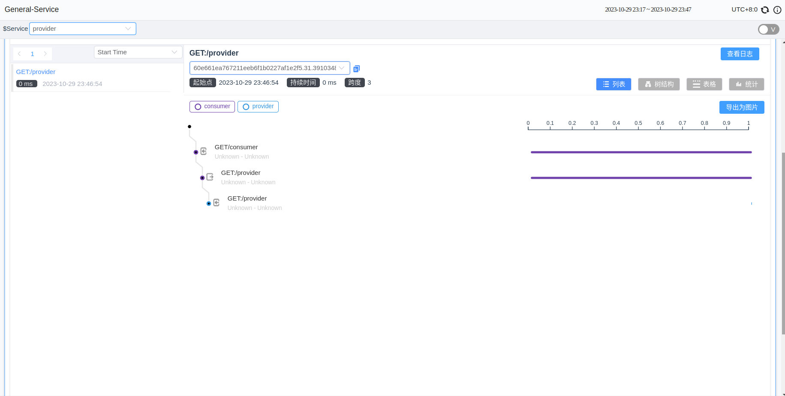
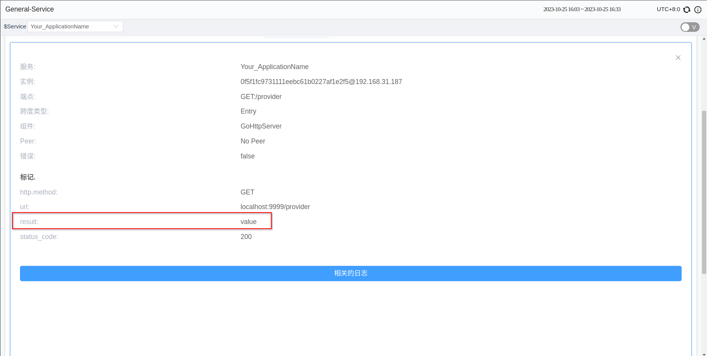

## 背景介绍

SkyWalking Go是一个开源的非侵入式Golang代理程序，用于监控、追踪和在分布式系统中进行数据收集。它使用户能够观察系统内请求的流程和延迟，从各个系统组件收集性能数据以进行性能监控，并通过追踪请求的完整路径来解决问题。

在版本v0.3.0中，Skywalking Go引入了 toolkit-trace 工具。Trace APIs 允许用户在插件不支持的情况下将关键操作、函数或服务添加到追踪范围。从而实现追踪和监控这些操作，并可用于故障分析、诊断和性能监控。

在深入了解之前，您可以参考[SkyWalking Go Agent快速开始指南](https://skywalking.apache.org/zh/2023-06-01-quick-start-with-skywalking-go-agent/)来学习如何使用SkyWalking Go Agent。

下面将会介绍如何在特定场景中使用这些接口。

## 导入 Trace Toolkit

在项目的根目录中执行以下命令：

```shell
go get github.com/apache/skywalking-go/toolkit
```

使用 toolkit trace 接口前，需要将该包导入到您的项目中：

```go
"github.com/apache/skywalking-go/toolkit/trace"
```

## 手动追踪

Span 是 Tracing 中单个操作的基本单元。它代表在特定时间范围内的操作，比如一个请求、一个函数调用或特定动作。Span记录了特定操作的关键信息，包括开始和结束时间、操作名称、标签（键-值对）以及操作之间的关系。多个 Span 可以形成层次结构。

在遇到 Skywalking Go 不支持的框架的情况下，用户可以手动创建 Span 以获取追踪信息。

（为了作为示例，我删除了已支持的框架。以下仅为示例。请在使用私有或不支持的框架的 API 时参考）

例如，当需要追踪HTTP响应时，可以在处理请求的方法内部使用 `trace.CreateEntrySpan() `来创建一个 span，在处理完成后使用 `trace.StopSpan()` 来结束这个 span。在发送HTTP请求时，使用 `trace.CreateExitSpan()` 来创建一个 span，在请求返回后结束这个 span。

这里有两个名为 consumer 和 provider 的HTTP服务。当用户访问 consumer 服务时，它在内部接收用户的请求，然后访问 provider 以获取资源。

```go
// consumer.go
package main

import (
	"io"
	"net/http"

	_ "github.com/apache/skywalking-go"
	"github.com/apache/skywalking-go/toolkit/trace"
)

func getProvider() (*http.Response, error) {
	// 新建 HTTP 请求
	req, err := http.NewRequest("GET", "http://localhost:9998/provider", http.NoBody)
	// 在发送 HTTP 请求之前创建 ExitSpan
	trace.CreateExitSpan("GET:/provider", "localhost:9999",
		func(headerKey, headerValue string) error {
			// Injector 向请求中添加特定的 header 信息
			req.Header.Add(headerKey, headerValue)
			return nil
		})
	// 结束 ExitSpan，使用 defer 确保在函数返回时执行
	defer trace.StopSpan()

	// 发送请求
	client := &http.Client{}
	resp, err := client.Do(req)
	if err != nil {
		return nil, err
	}
	return resp, nil
}

func consumerHandler(w http.ResponseWriter, r *http.Request) {
	// 创建 EntrySpan 来追踪 consumerHandler 方法的执行
	trace.CreateEntrySpan(r.Method+"/consumer", func(headerKey string) (string, error) {
		// Extractor 获取请求中添加的 header 信息
		return r.Header.Get(headerKey), nil
	})
	// 结束 EntrySpan
	defer trace.StopSpan()

	// 准备发送 HTTP 请求
	resp, err := getProvider()

	body, err := io.ReadAll(resp.Body)
	if err != nil {
		return
	}
	_, _ = w.Write(body)
}

func main() {
	http.HandleFunc("/consumer", consumerHandler)

	_ = http.ListenAndServe(":9999", nil)
}
```

```go
// provider.go
package main

import (
	"net/http"

	_ "github.com/apache/skywalking-go"
	"github.com/apache/skywalking-go/toolkit/trace"
)

func providerHandler(w http.ResponseWriter, r *http.Request) {
	// 创建 EntrySpan 来追踪 providerHandler 方法的执行
	trace.CreateEntrySpan("GET:/provider", func(headerKey string) (string, error) {
		return r.Header.Get(headerKey), nil
	})
	// 结束 EntrySpan
	defer trace.StopSpan()

	_, _ = w.Write([]byte("success from provider"))
}

func main() {
	http.HandleFunc("/provider", providerHandler)

	_ = http.ListenAndServe(":9998", nil)
}

```


然后中终端中执行：

```shell
go build -toolexec="/path/to/go-agent" -a -o consumer ./consumer.go
./consumer
```

```shell
go build -toolexec="/path/to/go-agent" -a -o provider ./provider.go
./provider
```

```shell
curl 127.0.0.1:9999/consumer
```

此时 UI 中将会显示你所创建的span信息



如果需要追踪仅在本地执行的方法，可以使用 `trace.CreateLocalSpan()`。如果不需要监控来自另一端的信息或状态，可以将 `ExitSpan` 和 `EntrySpan` 更改为 `LocalSpan`。

以上方法仅作为示例，用户可以决定追踪的粒度以及程序中需要进行追踪的位置。

注意，如果程序结束得太快，可能会导致 Tracing 数据无法异步发送到 SkyWalking 后端。

## 填充 Span

当需要记录额外信息时，包括创建/更新标签、追加日志和设置当前被追踪 Span 的新操作名称时，可以使用这些API。这些操作用于增强追踪信息，提供更详细的上下文描述，有助于更好地理解被追踪的事件或操作。

Toolkit trace APIs 提供了一种简便的方式来访问和操作 Trace 数据：

- 设置标签：`SetTag()`
- 添加日志：`AddLog()`
- 设置 Span 名称：`SetOperationName()`
- 获取各种ID：`GetTraceID()`, `GetSegmentID()`, `GetSpanID()`

例如，如果需要在一个 Span 中记录HTTP状态码，就可以在 Span 未结束时调用以下接口：

```go
trace.CreateExitSpan("GET:/provider", "localhost:9999", func(headerKey, headerValue string) error {
	r.Header.Add(headerKey, headerValue)
	return nil
})
resp, err := http.Get("http://localhost:9999/provider")
trace.SetTag("status_code", fmt.Sprintf("%d", resp.StatusCode))
spanID := trace.GetSpanID()
trace.StopSpan()
```

在调用这些方法时，当前线程需要有正在活跃的 span。

## 异步 APIs

异步API 用于跨 goroutines 操作 spans。包括以下情况：

- 包含多个 goroutines 的程序，需要在不同上下文中中操作 Span。
- 在异步操作时更新或记录 Span 的信息。
- 延迟结束 Span。

按照以下步骤使用：

- 获取 `CreateSpan` 的返回值 `SpanRef`。
- 调用 `spanRef.PrepareAsync()` ，准备在另一个 goroutine 中执行操作。
- 当前 goroutine 工作结束后，调用 `trace.StopSpan()` 结束该 span（仅影响当前 goroutine）。
- 将 `spanRef` 传递给另一个 goroutine。
- 完成工作后在任意 goroutine 中调用 `spanRef.AsyncFinish()`。

以下为示例：

```go
spanRef, err := trace.CreateLocalSpan("LocalSpan")
if err != nil {
	return
}
spanRef.PrepareAsync()
go func(){
	// some work
    spanRef.AsyncFinish()
}()
// some work
trace.StopSpan()
```

## Correlation Context

Correlation Context 用于在 Span 间传递参数，父 Span 会把 Correlation Context 递给其所有子 Spans。它允许在不同应用程序的 spans 之间传输信息。Correlation Context 的默认元素个数为3，其内容长度不能超过128字节。

Correlation Context 通常用于以下等情况:

- `在 Spans 之间传递信息`：它允许关键信息在不同 Span 之间传输，使上游和下游 Spans 能够获取彼此之间的关联和上下文。
- `传递业务参数`：在业务场景中，涉及在不同 Span 之间传输特定参数或信息，如认证令牌、交易ID等。

用户可以使用 `trace.SetCorrelation(key, value)` 设置 Correlation Context ，并可以使用 `value := trace.GetCorrelation(key)` 在下游 spans 中获取相应的值。

例如在下面的代码中，我们将值存储在 span 的标签中，以便观察结果：

```go
package main

import (
	_ "github.com/apache/skywalking-go"
	"github.com/apache/skywalking-go/toolkit/trace"
	"net/http"
)

func providerHandler(w http.ResponseWriter, r *http.Request) {
	ctxValue := trace.GetCorrelation("key")
	trace.SetTag("result", ctxValue)
}

func consumerHandler(w http.ResponseWriter, r *http.Request) {
	trace.SetCorrelation("key", "value")
	_, err := http.Get("http://localhost:9999/provider")
	if err != nil {
		return
	}
}

func main() {
	http.HandleFunc("/provider", providerHandler)

	http.HandleFunc("/consumer", consumerHandler)

	_ = http.ListenAndServe(":9999", nil)
}
```

然后在终端执行：

```shell
export SW_AGENT_NAME=server
go build -toolexec="/path/to/go-agent" -a -o server ./server.go
./server
```

```shell
curl 127.0.0.1:9999/consumer
```

最后在 `providerHandler()` 的 Span 中找到了 Correlation Context 的信息：



## 总结

本文讲述了Skywalking Go的 Trace APIs 及其应用。它为用户提供了自定义追踪的功能。

更多关于该接口的介绍见文档：[Tracing APIs](https://skywalking.apache.org/docs/skywalking-go/next/en/advanced-features/manual-apis/toolkit-trace/)。

欢迎大家来使用新版本。