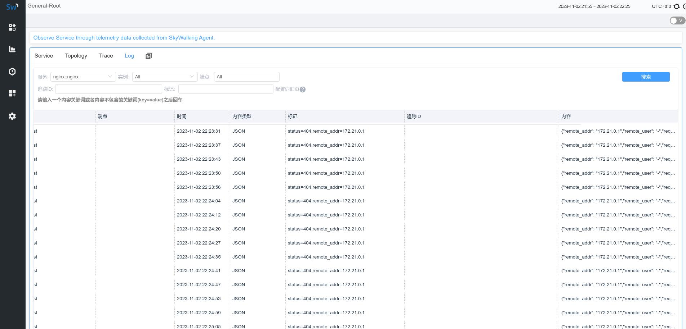
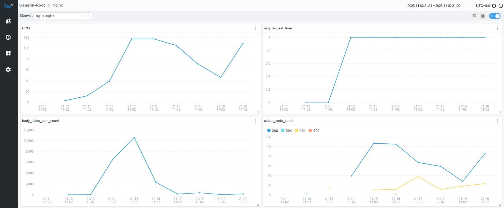

## 背景介绍
Nginx access log 中包含了丰富的信息，例如：日志时间、状态码、响应时间、body 大小等。通过收集并分析 access log，我们可以实现对 Nginx 中接口状态的监控。

在本案例中，将由 [fluent-bit](https://fluentbit.io/) 收集 access log，并通过 HTTP 将日志信息发送给 SkyWalking OAP Server 进行进一步的分析。

## 环境准备
实验需要的 Nginx 及 Fluent-bit 相关配置文件都被上传到了[Github](https://github.com/weixiang1862/nginx-fluent-bit)，有需要的读者可以自行 git clone 并通过 docker compose 启动，本文中将介绍配置文件中几个关键点。

### Nginx日志格式配置
LAL 目前支持 JSON、YAML 及 REGEX 日志解析，为了方便获取到日志中的指标字段，我们将 Nginx 的日志格式定义为 JSON.

```
http {
    ...
    ...

    log_format  main  '{"remote_addr": "$remote_addr",'
            '"remote_user": "$remote_user",'
            '"request": "$request",'
            '"time": "$time_iso8601",'
            '"status": "$status",'
            '"request_time":"$request_time",'
            '"body_bytes_sent": "$body_bytes_sent",'
            '"http_referer": "$http_referer",'
            '"http_user_agent": "$http_user_agent",'
            '"http_x_forwarded_for": "$http_x_forwarded_for"}';

    access_log  /var/log/nginx/access.log  main;
    
    ...
    ...
}
```

### Fluent bit Filter
我们通过 Fluent bit 的 lua filter 进行日志格式的改写，将其调整为 SkyWalking 所需要的格式，record的各个字段含义如下：
- body：日志内容体
- service：服务名称
- serviceInstance：实例名称
```
function rewrite_body(tag, timestamp, record)
    local newRecord = {}
    newRecord["body"] = { json = { json = record.log } }
    newRecord["service"] = "nginx::nginx"
    newRecord["serviceInstance"] = "localhost"
    return 1, timestamp, newRecord
end
```

## OAP 日志分析
### LAL定义
在 filter 中，我们通过条件判断，只处理 `service=nginx::nginx` 的服务，其他服务依旧走默认逻辑：

第一步，使用 json 指令对日志进行解析，解析的结果会被存放到 parsed 字段中，通过 parsed 字段我们可以获取 json 日志中的字段信息。

第二步，使用 timestamp 指令解析 parsed.time 并将其赋值给日志的 timestamp 字段，这里的 time 就是access log json 中的 time。

第三步，使用 tag 指令给日志打上对应的标签，标签的值依然可以通过 parsed 字段获取。

第四步，使用 metrics 指令从日志中提取出指标信息，我们共提取了四个指标：
- `nginx_log_count`：Nginx 每次请求都会生成一条 access log，该指标可以帮助我们统计 Nginx 当前的请求数。
- `nginx_request_time`：access log 中会记录请求时间，该指标可以帮助我们统计上游接口的响应时长。
- `nginx_body_bytes_sent`：body 大小指标可以帮助我们了解网关上的流量情况。
- `nginx_status_code`：状态码指标可以实现对状态码的监控，如果出现异常上涨可以结合 alarm 进行告警。

```yaml
rules:
  - name: default
    layer: GENERAL
    dsl: |
      filter {
        if (log.service == "nginx::nginx") {
          json {
            abortOnFailure true
          }
    
          extractor {
            timestamp parsed.time as String, "yyyy-MM-dd'T'HH:mm:ssXXX"
            tag status: parsed.status
            tag remote_addr: parsed.remote_addr
      
            metrics {
              timestamp log.timestamp as Long
              labels service: log.service, instance: log.serviceInstance
              name "nginx_log_count"
              value 1
            }
            metrics {
              timestamp log.timestamp as Long
              labels service: log.service, instance: log.serviceInstance
              name "nginx_request_time"
              value parsed.request_time as Double
            }
            metrics {
              timestamp log.timestamp as Long
              labels service: log.service, instance: log.serviceInstance
              name "nginx_body_bytes_sent"
              value parsed.body_bytes_sent as Long
            }
            metrics {
              timestamp log.timestamp as Long
              labels service: log.service, instance: log.serviceInstance, status: parsed.status
              name "nginx_status_code"
              value 1
            }
          }
        }
      
        sink {
        }
      }
```
经过 LAL 处理后，我们已经可以在日志面板看到日志信息了，接下来我们将对 LAL 中提取的指标进行进一步分析：



### MAL定义
在 MAL 中，我们可以对上一步 LAL 中提取的指标进行进一步的分析聚合，下面的例子里：

nginx_log_count、nginx_request_time、nginx_status_code 使用 sum 聚合函数处理，并使用 SUM 方式 downsampling，

nginx_request_time 使用 avg 聚合函数求平均值，默认使用 AVG 方式 downsampling。

完成聚合分析后，SkyWalking Meter System 会完成对上述指标的持久化。

```yaml
expSuffix: service(['service'], Layer.GENERAL)
metricPrefix: nginx
metricsRules:
  - name: cpm
    exp: nginx_log_count.sum(['service']).downsampling(SUM)
  - name: avg_request_time
    exp: nginx_request_time.avg(['service'])
  - name: body_bytes_sent_count
    exp: nginx_body_bytes_sent.sum(['service']).downsampling(SUM)
  - name: status_code_count
    exp: nginx_status_code.sum(['service','status']).downsampling(SUM)
```
最后，我们便可以来到 SkyWalking UI 页面新建 Nginx 仪表板，使用刚刚 MAL 中定义的指标信息创建 Nginx Dashboard（也可以通过上文提到[仓库]((https://github.com/weixiang1862/nginx-fluent-bit))中的 dashboard.json 直接导入测试）：



## 参考文档
- [Fluent Bit lua Filter](https://docs.fluentbit.io/manual/pipeline/filters/lua)
- [Log Analysis Language](https://skywalking.apache.org/docs/main/next/en/concepts-and-designs/lal/)
- [Meter Analysis Language](https://skywalking.apache.org/docs/main/next/en/concepts-and-designs/mal/)