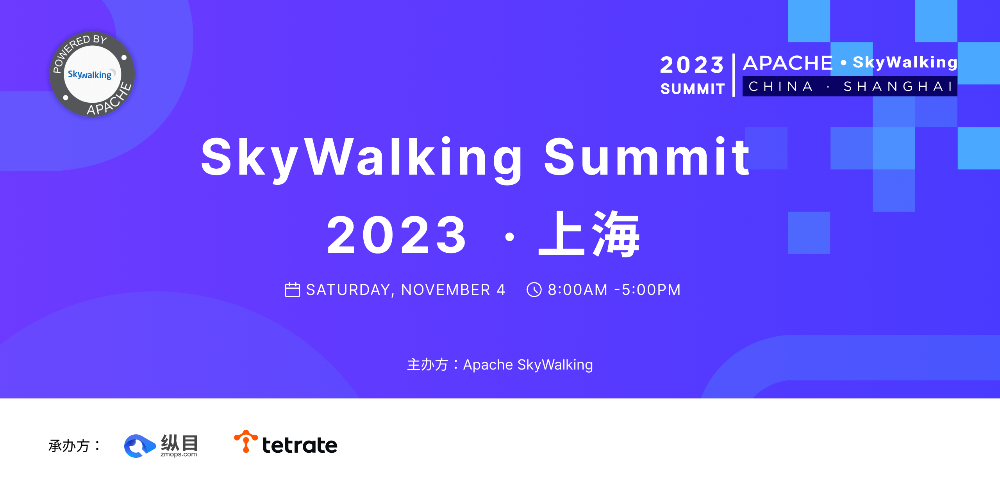

# SkyWalking Summit 2023 @ Shanghai

会议时间：2023年11月4日 全天
地点：上海大华虹桥假日酒店
赞助商：纵目科技，Tetrate

# 会议议程 与 PDF

## SkyWalking V9 In 2023 - 5 featured releases
* 吴晟
* [PDF](wu_sheng.pdf)

## 使用 Terraform 与 Ansible 快速部署skyWalking 集群   
* 柯振旭
* [PDF](ke_zhenxu.pdf)

##  基于 skyWalking 建 全域一体化观测平台        
* 陈修能
* [PDF](chen_xiuneng.pdf)

## 云原生可观测性数据库BanyanDB            
* 高洪涛
* [PDF](gao_hongtao.pdf)

## 基于skyWalking Agent 的性能剖析和实时诊断      
* 陆家靖
* [PDF](lu_jiajing.pdf)

## 太保科技-多云环境下Zabbix的运用实践         
* 田川
* [PDF](tian_chuan.pdf)

## KubeSphere 在可观测性领域的探索与实践        
* 霍秉杰
* [PDF](huo_bingjie.pdf)

## 大型跨国企业的微服务治理               
* 张文杰
* [PDF](zhang_wenjie.pdf)
