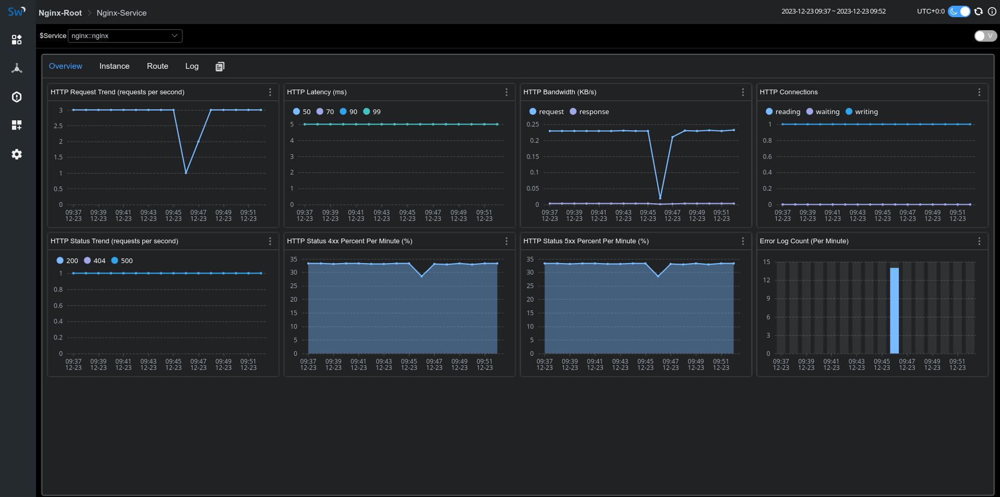
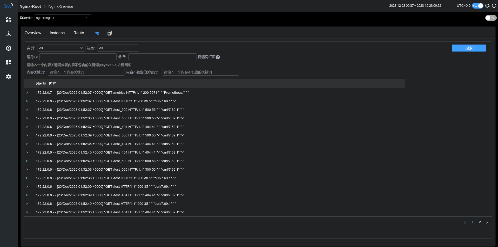

## 背景介绍
在前面的 Blog [使用 LAL 收集并分析 Nginx access log](https://skywalking.apache.org/zh/2023-10-29-collect-and-analyse-nginx-accesslog-by-lal/) 中，我们以 Nginx access log 为切入点，
演示了 SkyWalking LAL 的日志分析能力。

为了实现对 Nginx 更全面的监控能力，我们在 SkyWalking 9.7 中引入了 Nginx 监控面板，本文将演示该监控面板的使用，并介绍相关指标的含义。

## 监控面板接入
### Metric 定义与采集
由于使用了 [nginx-lua-prometheus](https://github.com/knyar/nginx-lua-prometheus) 来定义及暴露指标，
我们需要为 Nginx 安装 [lua_nginx_module](https://github.com/openresty/lua-nginx-module)， 或者直接使用[OpenResty](https://openresty.org)。

下面的例子中，我们通过 nginx-lua-prometheus 定义了四个指标，并通过 ip:9145/metrics 暴露指标接口：
- histogram: nginx_http_latency，监控 http 延时
- gauge: nginx_http_connections，监控 http 连接数
- counter: nginx_http_size_bytes，监控 http 请求和响应大小
- counter: nginx_http_requests_total，监控 http 请求次数
```
http {
    log_format  main  '$remote_addr - $remote_user [$time_local] "$request" '
                      '$status $body_bytes_sent "$http_referer" '
                      '"$http_user_agent" "$http_x_forwarded_for"';

    access_log  /var/log/nginx/access.log  main;

    lua_shared_dict prometheus_metrics 10M;
    # lua_package_path "/path/to/nginx-lua-prometheus/?.lua;;";

    init_worker_by_lua_block {
      prometheus = require("prometheus").init("prometheus_metrics")

      metric_bytes = prometheus:counter(
        "nginx_http_size_bytes", "Total size of HTTP", {"type", "route"})
      metric_requests = prometheus:counter(
        "nginx_http_requests_total", "Number of HTTP requests", {"status", "route"})
      metric_latency = prometheus:histogram(
        "nginx_http_latency", "HTTP request latency", {"route"})
      metric_connections = prometheus:gauge(
        "nginx_http_connections", "Number of HTTP connections", {"state"})
    }

    server {
        listen 8080;

        location /test {
          default_type application/json;
          return 200  '{"code": 200, "message": "success"}';

          log_by_lua_block {
            metric_bytes:inc(tonumber(ngx.var.request_length), {"request", "/test/**"})
            metric_bytes:inc(tonumber(ngx.var.bytes_send), {"response", "/test/**"})
            metric_requests:inc(1, {ngx.var.status, "/test/**"})
            metric_latency:observe(tonumber(ngx.var.request_time), {"/test/**"})
          }
        }
    }

    server {
      listen 9145;
      location /metrics {
        content_by_lua_block {
          metric_connections:set(ngx.var.connections_reading, {"reading"})
          metric_connections:set(ngx.var.connections_waiting, {"waiting"})
          metric_connections:set(ngx.var.connections_writing, {"writing"})
          prometheus:collect()
        }
      }
    }
}
```
上面的例子中，我们暴露了 route 级别的指标，你也可以根据监控粒度的需要，选择暴露 host 指标：
```
http {
  log_by_lua_block {
      metric_bytes:inc(tonumber(ngx.var.request_length), {"request", ngx.var.host})
      metric_bytes:inc(tonumber(ngx.var.bytes_send), {"response", ngx.var.host})
      metric_requests:inc(1, {ngx.var.status, ngx.var.host})
      metric_latency:observe(tonumber(ngx.var.request_time), {ngx.var.host})
  }
}
```
或者 upstream 指标：
```
upstream backend {
  server ip:port;
}

server {
  
  location /test_upstream {
  
    proxy_pass http://backend;
  
    log_by_lua_block {
      metric_bytes:inc(tonumber(ngx.var.request_length), {"request", "upstream/backend"})
      metric_bytes:inc(tonumber(ngx.var.bytes_send), {"response", "upstream/backend"})
      metric_requests:inc(1, {ngx.var.status, "upstream/backend"})
      metric_latency:observe(tonumber(ngx.var.request_time), {"upstream/backend"})
    }
  }
}
```
完成指标定义后，我们启动 nginx 和 opentelemetry-collector，将指标采集到 SkyWalking 后端进行分析和存储。

请确保`job_name: 'nginx-monitoring'`，否则上报的数据将被 SkyWalking 忽略。如果你有多个 Nginx 实例，你可以通过`service`及`service_instance_id`这两个 label 进行区分：
```
receivers:
  prometheus:
    config:
      scrape_configs:
        - job_name: 'nginx-monitoring'
          scrape_interval: 5s
          metrics_path: "/metrics"
          static_configs:
            - targets: ['nginx:9145']
              labels:
                service: nginx
                service_instance_id: nginx-instance
processors:
  batch:

exporters:
  otlp:
    endpoint: oap:11800
    tls:
      insecure: true
service:
  pipelines:
    metrics:
      receivers:
        - prometheus
      processors:
        - batch
      exporters:
        - otlp
```
如果一切顺利，你将在 skywalking-ui 的网关菜单下看到 nginx 上报的指标数据：



### Access & Error Log 采集
SkyWalking Nginx 监控提供了日志采集及错误日志统计功能，我们可以借助 [fluent-bit](https://fluentbit.io/) 采集并上报 access log、error log 给 SkyWalking 分析存储。

下面 fluent-bit 配置定义了日志采集目录为`/var/log/nginx/`，access 和 error log 经过 `rewrite_access_log` 和 `rewrite_error_log` 处理后会通过 oap 12800 端口进行上报：
```
[SERVICE]
    Flush          5
    Daemon         Off
    Log_Level      warn
[INPUT]
    Name           tail
    Tag            access
    Path           /var/log/nginx/access.log
[INPUT]
    Name           tail
    Tag            error
    Path           /var/log/nginx/error.log
[FILTER]
    Name           lua
    Match          access
    Script         fluent-bit-script.lua
    Call           rewrite_access_log
[FILTER]
    Name           lua
    Match          error
    Script         fluent-bit-script.lua
    Call           rewrite_error_log
[OUTPUT]
    Name            stdout
    Match           *
    Format          json
[OUTPUT]
    Name            http
    Match           *
    Host            oap
    Port            12800
    URI             /v3/logs
    Format          json
```
在 fluent-bit-script.lua 中，我们通过 LOG_KIND 来区分 access log 和 error log。

为了能够关联上文采集的 metric，请确保 service 和 serviceInstance 值与上文中指标采集定义一致。
```
function rewrite_access_log(tag, timestamp, record)
    local newRecord = {}
    newRecord["layer"] = "NGINX"
    newRecord["service"] = "nginx::nginx"
    newRecord["serviceInstance"] = "nginx-instance"
    newRecord["body"] = { text = { text = record.log } }
    newRecord["tags"] = { data = {{ key = "LOG_KIND", value = "NGINX_ACCESS_LOG"}}}
    return 1, timestamp, newRecord
end

function rewrite_error_log(tag, timestamp, record)
    local newRecord = {}
    newRecord["layer"] = "NGINX"
    newRecord["service"] = "nginx::nginx"
    newRecord["serviceInstance"] = "nginx-instance"
    newRecord["body"] = { text = { text = record.log } }
    newRecord["tags"] = { data = {{ key = "LOG_KIND", value = "NGINX_ERROR_LOG" }}}
    return 1, timestamp, newRecord
end
```
启动 fluent-it 后，我们便可以在监控面板的 Log tab 看到采集到的日志信息：



## 面板指标含义

| 面板名称                | 单位 | 指标含义               | 数据源               |
| ----------------------- | ---- | ---------------------- | -------------------- |
| HTTP Request Trend      |      | 每秒钟平均请求数       | nginx-lua-prometheus |
| HTTP Latency            | ms   | 平均响应延时           | nginx-lua-prometheus |
| HTTP Bandwidth          | KB   | 请求响应流量           | nginx-lua-prometheus |
| HTTP Connections        |      | nginx http 连接数      | nginx-lua-prometheus |
| HTTP Status Trend       | %    | 每分钟 http 状态码统计 | nginx-lua-prometheus |
| HTTP Status 4xx Percent | %    | 4xx状态码比例          | nginx-lua-prometheus |
| HTTP Status 5xx Percent | %    | 5xx状态码比例          | nginx-lua-prometheus |
| Error Log Count         |      | 每分钟错误日志数统计   | fluent-bit           |


## 参考文档
- [nginx-lua-prometheus](https://github.com/knyar/nginx-lua-prometheus)
- [fluent-bit-lua-filter](https://docs.fluentbit.io/manual/pipeline/filters/lua)
- [skywalking-apisix-monitoring](https://skywalking.apache.org/docs/main/next/en/setup/backend/backend-apisix-monitoring)