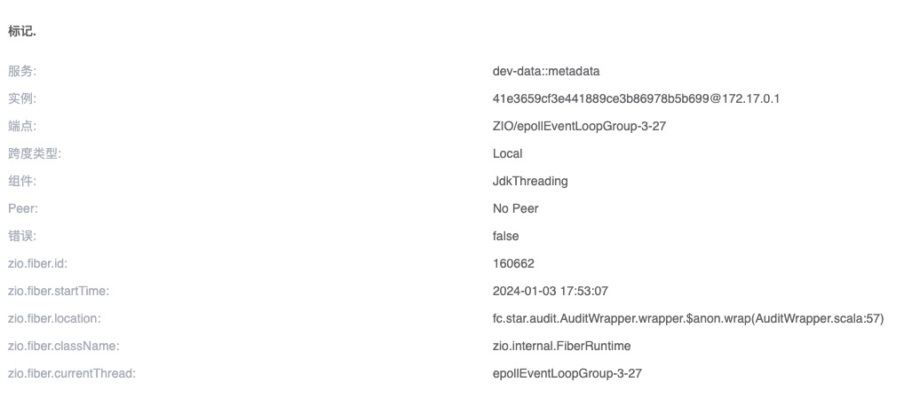
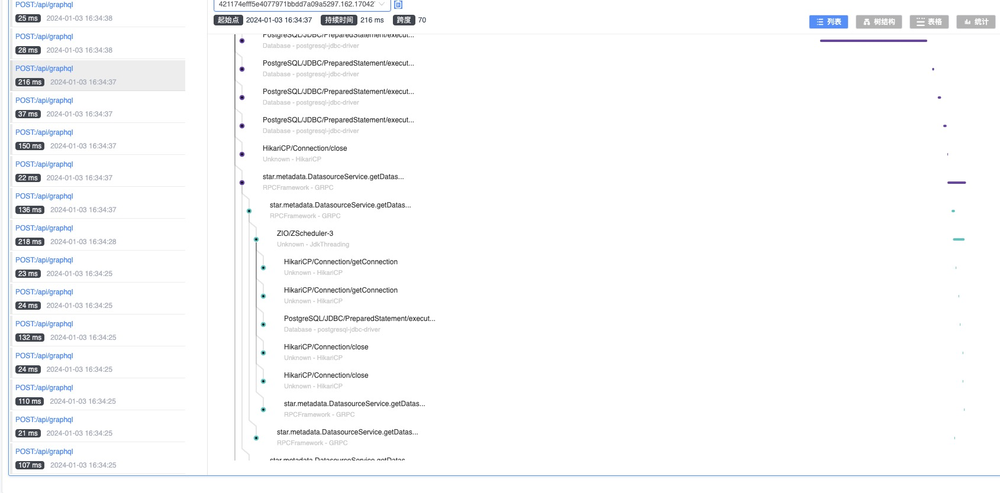

## 背景介绍

在 Scala 中，纯函数式中主要使用 Fiber，而不是线程，诸如 [Cats-Effect](https://github.com/typelevel/cats-effect)、[ZIO](https://github.com/zio/zio) 等 Effect 框架。
您可以将 Fiber 视为轻量级线程，它是一种并发模型，由框架本身掌控控制权，从而消除了上下文切换的开销。
基于这些 Effect 框架开发的 HTTP、gRCP、GraphQL 库而开发的应用，我们一般称为 **纯函数式应用程序**。

我们以 ZIO 为切入点， 演示 SkyWalking Scala 如何支持 Effect 生态。

## ZIO Trace

首先，我们想要实现 Fiber 上下文传递，而不是监控 Fiber 本身。对于一个大型应用来说，可能存在成千上万个 Fiber，监控 Fiber 本身的意义不大。

虽然 Fiber 的 Span 是在活跃时才会创建，但难免会有目前遗漏的场景，所以提供了一个配置 `plugin.ziov2.ignore_fiber_regexes`。
它将使用正则去匹配 Fiber location，匹配上的 Fiber 将不会创建 Span。

Fiber Span的信息如下：



下面是我们使用本 ZIO 插件，和一些官方插件（hikaricp、jdbc、pulsar）完成的 Trace：



## 分析
在 ZIO 中，Fiber可以有两种方式被调度，它们都是 `zio.Executor` 的子类。当然您也可以使用自己的线程池，这样也需被 ZIO 包装，其实就类似下面的 `blockingExecutor`。

```scala
abstract class Executor extends ExecutorPlatformSpecific {
  self =>
  def submit(runnable: Runnable)(implicit unsafe: Unsafe): Boolean
}
```

一种是系统默认线程池 `defaultExecutor`：
```scala
private[zio] trait RuntimePlatformSpecific {
  final val defaultExecutor: Executor =
    Executor.makeDefault()
}
```

另一种是专用于阻塞 IO 的线程池 `blockingExecutor`：
```scala
private[zio] trait RuntimePlatformSpecific {
  final val defaultBlockingExecutor: Executor =
    Blocking.blockingExecutor
}
```

## 默认线程池 `defaultExecutor`

对于 `defaultExecutor`，其本身是很复杂的，但它就是一个 ZIO 的 Fiber 调度（执行）器：
```scala
/**
 * A `ZScheduler` is an `Executor` that is optimized for running ZIO
 * applications. Inspired by "Making the Tokio Scheduler 10X Faster" by Carl
 * Lerche. [[https://tokio.rs/blog/2019-10-scheduler]]
 */
private final class ZScheduler extends Executor
```

由于它们都是 `zio.Executor` 的子类，我们只需要对其及其子类进行增强：
```scala
final val ENHANCE_CLASS = LogicalMatchOperation.or(
  HierarchyMatch.byHierarchyMatch("zio.Executor"),
  MultiClassNameMatch.byMultiClassMatch("zio.Executor")
)
```

它们都是线程池，我们只需要在 `zio.Executor` 的 `submit` 方法上进行类似 `ThreadPoolExecutor` 上下文捕获的操作，可以参考 [jdk-threadpool-plugin](https://github.com/apache/skywalking-java/blob/main/apm-sniffer/bootstrap-plugins/jdk-threadpool-plugin/src/main/java/org/apache/skywalking/apm/plugin/ThreadPoolSubmitMethodInterceptor.java) 

这里需要注意，因为 Fiber 也是一种 `Runnable`：
```scala
private[zio] trait FiberRunnable extends Runnable {
  def location: Trace
  def run(depth: Int): Unit
}
```

[zio-v2x-plugin](https://github.com/bitlap/skywalking-scala/blob/master/plugins/zio-v2x-plugin/src/main/scala/org/bitlap/skywalking/apm/plugin/zio/v2x/define/ZioExecutorInstrumentation.scala)

## 阻塞线程池 `blockingExecutor`

对于 `blockingExecutor`，其实它只是对 Java 线程池进行了一个包装：
```scala
object Blocking {

  val blockingExecutor: zio.Executor =
    zio.Executor.fromThreadPoolExecutor {
      val corePoolSize  = 0
      val maxPoolSize   = Int.MaxValue
      val keepAliveTime = 60000L
      val timeUnit      = TimeUnit.MILLISECONDS
      val workQueue     = new SynchronousQueue[Runnable]()
      val threadFactory = new NamedThreadFactory("zio-default-blocking", true)

      val threadPool = new ThreadPoolExecutor(
        corePoolSize,
        maxPoolSize,
        keepAliveTime,
        timeUnit,
        workQueue,
        threadFactory
      )

      threadPool
    }
}
```

由于其本身是对 `ThreadPoolExecutor` 的封装，所以，当我们已经实现了 `zio.Executor `的增强后，只需要使用官方 `jdk-threadpool-plugin` 插件即可。
这里我们还想要对代码进行定制修改和复用，所以重新使用 Scala 实现了一个 [executors-plugin](https://github.com/bitlap/skywalking-scala/blob/master/plugins/executors-plugin/src/main/scala/org/bitlap/skywalking/apm/plugin/executor/define/ThreadPoolExecutorInstrumentation.scala) 插件。

## 串连 Fiber 上下文

最后，上面谈到过，Fiber 也是一种 `Runnable`，因此还需要对 `zio.internal.FiberRunnable` 进行增强。大致分为两点，其实与 `jdk-threading-plugin` 是一样的。
1. 每次创建 `zio.internal.FiberRunnable` 实例时，都需要保存 **现场**，即构造函数增强。
2. 每次运行时创建一个过渡的 Span，将当前线程上下文与之前保存在构造函数中的上下文进行关联。Fiber 可能被不同线程执行，所以这是必须的。

[zio-v2x-plugin](https://github.com/bitlap/skywalking-scala/blob/master/plugins/zio-v2x-plugin/src/main/scala/org/bitlap/skywalking/apm/plugin/zio/v2x/define/ZioFiberRuntimeInstrumentation.scala)

## 说明

当我们完成了对 ZIO Fiber 的上下文传播处理后，任意基于 ZIO 的应用层框架都可以按照普通的 Java 插件思路去开发。
我们只需要找到一个全局切入点，这个切入点应该是每个请求都会调用的方法，然后对这个方法进行增强。

要想激活插件，只需要在 Release Notes 下载[插件](https://github.com/bitlap/skywalking-scala/releases/tag/v0.2.0-beta1)，放到您的 `skywalking-agent/plugins` 目录，重新启动服务即可。

如果您的项目使用 sbt assembly 打包，您可以参考这个 [示例](https://github.com/bitlap/skywalking-scala/tree/master/scenarios)。该项目使用了下列技术栈：
```scala
    libraryDependencies ++= Seq(
      "io.d11"               %% "zhttp"                % zioHttp2Version,
      "dev.zio"              %% "zio"                  % zioVersion,
      "io.grpc"               % "grpc-netty"           % "1.50.1",
      "com.thesamet.scalapb" %% "scalapb-runtime-grpc" % scalapb.compiler.Version.scalapbVersion
    ) ++ Seq(
      "dev.profunktor" %% "redis4cats-effects"  % "1.3.0",
      "dev.profunktor" %% "redis4cats-log4cats" % "1.3.0",
      "dev.profunktor" %% "redis4cats-streams"  % "1.3.0",
      "org.typelevel"  %% "log4cats-slf4j"      % "2.5.0",
      "dev.zio"        %% "zio-interop-cats"    % "23.0.03",
      "ch.qos.logback"  % "logback-classic"     % "1.2.11",
      "dev.zio"        %% "zio-cache"           % zioCacheVersion
    )
```
